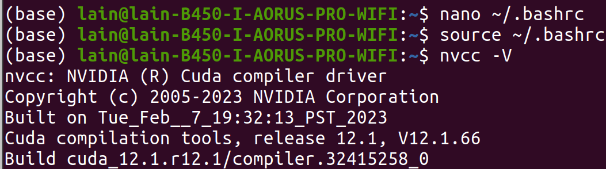

# 如何安装CUDA
[CUDA Toolkit 存档地址](https://developer.nvidia.com/cuda-toolkit-archive)


## 1. 基础安装命令
```bash
# 下载CUDA 12.1安装包
wget https://developer.download.nvidia.com/compute/cuda/12.1.0/local_installers/cuda_12.1.0_530.30.02_linux.run

# 执行安装
sudo sh cuda_12.1.0_530.30.02_linux.run
```


## 2. 当前环境状态
从`nvidia-smi`输出可知：
- NVIDIA驱动（版本：535.230.02）已正常安装运行
- 驱动兼容的CUDA版本显示为12.2，可向下兼容你安装的CUDA 12.1
→ 驱动和CUDA基础环境已可用


## 3. 提示“驱动未安装”解决办法
### 步骤1：配置CUDA环境变量
让系统识别CUDA 12.1：
1. 编辑`~/.bashrc`文件：
   ```bash
   nano ~/.bashrc
   ```
2. 在文件末尾添加以下内容：
   ```bash
   # 配置CUDA 12.1环境变量
   export PATH=/usr/local/cuda-12.1/bin:$PATH
   export LD_LIBRARY_PATH=/usr/local/cuda-12.1/lib64:$LD_LIBRARY_PATH
   ```
3. 保存后使配置生效：
   ```bash
   source ~/.bashrc
   ```


### 步骤2：验证CUDA 12.1是否可用
执行命令查看CUDA编译器版本：
```bash
nvcc -V
```
若输出显示`release 12.1`，则CUDA 12.1配置成功。


### 步骤3：测试Isaac Gym
当前驱动（535版本）+ CUDA 12.1已满足Isaac Gym的环境要求，可正常安装运行。



## 总结
虽然安装CUDA时提示“驱动未安装”，但系统已有的535版本驱动完全兼容CUDA 12.1，无需重复安装驱动，仅需配置好CUDA环境变量即可正常使用。


要不要我帮你把这些内容整理成**极简版的操作步骤清单**？