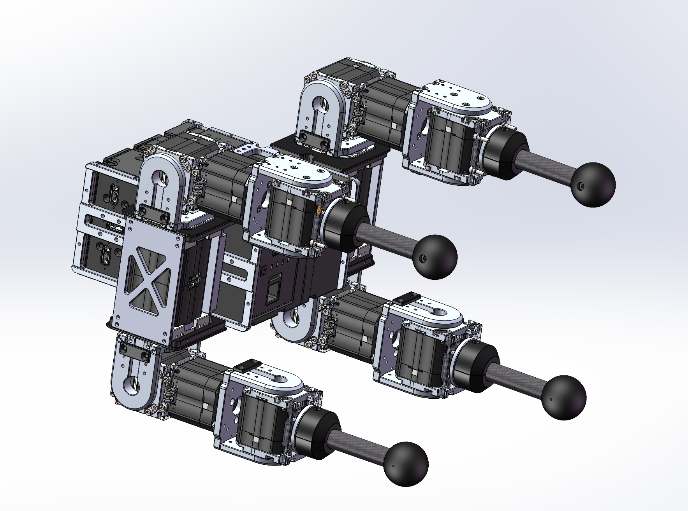

项目链接：https://github.com/HighTorque-Robotics/Mini-Pi-Plus_BeyondMimic

GMR:https://arxiv.org/abs/2510.02252

https://jaraujo98.github.io/retargeting_matters/

四足机器人高程图跳跃 sim2sim:cnn＋多头(参考eth)

Attention-Based Map Encoding for Learning Generalized Legged Locomotion

四足系统设计：（保持原计划）

1.单腿四自由度+舵向 舵向单自由度锁死处理

2.基础的迁移处理已跑通

3.暂时使用打印件替代  使用板件链接，销钉+304螺丝

4.强度件与外部装饰零件分开

### 四自由度机械臂运动学正解

#### 1. 机械臂结构与D-H参数
机械臂采用串联结构，关节顺序为：**基座Yaw（绕Z轴）→ 肩关节Pitch（绕Y轴）→ 肘Yaw（绕Z轴）→ 腕关节Pitch（绕Y轴）**。采用**标准D-H参数**建模，参数表如下：

| 连杆i | 关节角θi（变量） | 连杆偏距di（固定） | 连杆长度ai（固定） | 连杆扭转角αi（固定） |
|-------|------------------|-------------------|-------------------|----------------------|
| 1     | θ1（基座Yaw）    | d1                | a1                | 0°                   |
| 2     | θ2（肩Pitch）    | 0                 | a2                | -90°                 |
| 3     | θ3（肘Yaw）      | 0                 | a3                | 0°                   |
| 4     | θ4（腕Pitch）    | 0                 | a4                | -90°                 |

#### 2. 正解公式推导
基于D-H变换矩阵，末端执行器的位姿由各连杆变换矩阵的乘积得到：
$$
T_4^0 = T_1^0 \times T_2^1 \times T_3^2 \times T_4^3 
$$

其中，单个连杆的D-H变换矩阵为：
$$
T_i^{i-1} = Rot(z, \theta_i) \times Trans(z, d_i) \times Trans(x, a_i) \times Rot(x, \alpha_i)
$$

通过矩阵乘积化简，得到末端位置 \((x, y, z)\) 和旋转矩阵 \(R\)：

##### 末端位置公式
$$
\begin{cases}
x = \cos(\theta_1+\theta_2) \left[ a_4\cos(\theta_3+\theta_4) + a_3\cos\theta_3 + a_2 \right] + a_1\cos\theta_1 \\
y = \sin(\theta_1+\theta_2) \left[ a_4\cos(\theta_3+\theta_4) + a_3\cos\theta_3 + a_2 \right] + a_1\sin\theta_1 \\
z = -a_4\sin(\theta_3+\theta_4) - a_3\sin\theta_3 + d_1
\end{cases}
$$

##### 末端旋转矩阵 \(R\)
$$
R = \begin{bmatrix}
\cos(\theta_1+\theta_2)\cos(\theta_3+\theta_4) & \sin(\theta_1+\theta_2) & -\cos(\theta_1+\theta_2)\sin(\theta_3+\theta_4) \\
\sin(\theta_1+\theta_2)\cos(\theta_3+\theta_4) & -\cos(\theta_1+\theta_2) & -\sin(\theta_1+\theta_2)\sin(\theta_3+\theta_4) \\
-\sin(\theta_3+\theta_4) & 0 & -\cos(\theta_3+\theta_4)
\end{bmatrix}
$$

### 四自由度机械臂运动学逆解

#### 1. 逆解问题分析
四自由度机械臂为**欠驱动系统**（4关节控制6自由度末端位姿），因此逆解存在**约束条件**：
- **姿态约束**：末端Y轴方向必须在XY平面内（旋转矩阵第3行第2列元素为0，即 $R_{21} = 0$）
- **位置约束**：末端位置需满足特定几何关系

#### 2. 逆解公式推导
基于正解模型，逆解步骤如下：

##### 2.1 符号定义
- 末端位姿：位置 $(x, y, z)$，旋转矩阵 $R$
- 关节角：$\theta_1$（基座Yaw）、$\theta_2$（肩Pitch）、$\theta_3$（肘Yaw）、$\theta_4$（腕Pitch）
- 连杆参数：$d_1, a_1, a_2, a_3, a_4$（固定）
- 中间变量：$\phi = \theta_1 + \theta_2$（肩肘合成角），$\psi = \theta_3 + \theta_4$（肘腕合成角）

##### 2.2 逆解步骤
1. **姿态约束检查**：旋转矩阵 $R$ 的第3行第2列元素必须为0，即 $R_{21} = 0$，否则无解。

2. **求解 $\phi = \theta_1 + \theta_2$**：
   由旋转矩阵第2列（末端Y轴方向）得：
   $$
   \phi = \arctan2(R_{01}, -R_{11})
   $$

3. **求解 $\psi = \theta_3 + \theta_4$**：
   由旋转矩阵第3列（末端Z轴方向）得：
   $$
   \sin\psi = -\frac{R_{02}}{\cos\phi} \quad (\text{或} \quad -\frac{R_{12}}{\sin\phi}, \text{避免分母为0})
   $$
   $$
   \cos\psi = -R_{22}
   $$
   $$
   \psi = \arctan2(\sin\psi, \cos\psi)
   $$

4. **求解 $\theta_3$**：
   由Z坐标方程 $z = d_1 - (a_4\sin\psi + a_3\sin\theta_3)$ 变形得：
   $$
   \sin\theta_3 = \frac{d_1 - z - a_4\sin\psi}{a_3}
   $$
   存在条件：$\left| \frac{d_1 - z - a_4\sin\psi}{a_3} \right| \leq 1$（超出则无解）
   解为两种构型（肘关节上下）：
   $$
   \theta_3^{(1)} = \arcsin\left( \frac{d_1 - z - a_4\sin\psi}{a_3} \right) \quad (\text{elbow up})
   $$
   $$
   \theta_3^{(2)} = \pi - \theta_3^{(1)} \quad (\text{elbow down})
   $$

5. **求解 $\theta_4$**：
   由 $\psi = \theta_3 + \theta_4$ 变形得：
   $$
   \theta_4 = \psi - \theta_3
   $$

6. **求解 $\theta_1$**：
   定义中间变量 $A = a_4\cos\psi + a_3\cos\theta_3 + a_2$，代入位置方程化简得：
   $$
   C = x - A\cos\phi, \quad D = y - A\sin\phi
   $$
   存在条件：$C^2 + D^2 \approx a_1^2$（考虑数值误差，误差容限建议 $10^{-6}$）
   $$
   \theta_1 = \arctan2(D, C)
   $$

7. **求解 $\theta_2$**：
   由 $\phi = \theta_1 + \theta_2$ 变形得：
   $$
   \theta_2 = \phi - \theta_1
   $$

#### 3. 逆解存在条件
1. **姿态约束**：$R_{21} = 0$（末端Y轴无Z向分量）
2. **位置约束**：
   $$
   \left| \frac{d_1 - z - a_4\sin\psi}{a_3} \right| \leq 1
   $$
   $$
   (x - A\cos\phi)^2 + (y - A\sin\phi)^2 = a_1^2
   $$
