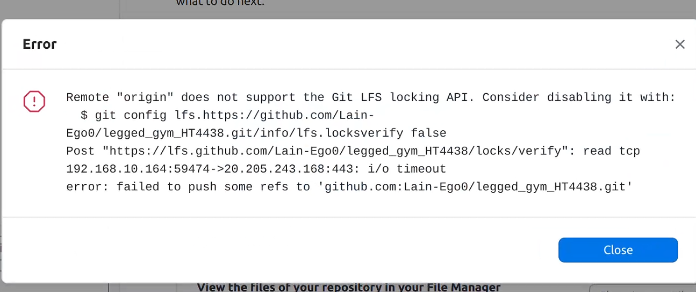
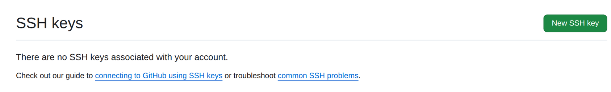

# Liunx版本Github desktop无法Git
## 报错：

/usr/lib/github-desktop/resources/app/git/libexec/git-core/git-credential-desktop: /lib/x86_64-linux-gnu/libc.so.6: version `GLIBC_2.34' not found (required by /usr/lib/github-desktop/resources/app/git/libexec/git-core/git-credential-desktop) fatal: could not read Username for '[https://github.com](https://github.com/)': terminal prompts disabled

## 问题核心

1. **GLIBC 版本依赖冲突**：GitHub Desktop 自带的 `git-credential-desktop` 工具需要 `GLIBC 2.34`，但系统（如 Ubuntu 20.04）默认 `GLIBC 2.31`，导致工具无法运行。
2. **Git 认证失效**：凭证助手无法工作，Git 无法读取 GitHub 用户名，最终触发 `fatal: could not read Username` 错误。

## 前置检查：查看系统 GLIBC 版本

```bash
# 方法1
ldd --version
# 方法2
strings /lib/x86_64-linux-gnu/libc.so.6 | grep GLIBC_ | tail -n 1
```

## 解决方案（按优先级排序）
### 方案1：降级 GitHub Desktop 到兼容版本（最快解决）
旧版本 GitHub Desktop（如 **3.1.1**）对 GLIBC 版本要求更低，适配旧系统：
1.  访问https://github.com/shiftkey/desktop/releases?page=7，下载 `3.1.1` 版本的 deb 包。
2.  卸载当前版本 GitHub Desktop：
    ```bash
    sudo apt remove github-desktop
    ```
3.  安装下载的旧版本：
    ```bash
    sudo dpkg -i GitHubDesktop-linux-3.1.1.deb
    ```

### 方案2：配置 SSH 密钥认证
SSH 认证无需依赖 Git 凭证助手，是 Linux 下更稳定的 GitHub 操作方式。
1.  **生成 SSH 密钥**（若未生成过）
    ```bash
    ssh-keygen -t ed25519 -C "你的GitHub邮箱"
    # 按回车使用默认路径，设置密码（可选，推荐设置）
    ```
    
2.  **查看并复制公钥**
    ```bash
    cat ~/.ssh/id_ed25519.pub
    # 若为 RSA 密钥，执行 cat ~/.ssh/id_rsa.pub
    ```
    复制输出的完整公钥（以 `ssh-ed25519` 开头，邮箱结尾）。
    
3.  **添加公钥到 GitHub**
    
    - 登录 GitHub → 右上角头像 → **Settings** → **SSH and GPG keys** → **New SSH key**。
    
      
    
      
    
    - 填写标题，粘贴公钥内容，点击 **Add SSH key**。
    
      
    
4.  **验证 SSH 连接**
    
    ```bash
    ssh -T git@github.com
    ```
    首次连接输入 `yes` 确认，看到 `Hi [你的用户名]! You've successfully authenticated...` 即为成功。
    
5.  **切换 Git 远程仓库 URL 为 SSH 格式**
    ```bash
    # 查看当前远程 URL
    git remote -v
    # 替换为 SSH 格式（替换 用户名/仓库名）
    git remote set-url origin git@github.com:用户名/仓库名.git
    ```

### 方案3：升级系统（看需求）
Ubuntu 22.04 及以上版本默认 `GLIBC 2.35`，可满足依赖要求，但系统升级有风险，需先备份数据。
```bash
# 执行系统升级
sudo do-release-upgrade
```

## 注意事项
- **不建议手动替换 GLIBC**：手动更新系统 GLIBC 可能导致系统崩溃，新手切勿尝试。