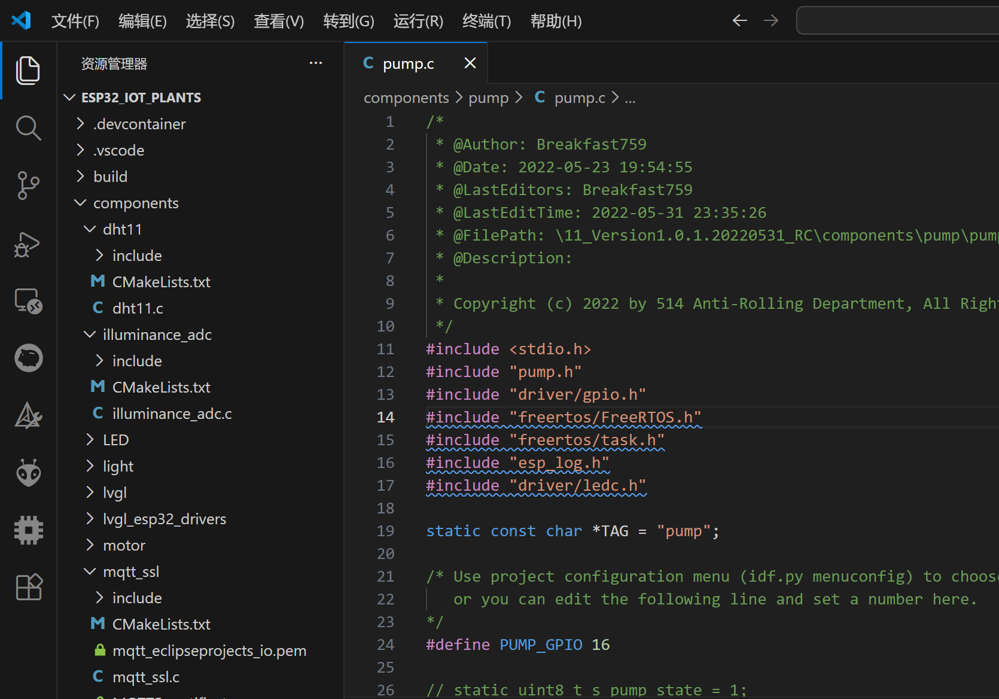
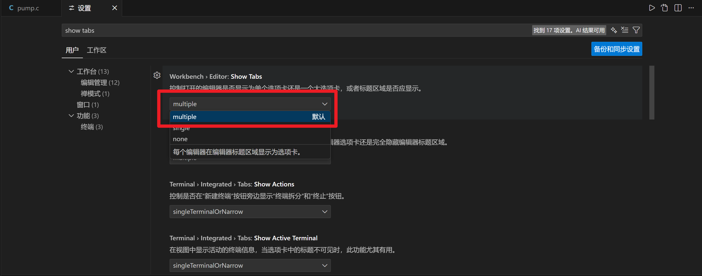

VSCode每次打开一个新的文件都会替换掉原来的文件，这样使用很不方便。

1.打开设置页面，搜索show tabs，然后找到[Workbench](https://so.csdn.net/so/search?q=Workbench&spm=1001.2101.3001.7020) > Editor:Show Tabs，勾选该项

2.搜索Workbench.editor.enablePreview 取消该项勾选

