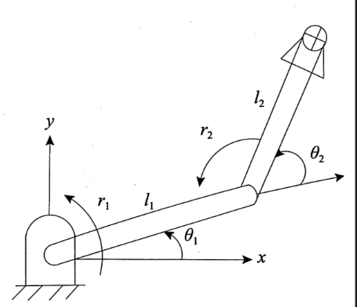

# 一、足式机器人理论基础

## （一）基于D-H坐标系的四足机器人运动学建模

### 1 D-H坐标系说明

以十二自由度串联的单腿运动学为例。

让我们把四足机器人的腿视为一系列由关节连接起来的连杆。为四足机器人的每一连杆建立一个坐标系，并用齐次变换来描述这些坐标系间的相对位置和姿态。通常，$\{i\}$系的坐标原点在关节$i$和关节$i + 1$轴线的公法线和关节$i$轴线的交点上，$z_i$与关节$i$的轴线重合，$x_i$和上述公法线重合（方向由关节$i$指向$i + 1$），$y_i$用右手定则确定。  

令4条腿的髋关节坐标点与$O_0$共$z$平面，这样便不存在$z$方向的平移。

规定躯干固连坐标系$\{O_b\}$位于躯干自身的几何中心，定义$y_b$的正方向为机体前进方向，$z_b$的正方向与重力方向相反，$z_b$垂直躯干横面向上，$x_b$按照D-H要求，经$O_b$自$z_b$指向$z_0$。

这里错了，Xb为正方向

$\{0\}$系为全局坐标系，$\{1\}$系为髋部关节固连于机体的坐标系，以下关节坐标系分别为$\{2\}$和$\{3\}$系及末端足端$\{4\}$系。

$\{0\}$系位于右前腿和右后腿坐标系连线中点，$z_0$同向平行于$z_b$，$x_0$垂直于躯干右立面，方向由右立面指向左立面。

$\{1\}$系的原点$O_1$在机体坐标$\{0\}$系中的位置为$(a,b,c)$，其中$a=-w$，$b=0$，$c=0$。$\{1\}$系的$z_1$与1关节的轴线重合，$x_1$和$z_1$与$z_2$公法线重合，方向由关节1指向关节2，$y_1$用右手定则确定。

$\{2\}$系的原点$O_2$在关节1和关节2轴线的公法线与关节2轴线的交点上，$z_2$与关节2的轴线重合。$x_2$和$z_3$与$z_2$的公法线重合，方向由关节2指向关节3，$y_2$用右手定则确定。

$\{3\}$系的原点$O_3$在关节2和关节3轴线的公法线与关节3轴线的交点上，$z_3$与关节3的轴线重合（与$z_2$平行同向）；$\{4\}$系虚拟$z$轴平行于$z_3$，$x_3$由关节3指向足端末端$\{4\}$系，且$x_4$与$x_3$一致。

下面介绍右前腿（RF）的运动学公式推导过程。  其他腿的推导过程一样，自行替换数值。

### 2 正运动学 

建立躯干固连坐标系$(x_b, y_b, z_b)$，其原点$O_b$为机体质心的初始位置。

根据右前腿结构，列出**D-H参数表**： 

| 编号$i$ | 杆件长度$a_i$ | 杆件扭角$\alpha_i$ | 关节距离$d_i$ | 关节转角$\theta_i$ |
|---------|---------------|--------------------|---------------|--------------------|
| 0       | $b$           | $0^\circ$          | $-h$          | $90^\circ$         |
| 1       | $-w$          | $-90^\circ$        | $0$           | $\theta_1$         |
| 2       | $L_1$         | $-90^\circ$        | $0$           | $\theta_2$         |
| 3       | $L_2$         | $0^\circ$          | $0$           | $\theta_3$         |
| 4       | $L_3$         | $0^\circ$          | $0$           | $0^\circ$          |

根据D-H方法的**齐次变换矩阵公式**：
$$
{}_{i}^{i-1}\mathbf{T} = \begin{bmatrix} c_i & -s_i & 0 & a_i \\ c_{\alpha_i}s_i & c_{\alpha_i}c_i & -s_{\alpha_i} & -d_i s_{\alpha_i} \\ s_{\alpha_i}s_i & s_{\alpha_i}c_i & c_{\alpha_i} & d_i c_{\alpha_i} \\ 0 & 0 & 0 & 1 \end{bmatrix}
$$

（式中，$c_i = \cos\theta_i$，$s_i = \sin\theta_i$）  

将右前腿D-H参数代入齐次变换公式，得到各连杆间的齐次变换矩阵：

$$
{}_{0}^{b}\mathbf{T} = \begin{bmatrix} 0 & -1 & 0 & b \\ 1 & 0 & 0 & 0 \\ 0 & 0 & 1 & -h \\ 0 & 0 & 0 & 1 \end{bmatrix}, \quad {}_{1}^{0}\mathbf{T} = \begin{bmatrix} c_1 & -s_1 & 0 & -w \\ 0 & 0 & 1 & 0 \\ -s_1 & -c_1 & 0 & 0 \\ 0 & 0 & 0 & 1 \end{bmatrix} 
$$

$$
{}_{2}^{1}\mathbf{T} = \begin{bmatrix} c_2 & -s_2 & 0 & L_1 \\ 0 & 0 & 1 & 0 \\ -s_2 & -c_2 & 0 & 0 \\ 0 & 0 & 0 & 1 \end{bmatrix}, \quad {}_{3}^{2}\mathbf{T} = \begin{bmatrix} c_3 & -s_3 & 0 & L_2 \\ s_3 & c_3 & 0 & 0 \\ 0 & 0 & 1 & 0 \\ 0 & 0 & 0 & 1 \end{bmatrix} 
$$

$$
{}_{4}^{3}\mathbf{T} = \begin{bmatrix} 1 & 0 & 0 & L_3 \\ 0 & 1 & 0 & 0 \\ 0 & 0 & 1 & 0 \\ 0 & 0 & 0 & 1 \end{bmatrix}
$$

足端相对于躯干固连坐标系的**位姿矩阵**为各齐次变换的乘积：

$$
 {}_{4}^{b}\mathbf{T} = {}_{0}^{b}\mathbf{T} {}_{1}^{0}\mathbf{T} {}_{2}^{1}\mathbf{T} {}_{3}^{2}\mathbf{T} {}_{4}^{3}\mathbf{T} 
$$

展开后得到：

$$
{}_{4}^{b}\mathbf{T} = \begin{bmatrix} s_2 c_3 + c_2 s_3 & c_2 c_3 - s_2 s_3 & 0 & b + L_2 s_2 + L_3 (c_2 s_3 + s_2 c_3) \\ c_1 c_2 c_3 - c_1 s_2 s_3 & -c_1 c_2 s_3 - c_1 s_2 c_3 & -s_1 & -w + [L_1 c_1 + L_2 c_1 c_2 + L_3 (c_1 c_2 c_3 - c_1 s_2 s_3)] \\ s_1 s_2 s_3 - s_1 c_2 c_3 & s_1 c_2 s_3 + s_1 s_2 c_3 & -c_1 & -L_1 s_1 - L_2 s_1 c_2 + L_3 (s_1 s_2 s_3 - s_1 c_2 c_3) - h \\ 0 & 0 & 0 & 1 \end{bmatrix}
$$

将位姿矩阵拆分为**旋转矩阵$\mathbf{R}$**和**位置向量$\mathbf{P}$**：

$$
{}_{4}^{b}\mathbf{T} = \begin{bmatrix} \mathbf{R} & \mathbf{P} \\ 0\ 0\ 0 & 1 \end{bmatrix}, \quad \mathbf{R} = \begin{bmatrix} s_2 c_3 + c_2 s_3 & c_2 c_3 - s_2 s_3 & 0 \\ c_1 c_2 c_3 - c_1 s_2 s_3 & -c_1 c_2 s_3 - c_1 s_2 c_3 & -s_1 \\ -s_1 c_2 c_3 + s_1 s_2 s_3 & s_1 c_2 s_3 + s_1 s_2 c_3 & -c_1 \end{bmatrix} 
$$

$$
\mathbf{P} = \begin{bmatrix} p_x \\ p_y \\ p_z \end{bmatrix} = \begin{bmatrix} b + L_2 s_2 + L_3 (c_2 s_3 + s_2 c_3) \\ -w + [L_1 c_1 + L_2 c_1 c_2 + L_3 (c_1 c_2 c_3 - c_1 s_2 s_3)] \\ -L_1 s_1 - L_2 s_1 c_2 + L_3 (s_1 s_2 s_3 - s_1 c_2 c_3) - h \end{bmatrix} 
$$

若将$\theta_1$修正为实际机器人使用的角度（定义$\theta_1 = \theta_1' + 90^\circ$），则位置向量简化为：

$$
\mathbf{P} = \begin{bmatrix} p_x \\ p_y \\ p_z \end{bmatrix} = \begin{bmatrix} b + L_2 s_2 + L_3 (c_2 s_3 + s_2 c_3) \\ -w - [L_1 s_1 + L_2 s_1 c_2 + L_3 (s_1 c_2 c_3 - s_1 s_2 s_3)] \\ -L_1 c_1 - L_2 c_1 c_2 + L_3 (c_1 s_2 s_3 - c_1 c_2 c_3) - h \end{bmatrix} 
$$

对足端位置向量$\mathbf{P}$化简（令$c_{ij} = \cos(\theta_i + \theta_j)$，$s_{ij} = \sin(\theta_i + \theta_j)$），得：

$$
\mathbf{P} = \begin{bmatrix} p_x \\ p_y \\ p_z \end{bmatrix} = \begin{bmatrix} b + L_2 s_2 + L_3 s_{23} \\ -w - (L_1 s_1 + L_2 s_1 c_2 + L_3 s_1 c_{23}) \\ -L_1 c_1 - L_2 c_1 c_2 - L_3 c_1 c_{23} - h \end{bmatrix} 
$$

对该式做**时间微分**，得到足端线速度与关节角速度的关系：

$$
\dot{p}_x = L_2 c_2 \dot{\theta}_2 + L_3 c_{23} (\dot{\theta}_2 + \dot{\theta}_3) 
$$

$$
\dot{p}_y = -L_1 c_1 \dot{\theta}_1 - L_2 c_1 c_2 \dot{\theta}_1 + L_2 s_1 s_2 \dot{\theta}_2 - L_3 c_1 c_{23} \dot{\theta}_1 + L_3 s_1 s_{23} (\dot{\theta}_2 + \dot{\theta}_3) 
$$

$$
\dot{p}_z = L_1 s_1 \dot{\theta}_1 + L_2 s_1 c_2 \dot{\theta}_1 + L_2 c_1 s_2 \dot{\theta}_2 + L_3 s_1 c_{23} \dot{\theta}_1 + L_3 c_1 s_{23} (\dot{\theta}_2 + \dot{\theta}_3) 
$$

整理为**矩阵形式**（足端线速度$\begin{bmatrix} v_x \\ v_y \\ v_z \end{bmatrix} = \begin{bmatrix} \dot{p}_x \\ \dot{p}_y \\ \dot{p}_z \end{bmatrix}$，关节角速度$\begin{bmatrix} \dot{\theta}_1 \\ \dot{\theta}_2 \\ \dot{\theta}_3 \end{bmatrix}$）： $$ \begin{bmatrix} v_x \\ v_y \\ v_z \end{bmatrix} = \mathbf{J}(\theta) \begin{bmatrix} \dot{\theta}_1 \\ \dot{\theta}_2 \\ \dot{\theta}_3 \end{bmatrix} $$ 

其中**雅可比矩阵**$\mathbf{J}(\theta)$为： 
$$
\mathbf{J}(\theta) = \begin{bmatrix} 0 & L_2 c_2 + L_3 c_{23} & L_3 c_{23} \\ -L_1 c_1 - L_2 c_1 c_2 + L_3 c_1 c_{23} & L_2 s_1 s_2 + L_3 s_1 s_{23} & L_3 s_1 s_{23} \\ L_1 s_1 + L_2 s_1 c_2 + L_3 s_1 c_{23} & L_2 c_1 s_2 + L_3 c_1 s_{23} & L_3 c_1 s_{23} \end{bmatrix} 
$$

因此，关节角速度可通过雅可比矩阵的逆求解： 
$$
\begin{bmatrix} \dot{\theta}_1 \\ \dot{\theta}_2 \\ \dot{\theta}_3 \end{bmatrix} = \mathbf{J}(\theta)^{-1} \begin{bmatrix} v_x \\ v_y \\ v_z \end{bmatrix} 
$$

### 3 逆运动学
逆运动学旨在“已知足端位姿，求关节变量”，是机器人位姿控制与轨迹规划的基础。 

由位姿矩阵关系${}_{4}^{b}\mathbf{T} = {}_{0}^{b}\mathbf{T} {}_{1}^{0}\mathbf{T} {}_{2}^{1}\mathbf{T} {}_{3}^{2}\mathbf{T} {}_{4}^{3}\mathbf{T}$，推导得：

$$
{}_{2}^{1}\mathbf{T}^{-1} {}_{1}^{0}\mathbf{T}^{-1} {}_{0}^{b}\mathbf{T}^{-1} {}_{4}^{b}\mathbf{T} = {}_{3}^{2}\mathbf{T} {}_{4}^{3}\mathbf{T} = \begin{bmatrix} c_3 & -s_3 & 0 & L_2 + L_3 c_3 \\ s_3 & c_3 & 0 & L_3 s_3 \\ 0 & 0 & 1 & 0 \\ 0 & 0 & 0 & 1 \end{bmatrix}
$$

利用**齐次变换的逆矩阵公式**$\mathbf{T}^{-1} = \begin{bmatrix} \mathbf{Q}^\mathrm{T} & -\mathbf{Q}^\mathrm{T} \mathbf{R} \\ \mathbf{0}^\mathrm{T} & 1 \end{bmatrix}$（其中$\mathbf{T} = \begin{bmatrix} \mathbf{Q} & \mathbf{R} \\ \mathbf{0}^\mathrm{T} & 1 \end{bmatrix}$）得到：

应该为0100
$$
{_0^b}\boldsymbol{T} = \begin{bmatrix} 0 & -1 & 0 & b \\ 1 & 0 & 0 & 0 \\ 0 & 0 & 1 & -h \\ 0 & 0 & 0 & 1 \end{bmatrix}, \quad {_0^b}\boldsymbol{T}^{-1} = \begin{bmatrix} 0 & 1 & 0 & 1 \\ -1 & 0 & 0 & b \\ 0 & 0 & 1 & h \\ 0 & 0 & 0 & 1 \end{bmatrix}
$$

$$
{_1^0}\boldsymbol{T} = \begin{bmatrix} c_1 & -s_1 & 0 & -w \\ 0 & 0 & 1 & 0 \\ -s_1 & -c_1 & 0 & 0 \\ 0 & 0 & 0 & 1 \end{bmatrix}, \quad {_1^0}\boldsymbol{T}^{-1} = \begin{bmatrix} c_1 & 0 & -s_1 & w c_1 \\ -s_1 & 0 & -c_1 & w s_1 \\ 0 & 1 & 0 & 0 \\ 0 & 0 & 0 & 1 \end{bmatrix}
$$

$$
{_2^1}\boldsymbol{T} = \begin{bmatrix} c_2 & -s_2 & 0 & L_1 \\ 0 & 0 & 1 & 0 \\ -s_2 & -c_2 & 0 & 0 \\ 0 & 0 & 0 & 1 \end{bmatrix}, \quad {_2^1}\boldsymbol{T}^{-1} = \begin{bmatrix} c_2 & 0 & -s_2 & -L_1 c_2 \\ -s_2 & 0 & -c_2 & L_1 s_2 \\ 0 & 1 & 0 & 0 \\ 0 & 0 & 0 & 1 \end{bmatrix}
$$

从而：

$$
{_2^1}\boldsymbol{T}^{-1} {_1^0}\boldsymbol{T}^{-1} {_0^b}\boldsymbol{T}^{-1} = \begin{bmatrix} s_2 & c_1 c_2 & -s_1 c_2 & w c_1 c_2 - h s_1 c_2 - b s_2 - L_1 c_2 \\ c_2 & -c_1 s_2 & s_1 s_2 & -w c_1 s_2 + h s_1 s_2 - b c_2 + L_1 s_2 \\ 0 & -s_1 & -c_1 & -w s_1 - h c_1 \\ 0 & 0 & 0 & 1 \end{bmatrix}
$$

得到：

$$
\begin{aligned}
\begin{bmatrix} 
s_2 & c_1 c_2 & -s_1 c_2 & w c_1 c_2 - h s_1 c_2 - b s_2 - L_1 c_2 \\ 
c_2 & -c_1 s_2 & s_1 s_2 & -w c_1 s_2 + h s_1 s_2 - b c_2 + L_1 s_2 \\ 
0 & -s_1 & -c_1 & -w s_1 - h c_1 \\ 
0 & 0 & 0 & 1 
\end{bmatrix} 
\begin{bmatrix} 
\boldsymbol{R} & p_x \\ 
& p_y \\ 
& p_z \\ 
0 & 0 & 0 & 1 
\end{bmatrix} 
&= \\
\begin{bmatrix} 
c_3 & -s_3 & 0 & L_2 + L_3 c_3 \\ 
s_3 & c_3 & 0 & L_3 s_3 \\ 
0 & 0 & 1 & 0 \\ 
0 & 0 & 0 & 1 
\end{bmatrix}
\end{aligned}
$$

由等式两端的矩阵第4列，可得到：

$$
s_2 p_x + c_1 c_2 p_y - s_1 c_2 p_z + w c_1 c_2 - h s_1 c_2 - b s_2 - L_1 c_2 = L_2 + L_3 c_3 \tag{3.1}
$$

$$
c_2 p_x - c_1 s_2 p_y + s_1 s_2 p_z - w c_1 s_2 + h s_1 s_2 - b c_2 + L_1 s_2 = L_3 s_3 \tag{3.2}
$$

$$
-s_1 p_y - c_1 p_z - w s_1 - h c_1 = 0 \tag{3.3}
$$

把$$\theta_1$$ 改成实际机器人系统使用的角度，定义新的$$\theta_1'$$（为机器人使用的角度值），则有：

$$
\theta_1 = \theta_1' + 90^\circ
$$

由式(3.3)得：

$$
-c_1 p_y + s_1 p_z - w c_1 + h s_1 = 0 
$$

$$
\theta_1 = \arctan\left( \frac{w + p_y}{p_z + h} \right), \quad \theta_1 \in \left( -\frac{\pi}{2}, \frac{\pi}{2} \right)
$$

代入式(3.1)和式(3.2)，并令：

$$
D = c_1 p_y - s_1 p_z + w c_1 - h s_1 - L_1 \quad (c_2 \text{ 的系数})
$$
$$
E = p_x - b \quad (s_2 \text{ 的系数})
$$

所以：

$$
D c_2 + E s_2 = L_2 + L_3 c_3 \tag{3.4}
$$
$$
E c_2 - D s_2 = L_3 s_3 
$$

两式平方相加。

$$
D^2 + E^2 = L_2^2 + L_3^2 + 2 L_2 L_3 c_3
$$

求出：

$$
\theta_3 = \arccos\left( \frac{D^2 + E^2 - L_2^2 - L_3^2}{2 L_2 L_3} \right), \quad \theta_3 \in \left( -\frac{\pi}{2}, \frac{\pi}{2} \right)
$$

令 $$ K = L_2 + L_3 c_3 $$，则由式(3.4)得：

$$
D c_2 + E s_2 = K
$$

等式两端平方可得：

$$
D^2 c_2^2 + E^2 s_2^2 + 2 D E c_2 s_2 = K^2
$$

也可写成：

$$
D^2 c_2^2 + D^2 s_2^2 + E^2 s_2^2 + E^2 c_2^2 + 2 D E c_2 s_2 - D^2 s_2^2 - E^2 c_2^2 = K^2
$$

$$
D^2 + E^2 + 2 D E c_2 s_2 - D^2 s_2^2 - E^2 c_2^2 = K^2
$$

$$
D^2 s_2^2 - 2 D E c_2 s_2 + E^2 c_2^2 = D^2 + E^2 - K^2
$$

从而可以推出：

$$
E c_2 - D s_2 = \sqrt{D^2 + E^2 - K^2} \quad (\text{保证取值为正})
$$

把该式与式(3.4)相除，可得：

$$
\frac{E c_2 - D s_2}{D c_2 + E s_2} = \frac{\sqrt{D^2 + E^2 - K^2}}{K} 
$$

上式也可写成：

$$
\frac{E - D \tan_2}{D + E \tan_2} = \frac{\sqrt{D^2 + E^2 - K^2}}{K} \quad 
$$

化简上式，得到：

$$
\tan_2 = \frac{E - D \frac{\sqrt{D^2 + E^2 - K^2}}{K}}{D + E \frac{\sqrt{D^2 + E^2 - K^2}}{K}}
$$

$$
\theta_2 = \arctan\left( \frac{E - D \frac{\sqrt{D^2 + E^2 - K^2}}{K}}{D + E \frac{\sqrt{D^2 + E^2 - K^2}}{K}} \right), \quad \theta_2 \in (-\pi, \pi)
$$

从而$$\theta_1$$、$$\theta_2$$、$$\theta_3$$的角度表示公式为：

$$
\theta_1 = \arctan\left( \frac{w + p_y}{p_z + h} \right), \quad \theta_1 \in \left( -\frac{\pi}{2}, \frac{\pi}{2} \right)
$$

$$
\theta_2 = \arctan\left( \frac{E - D \frac{\sqrt{D^2 + E^2 - K^2}}{K}}{D + E \frac{\sqrt{D^2 + E^2 - K^2}}{K}} \right), \quad \theta_2 \in (-\pi, \pi) \ (\text{$s_3$ 为正值时})
$$

$$
\theta_2 = \arctan\left( \frac{E + D \frac{\sqrt{D^2 + E^2 - K^2}}{K}}{D - E \frac{\sqrt{D^2 + E^2 - K^2}}{K}} \right) \quad (\text{$s_3$ 为负值时})
$$

$$
\theta_3 = \arccos\left( \frac{D^2 + E^2 - L_2^2 - L_3^2}{2 L_2 L_3} \right), \quad \theta_3 \in \left( -\frac{\pi}{2}, \frac{\pi}{2} \right)
$$

$$
D = -s_1 p_y - c_1 p_z - w s_1 - h c_1 - L_1
$$

$$
E = p_x - b
$$

$$
L_2 + L_3 c_3 = K
$$

## （二） 雅可比矩阵

### 1 雅可比矩阵基础与建模 

两空间之间速度的线性映射关系可表示为**雅可比矩阵**（简称“雅可比”）。它可看作从关节空间到操作空间（笛卡尔空间）运动速度的传动比，也可用于表示两空间之间力的传递关系。以**2自由度平面机械手**为例说明：  

基于机器人运动学建模方法，平面机械手末端手爪相对于基坐标系的位置关系为：

$$
 \begin{cases} x = l_1 c_1 + l_2 c_{12} \\ y = l_1 s_1 + l_2 s_{12} \end{cases} 
$$

（式中，$c_i = \cos\theta_i$，$s_i = \sin\theta_i$；$c_{12} = \cos(\theta_1+\theta_2)$，$s_{12} = \sin(\theta_1+\theta_2)$。）  

对其微分，得到**微小位移关系**：

$$
\begin{cases} 
 \mathrm{d}x = \frac{\partial x}{\partial \theta_1} \mathrm{d}\theta_1 + \frac{\partial x}{\partial \theta_2} \mathrm{d}\theta_2 \\ 
 \mathrm{d}y = \frac{\partial y}{\partial \theta_1} \mathrm{d}\theta_1 + \frac{\partial y}{\partial \theta_2} \mathrm{d}\theta_2 \end{cases}
$$

写成**矩阵形式**：

$$
\begin{bmatrix} \mathrm{d}x \\ \mathrm{d}y \end{bmatrix} = \begin{bmatrix} \frac{\partial x}{\partial \theta_1} & \frac{\partial x}{\partial \theta_2} \\ \frac{\partial y}{\partial \theta_1} & \frac{\partial y}{\partial \theta_2} \end{bmatrix} \begin{bmatrix} \mathrm{d}\theta_1 \\ \mathrm{d}\theta_2 \end{bmatrix}
$$

代入偏导数后，得：

$$
 \begin{bmatrix} \mathrm{d}x \\ \mathrm{d}y \end{bmatrix} = \begin{bmatrix} -l_1 s_1 - l_2 s_{12} & -l_2 s_{12} \\ l_1 c_1 + l_2 c_{12} & l_2 c_{12} \end{bmatrix} \begin{bmatrix} \mathrm{d}\theta_1 \\ \mathrm{d}\theta_2 \end{bmatrix} 
$$

简写为： 
$$
\mathrm{d}\mathbf{x} = \mathbf{J} \mathrm{d}\boldsymbol{\theta} 
$$

式中，$\mathbf{J}$为机械手的**雅可比矩阵**，由$x、y$的偏微分组成，反映关节微小位移$\mathrm{d}\boldsymbol{\theta}$与手爪微小运动$\mathrm{d}\mathbf{x}$的关系。  

若关节速度为$\dot{\boldsymbol{\theta}} = [\dot{\theta}_1, \dot{\theta}_2]^\mathrm{T}$，手爪速度为$\mathbf{v} = \dot{\mathbf{x}} = [\dot{x}, \dot{y}]^\mathrm{T}$，对$\mathrm{d}\mathbf{x} = \mathbf{J} \mathrm{d}\boldsymbol{\theta}$两边同除$\mathrm{d}t$，得： 

$$
\frac{\mathrm{d}\mathbf{x}}{\mathrm{d}t} = \mathbf{J} \frac{\mathrm{d}\boldsymbol{\theta}}{\mathrm{d}t} \implies \dot{\mathbf{x}} = \mathbf{J} \dot{\boldsymbol{\theta}} \implies \mathbf{v} = \mathbf{J} \dot{\boldsymbol{\omega}} 
$$

因此，雅可比矩阵定义为：**操作空间速度与关节空间速度的线性变换**（$\dot{\mathbf{x}}$或$\mathbf{v}$为手爪在操作空间的广义速度，$\dot{\boldsymbol{\theta}}$为关节速度）。  

机器人雅可比矩阵描述关节空间与操作空间的速度传动比。设$\mathbf{x}$为末端位姿（位置+姿态）的广义位置矢量，$\mathbf{q}$为关节坐标矢量（$n$个关节时为$n$维矢量），则：

$$
 \mathbf{x} = \mathbf{x}(\mathbf{q}) \implies \dot{\mathbf{x}} = \sum_{i=1}^6 \sum_{j=1}^n \frac{\partial x_i}{\partial q_j} \dot{q}_j = \mathbf{J}(\mathbf{q}) \dot{\mathbf{q}} 
$$

其中$\mathbf{J}(\mathbf{q})$为$6 \times n$的**偏导数矩阵**，第$i$行第$j$列元素为：

$$
J_{ij}(\mathbf{q}) = \frac{\partial x_i(\mathbf{q})}{\partial q_j}, \quad i=1,2,\dots,6; \, j=1,2,\dots,n 
$$

矩阵形式表示为： 
$$
\begin{bmatrix} \mathbf{v} \\ \boldsymbol{\omega} \end{bmatrix} = \begin{bmatrix} J_{11} & J_{12} & \dots & J_{1n} \\ J_{21} & J_{22} & \dots & J_{2n} \\ J_{31} & J_{32} & \dots & J_{3n} \\ J_{41} & J_{42} & \dots & J_{4n} \\ J_{51} & J_{52} & \dots & J_{5n} \\ J_{61} & J_{62} & \dots & J_{6n} \end{bmatrix} \begin{bmatrix} \dot{q}_1 \\ \dot{q}_2 \\ \vdots \\ \dot{q}_n \end{bmatrix} 
$$

雅可比矩阵也可**分块表示**：

$$
 \begin{bmatrix} \mathbf{v} \\ \boldsymbol{\omega} \end{bmatrix} = \begin{bmatrix} J_{L1} & J_{L2} & \dots & J_{Ln} \\ J_{A1} & J_{A2} & \dots & J_{An} \end{bmatrix} \begin{bmatrix} \dot{q}_1 \\ \dot{q}_2 \\ \vdots \\ \dot{q}_n \end{bmatrix} 
$$

手爪线速度$\mathbf{v}$和角速度$\boldsymbol{\omega}$可表示为关节速度$\dot{q}_i$的线性函数：

$$
\mathbf{v} = J_{L1}\dot{q}_1 + J_{L2}\dot{q}_2 + \dots + J_{Ln}\dot{q}_n, \quad \boldsymbol{\omega} = J_{A1}\dot{q}_1 + J_{A2}\dot{q}_2 + \dots + J_{An}\dot{q}_n
$$

以2自由度平面机械手为例，其雅可比矩阵为：

$$
 \mathbf{J} = \begin{bmatrix} -l_1 s_1 - l_2 s_{12} & -l_2 s_{12} \\ l_1 c_1 + l_2 c_{12} & l_2 c_{12} \end{bmatrix} 
$$

可见$\mathbf{J}$的值随手爪位置（$\theta_1、\theta_2$）变化。当$\theta_2 = 0^\circ$或$\theta_2 = 180^\circ$时，雅可比矩阵行列式为0，**秩减为1**，机械手处于**奇异形位**（操作空间自由度减少）。  

若雅可比矩阵$\mathbf{J}$是**满秩方阵**，关节速度可由$\dot{\boldsymbol{\theta}} = \mathbf{J}^{-1} \dot{\mathbf{x}}$求解。

例如平面2自由度机械手的逆雅可比矩阵：

$$
 \mathbf{J}^{-1} = \frac{1}{l_1 l_2 s_2} \begin{bmatrix} l_2 c_{12} & l_2 s_{12} \\ -l_1 c_1 - l_2 c_{12} & -l_1 s_1 - l_2 s_{12} \end{bmatrix} 
$$

当末端速度$\dot{\mathbf{x}} = [1, 0]^\mathrm{T}$时，关节速度为：

$$
 \dot{\theta}_1 = \frac{c_{12}}{l_1 s_2}, \quad \dot{\theta}_2 = -\frac{c_1}{l_2 s_2} - \frac{c_{12}}{l_1 s_2} 
$$

若$\theta_2 \to 0^\circ$（或$180^\circ$），机械手接近奇异形位，关节速度会趋于无穷大。  

### 2 四足机器人雅可比矩阵的一般求解方法 
将四足机器人的一条腿视为“机械手”，足端可达区域为**操作空间**，腿部3个关节为**关节空间**。

雅可比矩阵的推导方法有4种：**正运动学方法、矢量积法、微分变换法、连杆速度法**。它们均基于连杆空间坐标系，其中： 

- 正运动学、微分变换法需已知连杆齐次变换矩阵； 

- 矢量积法基于基坐标系计算列矩阵； 

- 连杆速度法通过基坐标系下的连杆速度变换，得到末端线速度和角速度。  

#### 2.1 矢量积法的雅可比矩阵计算方法 
##### 2.1.1 矢量积法原理
矢量积法将每个关节对末端手爪速度的影响表示为雅可比矩阵的一列（雅可比矩阵描述关节空间速度到操作空间速度的传递，最终得到基于基坐标系的雅可比矩阵）。 

末端手爪的线速度$\mathbf{v}$和角速度$\boldsymbol{\omega}$与关节速度$\dot{\boldsymbol{\theta}}$的线性映射为：

$$
 \begin{bmatrix} \mathbf{v} \\ \boldsymbol{\omega} \end{bmatrix} = \mathbf{J}_n(\boldsymbol{\theta}) \dot{\boldsymbol{\theta}} 
$$

 式中，$\boldsymbol{\theta} = [\theta_1, \theta_2, \dots, \theta_n]^\mathrm{T}$，$\dot{\boldsymbol{\theta}} = [\dot{\theta}_1, \dot{\theta}_2, \dots, \dot{\theta}_n]^\mathrm{T}$。

 四足机器人腿末端为6维操作空间，因此广义速度为$6 \times 1$矢量，雅可比矩阵$\mathbf{J}_n(\boldsymbol{\theta})$为$6$维；列数等于从基坐标系到末端手爪的关节数。雅可比矩阵前3行表示关节到手爪**线速度**的传递，后3行表示关节到末端手爪**角速度**的传递；每一列表示对应关节速度$\dot{\theta}_i$对末端手爪速度的传递。  

##### 2.1.2 关节$i$的速度求解（以旋转关节为例，基坐标系为$\{b\}$） 

（1）角速度求解 

关节绕$z$轴旋转，自身坐标系下的角速度为： 

$$
{}^i \boldsymbol{\omega}_i = {}^i z_i \dot{\theta}_i = \begin{bmatrix} 0 \\ 0 \\ 1 \end{bmatrix} \dot{\theta}_i 
$$

对等式两端乘以从$\{b\}$到$\{i\}$的旋转矩阵${}_i^b \mathbf{R}$，得到关节$i$相对于基坐标系的角速度：

$$
 {}_i^b \mathbf{R} \, {}^i \boldsymbol{\omega}_i = {}_i^b \mathbf{R} \, {}^i z_i \dot{\theta}_i = {}^b z_i \dot{\theta}_i 
$$

式中，${}^b z_i$为${}_i^b \mathbf{R}$矩阵的第3列。  

（2）线速度求解 

旋转关节的线速度由角速度引起。设关节$i$自身坐标系原点的矢径为$\mathbf{p}^i$，则原点处线速度为角速度$\boldsymbol{\omega}$在矢径$\mathbf{p}^i$处的线速度：

$$
 \mathbf{v}_i = \mathbf{p}^i \times \boldsymbol{\omega} 
$$

其中$\mathbf{p}^i = {}^b z_i \times {}^i \mathbf{p}_n^b$（${}^i \mathbf{p}_n^b$为末端手爪坐标系原点相对于$\{i\}$的位置在基坐标系$\{b\}$的表示）：

将此式代入上一式，得关节$i$的线速度：

$$
 \mathbf{v} = ({}^b z_i \times {}^i \mathbf{p}_n^b) \dot{\theta}_i 
$$

（3）广义速度求解 

综合线速度和角速度，关节$i$相对于基坐标系的**广义速度**为：

$$
 \begin{bmatrix} \mathbf{v} \\ \boldsymbol{\omega} \end{bmatrix} = \begin{bmatrix} {}^b z_i \times {}^i \mathbf{p}_n^b \\ {}^b z_i \end{bmatrix} \dot{\theta}_i 
$$

利用分块公式，整个雅可比矩阵为：

$$
 \mathbf{J}(\boldsymbol{\theta}) = \begin{bmatrix} {}^b z_1 \times {}^1 \mathbf{p}_n^b & {}^b z_2 \times {}^2 \mathbf{p}_n^b & \dots & {}^b z_n \times {}^n \mathbf{p}_n^b \\ {}^b z_1 & {}^b z_2 & \dots & {}^b z_n \end{bmatrix} 
$$

若需手爪广义速度在**自身坐标系**中的表示，需在$\mathbf{v}$和$\boldsymbol{\omega}$前同时乘从$\{b\}$到$\{n\}$的旋转矩阵${}_b^n \mathbf{R}$：

$$
 \begin{bmatrix} {}^n \mathbf{v} \\ {}^n \boldsymbol{\omega} \end{bmatrix} = \begin{bmatrix} {}_b^n \mathbf{R} & 0 \\ 0 & {}_b^n \mathbf{R} \end{bmatrix} \begin{bmatrix} \mathbf{v} \\ \boldsymbol{\omega} \end{bmatrix} 
$$

将式

$$
\begin{bmatrix} \mathbf{v} \\ \boldsymbol{\omega} \end{bmatrix} = \mathbf{J}_n(\boldsymbol{\theta}) \dot{\boldsymbol{\theta}} 
$$

代入上式，得手爪相对于自身坐标系的广义速度：

$$
 \begin{bmatrix} {}^n \mathbf{v} \\ {}^n \boldsymbol{\omega} \end{bmatrix} = \begin{bmatrix} {}_b^n \mathbf{R} & 0 \\ 0 & {}_b^n \mathbf{R} \end{bmatrix} \mathbf{J}(\boldsymbol{\theta}) \dot{\boldsymbol{\theta}} 
$$

进而得到两个雅可比矩阵的关系：

$$
 {}^T \mathbf{J}(\boldsymbol{\theta}) = \begin{bmatrix} {}_b^n \mathbf{R} & 0 \\ 0 & {}_b^n \mathbf{R} \end{bmatrix} \mathbf{J}(\boldsymbol{\theta}) 
$$

##### 2.1.3 四足机器人雅可比矩阵推导（矢量积法） 

需计算${}^b z_i$、${}^i \mathbf{p}_n$、${}_i^b \mathbf{R}$，代入$\mathbf{V}_n = \mathbf{J}(\boldsymbol{\theta}) [\dot{\theta}_1, \dot{\theta}_2, \dots, \dot{\theta}_n]^\mathrm{T}$，得到末端手爪相对于基坐标系$\{b\}$的雅可比矩阵。 

（1）计算${}^b z_i$ 各关节相对于基坐标系的旋转矩阵：

$$
 {}_0^b \mathbf{R} = \begin{bmatrix} 0 & -1 & 0 \\ 1 & 0 & 0 \\ 0 & 0 & 1 \end{bmatrix}, \quad {}_1^b \mathbf{R} = \begin{bmatrix} 0 & 0 & -1 \\ c_1 & -s_1 & 0 \\ -s_1 & -c_1 & 0 \end{bmatrix} 
$$

$$
 {}_2^b \mathbf{R} = \begin{bmatrix} s_2 & c_2 & 0 \\ c_1 c_2 & -c_1 s_2 & -s_1 \\ -s_1 c_2 & s_1 s_2 & -c_1 \end{bmatrix}, \quad {}_3^b \mathbf{R} = \begin{bmatrix} s_{23} & c_{23} & 0 \\ c_1 c_{23} & -c_1 s_{23} & -s_1 \\ -s_1 c_{23} & s_1 s_{23} & -c_1 \end{bmatrix} 
$$

$$
{}_4^b \mathbf{R} = \begin{bmatrix} s_{23} & c_{23} & 0 \\ c_1 c_{23} & -c_1 s_{23} & -s_1 \\ -s_1 c_{23} & s_1 s_{23} & -c_1 \end{bmatrix} 
$$

由此得：

$$
 {}^b z_0 = \begin{bmatrix} 0 \\ 0 \\ 1 \end{bmatrix}^\mathrm{T}, \quad {}^b z_1 = \begin{bmatrix} -1 \\ 0 \\ 0 \end{bmatrix}^\mathrm{T}, \quad {}^b z_2 = \begin{bmatrix} 0 \\ -s_1 \\ -c_1 \end{bmatrix}^\mathrm{T} 
$$

$$
 {}^b z_3 = \begin{bmatrix} 0 \\ -s_1 \\ -c_1 \end{bmatrix}^\mathrm{T}, \quad {}^b z_4 = \begin{bmatrix} 0 \\ -s_1 \\ -c_1 \end{bmatrix}^\mathrm{T} 
$$

（2）计算${}^i \mathbf{p}_n$ 各关节到末端手爪的变换矩阵：

$$
 {}_4^0 \mathbf{T} = \begin{bmatrix} c_1 c_{23} & -c_1 s_{23} & -s_1 & L_1 c_1 - w + L_2 c_1 c_2 + L_3 c_1 c_{23} \\ -s_{23} & -c_{23} & 0 & -L_2 s_2 - L_3 s_{23} \\ -s_1 c_{23} & s_1 s_{23} & -c_1 & -L_1 s_1 - L_2 s_1 c_2 - L_3 s_1 c_{23} \\ 0 & 0 & 0 & 1 \end{bmatrix} 
$$

$$
{}_4^1 \mathbf{T} = \begin{bmatrix} c_{23} & -s_{23} & 0 & L_1 + L_2 c_2 + L_3 c_{23} \\ 0 & 0 & 1 & 0 \\ -s_{23} & -c_{23} & 0 & -L_2 s_2 - L_3 s_{23} \\ 0 & 0 & 0 & 1 \end{bmatrix} 
$$

$$
{}_4^2 \mathbf{T} = \begin{bmatrix} c_3 & -s_3 & 0 & L_2 + L_3 c_3 \\ s_3 & c_3 & 0 & L_3 s_3 \\ 0 & 0 & 1 & 0 \\ 0 & 0 & 0 & 1 \end{bmatrix}, \quad {}_4^3 \mathbf{T} = \begin{bmatrix} 1 & 0 & 0 & L_3 \\ 0 & 1 & 0 & 0 \\ 0 & 0 & 1 & 0 \\ 0 & 0 & 0 & 1 \end{bmatrix} 
$$

$$
{}_4^4 \mathbf{T} = \begin{bmatrix} 0 & 0 & 0 & 0 \\ 0 & 0 & 0 & 0 \\ 0 & 0 & 0 & 0 \\ 0 & 0 & 0 & 0 \end{bmatrix} 
$$

由此得各关节到末端的位置矢量：

$$
{}^0 \mathbf{p}_4 = \begin{bmatrix} L_1 c_1 - w + L_3 c_1 c_{23} + L_2 c_1 c_2 \\ -L_2 s_2 - L_3 s_{23} \\ -L_1 s_1 - L_3 s_1 c_{23} - L_2 c_2 s_1 \end{bmatrix}, \quad {}^1 \mathbf{p}_4 = \begin{bmatrix} L_1 + L_2 c_2 + L_3 c_{23} \\ 0 \\ -L_2 s_2 - L_3 s_{23} \end{bmatrix} 
$$

$$
 {}^2 \mathbf{p}_4 = \begin{bmatrix} L_2 + L_3 c_3 \\ L_3 s_3 \\ 0 \end{bmatrix}, \quad {}^3 \mathbf{p}_4 = \begin{bmatrix} L_3 \\ 0 \\ 0 \end{bmatrix}, \quad {}^4 \mathbf{p}_4 = \begin{bmatrix} 0 \\ 0 \\ 0 \end{bmatrix} 
$$

（3）计算${}^i \mathbf{p}_n^b$ 由${}^i \mathbf{p}_n^b = {}_i^b \mathbf{R} \, {}^i \mathbf{p}_n$，得： 

$$
{}^0 \mathbf{p}_4^b = \begin{bmatrix} L_2 s_2 + L_3 s_{23} \\ L_1 c_1 - w + L_2 c_1 c_2 + L_3 c_1 c_{23} \\ -L_1 s_1 - L_2 s_1 c_2 - L_3 s_1 c_{23} \end{bmatrix}, \quad {}^1 \mathbf{p}_4^b = \begin{bmatrix} -L_2 s_2 - L_3 s_{23} \\ L_1 c_1 + L_2 c_1 c_2 + L_3 c_1 c_{23} \\ -L_1 s_1 - L_2 s_1 c_2 - L_3 s_1 c_{23} \end{bmatrix} 
$$

$$
{}^2 \mathbf{p}_4^b = \begin{bmatrix} L_2 s_2 + L_3 s_{23} \\ L_2 c_1 c_2 + L_3 c_1 c_{23} \\ -L_2 s_1 c_2 - L_3 s_1 c_{23} \end{bmatrix}, \quad {}^3 \mathbf{p}_4^b = \begin{bmatrix} L_3 s_{23} \\ L_3 c_1 c_{23} \\ -L_3 s_1 c_{23} \end{bmatrix}, \quad {}^4 \mathbf{p}_4^b = \begin{bmatrix} 0 \\ 0 \\ 0 \end{bmatrix} 
$$

（4）计算$\mathbf{J}(\boldsymbol{\theta})$的每一列 

根据式 
$$
\begin{bmatrix} \mathbf{v} \\ \boldsymbol{\omega} \end{bmatrix} = \begin{bmatrix} {}^b z_i \times {}^i \mathbf{p}_n^b \\ {}^b z_i \end{bmatrix} \dot{\theta}_i  
$$

各列有：

$$
 \mathbf{J}_1(\boldsymbol{\theta}) = \begin{bmatrix} {}^b z_0 \times {}^0 \mathbf{p}_4^b \\ {}^b z_0 \end{bmatrix} = \begin{bmatrix} -L_1 c_1 + w - L_2 c_1 c_2 - L_3 c_1 c_{23} \\ L_2 s_2 + L_3 s_{23} \\ 0 \\ 0 \\ 0 \\ 1 \\ 0 \end{bmatrix} 
$$

$$
 \mathbf{J}_2(\boldsymbol{\theta}) = \begin{bmatrix} {}^b z_1 \times {}^1 \mathbf{p}_4^b \\ {}^b z_1 \end{bmatrix} = \begin{bmatrix} -L_1 s_1 - L_2 s_1 c_2 - L_3 s_1 c_{23} \\ -L_1 c_1 - L_2 c_1 c_2 - L_3 c_1 c_{23} \\ -1 \\ 0 \\ 0 \end{bmatrix} 
$$

$$
\mathbf{J}_3(\boldsymbol{\theta}) = \begin{bmatrix} {}^b z_2 \times {}^2 \mathbf{p}_4^b \\ {}^b z_2 \end{bmatrix} = \begin{bmatrix} -L_2 c_2 - L_3 c_{23} \\ -L_2 c_1 s_2 - L_3 c_1 s_{23} \\ L_2 s_1 s_2 + L_3 s_1 s_{23} \\ 0 \\ -s_1 \\ -c_1 \end{bmatrix}
$$

$$
\mathbf{J}_4(\boldsymbol{\theta}) = \begin{bmatrix} {}^b z_3 \times {}^3 \mathbf{p}_4^b \\ {}^b z_3 \end{bmatrix} = \begin{bmatrix} -L_3 c_{23} \\ -L_3 c_1 s_{23} \\ L_3 s_1 s_{23} \\ 0 \\ -s_1 \\ -c_1 \end{bmatrix}, \quad \mathbf{J}_5(\boldsymbol{\theta}) = \begin{bmatrix} {}^b z_4 \times {}^4 \mathbf{p}_4^b \\ {}^b z_4 \end{bmatrix} = \begin{bmatrix} 0 \\ 0 \\ 0 \\ 0 \\ -s_1 \\ -c_1 \end{bmatrix}
$$

最终，基于式 

$$
\mathbf{J}(\boldsymbol{\theta}) = \begin{bmatrix} {}^b z_1 \times {}^1 \mathbf{p}_n^b & {}^b z_2 \times {}^2 \mathbf{p}_n^b & \dots & {}^b z_n \times {}^n \mathbf{p}_n^b \\ {}^b z_1 & {}^b z_2 & \dots & {}^b z_n \end{bmatrix} 
$$

相对于基坐标系$\{b\}$的雅可比矩阵为$\mathbf{J}(\mathbf{q}) = [\mathbf{J}_1(\mathbf{q}), \mathbf{J}_2(\mathbf{q}), \mathbf{J}_3(\mathbf{q}), \mathbf{J}_4(\mathbf{q}), \mathbf{J}_5(\mathbf{q})]$。  

#### 2.2 基于微分变换法的雅可比矩阵计算方法 

##### 2.2.1 微分变换法原理 

速度可视为单位采样时间内的**微分运动位移**，利用操作空间速度与关节空间速度的微分运动关系，得到雅可比矩阵（相对于操作空间坐标系）。 

操作空间速度$\dot{\mathbf{x}}$与关节速度$\dot{\mathbf{q}}$的关系为$\dot{\mathbf{x}} = \mathbf{J}(\mathbf{q}) \dot{\mathbf{q}}$，其中$\mathbf{J}$为$6 \times n$矩阵（$n$为关节数），前3行与线速度有关，后3行与角速度有关。 

计算步骤：

1. 计算各连杆间的变换矩阵：${}_1^0 \mathbf{T}, {}_2^1 \mathbf{T}, \dots, {}_{n-1}^n \mathbf{T}$。 
2. 计算各连杆到操作端连杆的变换矩阵：${}_n^{n-1} \mathbf{T}, {}_n^{n-2} \mathbf{T}, \dots, {}_n^0 \mathbf{T}$。 
3. 计算$\mathbf{J}(\mathbf{q})$的各列元素：根据关节$i$是转动/移动关节，由$\mathbf{T}_n$计算$J_i$列（图3.2为雅可比矩阵各关节的向量关系图）。  

##### 2.2.2 四足机器人雅可比矩阵推导（微分变换法） 

需先判断关节类型（转动/移动），不同关节对应不同计算方法： 

（1）转动关节$i$的微分运动 

连杆$i$的微分转动$\mathrm{d}\theta_i$对应微分运动矢量$\mathbf{d} = [0,0,0]^\mathrm{T}$，$\boldsymbol{\delta} = [0,0,1]^\mathrm{T} \mathrm{d}\theta_i$，手爪微分运动矢量为：

$$
 \begin{bmatrix} {}^T d_x \\ {}^T d_y \\ {}^T d_z \\ {}^T \delta_x \\ {}^T \delta_y \\ {}^T \delta_z \end{bmatrix} = \begin{bmatrix} (\mathbf{p} \times \mathbf{n})_z \\ (\mathbf{p} \times \mathbf{o})_z \\ (\mathbf{p} \times \mathbf{a})_z \\ n_z \\ o_z \\ a_z \end{bmatrix} \mathrm{d}\theta_i 
$$

（2）移动关节$i$的微分运动 

连杆$i$相对于连杆$i-1$的微分移动$\mathrm{d}d_i$对应$\mathbf{d} = [0,0,1]^\mathrm{T}$，$\boldsymbol{\delta} = [0,0,0]^\mathrm{T} \mathrm{d}\theta_i$，手爪微分运动矢量为：

$$
 \begin{bmatrix} {}^T d_x \\ {}^T d_y \\ {}^T d_z \\ {}^T \delta_x \\ {}^T \delta_y \\ {}^T \delta_z \end{bmatrix} = \begin{bmatrix} n_z \\ o_z \\ a_z \\ 0 \\ 0 \\ 0 \end{bmatrix} \mathrm{d}d_i 
$$

利用手爪微分运动矢量矩阵，雅可比矩阵的第$i$列（转动关节$i$ vs 移动关节$i$）为：

$$
 {}^T \mathbf{J}_{li} = \begin{bmatrix} (\mathbf{p} \times \mathbf{n})_z \\ (\mathbf{p} \times \mathbf{o})_z \\ (\mathbf{p} \times \mathbf{a})_z \end{bmatrix} \, (\text{转动关节} \, i), \quad {}^T \mathbf{J}_{li} = \begin{bmatrix} n_z \\ o_z \\ a_z \end{bmatrix} \, (\text{移动关节} \, i) 
$$

$$
 {}^T \mathbf{J}_{ai} = \begin{bmatrix} n_z \\ o_z \\ a_z \end{bmatrix} \, (\text{转动关节} \, i), \quad {}^T \mathbf{J}_{ai} = \begin{bmatrix} 0 \\ 0 \\ 0 \end{bmatrix} \, (\text{移动关节} \, i)  
$$

式中，$\mathbf{n}、\mathbf{o}、\mathbf{a}、\mathbf{p}$是${}_i^n \mathbf{T}$的4个列向量。  

（3）连杆到末端的变换矩阵计算 示例变换矩阵（如${}_4^3 \mathbf{T}, {}_4^2 \mathbf{T}, {}_4^1 \mathbf{T}, {}_4^0 \mathbf{T}, {}_4^b \mathbf{T}$）： 
$$
{}_4^3 \mathbf{T} = \begin{bmatrix} 1 & 0 & 0 & L_3 \\ 0 & 1 & 0 & 0 \\ 0 & 0 & 1 & 0 \\ 0 & 0 & 0 & 1 \end{bmatrix}, \quad {}_4^2 \mathbf{T} = \begin{bmatrix} c_3 & -s_3 & 0 & L_2 + L_3 c_3 \\ s_3 & c_3 & 0 & L_3 s_3 \\ 0 & 0 & 1 & 0 \\ 0 & 0 & 0 & 1 \end{bmatrix}
$$

$$
 {}_4^1 \mathbf{T} = \begin{bmatrix} c_{23} & -s_{23} & 0 & L_1 + L_2 c_2 + L_3 c_{23} \\ 0 & 0 & 1 & 0 \\ -s_{23} & -c_{23} & 0 & -L_2 s_2 - L_3 s_{23} \\ 0 & 0 & 0 & 1 \end{bmatrix} 
$$

$$
{}_4^0 \mathbf{T} = \begin{bmatrix} c_1 c_{23} & -c_1 s_{23} & -s_1 & L_1 c_1 + L_2 c_1 c_2 + L_3 c_1 c_{23} - w \\ -s_{23} & -c_{23} & 0 & -L_2 s_2 - L_3 s_{23} \\ -s_1 c_{23} & s_1 s_{23} & -c_1 & -L_1 s_1 - L_2 s_1 c_2 - L_3 s_1 c_{23} \\ 0 & 0 & 0 & 1 \end{bmatrix} 
$$

$$
{}_4^b \mathbf{T} = \begin{bmatrix} s_{23} & c_{23} & 0 & L_3 s_{23} + L_2 s_2 - b \\ c_1 c_{23} & -c_1 s_{23} & -s_1 & L_1 c_1 - w + L_3 c_1 c_{23} + L_2 c_1 c_2 \\ -s_1 c_{23} & s_1 s_{23} & -c_1 & -L_1 s_1 - L_3 s_1 c_{23} - L_2 c_2 s_1 - h \\ 0 & 0 & 0 & 1 \end{bmatrix} 
$$

（4）雅可比矩阵求解 

基于变换矩阵元素，以$\mathbf{P}_5 = \begin{bmatrix} L_3 \\ 0 \\ 0 \end{bmatrix}$为例，矢量积与雅可比元素关系：

$$
 \mathbf{P}_5 \times \mathbf{n} = \begin{vmatrix} \mathbf{i} & \mathbf{j} & \mathbf{k} \\ L_3 & 0 & 0 \\ n_z & n_y & n_z \end{vmatrix}, \quad (\mathbf{P}_5 \times \mathbf{n})_z = L_3 n_y 
$$

$$
\begin{bmatrix} (\mathbf{P}_5 \times \mathbf{n})_z \\ (\mathbf{P}_5 \times \mathbf{o})_z \\ (\mathbf{P}_5 \times \mathbf{a})_z \end{bmatrix} = \begin{bmatrix} 0 \\ L_3 \\ 0 \end{bmatrix} 
$$

 从而，可得到雅可比矩阵的第5列为： 
$$
 {}^T \mathbf{J}_5 = \begin{bmatrix} 0 \\ L_3 \\ 0 \\ 0 \\ 0 \\ 1 \end{bmatrix}  
$$

利用同样的方式，通过变换矩阵${}_4^2 \mathbf{T}$，由$\mathbf{P}_4 = \begin{bmatrix} L_2 + L_3 c_3 \\ L_3 s_3 \\ 0 \end{bmatrix}$，可求得雅可比矩阵的第4列为：

$$
{}^T \mathbf{J}_4 = \begin{bmatrix} ( \mathbf{P}_4 \times \mathbf{n} )_z \\ ( \mathbf{P}_4 \times \mathbf{o} )_z \\ ( \mathbf{P}_4 \times \mathbf{a} )_z \\ n_z \\ o_z \\ a_z \end{bmatrix} = \begin{bmatrix} (L_3 c_3 + L_2) n_y - L_3 s_3 n_x \\ (L_3 c_3 + L_2) o_y - L_3 s_3 o_x \\ (L_3 c_3 + L_2) a_y - L_3 s_3 a_x \\ n_z \\ o_z \\ a_z \end{bmatrix} = \begin{bmatrix} L_2 s_3 \\ L_3 + L_2 c_3 \\ 0 \\ 0 \\ 0 \\ 1 \end{bmatrix} 
$$

通过变换矩阵${}_4^1 \mathbf{T}$，由$\mathbf{P}_3 = \begin{bmatrix} L_1 + L_2 c_2 + L_3 c_{23} \\ 0 \\ -L_2 s_2 - L_3 s_{23} \end{bmatrix}$，可求得雅可比矩阵的第3列为：

$$
 {}^T \mathbf{J}_3 = \begin{bmatrix} 0 \\ 0 \\ L_1 + L_2 c_2 + L_3 c_{23} \\ -s_{23} \\ -c_{23} \\ 0 \end{bmatrix}  
$$

通过变换矩阵${}_4^0 \mathbf{T}$，由$\mathbf{P}_2 = \begin{bmatrix} L_1 c_1 - w + L_3 c_1 c_{23} + L_2 c_1 c_2 \\ -L_2 s_2 - L_3 s_{23} \\ -L_1 s_1 - L_3 s_1 c_{23} - L_2 c_2 s_1 \end{bmatrix}$，可求得雅可比矩阵的第2列为：

$$
{}^T \mathbf{J}_2 = \begin{bmatrix} (-L_1 c_1 + w) s_{23} + L_2 c_1 s_2 c_{23} - L_2 c_1 c_2 s_{23} \\ (-L_1 c_1 + w) c_{23} - L_2 c_1 c_2 c_{23} - L_2 s_2 c_1 s_{23} - L_3 c_1 \\ -(L_2 s_2 + L_3 s_{23}) s_1 \\ -s_1 c_{23} \\ s_1 s_{23} \\ -c_1 \end{bmatrix} 
$$

$$
\mathbf{P}_1 = \begin{bmatrix} L_3 s_{23} + L_2 s_2 - b \\ L_1 c_1 - w + L_3 c_1 c_{23} + L_2 c_1 c_2 \\ -L_1 s_1 - L_3 s_1 c_{23} - L_2 c_2 s_1 - h \end{bmatrix}
$$

通过变换矩阵${}_4^b \mathbf{T}$，可求得雅可比矩阵的第1列为：

$$
{}^T \mathbf{J}_1 = \begin{bmatrix} (L_2 s_2 - b) c_1 c_{23} - (L_1 c_1 - w + L_2 c_1 c_2) s_{23} \\ -(L_2 s_2 - b) c_1 s_{23} - (L_1 c_1 - w + L_2 c_1 c_2) c_{23} - L_3 c_1 \\ -(L_3 s_{23} + L_2 s_2 - b) s_1 \\ -s_1 c_{23} \\ s_1 s_{23} \\ -c_1 \end{bmatrix} 
$$

最终得到的雅可比矩阵结果如下：

$$
{}^T \mathbf{J} = \begin{bmatrix}
% 用aligned环境嵌套，&对齐拆分点
\begin{aligned}
&(L_2s_2 - b)c_1c_{23} \\ 
-&(L_1c_1 - w + L_2c_1c_2)s_{23}
\end{aligned} & 
\begin{aligned}
&(-L_1c_1 + w)s_{23} \\ 
+&L_2c_1s_2c_{23} - L_2c_1c_2s_{23}
\end{aligned} & 
0 & L_2s_3 & 0 \\
% 第2行同理
\begin{aligned}
-&(L_2s_2 - b)c_1s_{23} \\ 
-&(L_1c_1 - w + L_2c_1c_2)c_{23} - L_3c_1
\end{aligned} & 
\begin{aligned}
&(-L_1c_1 + w)c_{23} \\ 
-&L_2c_1c_2c_{23} - L_2s_2c_1s_{23} - L_3c_1
\end{aligned} & 
0 & L_3 + L_2c_3 & L_3 \\
% 第3-6行保持不变
-(L_3s_{23} + L_2s_2 - b)s_1 & -(L_2s_2 + L_3s_{23})s_1 & L_1 + L_2c_2 + L_3c_{23} & 0 & 0 \\
-s_1c_{23} & -s_1c_{23} & -s_{23} & 0 & 0 \\
s_1s_{23} & s_1s_{23} & -c_{23} & 0 & 0 \\
-c_1 & -c_1 & 0 & 1 & 1 \\
\end{bmatrix}
$$

#### 2.3 基于连杆速度法的雅可比矩阵计算方法

##### 2.3.1 连杆速度法

连杆速度法从**基坐标系原点**出发，依次计算下一个关节连杆的线速度和角速度，直到得到手爪坐标系相对于自身的线速度和角速度；再利用手爪坐标系相对于基坐标系的旋转矩阵，得到最终相对于基坐标系的雅可比矩阵。 连杆速度传递：已知基座速度和各关节旋转角度，从基座速度开始，经各关节依次推导下一个关节的角速度和线速度，最终得到末端执行器相对于基坐标系的广义速度。雅可比矩阵可表示为：

$$
 \begin{bmatrix} \mathbf{v} \\ \boldsymbol{\omega} \end{bmatrix} = \mathbf{J}_n(\boldsymbol{\theta}) \dot{\boldsymbol{\theta}} 
$$

以第$i$个关节为例，定义${}^i \mathbf{v}_i$、${}^i \boldsymbol{\omega}_i$为连杆$i$相对于自身坐标系的线速度和角速度；$\mathbf{v}_i$、$\boldsymbol{\omega}_i$为连杆$i$相对于基坐标系$\{b\}$的线速度和角速度。  

（1）角速度的传递 

连杆$i+1$相对于自身的角速度是连杆$i$的角速度与连杆$i+1$绕轴$z_{i+1}$旋转角速度的叠加。从连杆$i$的角速度递推连杆$i+1$的角速度时，需知$\boldsymbol{\omega}_i$和连杆$i+1$绕轴$z_{i+1}$的旋转角度$\theta_{i+1}$。 

将${}^i \boldsymbol{\omega}_i$转换为相对于$\{i+1\}$坐标系的角速度：

$$
{}^{i+1} \boldsymbol{\omega}_i = {}_{i}^{i+1} \mathbf{R} \, {}^i \boldsymbol{\omega}_i 
$$

（${}_{i}^{i+1} \mathbf{R}$是从$\{i\}$到$\{i+1\}$坐标系的旋转矩阵。） 

连杆$i+1$绕轴$z_{i+1}$旋转的角速度（绕$z$轴旋转，$x、y$轴无分量）：

$$
\dot{\theta}_{i+1} \, {}^{i+1} z_{i+1} = \dot{\theta}_{i+1} \begin{bmatrix} 0 \\ 0 \\ 1 \end{bmatrix} = \begin{bmatrix} 0 \\ 0 \\ \dot{\theta}_{i+1} \end{bmatrix}
$$
（${}^{i+1} z_{i+1}$是$z_{i+1}$相对于自身的单位向量，为$\begin{bmatrix} 0 & 0 & 1 \end{bmatrix}^\mathrm{T}$。） 

连杆$i+1$相对于$\{i+1\}$坐标系的角速度：

$$
{}^{i+1} \boldsymbol{\omega}_{i+1} = {}_{i}^{i+1} \mathbf{R} \, {}^i \boldsymbol{\omega}_i + \dot{\theta}_{i+1} \, {}^{i+1} z_{i+1} 
$$

由此可从基坐标系的角速度开始往末端递推，最终得到末端手爪连杆$n$相对于自身坐标系的角速度${}^n \boldsymbol{\omega}_n$。  

（2）线速度的传递

线速度指**连杆原点处的线速度**。连杆$i+1$原点的线速度等于连杆$i$原点的线速度，加上连杆$i$绕$z_i$轴旋转产生的分量（需知连杆$i$的线速度${}^i \mathbf{v}_i$和角速度${}^i \boldsymbol{\omega}_i$）。 

计算连杆$i$绕$z_i$轴转动产生的分量：

${}^i \boldsymbol{\omega}_i \times {}^i \mathbf{p}_{i+1}$（${}^i \mathbf{p}_{i+1}$是$\{i\}$到$\{i+1\}$变换矩阵${}_{i+1}^i \mathbf{T}$中的位移变换列$\begin{bmatrix} p_x & p_y & p_z \end{bmatrix}^\mathrm{T}$）。 

 $\{i+1\}$坐标系原点相对于$\{i\}$坐标系的线速度：

$$
{}^{i+1} \mathbf{v}_{i+1} = {}^i \mathbf{v}_i + {}^i \boldsymbol{\omega}_i \times {}^i \mathbf{p}_{i+1} 
$$

 $\{i+1\}$坐标系原点相对于自身坐标系的线速度：

$$
{}^{i+1} \mathbf{v}_{i+1} = {}_{i}^{i+1} \mathbf{R} \left( {}^i \mathbf{v}_i + {}^i \boldsymbol{\omega}_i \times {}^i \mathbf{p}_{i+1} \right) 
$$

由此可从基坐标系的线速度开始往末端递推，最终得到末端手爪连杆$n$相对于自身坐标系的线速度${}^n \mathbf{v}_n$。  

（3）雅可比矩阵求解 

末端手爪连杆$n$相对于自身坐标系的**广义速度**为：

$$
 {}^n \mathbf{V}_n = \begin{bmatrix} {}^n \mathbf{v}_n \\ {}^n \boldsymbol{\omega}_n \end{bmatrix}  
$$

在式(3.52)两端同时乘以从末端手爪坐标系$\{n\}$到基坐标系$\{b\}$的旋转矩阵${}_n^b \mathbf{R}$，得到末端手爪相对于基坐标系的广义速度：

$$
\mathbf{V}_n = \begin{bmatrix} {}_n^b \mathbf{R} & 0 \\ 0 & {}_n^b \mathbf{R} \end{bmatrix} \begin{bmatrix} {}^n \mathbf{v}_n \\ {}^n \boldsymbol{\omega}_n \end{bmatrix}
$$

再将等式右端变换为

$\mathbf{J}(\boldsymbol{\theta}) \begin{bmatrix} \dot{\theta}_1 & \dot{\theta}_2 & \dots & \dot{\theta}_n \end{bmatrix}^\mathrm{T}$，使得：

$$
\mathbf{V}_n = \mathbf{J}(\boldsymbol{\theta}) \begin{bmatrix} \dot{\theta}_1 \\ \dot{\theta}_2 \\ \vdots \\ \dot{\theta}_n \end{bmatrix}
$$

$\mathbf{J}(\boldsymbol{\theta})$即为所求雅可比矩阵。  

##### 2.3.2 基于连杆速度法的四足机器人雅可比矩阵推导 

（1）末端执行器相对于基坐标系的角速度计算 

计算各关节相对于自身坐标系的角速度${}^i \boldsymbol{\omega}_i$：

$$
 {}^1 \boldsymbol{\omega}_1 = \dot{\theta}_1 \, {}^1 z_1 = \dot{\theta}_1 \begin{bmatrix} 0 \\ 0 \\ 1 \end{bmatrix} = \begin{bmatrix} 0 \\ 0 \\ \dot{\theta}_1 \end{bmatrix} 
$$

$$
{}^2 \boldsymbol{\omega}_2 = {}_{1}^{2} \mathbf{R} \, {}^1 \boldsymbol{\omega}_1 + \dot{\theta}_2 \, {}^2 z_2 = \begin{bmatrix} c_2 & 0 & -s_2 \\ -s_2 & 0 & -c_2 \\ 0 & 1 & 0 \end{bmatrix} \begin{bmatrix} 0 \\ 0 \\ \dot{\theta}_1 \end{bmatrix} + \dot{\theta}_2 \begin{bmatrix} 0 \\ 0 \\ 1 \end{bmatrix} = \begin{bmatrix} -s_2 \dot{\theta}_1 \\ -c_2 \dot{\theta}_1 \\ \dot{\theta}_2 \end{bmatrix} 
$$

$$
 {}^3 \boldsymbol{\omega}_3 = {}_{2}^{3} \mathbf{R} \, {}^2 \boldsymbol{\omega}_2 + \dot{\theta}_3 \, {}^3 z_3 = \begin{bmatrix} c_3 & s_3 & 0 \\ -s_3 & c_3 & 0 \\ 0 & 0 & 1 \end{bmatrix} \begin{bmatrix} -s_2 \dot{\theta}_1 \\ -c_2 \dot{\theta}_1 \\ \dot{\theta}_2 \end{bmatrix} + \dot{\theta}_3 \begin{bmatrix} 0 \\ 0 \\ 1 \end{bmatrix} = \begin{bmatrix} -s_{23} \dot{\theta}_1 \\ -c_{23} \dot{\theta}_1 \\ \dot{\theta}_2 + \dot{\theta}_3 \end{bmatrix} 
$$

$$
{}^4 \boldsymbol{\omega}_4 = {}^3 \boldsymbol{\omega}_3 = \begin{bmatrix} -s_{23} \dot{\theta}_1 \\ -c_{23} \dot{\theta}_1 \\ \dot{\theta}_2 + \dot{\theta}_3 \end{bmatrix} 
$$

末端执行器相对于基坐标系的角速度（乘以从$\{4\}$到$\{b\}$的变换矩阵${}_{4}^b \mathbf{R}$）：

$$
 {}^b \boldsymbol{\omega}_4 = {}_{4}^b \mathbf{R} \, {}^4 \boldsymbol{\omega}_4 = \begin{bmatrix} s_{23} & c_{23} & 0 \\ c_1 c_{23} & -c_1 s_{23} & -s_1 \\ -s_1 c_{23} & s_1 s_{23} & -c_1 \end{bmatrix} \begin{bmatrix} -s_{23} \dot{\theta}_1 \\ -c_{23} \dot{\theta}_1 \\ \dot{\theta}_2 + \dot{\theta}_3 \end{bmatrix} = \begin{bmatrix} -\dot{\theta}_1 \\ -s_1 (\dot{\theta}_2 + \dot{\theta}_3) \\ -c_1 (\dot{\theta}_2 + \dot{\theta}_3) \end{bmatrix} 
$$

（2）末端执行器相对于基坐标系的线速度计算 

计算各关节相对于自身坐标系的线速度${}^i \mathbf{v}_i$：

$$
{}^0 \mathbf{v}_0 = {}^1 \mathbf{v}_1 = \begin{bmatrix} 0 \\ 0 \\ 0 \end{bmatrix}
$$

$$
{}^2 \mathbf{v}_2 = {}_{1}^{2} \mathbf{R} \left( {}^1 \mathbf{v}_1 + {}^1 \boldsymbol{\omega}_1 \times {}^1 \mathbf{p}_2 \right) = \begin{bmatrix} c_2 & 0 & -s_2 \\ -s_2 & 0 & -c_2 \\ 0 & 1 & 0 \end{bmatrix} \left( \begin{bmatrix} 0 \\ 0 \\ 0 \end{bmatrix} + \begin{bmatrix} 0 \\ 0 \\ \dot{\theta}_1 \end{bmatrix} \times \begin{bmatrix} L_1 \\ 0 \\ 0 \end{bmatrix} \right) = \begin{bmatrix} 0 \\ 0 \\ L_1 \dot{\theta}_1 \end{bmatrix} 
$$

$$
{}^3 \mathbf{v}_3 = {}_{2}^{3} \mathbf{R} \left( {}^2 \mathbf{v}_2 + {}^2 \boldsymbol{\omega}_2 \times {}^2 \mathbf{p}_3 \right) = \begin{bmatrix} c_3 & s_3 & 0 \\ -s_3 & c_3 & 0 \\ 0 & 0 & 1 \end{bmatrix} \left( \begin{bmatrix} 0 \\ 0 \\ L_1 \dot{\theta}_1 \end{bmatrix} + \begin{bmatrix} -s_2 \dot{\theta}_1 \\ -c_2 \dot{\theta}_1 \\ \dot{\theta}_2 \end{bmatrix} \times \begin{bmatrix} L_2 \\ 0 \\ 0 \end{bmatrix} \right) = \begin{bmatrix} s_3 L_2 \dot{\theta}_2 \\ c_3 L_2 \dot{\theta}_2 \\ L_1 \dot{\theta}_1 + L_2 c_2 \dot{\theta}_1 \end{bmatrix}
$$

$$
\begin{aligned}
% 第一段：左侧定义 + 中间运算（单位矩阵×(向量+叉乘)）
{}^4 \mathbf{v}_4 &= {}_{3}^{4} \mathbf{R} \left( {}^3 \mathbf{v}_3 + {}^3 \boldsymbol{\omega}_3 \times {}^3 \mathbf{p}_4 \right) \\
&= \begin{bmatrix} 1 & 0 & 0 \\ 0 & 1 & 0 \\ 0 & 0 & 1 \end{bmatrix} \left( \begin{bmatrix} s_3 L_2 \dot{\theta}_2 \\ c_3 L_2 \dot{\theta}_2 \\ L_1 \dot{\theta}_1 + L_2 c_2 \dot{\theta}_1 \end{bmatrix} + \begin{bmatrix} -s_{23} \dot{\theta}_1 \\ -c_{23} \dot{\theta}_1 \\ \dot{\theta}_2 + \dot{\theta}_3 \end{bmatrix} \times \begin{bmatrix} L_3 \\ 0 \\ 0 \end{bmatrix} \right) \\
% 第二段：右侧最终结果向量
&= \begin{bmatrix} L_2 s_3 \dot{\theta}_2 \\ L_2 c_3 \dot{\theta}_2 + L_3 \dot{\theta}_2 + L_3 \dot{\theta}_3 \\ L_1 \dot{\theta}_1 + L_2 c_2 \dot{\theta}_1 + L_3 c_{23} \dot{\theta}_1 \end{bmatrix} 
\end{aligned}
$$

末端执行器相对于基坐标系的线速度（乘以从$\{4\}$到$\{b\}$的变换矩阵${}_{4}^b \mathbf{R}$）： 
$$
{}^b \mathbf{V}_4 = {}_{4}^b \mathbf{R} \, {}^4 \mathbf{V}_4 = \begin{bmatrix} s_{23} & c_{23} & 0 \\ c_1 c_{23} & -c_1 s_{23} & -s_1 \\ -s_1 c_{23} & s_1 s_{23} & -c_1 \end{bmatrix} \begin{bmatrix} L_2 s_3 \dot{\theta}_2 \\ L_2 c_3 \dot{\theta}_2 + L_3 \dot{\theta}_2 + L_3 \dot{\theta}_3 \\ L_1 \dot{\theta}_1 + L_2 c_2 \dot{\theta}_1 + L_3 c_{23} \dot{\theta}_1 \end{bmatrix} 
$$

展开后：

$$
 {}^b \mathbf{V}_4 = \begin{bmatrix} (L_2 c_2 + L_3 c_{23}) \dot{\theta}_2 + L_3 c_{23} \dot{\theta}_3 \\ (-L_2 c_1 s_2 - L_3 c_1 s_{23}) \dot{\theta}_2 - L_3 c_1 s_{23} \dot{\theta}_3 - (L_1 s_1 + L_2 s_1 c_2 + L_3 s_1 c_{23}) \dot{\theta}_1 \\ (L_2 s_1 s_2 + L_3 s_1 s_{23}) \dot{\theta}_2 + L_3 s_1 s_{23} \dot{\theta}_3 - (L_1 c_1 + L_2 c_1 c_2 + L_3 c_1 c_{23}) \dot{\theta}_1 \end{bmatrix} 
$$

（3）末端执行器相对于基坐标系的速度雅可比矩阵 

结合角速度与线速度，广义速度${}^0 \mathbf{V}_4 = \begin{bmatrix} {}^0 \boldsymbol{\omega}_4 \\ {}^0 \mathbf{v}_4 \end{bmatrix}$为：

$$
 {}^0 \mathbf{V}_4 = \begin{bmatrix} -\dot{\theta}_1 \\ -s_1 (\dot{\theta}_2 + \dot{\theta}_3) \\ -c_1 (\dot{\theta}_2 + \dot{\theta}_3) \\ (L_2 c_2 + L_3 c_{23}) \dot{\theta}_2 + L_3 c_{23} \dot{\theta}_3 \\ (-L_2 c_1 s_2 - L_3 c_1 s_{23}) \dot{\theta}_2 - L_3 c_1 s_{23} \dot{\theta}_3 - (L_1 s_1 + L_2 s_1 c_2 + L_3 s_1 c_{23}) \dot{\theta}_1 \\ (L_2 s_1 s_2 + L_3 s_1 s_{23}) \dot{\theta}_2 + L_3 s_1 s_{23} \dot{\theta}_3 - (L_1 c_1 + L_2 c_1 c_2 + L_3 c_1 c_{23}) \dot{\theta}_1 \end{bmatrix} 
$$

因此，雅可比矩阵为：

$$
 \mathbf{J} = \begin{bmatrix} 0 & L_2 c_2 + L_3 c_{23} & L_3 c_{23} \\ -L_1 s_1 - L_2 s_1 c_2 - L_3 s_1 c_{23} & -L_2 c_1 s_2 - L_3 c_1 s_{23} & -L_3 c_1 s_{23} \\ -L_1 c_1 - L_2 c_1 c_2 - L_3 c_1 c_{23} & L_2 s_1 s_2 + L_3 s_1 s_{23} & L_3 s_1 s_{23} \\ -1 & 0 & 0 \\ 0 & -s_1 & -s_1 \\ 0 & -c_1 & -c_1 \end{bmatrix} 
$$

通过计算结果可知： 

- 矢量积法：所有关节空间的关节速度对末端手爪广义速度（相对于基坐标系）的传递； 
- 连杆速度法：所有旋转关节的速度对末端手爪广义速度的传递； 
- 连杆速度法结果包含正运动学结果，矢量积法结果包含连杆速度法结果； 
- 微分变换法需在已知相邻关节变换矩阵基础上，计算${}_4^b \mathbf{T}、{}_4^0 \mathbf{T}、{}_4^1 \mathbf{T}、{}_4^2 \mathbf{T}、{}_4^3 \mathbf{T}$，每个变换矩阵决定雅可比矩阵列的取值。

若令式(3.55)中$s_1 = c_1'$、$c_1 = -s_1'$（修正$\theta_1$取值差$90^\circ$），则与正运动学推导的雅可比矩阵结果一致。  

在算力需求上，连杆速度法计算量最小：仅需计算连杆速度，其他坐标速度为零，减少计算量； 微分变换法计算量最大：需计算$4 \times 4$齐次变换矩阵； 矢量积法计算$3 \times 3$旋转矩阵，计算量小于微分变换法； 正运动学法仅计算线速度雅可比矩阵，计算量小于微分变换法和矢量积法（后两者包含线速度+角速度矩阵）。

若需沿特殊轴控制末端执行器，可采用微分变换法；若追求计算效率，连杆速度法更优。

## （三） 静力学

此部分介绍静态力和力矩的表示方法，以及它们在坐标系之间的变换、等效关节力矩的计算方法。

力和力矩均为矢量，需相对于**确定的坐标系**描述：
- 用矢量$\boldsymbol{f}$表示**力**，矢量$\boldsymbol{m}$表示**力矩**；
- 力与力矩合称为**广义力矢量**$\boldsymbol{F}$，关系为：
$$
  \boldsymbol{F} = \begin{bmatrix} f_x & f_y & f_z & m_x & m_y & m_z \end{bmatrix}^\mathrm{T} 
$$
示例：若力矢量$\boldsymbol{f} = 10\boldsymbol{i} + 0\boldsymbol{j} - 150\boldsymbol{k}$、力矩矢量$\boldsymbol{m} = 0\boldsymbol{i} - 100\boldsymbol{j} + 0\boldsymbol{k}$，则广义力矢量为：
$$
\boldsymbol{F} = \begin{bmatrix} 10 & 0 & -150 & 0 & -100 & 0 \end{bmatrix}^\mathrm{T}
$$
### 1 坐标系之间力的变换
利用**虚功原理**分析力在坐标系间的变换：假定广义力矢量$\boldsymbol{F}$作用于物体，引起**虚位移**（微小假想位移）$\boldsymbol{D}_1$，若物体未实际移动，则**虚功为零**，即：
$$
\delta w = \boldsymbol{F}^\mathrm{T} \boldsymbol{D}_1 = 0 
$$
其中：
- $\delta w$为虚功；
- $\boldsymbol{D}_1 = \begin{bmatrix} d_x & d_y & d_z & \delta_x & \delta_y & \delta_z \end{bmatrix}^\mathrm{T}$为虚位移的微分运动矢量；
- $\boldsymbol{F}$为力矢量。

若虚位移由另一力向量造成，且用**坐标系$\{C\}$**描述，则虚功相同：
$$
\delta w = \boldsymbol{F}^\mathrm{T} \boldsymbol{D}_1 = {}^C \boldsymbol{F}^\mathrm{T} {}^C \boldsymbol{D}_1 
$$
即 $\boldsymbol{F}^\mathrm{T} \boldsymbol{D}_1 = {}^C \boldsymbol{F}^\mathrm{T} {}^C \boldsymbol{D}_1$。

虚位移的变换关系为 ${}^C \boldsymbol{D}_1 = \boldsymbol{J} \boldsymbol{D}_1$（$\boldsymbol{J}$为变换矩阵），代入上式得：
$$
\boldsymbol{F}^\mathrm{T} \boldsymbol{D}_1 = {}^C \boldsymbol{F}^\mathrm{T} \boldsymbol{J} \boldsymbol{D}_1
$$
两边消去$\boldsymbol{D}_1$后转置，得：
$$
\boldsymbol{F} = \boldsymbol{J}^\mathrm{T} {}^C \boldsymbol{F}
$$

展开为**矩阵形式**（$\boldsymbol{J}$由旋转矩阵列向量$\boldsymbol{n}、\boldsymbol{o}、\boldsymbol{a}$和位置矢量$\boldsymbol{p}$的叉积构成）：
$$
\begin{bmatrix} f_x \\ f_y \\ f_z \\ m_x \\ m_y \\ m_z \end{bmatrix} = \begin{bmatrix}
n_x & o_x & a_x & 0 & 0 & 0 \\
n_y & o_y & a_y & 0 & 0 & 0 \\
n_z & o_z & a_z & 0 & 0 & 0 \\
(\boldsymbol{p} \times \boldsymbol{n})_x & (\boldsymbol{p} \times \boldsymbol{o})_x & (\boldsymbol{p} \times \boldsymbol{a})_x & n_x & o_x & a_x \\
(\boldsymbol{p} \times \boldsymbol{n})_y & (\boldsymbol{p} \times \boldsymbol{o})_y & (\boldsymbol{p} \times \boldsymbol{a})_y & n_y & o_y & a_y \\
(\boldsymbol{p} \times \boldsymbol{n})_z & (\boldsymbol{p} \times \boldsymbol{o})_z & (\boldsymbol{p} \times \boldsymbol{a})_z & n_z & o_z & a_z
\end{bmatrix} \begin{bmatrix} {}^C f_x \\ {}^C f_y \\ {}^C f_z \\ {}^C m_x \\ {}^C m_y \\ {}^C m_z \end{bmatrix}
$$

由于旋转矩阵是**正交矩阵**（逆矩阵等于转置矩阵），对上述矩阵求逆并互换“力”与“力矩”的行，可得力和力矩在坐标系间的**简化变换关系**：
$$
\begin{cases}
{}^C m_x = \boldsymbol{n} \cdot [(\boldsymbol{f} \times \boldsymbol{p}) + \boldsymbol{m}], & {}^C f_x = \boldsymbol{n} \cdot \boldsymbol{f} \\
{}^C m_y = \boldsymbol{o} \cdot [(\boldsymbol{f} \times \boldsymbol{p}) + \boldsymbol{m}], & {}^C f_y = \boldsymbol{o} \cdot \boldsymbol{f} \\
{}^C m_z = \boldsymbol{a} \cdot [(\boldsymbol{f} \times \boldsymbol{p}) + \boldsymbol{m}], & {}^C f_z = \boldsymbol{a} \cdot \boldsymbol{f}
\end{cases}
$$
### 2 力雅可比矩阵
机器人与外界交互时，接触处的**力$\boldsymbol{f}$**和**力矩$\boldsymbol{m}$**合称为**末端广义力（操作力）矢量**，记为：
$$
\boldsymbol{F} = \begin{bmatrix} \boldsymbol{f} \\ \boldsymbol{m} \end{bmatrix} 
$$

静止状态下，广义力矢量$\boldsymbol{F}$与各关节的**驱动力/力矩**（关节力矢量$\boldsymbol{\tau} = \begin{bmatrix} \tau_1, \tau_2, \dots, \tau_n \end{bmatrix}^\mathrm{T}$）平衡。

利用**虚功原理**推导力与关节力矩的关系：
- 关节力做的虚功：
$$
  W = \boldsymbol{\tau}^\mathrm{T} \delta \boldsymbol{q} = \tau_1 \delta q_1 + \tau_2 \delta q_2 + \dots + \tau_n \delta q_n 
$$
- 末端执行器做的虚功：
$$
  W = \boldsymbol{F}^\mathrm{T} \boldsymbol{D}_1 = \boldsymbol{f}^\mathrm{T} \boldsymbol{d} + \boldsymbol{n}^\mathrm{T} \delta
$$

结合“末端虚位移与关节虚位移的关系”$\boldsymbol{D}_1 = \boldsymbol{J}(q) dq$，可得：
$$
\boldsymbol{\tau} = \boldsymbol{J}^\mathrm{T}(q) \boldsymbol{F} 
$$

$\boldsymbol{J}^\mathrm{T}(q)$称为**操作臂的力雅可比矩阵**，表示“静态平衡下，操作力向关节力映射的线性关系”。

力雅可比矩阵是**运动雅可比矩阵**的转置，因此**静力传递**与**速度传递**紧密相关（速度关系：$\boldsymbol{V} = \boldsymbol{J}(q) \dot{\boldsymbol{q}}$；静力关系：$\boldsymbol{\tau} = \boldsymbol{J}^\mathrm{T}(q) \boldsymbol{F}$）。

**示例：平面2自由度机械手的等效关节力矩**
如图，手爪端点对外界的力为${}^0 \boldsymbol{F} = \begin{bmatrix} F_x, F_y \end{bmatrix}^\mathrm{T}$（或${}^1 \boldsymbol{F} = \begin{bmatrix} f_x, f_y \end{bmatrix}^\mathrm{T}$），关节无摩擦时，求力${}^0 \boldsymbol{F}$的等效关节力矩$\boldsymbol{\tau} = \begin{bmatrix} \tau_1, \tau_2 \end{bmatrix}^\mathrm{T}$。

解：由前文推导，运动雅可比矩阵为：
$$
{}^0 \boldsymbol{J} = \begin{bmatrix} -l_1 s_1 - l_2 s_{12} & -l_2 s_{12} \\ l_1 c_1 + l_2 c_{12} & l_2 c_{12} \end{bmatrix}
$$
力雅可比矩阵为${}^0 \boldsymbol{J}^\mathrm{T}$，因此：
$$
\boldsymbol{\tau} = \boldsymbol{J}^\mathrm{T} {}^0 \boldsymbol{F} = \begin{bmatrix} -l_1 s_1 - l_2 s_{12} & l_1 c_1 + l_2 c_{12} \\ -l_2 s_{12} & l_2 c_{12} \end{bmatrix} \begin{bmatrix} F_x \\ F_y \end{bmatrix}
$$

若机器人**关节数为$n$**、**操作空间维数为$m$**：
- 速度映射：$n$维关节空间 → $m$维操作空间；
- 静力映射：$m$维操作空间 → $n$维关节空间。

利用“瞬时运动与静力的对偶关系”，可推导不同坐标系间的力变换（如坐标系$\{A\}$到$\{B\}$）：
$$
\begin{bmatrix} {}^B \boldsymbol{f} \\ {}^B \boldsymbol{n} \end{bmatrix} = \begin{bmatrix} {}^B_A \boldsymbol{R} & 0 \\ \boldsymbol{S}({}^B_A \boldsymbol{p}_{Ao}) {}^B_A \boldsymbol{R} & {}^B_A \boldsymbol{R} \end{bmatrix} \begin{bmatrix} {}^A \boldsymbol{f} \\ {}^A \boldsymbol{n} \end{bmatrix}
$$

### 3 雅可比矩阵的奇异性
机器人腿的雅可比矩阵依赖**位形$\boldsymbol{q}$**，**关节空间的奇异形位**定义为：机器人$6 \times n$的雅可比矩阵的秩“不满秩”，即满足：
$$
\mathrm{Rank}[\boldsymbol{J}(\boldsymbol{q})] < \min(6, n)
$$

操作空间中，对应点$\boldsymbol{x} = \boldsymbol{x}(\boldsymbol{q})$称为**工作空间的奇异点**，此时操作臂会**丧失一个或多个操作自由度**。

奇异形位分为两类：
- **内部奇异形位**：多个关节轴线重合，关节运动相互抵消，无法产生操作运动；
- **外部奇异形位**：机器人处于工作空间边界，操作自由度丧失。

## （四） 动力学
### 1 静力学、动力学、运动学关系

机器人的静力学和动力学分析是实现机器人动态分析的基础。机器人的静力学描述的是机器人缓慢运动时或静止时作用在机器人上的力和力矩问题，一般用来描述机器人末端与环境接触时，各个关节力（力矩）与接触力的关系；而机器人动力学（正问题和逆问题）主要研究机器人运动和受力之间的关系。正动力学问题主要用于机器人的仿真；逆动力学问题主要用于机器人的实时控制。由于四足机器人的结构比较复杂，其动力学模型非常复杂，难以用于实时控制。因此，如何基于四足机器人的动态特性，合理简化机器人的动力学模型，实现机器人的实时、高质量运动控制，是机器人动力学研究孜孜追求的目标。

机器人静力学、运动学和动力学参数之间的关系如图所示。

静力学：在静止状态下，机器人的末端接触环境时，接触力$\boldsymbol{F}$与关节驱动力$\boldsymbol{\tau}$之间的关系；
运动学：关节位移$\boldsymbol{\theta}$、关节速度$\dot{\boldsymbol{\theta}}$、关节加速度$\ddot{\boldsymbol{\theta}}$与末端位移$\boldsymbol{r}$、速度$\dot{\boldsymbol{r}}$、加速度$\ddot{\boldsymbol{r}}$之间的关系；
动力学：在动态情况下，关节驱动力$\boldsymbol{\tau}$和关节位移$\boldsymbol{\theta}$、关节速度$\dot{\boldsymbol{\theta}}$、关节加速度$\ddot{\boldsymbol{\theta}}$之间的关系。

### 2 动能与势能

机器人在运动过程中，需同时考虑**动能**和**势能**（即机械能）的影响：

- **动能**：机器人因运动具有的能量，是大于或等于零的标量，定义为：
$$
  K = \frac{1}{2} m v^2 
$$
  其中，$m$为物体质量，$v$为速度。多构件机器人系统的总动能为各构件动能之和。

- **重力势能**：机器人势能一般仅考虑重力势能，定义为：
$$
  P = m g h
$$
  其中，$h$为物体距参考水平面的高度（参考坐标系不同，势能不同）。

机器人的**机械能**为动能与势能之和，即 $E = K + P$。

### 3 惯性参数
机器人运动包含“移动”和“转动”，为求解动能，需将角速度信息转换为速度信息。应用牛顿-欧拉或拉格朗日方程时，需先求解**惯性参数**（质量、转动惯量、惯性张量），其中**转动惯量**最常见，以下先介绍其概念。

#### 3.1 转动惯量
转动惯量是**刚体绕轴转动时惯性的量度**（描述旋转物体保持匀速圆周运动或静止的特性）。

对于**转动质点**：角速度$\omega$与线速度$v$满足 $v = \omega r$（$r$为质心转动半径），结合动能公式(4.1)，质点的**转动动能**为：
$$
K = \frac{1}{2} m r^2 \omega^2 
$$
其中，$m r^2$为质点绕定轴的**转动惯量**。

对于**刚体**（由$n$个质点组成，定轴转动时各质点角速度相同），转动惯量定义为：
$$
J = \sum_{i=1}^n m_i r_i^2 = m r_z^2 
$$
其中，$r_i$为质点$m_i$到转动轴$z$的距离，$r_z$为刚体相对轴$z$的旋转半径。

对于**均质刚体**（质量连续分布，密度为$\rho$），转动惯量可通过**积分**表示：
$$
J = \int_m r^2 \mathrm{d}m = \int_v r^2 \rho \mathrm{d}v
$$
#### 3.2 惯性张量

惯性张量是**转动惯量的推广**，描述刚体绕某一点转动时的惯性（反映质量分布特征）。若坐标系使惯性积为零，则惯性矩为主惯性矩。

以**刚体质心$c$为原点**建立坐标系$\{c\}$，惯性张量${}^c I$定义为$3 \times 3$对称矩阵：
$$
{}^c I = \begin{bmatrix}
I_{xx} & -I_{xy} & -I_{xz} \\
-I_{xy} & I_{yy} & -I_{yz} \\
-I_{xz} & -I_{yz} & I_{zz}
\end{bmatrix} 
$$
其中：
- 对角线元素$I_{xx}、I_{yy}、I_{zz}$：刚体绕$x、y、z$轴的**惯性矩**；
- 非对角线元素$-I_{xy}、-I_{yz}、-I_{xz}$：**惯性积**。

对于**离散质点系**，惯性矩与惯性积的表达式为：
$$
\begin{cases}
\text{惯性矩:} &
\begin{cases}
I_{xx} = \sum_{i=1}^n m_i (y_i^2 + z_i^2) \\
I_{yy} = \sum_{i=1}^n m_i (x_i^2 + z_i^2) \\
I_{zz} = \sum_{i=1}^n m_i (y_i^2 + x_i^2)
\end{cases} \\[1em]
\text{惯性积:} &
\begin{cases}
I_{xy} = \sum_{i=1}^n m_i x_i y_i \\
I_{yz} = \sum_{i=1}^n m_i y_i z_i \\
I_{xz} = \sum_{i=1}^n m_i z_i x_i
\end{cases}
\end{cases}
$$

对于**均质连续体**（密度为$\rho$），惯性矩与惯性积的积分形式为：
$$
\begin{cases}
\text{惯性矩:} &
\begin{cases}
I_{xx} = \int_v (y^2 + z^2) \rho \mathrm{d}v \\
I_{yy} = \int_v (x^2 + z^2) \rho \mathrm{d}v \\
I_{zz} = \int_v (x^2 + y^2) \rho \mathrm{d}v
\end{cases} \\[1em]
\text{惯性积:} &
\begin{cases}
I_{xy} = \int_v x y \rho \mathrm{d}v \\
I_{yz} = \int_v y z \rho \mathrm{d}v \\
I_{xz} = \int_v z x \rho \mathrm{d}v
\end{cases}
\end{cases}
$$

### 4 机器人动力学建模方法
运动学方程仅描述机器人运动，未考虑“驱动运动的力/力矩”；**动力学方程**则明确力与运动的关系，是机器人设计、仿真、控制的核心基础。

#### 4.1 拉格朗日法
拉格朗日法是**基于能量的动力学方法**：通过“动能-势能”的能量差（拉格朗日函数）建立广义坐标系的动力学方程，避开复杂的力/速度/加速度矢量运算，适合简单结构，且易与控制优化结合。

- **拉格朗日函数**：系统动能$K$与势能$P$的差，即
$$
  L = K - P 
$$
- **通用动力学模型**：
$$
  \boldsymbol{M} \ddot{\boldsymbol{q}} + \boldsymbol{C} \dot{\boldsymbol{q}} + \boldsymbol{G} = \boldsymbol{\tau} 
$$
  其中，$\boldsymbol{M}$为**质量矩阵**，$\boldsymbol{C}$为**哥氏力/向心力矩阵**，$\boldsymbol{G}$为**重力矩阵**，$\boldsymbol{\tau}$为**广义力向量**。

- **动力学方程形式**：若广义坐标为$\boldsymbol{q}$（旋转关节用$\boldsymbol{\theta}$，平移关节用$\boldsymbol{d}$），则
$$
  \boldsymbol{\tau} = \frac{\mathrm{d}}{\mathrm{d}t} \frac{\partial L}{\partial \dot{\boldsymbol{q}}} - \frac{\partial L}{\partial \boldsymbol{q}} 
$$
结合$L = K - P$，方程可改写为：
$$
\boldsymbol{\tau} = \frac{\mathrm{d}}{\mathrm{d}t} \frac{\partial K}{\partial \dot{\boldsymbol{q}}} - \frac{\partial K}{\partial \boldsymbol{q}} + \frac{\partial P}{\partial \boldsymbol{q}} 
$$
**示例：1自由度机械手的拉格朗日建模**

1自由度机械手质心在连杆中心，广义坐标$\theta$，绕关节轴$z$的转动惯量为$I_z$，则：

- 总动能：$K = \frac{1}{2} I \dot{\theta}^2$（$I$为相对$z$轴的转动惯量）；
- 总势能：$P = m g L_c \sin\theta$（$L_c$为质心到关节的距离）；
- 拉格朗日函数：$L = \frac{1}{2} I \dot{\theta}^2 - m g L_c \sin\theta$；
- 偏导数：$\frac{\partial L}{\partial \dot{\theta}} = I \dot{\theta}$，$\frac{\partial L}{\partial \theta} = -m g L_c \cos\theta$；
- 动力学方程：代入拉格朗日方程，得 $I \ddot{\theta} + m g L_c \cos\theta = \tau$（其中$I = I_z = I_c + m L_c^2$，$I_c$为质心处转动惯量，$m L_c^2$为平行轴定理修正项）。

#### 4.2 牛顿-欧拉法
牛顿-欧拉法是**基于受力递推的动力学方法**：分析多体系统中每个杆件的受力与惯性状态，递推计算合力与运动，适合迭代运算（可逐步求关节力矩，无需解析解），且能计算交互力/内力，便于工程优化。

该方法以**牛顿第二定律**和**欧拉方程**为基础：
- 牛顿定律（质心加速度与受力）：$\boldsymbol{f} = m \dot{\boldsymbol{v}}_c$（$\dot{\boldsymbol{v}}_c$为质心加速度，$m$为总质量，$\boldsymbol{f}$为作用力）；
- 欧拉方程（绕质心的转动）：$\boldsymbol{n} = {}^c I \dot{\boldsymbol{\omega}} + \boldsymbol{\omega} \times ({}^c I \boldsymbol{\omega})$（$\boldsymbol{\omega}$为角速度，$\dot{\boldsymbol{\omega}}$为角加速度，${}^c I$为惯性张量，$\boldsymbol{n}$为作用力矩）。

**递推过程**：
1. **正向递推**：从机座到末端，计算每个杆件在自身坐标系的速度、加速度；
2. **反向递推**：从末端到机座，用牛顿-欧拉方程计算每个杆件的惯性力/力矩，最终得到关节驱动力（矩）。

**示例：1自由度机械手的牛顿-欧拉建模**

机械手绕关节轴$z$的惯性矩为$I$，取$z$轴垂直纸面，则：

- 角速度与角加速度：$\boldsymbol{\omega} = \begin{bmatrix} 0 \\ 0 \\ \dot{\theta} \end{bmatrix}$，$\dot{\boldsymbol{\omega}} = \begin{bmatrix} 0 \\ 0 \\ \ddot{\theta} \end{bmatrix}$；
- 欧拉方程项：$I \dot{\boldsymbol{\omega}} = \begin{bmatrix} 0 \\ 0 \\ I \ddot{\theta} \end{bmatrix}$，$\dot{\boldsymbol{\omega}} \times (I \boldsymbol{\omega}) = \begin{bmatrix} 0 \\ 0 \\ 0 \end{bmatrix}$；
- 总力矩：$\boldsymbol{n} = I \ddot{\theta} \begin{bmatrix} 0 \\ 0 \\ 1 \end{bmatrix}$，最终推导出与拉格朗日法一致的动力学方程 $I \ddot{\theta} + m g L_c \cos\theta = \tau$。

#### 4.3 机器人动力学方程的性质
对于$n$连杆机器人的拉格朗日动力学方程，具有以下核心性质：

##### 性质1 反对称性
惯性矩阵$\boldsymbol{M}(\boldsymbol{q})$与哥氏力/向心力矩阵$\boldsymbol{C}(\boldsymbol{q}, \dot{\boldsymbol{q}})$满足：矩阵 $\boldsymbol{N}(\boldsymbol{q}, \dot{\boldsymbol{q}}) = \dot{\boldsymbol{M}}(\boldsymbol{q}) - 2\boldsymbol{C}(\boldsymbol{q}, \dot{\boldsymbol{q}})$ 是**反对称矩阵**（即 $n_{jk} = -n_{kj}$）。

##### 性质2 无源性
存在常数$\beta \geq 0$，使得对任意$T > 0$，有：
$$
\int_0^T \dot{\boldsymbol{q}}^T(\zeta) \boldsymbol{\tau}(\zeta) \mathrm{d}\zeta \geq -\beta 
$$
积分项表示系统在$[0, T]$内的能量，无源性说明系统消耗的能量有下界$-\beta$。

##### 性质3 参数线性化
动力学方程的惯性参数具有**线性性**：存在函数$\boldsymbol{Y}(\boldsymbol{q}, \dot{\boldsymbol{q}}, \ddot{\boldsymbol{q}})$（$n \times l$维）和参数向量$\boldsymbol{p}_o$（$l$维），使动力学方程可表示为：
$$
\boldsymbol{M}(\boldsymbol{q}) \ddot{\boldsymbol{q}} + \boldsymbol{C}(\boldsymbol{q}, \dot{\boldsymbol{q}}) \dot{\boldsymbol{q}} + \boldsymbol{G}(\boldsymbol{q}) = \boldsymbol{Y}(\boldsymbol{q}, \dot{\boldsymbol{q}}, \ddot{\boldsymbol{q}}) \boldsymbol{p}_o 
$$
$\boldsymbol{Y}$称为**回归方程**，刚体通常需10个参数（总质量、惯性张量6个独立元素、质心3个坐标），因此$n$连杆机器人最多有$10n$个动力学参数（实际因关节约束，独立参数更少）。

##### 性质4 惯性矩阵的界限
惯性矩阵$\boldsymbol{M}(\boldsymbol{q})$**对称且正定**，其特征值$\lambda_1(\boldsymbol{q}) \leq \dots \leq \lambda_n(\boldsymbol{q})$均为正，满足：
$$
\lambda_1(\boldsymbol{q}) \boldsymbol{I}_{n \times n} \leq \boldsymbol{M}(\boldsymbol{q}) \leq \lambda_n(\boldsymbol{q}) \boldsymbol{I}_{n \times n} 
$$
若关节均为转动关节，惯性矩阵是广义坐标的**有界函数**，可找到常数$\lambda_m、\lambda_M$，使：
$$
\lambda_m \boldsymbol{I}_{n \times n} \leq \boldsymbol{D}(\boldsymbol{q}) \leq \lambda_M \boldsymbol{I}_{n \times n} < \infty
$$
### 5 简化动力学

采用拉格朗日方法进行建模。为了简单，由于所研究的四足机器人每条腿结构均相同，因此本部分内容只推导一条腿的动力学方程。以右前腿为例，首先，使用改进D-H（MD-H）方法推导其正运动学方程。机器人每条腿有3个自由度，紧靠躯干的为一个横滚自由度，另两个为俯仰自由度。由坐标系可建立MD-H参数表。

| 编号$$i$$ | 杆件长度$$a_i$$ | 杆件扭角$$\alpha_i$$| 关节距离$$d_i$$ | 关节转角$$\theta_i$$ |
|-----------|-----------------|----------------------|-----------------|----------------------|
| 1         | 0               | 0                    | 0               | $$\theta_1$$         |
| 2         | $$L_1$$        | $$\frac{\pi}{2}$$   | 0               | $$\theta_2$$         |
| 3         | $$L_2$$         | 0                    | 0               | $$\theta_3$$        |
| 4         | $$L_3$$         | 0                    | 0               | 0                    |

*右前腿MD-H参数表*

#### 5.1 坐标变换与足端坐标
$$
{^0_1T} = \begin{bmatrix}
\cos\theta_1 & -\sin\theta_1 & 0 & 0 \\
\sin\theta_1 & \cos\theta_1 & 0 & 0 \\
0 & 0 & 1 & 0 \\
0 & 0 & 0 & 1
\end{bmatrix} 
$$

$$
{^1_2T} = \begin{bmatrix}
\cos\theta_2 & -\sin\theta_2 & 0 & L_1 \\
0 & 0 & -1 & 0 \\
\sin\theta_2 & \cos\theta_2 & 0 & 0 \\
0 & 0 & 0 & 1
\end{bmatrix} 
$$

$$
{^2_3T} = \begin{bmatrix}
\cos\theta_3 & -\sin\theta_3 & 0 & L_2 \\
\sin\theta_3 & \cos\theta_3 & 0 & 0 \\
0 & 0 & 1 & 0 \\
0 & 0 & 0 & 1
\end{bmatrix} 
$$

$$
{^3_4T} = \begin{bmatrix}
1 & 0 & 0 & L_3 \\
0 & 1 & 0 & 0 \\
0 & 0 & 1 & 0 \\
0 & 0 & 0 & 1
\end{bmatrix} 
$$
由坐标关系得 ${^b_0T}$：
$$
{^b_0T} = \begin{bmatrix}
0 & 0 & 1 & x_{RF} \\
0 & 1 & 0 & y_{RF} \\
-1 & 0 & 0 & z_{RF} \\
0 & 0 & 0 & 1
\end{bmatrix}
$$
通过变换矩阵连乘得 ${^b_4T}$：
$$
{^b_4T} = {^b_0T}{^0_1T}{^1_2T}{^2_3T}{^3_4T}
$$

$$
= \begin{bmatrix}
s_{23} & c_{23} & 0 & x_{RF} + L_2 s_2 + L_3 s_{23} \\
s_1 c_{23} & -s_1 s_{23} & -c_1 & y_{RF} + L_1 s_1 + L_2 s_1 c_2 + L_3 s_1 c_{23} \\
-c_1 c_{23} & c_1 s_{23} & -s_1 & z_{RF} - L_1 c_1 - L_2 c_1 c_2 - L_3 c_1 c_{23} \\
0 & 0 & 0 & 1
\end{bmatrix} 
$$
其中，$s_1 = \sin\theta_1$，$c_1 = \cos\theta_1$；$s_2 = \sin\theta_2$，$c_2 = \cos\theta_2$；$s_{23} = \sin(\theta_2 + \theta_3)$，$c_{23} = \cos(\theta_2 + \theta_3)$。

躯干坐标系 $O_b$ 下右前腿足端坐标 ${^b p}$：
$$
{^b p} = \begin{bmatrix}
x_{RF} + L_2 s_2 + L_3 s_{23} \\
y_{RF} + L_1 s_1 + L_2 s_1 c_2 + L_3 s_1 c_{23} \\
z_{RF} - L_1 c_1 - L_2 c_1 c_2 - L_3 c_1 c_{23}
\end{bmatrix} 
$$
#### 5.2 坐标原点位置与速度
髋关节坐标系 $O_{\text{hip}}$ 下，各坐标原点位置 $\boldsymbol{p}_{\text{org}i}$：
$$
\boldsymbol{p}_{\text{org1}} = \begin{bmatrix}
x_{\text{org1}} \\
y_{\text{org1}} \\
z_{\text{org1}}
\end{bmatrix} = \begin{bmatrix}
0 \\
0 \\
0
\end{bmatrix} 
$$

$$
\boldsymbol{p}_{\text{org2}} = \begin{bmatrix}
x_{\text{org2}} \\
y_{\text{org2}} \\
z_{\text{org2}}
\end{bmatrix} = \begin{bmatrix}
0 \\
L_1 s_1 \\
-L_1 c_1
\end{bmatrix}
$$

$$
\boldsymbol{p}_{\text{org3}} = \begin{bmatrix}
x_{\text{org3}} \\
y_{\text{org3}} \\
z_{\text{org3}}
\end{bmatrix} = \begin{bmatrix}
L_2 s_2 \\
L_1 s_1 + L_2 s_1 c_2 \\
-L_1 c_1 - L_2 c_1 c_2
\end{bmatrix} 
$$

$$
\boldsymbol{p}_{\text{org4}} = \begin{bmatrix}
x_{\text{org4}} \\
y_{\text{org4}} \\
z_{\text{org4}}
\end{bmatrix} = \begin{bmatrix}
L_2 s_2 + L_3 s_{23} \\
L_1 s_1 + L_2 s_1 c_2 + L_3 s_1 c_{23} \\
-L_1 c_1 - L_2 c_1 c_2 - L_3 c_1 c_{23}
\end{bmatrix} 
$$
（$\text{org}$ 表示坐标原点（origin））

各坐标原点的运动速度 $\boldsymbol{v}_{\text{org}i}$：
$$
\boldsymbol{v}_{\text{org1}} = \begin{bmatrix}
\dot{x}_{\text{org1}} \\
\dot{y}_{\text{org1}} \\
\dot{z}_{\text{org1}}
\end{bmatrix} = \begin{bmatrix}
0 \\
0 \\
0
\end{bmatrix}
$$

$$
\boldsymbol{v}_{\text{org2}} = \begin{bmatrix}
\dot{x}_{\text{org2}} \\
\dot{y}_{\text{org2}} \\
\dot{z}_{\text{org2}}
\end{bmatrix} = \begin{bmatrix}
0 \\
L_1 \dot{\theta}_1 c_1 \\
L_1 \dot{\theta}_1 s_1
\end{bmatrix} 
$$

$$
\boldsymbol{v}_{\text{org3}} = \begin{bmatrix}
\dot{x}_{\text{org3}} \\
\dot{y}_{\text{org3}} \\
\dot{z}_{\text{org3}}
\end{bmatrix} = \begin{bmatrix}
L_2 \dot{\theta}_2 c_2 \\
L_1 \dot{\theta}_1 c_1 + L_2 \dot{\theta}_1 c_1 c_2 - L_2 \dot{\theta}_2 s_1 s_2 \\
L_1 \dot{\theta}_1 s_1 + L_2 \dot{\theta}_1 s_1 c_2 + L_2 \dot{\theta}_2 c_1 s_2
\end{bmatrix} 
$$

$$
\boldsymbol{v}_{\text{org4}} = \begin{bmatrix}
\dot{x}_{\text{org4}} \\
\dot{y}_{\text{org4}} \\
\dot{z}_{\text{org4}}
\end{bmatrix} = \begin{bmatrix}
0 & L_2 c_2 + L_3 c_{23} & L_3 c_{23} \\
L_1 c_1 + L_2 c_1 c_2 + L_3 c_1 c_{23} & -L_2 s_1 s_2 - L_3 s_1 s_{23} & -L_3 s_1 s_{23} \\
L_1 s_1 + L_2 s_1 c_2 + L_3 s_1 c_{23} & L_2 c_1 s_2 + L_3 c_1 s_{23} & L_3 c_1 s_{23}
\end{bmatrix}
$$
#### 5.3 杆件的动能与势能
杆件 $i$ 的总动能 $K_i$：
$$
\begin{aligned}
K_i &= \int_0^{L_i} \frac{m_i}{2 L_i} \left( \frac{v_{\text{org}i+1} - v_{\text{org}i}}{L_i} x + v_{\text{org}i} \right)^2 dx \\
&= \frac{m_i}{6} (v_{\text{org}i+1} - v_{\text{org}i})^2 + \frac{m_i v_{\text{org}i} v_{\text{org}i+1}}{2} \\
&= \frac{m_i}{6} (v_{\text{org}i+1}^2 + v_{\text{org}i}^2 + v_{\text{org}i} v_{\text{org}i+1})
\end{aligned} 
$$
各杆件的动能：
- 杆件1：
$$
  K_1 = \frac{1}{6} m_1 L_1^2 \dot{\theta}_1^2 
$$
- 杆件2：
$$
  K_2 = \frac{m_2}{12} \left[ 6 L_1^2 \dot{\theta}_1^2 + L_2^2 \dot{\theta}_1^2 + 2 L_2^2 \dot{\theta}_2^2 + L_2^2 \dot{\theta}_1^2 \cos(2\theta_2) + 6 L_1 L_2 \dot{\theta}_1^2 \cos\theta_2 \right] 
$$
- 杆件3：
$$
  \begin{aligned}
  K_3 &= \frac{m_3}{12} \left[ 6 L_1^2 \dot{\theta}_1^2 + 3 L_2^2 \dot{\theta}_1^2 + 6 L_2^2 \dot{\theta}_2^2 + L_3^2 \dot{\theta}_1^2 + 2 L_3^2 \dot{\theta}_2^2 + 2 L_3^2 \dot{\theta}_3^2 \right. \\
  &\quad + 3 L_2^2 \dot{\theta}_1^2 \cos(2\theta_2) + L_3^2 \dot{\theta}_1^2 \cos(2\theta_2 + 2\theta_3) + 3 L_2 L_3 \dot{\theta}_1^2 \cos\theta_3 \\
  &\quad + 6 L_1 L_3 \dot{\theta}_1^2 \cos(\theta_2 + \theta_3) + 12 L_1 L_2 \dot{\theta}_1^2 \cos\theta_2 + 6 L_2 L_3 \dot{\theta}_2^2 \cos\theta_3 \\
  &\quad \left. + 3 L_2 L_3 \dot{\theta}_1^2 \cos(2\theta_2 + \theta_3) + 6 L_2 L_3 \dot{\theta}_2 \dot{\theta}_3 \cos\theta_3 \right] + 4 L_3^2 \dot{\theta}_2 \dot{\theta}_3
  \end{aligned} 
$$

杆件 $i$ 的总势能 $P_i$：
$$
P_i = m_i g \frac{z_{\text{org}i} + z_{\text{org}i+1}}{2} 
$$
各杆件的势能：
- 杆件1：
$$
  P_1 = -\frac{1}{2} m_1 g L_1 c_1 
$$
- 杆件2：
$$
  P_2 = -\frac{m_2 g}{2} (2 L_1 c_1 + L_2 c_1 c_2) 
$$
- 杆件3：
$$
  P_3 = -\frac{m_3 g}{2} \left[ L_1 c_1 + c_1 (L_1 + L_3 c_{23} + L_2 c_2) + L_2 c_1 c_2 \right] 
$$

#### 5.4 拉格朗日动力学方程
拉格朗日函数 $L = K_1 + K_2 + K_3 - P_1 - P_2 - P_3$，代入后得广义力矩：
$$
\tau_1 = \frac{d}{dt} \frac{\partial L}{\partial \dot{\theta}_1} - \frac{\partial L}{\partial \theta_1}
$$

$$
\begin{aligned}
&= \frac{\ddot{\theta}_1}{6} \left[ 2 L_1^2 m_1 + 6 L_1^2 m_2 + 6 L_1^2 m_3 + L_3^2 m_3 + 2 L_2^2 m_2 \cos^2\theta_2 + 6 L_2^2 m_3 \cos^2\theta_2 \right. \\
&\quad + L_3^2 m_3 \cos(2\theta_2 + 2\theta_3) + 6 L_1 L_3 m_3 \cos(\theta_2 + \theta_3) + 12 L_1 L_2 m_3 \cos\theta_2 \\
&\quad \left. + 6 L_1 L_2 m_2 \cos\theta_2 + 3 L_2 L_3 m_3 \cos\theta_3 + 3 L_2 L_3 m_3 \cos(2\theta_2 + \theta_3) \right] \\
&\quad - \frac{\dot{\theta}_1 \dot{\theta}_2}{3} \left[ L_2^2 m_2 \sin(2\theta_2) + 3 L_1 L_3 m_3 \sin(\theta_2 + \theta_3) + L_3^2 m_3 \sin(2\theta_2 + 2\theta_3) \right. \\
&\quad + 3 L_1 L_2 m_2 \sin\theta_2 + 6 L_1 L_2 m_3 \sin\theta_2 + 3 L_2 L_3 m_3 \sin(2\theta_2 + \theta_3) \\
&\quad \left. + 3 L_2^2 m_3 \sin(2\theta_2) \right] - \frac{\dot{\theta}_1 \dot{\theta}_3}{6} \left[ 2 L_3^2 m_3 \sin(2\theta_2 + 2\theta_3) + 3 L_2 L_3 m_3 \sin\theta_3 \right. \\
&\quad \left. + 6 L_1 L_3 m_3 \sin(\theta_2 + \theta_3) + 3 L_2 L_3 m_3 \sin(2\theta_2 + \theta_3) \right] + \frac{g \sin\theta_1}{2} \left[ L_1 m_1 \right. \\
&\quad \left. + 2 L_1 m_2 + 2 L_1 m_3 + L_3 m_3 \cos(\theta_2 + \theta_3) + L_2 m_2 \cos\theta_2 + 2 L_2 m_3 \cos\theta_2 \right]
\end{aligned} 
$$

$$
\tau_2 = \frac{d}{dt} \frac{\partial L}{\partial \dot{\theta}_2} - \frac{\partial L}{\partial \theta_2}
$$

$$
\begin{aligned}
&= L_2^2 m_3 \ddot{\theta}_2 + \frac{L_3^2 m_3}{3} \ddot{\theta}_2 + L_2 L_3 m_3 \cos\theta_3 \ddot{\theta}_2 + \frac{L_3^2 m_3}{3} \ddot{\theta}_3 + \frac{L_2 L_3 m_3 \cos\theta_3}{2} \ddot{\theta}_3 \\
&\quad + \frac{L_3^2 m_3 \sin(2\theta_2)}{2} \dot{\theta}_1^2 + \frac{L_2^2 m_2 \sin(2\theta_2)}{6} \dot{\theta}_1^2 + \frac{L_3^2 m_3 \sin(2\theta_2 + 2\theta_3)}{6} \dot{\theta}_1^2 \\
&\quad + \frac{L_2^2 m_2}{3} \ddot{\theta}_2 + \frac{L_1 L_2 m_2 \sin\theta_2}{2} \dot{\theta}_1^2 + L_1 L_2 m_3 \sin\theta_2 \dot{\theta}_1^2 - \frac{L_2 L_3 m_3 \sin\theta_3}{2} \dot{\theta}_3^2 \\
&\quad + \frac{L_2 L_3 m_3 \sin(2\theta_2 + \theta_3)}{2} \dot{\theta}_1^2 + \frac{L_1 L_3 m_3 \sin(\theta_2 + \theta_3)}{2} \dot{\theta}_1^2 - L_2 L_3 m_3 \sin\theta_3 \dot{\theta}_2 \dot{\theta}_3 \\
&\quad + \frac{L_3 g m_3 \sin(\theta_2 + \theta_3)}{2} + \frac{L_2 g m_2 \cos\theta_1 \sin\theta_2}{2} + L_2 g m_3 \cos\theta_1 \sin\theta_2
\end{aligned} 
$$

$$
\tau_3 = \frac{d}{dt} \frac{\partial L}{\partial \dot{\theta}_3} - \frac{\partial L}{\partial \theta_3}
$$

$$
\begin{aligned}
&= \frac{1}{3} L_3^2 m_3 \ddot{\theta}_2 + \frac{1}{2} L_2 L_3 m_3 \cos\theta_3 \ddot{\theta}_2 + \frac{1}{3} L_3^2 m_3 \ddot{\theta}_3 + \frac{1}{2} L_1 L_3 m_3 \sin(\theta_2 + \theta_3) \dot{\theta}_1^2 \\
&\quad + \frac{1}{4} L_2 L_3 m_3 \sin\theta_3 \dot{\theta}_1^2 + \frac{1}{4} L_2 L_3 m_3 \sin(2\theta_2 + \theta_3) \dot{\theta}_1^2 + \frac{1}{2} L_2 L_3 m_3 \sin\theta_3 \dot{\theta}_2^2 \\
&\quad + \frac{1}{6} L_3 L_3 m_3 \sin(2\theta_2 + 2\theta_3) \dot{\theta}_1^2 - \frac{1}{2} L_2 L_3 m_3 \sin\theta_3 \dot{\theta}_2 \dot{\theta}_3 \\
&\quad + \frac{1}{2} g L_3 m_3 \sin(\theta_2 + \theta_3) \cos\theta_1 + \frac{1}{2} L_2 L_3 m_3 \sin\theta_3 \dot{\theta}_2 \dot{\theta}_3
\end{aligned}
$$

#### 5.5 动力学方程通用形式
整理为通用形式：
$$
\begin{bmatrix}
M_{11} & M_{12} & M_{13} \\
M_{21} & M_{22} & M_{23} \\
M_{31} & M_{32} & M_{33}
\end{bmatrix} \begin{bmatrix}
\ddot{\theta}_1 \\
\ddot{\theta}_2 \\
\ddot{\theta}_3
\end{bmatrix} + \begin{bmatrix}
C_{11} & C_{12} & C_{13} & C_{14} & C_{15} & C_{16} \\
C_{21} & C_{22} & C_{23} & C_{24} & C_{25} & C_{26} \\
C_{31} & C_{32} & C_{33} & C_{34} & C_{35} & C_{36}
\end{bmatrix} \begin{bmatrix}
\dot{\theta}_1^2 \\
\dot{\theta}_2^2 \\
\dot{\theta}_3^2 \\
\dot{\theta}_1 \dot{\theta}_2 \\
\dot{\theta}_1 \dot{\theta}_3 \\
\dot{\theta}_2 \dot{\theta}_3
\end{bmatrix} + \begin{bmatrix}
G_1 \\
G_2 \\
G_3
\end{bmatrix} = \begin{bmatrix}
\tau_1 \\
\tau_2 \\
\tau_3
\end{bmatrix}
$$
其中，惯量矩阵元素 $M_{ij}$、科里奥利力/离心力矩阵元素 $C_{ij}$、重力项 $G_i$ 的表达式如下（部分零元素省略）：

- 惯量矩阵 $M$：
$$
  \begin{aligned}
  M_{11} &= \frac{1}{6} \left[ 2 L_1^2 m_1 + 6 L_1^2 m_2 + 6 L_1^2 m_3 + L_3^2 m_3 + 2 L_2^2 m_2 \cos^2\theta_2 + 6 L_2^2 m_3 \cos^2\theta_2 \right. \\
  &\quad + L_3^2 m_3 \cos(2\theta_2 + 2\theta_3) + 6 L_1 L_3 m_3 \cos(\theta_2 + \theta_3) + 6 L_1 L_2 m_2 \cos\theta_2 \\
  &\quad \left. + 12 L_1 L_2 m_3 \cos\theta_2 + 3 L_2 L_3 m_3 \cos\theta_3 + 3 L_2 L_3 m_3 \cos(2\theta_2 + \theta_3) \right]
  \end{aligned}
$$

$$
  M_{22} = L_2^2 m_3 + \frac{L_3^2 m_3}{3} + \frac{L_2^2 m_2}{3} + L_2 L_3 m_3 \cos\theta_3
$$

$$
  M_{23} = \frac{L_3^2 m_3}{3} + \frac{L_2 L_3 m_3 \cos\theta_3}{2}, \quad M_{32} = \frac{1}{3} L_3^2 m_3 + \frac{1}{2} L_2 L_3 m_3 \cos\theta_3
$$

$$
  M_{33} = \frac{1}{3} L_3^2 m_3, \quad M_{12} = M_{13} = M_{21} = M_{31} = 0
$$

- 科里奥利力/离心力矩阵 $C$：
$$
  \begin{aligned}
  C_{14} &= -\frac{1}{3} \left[ L_2^2 m_2 \sin(2\theta_2) + 3 L_2^2 m_3 \sin(2\theta_2) + L_3^2 m_3 \sin(2\theta_2 + 2\theta_3) \right. \\
  &\quad + 3 L_1 L_3 m_3 \sin(\theta_2 + \theta_3) + 3 L_1 L_2 m_2 \sin\theta_2 + 6 L_1 L_2 m_3 \sin\theta_2 \\
  &\quad \left. + 3 L_2 L_3 m_3 \sin(2\theta_2 + \theta_3) \right]
  \end{aligned}
$$

$$
  \begin{aligned}
  C_{15} &= -\frac{1}{6} \left[ 2 L_3^2 m_3 \sin(2\theta_2 + 2\theta_3) + 6 L_1 L_3 m_3 \sin(\theta_2 + \theta_3) \right. \\
  &\quad \left. + 3 L_2 L_3 m_3 \sin\theta_3 + 3 L_2 L_3 m_3 \sin(2\theta_2 + \theta_3) \right]
  \end{aligned}
$$

$$
  \begin{aligned}
  C_{21} &= \frac{L_2^2 m_2 \sin(2\theta_2)}{6} + \frac{L_3^2 m_3 \sin(2\theta_2 + 2\theta_3)}{6} + \frac{L_2 L_3 m_3 \sin(2\theta_2 + \theta_3)}{2} \\
  &\quad + \frac{L_1 L_2 m_2 \sin\theta_2}{2} + \frac{L_1 L_3 m_3 \sin(\theta_2 + \theta_3)}{2} + \frac{L_2^2 m_3 \sin(2\theta_2)}{2} \\
  &\quad + L_1 L_2 m_3 \sin\theta_2
  \end{aligned}
$$

$$
  C_{23} = -\frac{L_2 L_3 m_3 \sin\theta_3}{2}, \quad C_{26} = -L_2 L_3 m_3 \sin\theta_3
$$

$$
  \begin{aligned}
  C_{31} &= \frac{1}{2} L_1 L_3 m_3 \sin(\theta_2 + \theta_3) + \frac{1}{4} L_2 L_3 m_3 \sin(2\theta_2 + \theta_3) \\
  &\quad + \frac{1}{6} L_3 L_3 m_3 \sin(2\theta_2 + 2\theta_3) + \frac{1}{4} L_2 L_3 m_3 \sin\theta_3
  \end{aligned}
$$

$$
  C_{32} = \frac{1}{2} L_2 L_3 m_3 \sin\theta_3, \quad C_{36} = \frac{1}{2} L_2 L_3 m_3 \sin\theta_3 - \frac{1}{2} L_2 L_3 m_3 \sin\theta_3
$$

$$
  C_{11} = C_{12} = C_{13} = C_{16} = C_{22} = C_{24} = C_{25} = C_{33} = C_{34} = C_{35} = 0
$$

- 重力项 $G$：
$$
  \begin{aligned}
  G_1 &= \frac{g \sin\theta_1}{2} \left[ L_1 m_1 + 2 L_1 m_2 + L_3 m_3 \cos(\theta_2 + \theta_3) \right. \\
  &\quad \left. + 2 L_1 m_3 + L_2 m_2 \cos\theta_2 + 2 L_2 m_3 \cos\theta_2 \right]
  \end{aligned}
$$

$$
  G_2 = \frac{L_3 g m_3 \sin(\theta_2 + \theta_3)}{2} + \frac{L_2 g m_2 \cos\theta_1 \sin\theta_2}{2} + L_2 g m_3 \cos\theta_1 \sin\theta_2
$$

$$
  G_3 = \frac{1}{2} g L_3 m_3 \sin(\theta_2 + \theta_3) \cos\theta_1
$$
## （五） 步态规划

### 1 四足机器人步态规划基础理论

四足机器人的各种步态，一般可根据占空系数分为**静步态**和**动步态**：静步态的占空比>0.5，主要为行走（walk）步态；反之可分为对角小跑（trot）、遛步（pace）、跳跃（bound）、奔跑（gallop）等步态。

常见步态有：

- 行走步态（静步态）：任意时刻至少三条腿着地；

- 对角小跑步态（动步态）：对角线上两条腿同时摆动，一对腿为支撑相、另一对为摆动相；

- 遛步步态（动步态）：身体同一侧的双腿同时摆动，另一侧双腿为支撑相；

- 跳跃步态（动步态）：前后腿交替动作，躯干有明显俯仰运动；

- 奔跑步态（动步态）：与跳跃步态的区别是“先前双腿先后着地，再后双腿先后着地”。

当机器人不同的运动部分在一个步态周期内同时发生则为周期步态。当机器人处于复杂环境时，需根据环境选择和规划步态。若步态的周期性被打破，称为**非周期步态**；根据运动连续性，步态还可分为连续步态与非连续步态。此外，按行走方向可分为**直行步态**和**转弯步态**；转弯步态又依旋转半径分为：旋转（spinning）步态与环绕（circling）步态。

### 2 动步态规划方法

四足机器人常采用**动步态**以提升运动效率，动步态包含对角小跑、遛步、跳跃、奔跑（速度依次加快）。其中，**对角小跑步态**实用性更强，理由如下：

1. 能效与稳定性：具有较高能效和宽速度适应范围；若对角支撑腿翻倒，另一对角线摆动腿可快速触地防止整体跌倒。

2. 运动对称性：对角线上前后腿运动相位相同，理论上可同时触地/离地，利于保持自稳定性、减轻姿态控制负担。

3. 步态适配性：与直行步态适配性好，仅改变占空比（如从占空比0.75的直行步态切换到0.5的对角小跑步态），即可连续生成适配目标速度的步态，利于步态平滑切换、提升环境适应性。

因此，步态规划中通常采用**对角小跑步态（trot步态）**。

### 3 机器人轨迹规划与步态生成

#### 3.1 机器人轨迹规划

机器人作业分为**点到点作业**和**连续路径作业**，轨迹规划的核心是对运动过程中的位姿、速度、加速度进行规划。

轨迹规划的一般要求：对选定轨迹节点的位姿、速度、加速度给出显式约束，从一类函数中选取参数化轨迹，对节点插值并满足约束。规划方法通常是在初始与目标位置间，用多项式内插或逼近路径，生成控制点。

**插值的常见方法**：

- 分段线性插值：将相邻离散点用直线连接，形成折线；
- 拉格朗日插值：插值点间用拉格朗日函数连接；
- 样条插值：用三次样条函数构造数据点间的插值函数。

在步态规划中，约束通常包括抬腿/落地时刻的位姿、速度、加速度，部分场景还需考虑抬腿高度。为提升运动连续性、降低地面冲击，一般采用**三次及更高阶多项式**作为插值函数规划步态曲线。

##### 3.1.1 三次多项式插值方法
在三次多项式插值方法中，仅需给定机器人运动的起始点和终止点的关节角度，中间可生成多条三次多项式曲线。该方法能保证机器人工作过程中角度、角速度和角加速度连续，但**无法保证起始点和终止点的加速度连续**。若机器人在起始点加速度由 $$ 0 $$ 突变为某一值，或在终止点由某值突变为 $$ 0 $$，关节变量的加速度突变会导致机器人启动/停止时末端执行器抖动，影响工作平稳性。

三次多项式函数形式为：

$$
\theta(t) = a_0 + a_1 t + a_2 t^2 + a_3 t^3  
$$

式中，$$ a_0、a_1、a_2、a_3 $$ 为4个待定系数，可通过**起始点、终止点的函数值及其一阶导数**建立4个方程，进而求解系数。

机器人实现平稳运动的轨迹函数需满足以下4个约束条件：

1. 起始点关节角度约束：$$ \theta(0) = \theta_0 $$；

2. 终止点关节角度约束：$$ \theta(t_f) = \theta_f $$；

3. 起始点关节速度约束：$$ \dot{\theta}(0) = 0 $$；

4. 终止点关节速度约束：$$ \dot{\theta}(t_f) = 0 $$。

将约束条件代入上式，可得系数解：

$$
a_0 = \theta_0, \quad a_1 = 0, \quad a_2 = \frac{3}{t_f^2}(\theta_f - \theta_0), \quad a_3 = -\frac{2}{t_f^3}(\theta_f - \theta_0)
$$

##### 3.1.2 过路径点的三次多项式插值
机器人运动时常需平滑过渡或加速度为 $$ 0 $$ 的特殊要求。该方法将**所有路径点视为起始点/终止点**，先通过逆运动学方程求解对应关节矢量值，再用三次多项式插值函数平滑连接路径点。

此时，起始点和终止点的关节速度不再为 $$ 0 $$，约束条件改为：

$$ \dot{\theta}(0) = \dot{\theta}_0, \quad \dot{\theta}(t_f) = \dot{\theta}_f $$

利用上述约束条件，同理可求得三次多项式系数：
$$
\begin{cases}
a_0 = \theta_0 \\
a_1 = \dot{\theta}_0 \\
a_2 = \frac{3}{t_f^2}(\theta_f - \theta_0) - \frac{2}{t_f}\dot{\theta}_0 - t_f \dot{\theta}_f \\
a_3 = -\frac{2}{t_f^3}(\theta_f - \theta_0) + \frac{1}{t_f^2}(\dot{\theta}_0 + \dot{\theta}_f)
\end{cases} 
$$

由此确定的三次多项式，可描述“起始点和终止点具有任意给定位置、速度”的运动轨迹。在此基础上，计算路径点关节速度的方法有3种：
1. 根据工具坐标系在直角坐标空间的**瞬时线速度、角速度**，确定各路径点的关节速度；
2. 为保证路径点**加速度连续**，由控制系统自动选择路径点的关节速度；
3. 在直角坐标/关节空间中，用启发式方法由控制系统自动选择路径点的关节速度。

#### 3.2 机器人步态生成

常见的四足机器人的步态生成方法有三次曲线法、复合摆线法、改进复合摆线法、三次贝塞尔曲线规划法等。

##### 3.2.1 三次曲线法

在三次曲线法中，利用三次多项式对机器人的步态进行规划。在机器人的步态规划中，为了降低步态规划的难度，一般分别单独规划前进方向（$$ x $$轴）和上下方向（$$ z $$ 轴）的足端运动轨迹，其中 $$ x$$ 轴方向实现足端的前后摆动，$$ z $$ 轴方向实现足端的抬落。

在 $$ x $$ 轴方向的步态运动中，分为支撑相和摆动相，前半个周期 $$ [0, 0.5T] $$ 为支撑相，后半个周期 $$ (0.5T, T) $$ 为摆动相。支撑相的足端轨迹为直线，摆动相使用三次多项式曲线，其运动曲线单位化之后的表示公式如下：
$$
\begin{cases}
x(t) = S \times \left(1 - \frac{4t}{T}\right) & t \in [0, 0.5T] \\
x(t) = S \times \left(-\frac{64t^3}{T^3} + \frac{144t^2}{T^2} - \frac{100t}{T} + 21\right) & t \in (0.5T, T)
\end{cases}
$$
式中，$$ S $$ 表示四足机器人行走过程中的腿摆幅，$$ t $$ 表示当前周期流逝的时间，$$ T $$ 表示一个完整步态周期总时间。

在 $$ z $$ 轴方向的步态运动中，也分为支撑相和摆动相，其中支撑相速度为恒定值，摆动相可以使用比较简单的曲线（如正弦或者余弦曲线），其中使用余弦曲线的公式可表示为：
$$
\begin{cases}
z(t) = 0 & t \in [0, 0.5T] \\
z(t) = H \times \frac{1 - \cos\left(\frac{4\pi t}{T}\right)}{2} & t \in (0.5T, T)
\end{cases} 
$$
式中，$$ H $$ 表示跨步高度。可以根据地面的不平坦程度和机器人运动速度的需求修改参数 $$ S $$、$$ H $$ 和 $$ T $$ 以实现对机器人步长、步高和步频的控制。

##### 3.2.2 复合摆线法

复合摆线法将数学中的摆线方程引入足端轨迹的规划中，满足在机器人抬腿和落地瞬间实现零冲击和落地软着陆，关节速度和加速度变化平滑、连续、无奇点，足端在抬腿和落地瞬间前进方向和竖直方向上速度和加速度分量皆为零等足端规划要求。这种摆线运动轨迹主要具有抬脚高度可变，落地角与地面垂直，不打滑，适用于弹性腿的特点。

在复合摆线法中，首先假设在摆动周期和支撑周期之间的连接点处速度为 0，作为速度的边界条件。另外，人和四足动物正常行走时，足的运动接近于正弦曲线，从而定义：
$$
\ddot{x} = A_{\text{m1}} \sin\left(2\pi t / T_y\right)
$$
式中，$$ A_{\text{m1}} $$为待定参数，$$ T_y $$ 为摆动腿摆动时间，$$ t $$ 为步行时间。

由上式可得关于速度的表达式为：
$$
\dot{x} = \frac{A_{\text{m1}} T_y}{2\pi} \left(1 - \cos2\pi \frac{t}{T_y}\right) 
$$
由上式得，当 $$ t = 0 $$ 且 $$ t = T_y $$ 时，$$ \dot{x} = 0 $$。对速度表达式中的 $$ t $$ 进行积分，可得机器人步态规划的位置表达式为：
$$
x = \frac{A_{\text{m1}} T_y}{2\pi} \left(t - \frac{T_y}{2\pi} \sin2\pi \frac{t}{T_y}\right) + c_1 
$$
当 $$ t = 0 $$ 时，$$ x = 0 $$；当 $$ x = S_0 $$ 时，$$ t = T_y $$，有：
$$
c_1 = 0, \quad A_{\text{m1}} = \frac{2\pi S_0}{T_y^2} 
$$
式中，$$ S_0 $$ 为步长。将上述参数代入加速度、速度、位置表达式中，依次得到：
$$
\ddot{x} = \frac{2\pi S_0}{T_y^2} \sin2\pi \frac{t}{T_y} 
$$

$$
\dot{x} = \frac{S_0}{T_y} \left(1 - \cos2\pi \frac{t}{T_y}\right) 
$$

$$
x = S_0 \left(\frac{t}{T_y} - \frac{1}{2\pi} \sin2\pi \frac{t}{T_y}\right)
$$
在 $$z$$ 轴运动中，设定足端运动的边界条件，使在出发点、最大足端高度和落地点的加速度和速度为 0。将脚重复撞击地面的周期性运动视为凸轮轴的一种垂直运动，加速度呈正弦规律变化：
$$
\ddot{z} = A_{\text{m2}} \sin4\pi \frac{t}{T_y} 
$$
式中，$$ A_{\text{m2}} $$ 为待定系数。

速度积分得：
$$
\dot{z} = \frac{A_{\text{m2}} T_y}{4\pi} \left(1 - \cos4\pi \frac{t}{T_y}\right) 
$$
当 $$ t = 0 $$ 或 $$ t = T_y/2 $$ 时，$$ \dot{z} = 0 $$。

位置由对 $$ t $$ 积分得：
$$
z = \frac{A_{\text{m2}} T_y}{4\pi} \left(\frac{T_y}{2} - \frac{T_y}{4\pi} \sin4\pi \frac{t}{T_y}\right) 
$$

$$
A_{\text{m2}} = \frac{8\pi H_0}{T_y^2} 
$$
由上述两式得，当 $$ t = 0 $$ 或 $$ T_y/2 $$ 时，$$ Z = H_0 $$，其中，$$ H_0 $$ 为摆动腿抬起的高度。

将 $$ A_{\text{m2}} = \frac{8\pi H_0}{T_y^2} $$ 代入 \( z \) 轴的加速度、速度、位置表达式中，得到以下结果：
$$
\ddot{z} = \frac{8\pi H_0}{T_y^2} \sin4\pi \frac{t}{T_y} 
$$

$$
\dot{z} = \frac{2H_0}{T_y} \left(1 - \cos4\pi \frac{t}{T_y}\right) 
$$

$$
z = 2H_0 \left(\frac{t}{T_y} - \frac{1}{4\pi} \sin4\pi \frac{t}{T_y}\right) 
$$
##### 3.2.3 改进复合摆线法

为了防止当足底与地面接触时产生滑动，在步态规划中，摆动腿的抬腿速度和落地速度均为 0。为了防止机器人行走过程中产生拖地现象，仅在$$ x $$轴方向（机器人前进方向）步态规划中采用复合摆线的形式。修改后的四足机器人摆动腿的步态规划轨迹定义为：
$$
x(t) = S_0 \left[ \frac{t}{T} - \frac{1}{2\pi} \sin\left(2\pi \frac{t}{T_y}\right) \right] 
$$

$$
z(t) = H_0 \left[ \frac{1}{2} - \frac{1}{2} \cos\left(2\pi \frac{t}{T_y}\right) \right]
$$
式中，$$ S_0 $$ 和 $$ H_0 $$ 分别表示四足机器人行走过程中的步长和步高，$$ t $$ 是步态轨迹的采样时间，$$ T_y $$ 为摆动腿摆动时间。可以根据地面的不平坦程度和机器人运动速度的要求修改参数。进行四足机器人足端轨迹规划后，利用机器人逆运动学模型即可规划出摆动腿各个旋转关节的角度取值。

##### 3.2.4 三次贝塞尔曲线规划法

贝塞尔曲线是一种典型的插值曲线，其最初是按照“由已知曲线参数方程确定4个点”的思路设计的，是应用于二维图形应用程序的数学曲线。一般的矢量图形软件通过它来精确绘制曲线，具有**曲线平滑、计算量小**的特点。考虑到加速度的平滑性，至少选择三次插值方法。典型三次贝塞尔曲线的方程为：
$$
\boldsymbol{B}(t)=
\begin{cases}
\boldsymbol{P}_0 \left(1 - \frac{t}{T}\right)^3 + 3\boldsymbol{P}_1 \frac{t}{T} \left(1 - \frac{t}{T}\right)^2 + 3\boldsymbol{P}_2 \left(\frac{t}{T}\right)^2 \left(1 - \frac{t}{T}\right) + \boldsymbol{P}_3 \left(\frac{t}{T}\right)^3 & 0 \leqslant t \leqslant T \\
\boldsymbol{B}(t) = \boldsymbol{P}_3 & t > T
\end{cases}
$$

式中：
- $$\boldsymbol{P}_0$$ 为足端轨迹**起始点**；
- $$\boldsymbol{P}_3$$ 为足端轨迹**终止点**；
- $$\boldsymbol{P}_1$$、$$\boldsymbol{P}_2$$ 分别决定**起始点处、终止点处**的运动方向（可根据摩擦锥要求自适应调整）；
- $$T$$ 为“预备触地阶段”的最长时间；
- $$t$$ 为“预备触地阶段”已流逝的时间；
- $$\boldsymbol{B}(t)$$ 为水平坐标系中的**足端坐标**。

当 $$t > T$$ 时，足端已到达预备触地的位置，令 $$\boldsymbol{B}(t) = \boldsymbol{P}_3$$ 以锁定位置，等待足端触地。