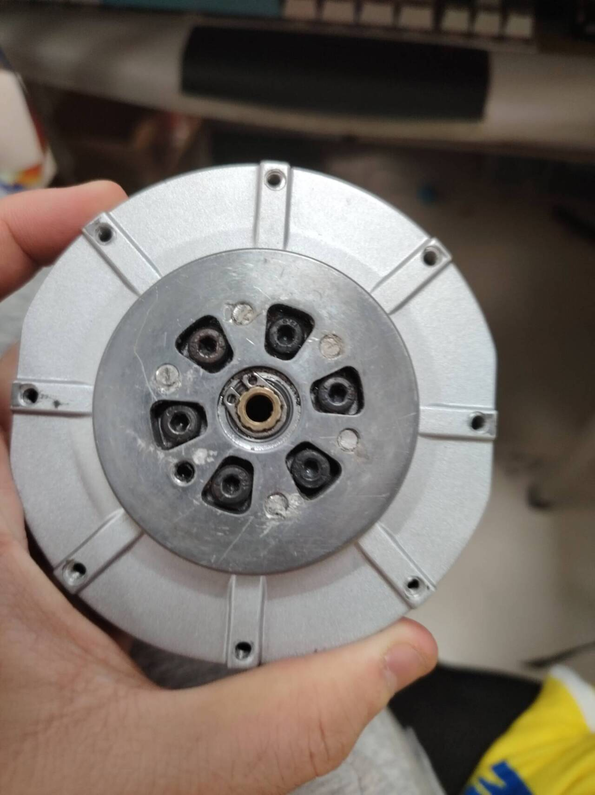
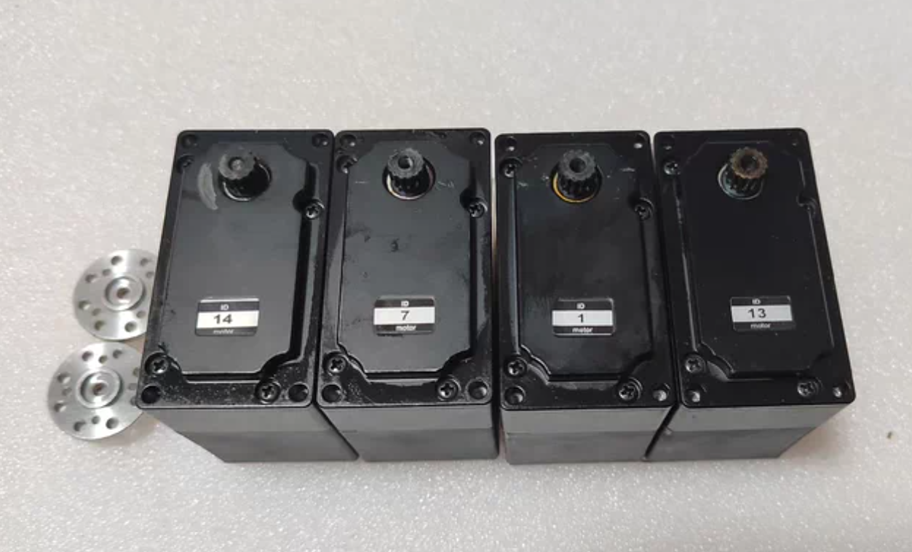
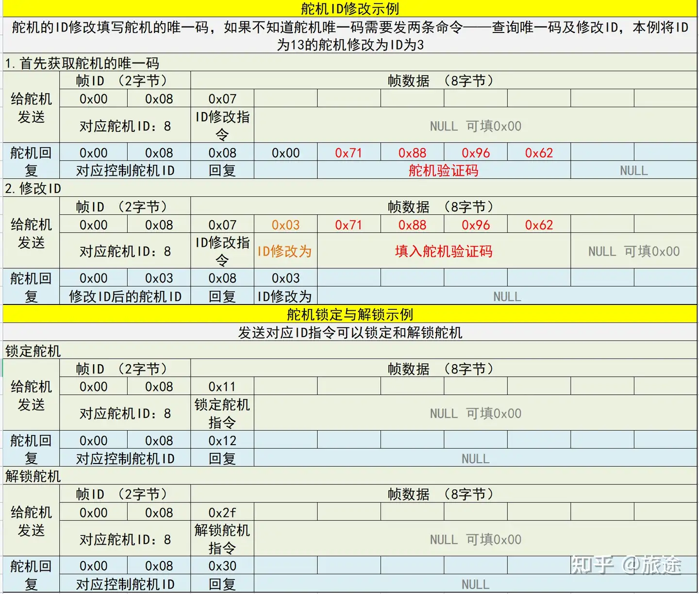

# RC足式机器人扫盲

在这个简陋的文档开头先简单做一下自我介绍。我是福建理工大学MTI战队足式组的Lain，在2025赛季基本完整负责了马术一队的研发，最后的成绩为江阴赛区竞速赛30名，障碍赛31名，越野赛34名，共三项国二，算是实现了队伍马术的第一次全赛道国二。

高三暑假被太原工业的马术视频拉入RC[大三寄录-两个前空翻过阶梯（脚滑）_哔哩哔哩_bilibili](https://www.bilibili.com/video/BV1sz4y147t6/?spm_id_from=333.1387.upload.video_card.click&vd_source=193a56b6f00b33090010ba20d05cfef7)


<center>是的就是这个万恶之源<center>
大一主要负责主赛，大二作为电控组负责人不满队内马术现状，于是梭哈马术。从暑假8月起从机械、材料选型、配合、电机选型、电机驱动、算法优化和MID360导航方案验证（最后求稳还是上了手动），算是全栈做完了一只狗子。在此分享一些自己对**RC足式机器人赛道**乃至足式机器人较泛的理解，属于**扫盲**性质。部分内容已经有人讲过了，亲测下来也可用，就通过分享链接的方式放在文档内了。本文对象主要为四足，六足会少量提及，尽可能涵盖舵机与伺服电机。

联系方式：2302109068@qq.com

部分资料链接：[足式网络资源整理以及官方下载地址](https://docs.qq.com/sheet/DRm1RV1NnSXJXeWtS?tab=BB08J2)

观前叠甲：个人计算机专业出身，机械、硬件完全不专业，能力有限，麻烦各位勘误。

本文档已做好标题分级，使用edge等PDF查看器打开会有目录。前半部分为纯理论推导，后半部分是此文档的重点。

接下来进入正文。

更新记录：

2025/10/12 V1.0 发布第一版RC足式机器人扫盲文档。

2025/10/13 V1.1 修正一部分表达错误，优化文档的PDF输出格式，补全了因为太长塞不下的公式。

---

# 一、RC足式机器人比赛与机器人特点

## （一）RC足式机器人比赛


第十八届全国大学生机器人大赛 ROBOCON 以“快马加鞭”为主题，灵感来自古代传递信息的驿传制度。


第十八届全国大学生机器人大赛 ROBOCON 赛场上首次出现了四足的机器马，为挖掘四足机器人的深层价值，提高机器人技术研发的可持续性，自2019年起，举办 ROBOCON 机器马术赛。2019ROBOCON 机器马术赛于第十八届全国大学生机器人赛 ROBOCON “快马加鞭”决赛期间同地进行，仅设竞速赛和绕柱赛两项。

自2019年至今，马术比赛从主赛的R2比赛变为独立赛事，从实物+仿真赛演变成纯实物竞赛，并在2024年增加了越野赛。

下图为第二十一届马术场地。对比二十四届的场地可发现难度提升其实不算大，而总体上各个学校足式机器人的性能对比2022年已经不是一个级别了。首先是从电机选型上，早期的电机除了部分学校自研外（如东大、武大）基本为3508，因此各队伍通过加减速齿、加同步带、改装减速箱的方式增大电机扭矩以满足比赛要求；2023年起，以宇树GO1电机为代表的廉价关节电机开始在马术参赛队伍中普及，极大提升了整体机器人的性能上限。其次是结构设计上，各队伍越来越趋于最优解，例如串联腿部的减速齿轮+平行四边形连杆趋势；并联腿的碳方框架趋势。最终为控制算法，早期包括北科等强在2022赛季仍都是使用位置控制，甚至有部分学校连运动学解算都不使用，以轨迹取点的方式，给电机发送8到16个角度点位实现运动；而在2025赛季（第二十四届），大连交通大学落地了良好的强化学习效果。


下图为第二十二届马术场地。第二十三届基本沿用，在中心区添加了障碍。

| 第二十二届马术场地（图1） | 第二十二届马术场地（图2） |
|--------------------------|--------------------------|
|  |  |
| 第二十三届马术场地（图1） | 第二十三届马术场地（图2） |
|  |  |

竞速赛由直线演变为两年的转弯踩点，再到今年的直线。北科在24赛季惊艳的表现很大程度取决于其MPC算法，可简单理解为质心参考轨迹跟踪，实现了及其丝滑的过弯，这是之前大多数通过差速实现转弯的八自由度足式机器人是不同的。在障碍赛主要有：上下台阶、斜坡、高于或低于300mm通过障碍的需求。一直为结构化地形，对八自由度的并联四足较为友好，毕竟没有什么障碍是不能跳过去的。除第二十三届外，均有跨越300mm障碍的强制要求，早期的300mm障碍甚至是接触就掉的——这对于串联狗可不太友好。今年除了南昌大学使用了后空翻过障碍的方案外，串联的足式机器人基本是用前后腿扒拉的方案过高墙的，存在一定的失误率。

## （二）RC足式机器人特点

目前RC足式机器人可用一句话概括：

**并联同轴五连杆与位置控制仍为主流，串联除少部分队伍没有明显优势，越障整体依赖跳跃而非地形适应，自动方案整体稳定性差，与主流相差甚远。**

接下来我们一句句解释，对各个方案的介绍请看第二、第三部分。

（1）**并联同轴五连杆与位置控制仍为主流**；早期大多数队伍使用了3508这一款被广泛应用于RC\RM机器人底盘与各机构的电机，大大降低电控难度，最底线的情况下使用查表法（每一个足端点位对应两个电机的绝对位置，在完整的足端轨迹中采样八个点去循环运行）即可正常运行。采用位置控制就可以实现跳跃和稳定运动，控制方面采用力控制方案较少，这导致能量使用效率低，足底冲击大，完全采用点接触后稳定性不足，不得不增大足端，甚至使机器人发运动性能极大取决于足端的磨损程度高低。

（2）**串联除少部分队伍没有明显优势**：串联腿对小腿电机扭矩要求高，因此不得不缩小力臂长度，再加上没有科学的减速比计算方案，使得很多队伍的支撑腿长度甚至不如并联机构。虽然可以实现相同的足端轨迹与运动周期方案，但电机的高扭矩负载使得对应转速和相应明显下降。所以同样使用位置控制/力控制的情况下，串联对比并联没有明显优势，甚至可以说劣于。目前应该是没有使用更好算法的8自由度并联，因此没办法进一步对比。

（3）**越障整体依赖跳跃而非地形适应**：比赛地形主要以结构化为主，并联结构极其简单的跳跃实现完美满足使用需求，这使得大多数队伍抛弃了对地形适应的考虑；因此25赛季江阴越野赛草坡这种仅稍稍麻烦点的地形就卡了大量队伍导致越野赛没有成绩。

（4）**自动方案整体稳定性差**：很多队伍按照23年来的技术惯性使用了AprilTags相机定位，部分队伍使用了MID360的雷达方案，以及少部分队伍使用了以D435i为代表的深度相机，在比赛中经常出现距离识别错误、运动响应不足、定位便宜大、决策树适应性差等问题。而越野赛除了北科基本为手动方案，也足以发现RC主流视觉方案的部分局限性——当然今年也出现了RTK方案，希望明年可以成熟一些。

（5）**与主流相差甚远**：很多参赛的机器人比例不协调，导致运动学空间大大受限，运行效率差；控制方法落后但性价比高，逐渐成为了局部最优解；感知方案鲁棒性差……当然，这个比赛的主力基本为大一、大二学生，并非业内人士与研究生，因此也不能过多苛责。以北科、哈工大、大交、东大为代表的第一梯度也开始逐渐尝试往目前较为先进的方向探索，非常期待在26赛季的表现。

所以组委会也果断对26赛季的比赛进行了改革，希望有效吧（写于2025/9/29，规则10月中旬才出来）

# 二、足式机器人理论基础

## （一）基于D-H坐标系的四足机器人运动学建模

### 1 D-H坐标系说明

以十二自由度串联的单腿运动学为例。

让我们把四足机器人的腿视为一系列由关节连接起来的连杆。为四足机器人的每一连杆建立一个坐标系，并用齐次变换来描述这些坐标系间的相对位置和姿态。通常，$\{i\}$系的坐标原点在关节$i$和关节$i + 1$轴线的公法线和关节$i$轴线的交点上，$z_i$与关节$i$的轴线重合，$x_i$和上述公法线重合（方向由关节$i$指向$i + 1$），$y_i$用右手定则确定。  

令4条腿的髋关节坐标点与$O_0$共$z$平面，这样便不存在$z$方向的平移。

规定躯干固连坐标系$\{O_b\}$位于躯干自身的几何中心，定义$y_b$的正方向为机体前进方向，$z_b$的正方向与重力方向相反，$z_b$垂直躯干横面向上，$x_b$按照D-H要求，经$O_b$自$z_b$指向$z_0$。


这里错了，Xb为正方向


$\{0\}$系为全局坐标系，$\{1\}$系为髋部关节固连于机体的坐标系，以下关节坐标系分别为$\{2\}$和$\{3\}$系及末端足端$\{4\}$系。

$\{0\}$系位于右前腿和右后腿坐标系连线中点，$z_0$同向平行于$z_b$，$x_0$垂直于躯干右立面，方向由右立面指向左立面。

$\{1\}$系的原点$O_1$在机体坐标$\{0\}$系中的位置为$(a,b,c)$，其中$a=-w$，$b=0$，$c=0$。$\{1\}$系的$z_1$与1关节的轴线重合，$x_1$和$z_1$与$z_2$公法线重合，方向由关节1指向关节2，$y_1$用右手定则确定。

$\{2\}$系的原点$O_2$在关节1和关节2轴线的公法线与关节2轴线的交点上，$z_2$与关节2的轴线重合。$x_2$和$z_3$与$z_2$的公法线重合，方向由关节2指向关节3，$y_2$用右手定则确定。

$\{3\}$系的原点$O_3$在关节2和关节3轴线的公法线与关节3轴线的交点上，$z_3$与关节3的轴线重合（与$z_2$平行同向）；$\{4\}$系虚拟$z$轴平行于$z_3$，$x_3$由关节3指向足端末端$\{4\}$系，且$x_4$与$x_3$一致。

下面介绍右前腿（RF）的运动学公式推导过程。  其他腿的推导过程一样，自行替换数值。


### 2 正运动学 

建立躯干固连坐标系$(x_b, y_b, z_b)$，其原点$O_b$为机体质心的初始位置。

根据右前腿结构，列出**D-H参数表**： 

| 编号$i$ | 杆件长度$a_i$ | 杆件扭角$\alpha_i$ | 关节距离$d_i$ | 关节转角$\theta_i$ |
|---------|---------------|--------------------|---------------|--------------------|
| 0       | $b$           | $0^\circ$          | $-h$          | $90^\circ$         |
| 1       | $-w$          | $-90^\circ$        | $0$           | $\theta_1$         |
| 2       | $L_1$         | $-90^\circ$        | $0$           | $\theta_2$         |
| 3       | $L_2$         | $0^\circ$          | $0$           | $\theta_3$         |
| 4       | $L_3$         | $0^\circ$          | $0$           | $0^\circ$          |

根据D-H方法的**齐次变换矩阵公式**：
$$
{}_{i}^{i-1}\mathbf{T} = \begin{bmatrix} c_i & -s_i & 0 & a_i \\ c_{\alpha_i}s_i & c_{\alpha_i}c_i & -s_{\alpha_i} & -d_i s_{\alpha_i} \\ s_{\alpha_i}s_i & s_{\alpha_i}c_i & c_{\alpha_i} & d_i c_{\alpha_i} \\ 0 & 0 & 0 & 1 \end{bmatrix}
$$

（式中，$c_i = \cos\theta_i$，$s_i = \sin\theta_i$）  


将右前腿D-H参数代入齐次变换公式，得到各连杆间的齐次变换矩阵：

$$
{}_{0}^{b}\mathbf{T} = \begin{bmatrix} 0 & -1 & 0 & b \\ 1 & 0 & 0 & 0 \\ 0 & 0 & 1 & -h \\ 0 & 0 & 0 & 1 \end{bmatrix}, \quad {}_{1}^{0}\mathbf{T} = \begin{bmatrix} c_1 & -s_1 & 0 & -w \\ 0 & 0 & 1 & 0 \\ -s_1 & -c_1 & 0 & 0 \\ 0 & 0 & 0 & 1 \end{bmatrix} 
$$

$$
{}_{2}^{1}\mathbf{T} = \begin{bmatrix} c_2 & -s_2 & 0 & L_1 \\ 0 & 0 & 1 & 0 \\ -s_2 & -c_2 & 0 & 0 \\ 0 & 0 & 0 & 1 \end{bmatrix}, \quad {}_{3}^{2}\mathbf{T} = \begin{bmatrix} c_3 & -s_3 & 0 & L_2 \\ s_3 & c_3 & 0 & 0 \\ 0 & 0 & 1 & 0 \\ 0 & 0 & 0 & 1 \end{bmatrix} 
$$

$$
{}_{4}^{3}\mathbf{T} = \begin{bmatrix} 1 & 0 & 0 & L_3 \\ 0 & 1 & 0 & 0 \\ 0 & 0 & 1 & 0 \\ 0 & 0 & 0 & 1 \end{bmatrix}
$$

足端相对于躯干固连坐标系的**位姿矩阵**为各齐次变换的乘积：

$$
 {}_{4}^{b}\mathbf{T} = {}_{0}^{b}\mathbf{T} {}_{1}^{0}\mathbf{T} {}_{2}^{1}\mathbf{T} {}_{3}^{2}\mathbf{T} {}_{4}^{3}\mathbf{T} 
$$

展开后得到：

$$
{}_{4}^{b}\mathbf{T} = \begin{bmatrix} s_2 c_3 + c_2 s_3 & c_2 c_3 - s_2 s_3 & 0 & b + L_2 s_2 + L_3 (c_2 s_3 + s_2 c_3) \\ c_1 c_2 c_3 - c_1 s_2 s_3 & -c_1 c_2 s_3 - c_1 s_2 c_3 & -s_1 & -w + [L_1 c_1 + L_2 c_1 c_2 + L_3 (c_1 c_2 c_3 - c_1 s_2 s_3)] \\ s_1 s_2 s_3 - s_1 c_2 c_3 & s_1 c_2 s_3 + s_1 s_2 c_3 & -c_1 & -L_1 s_1 - L_2 s_1 c_2 + L_3 (s_1 s_2 s_3 - s_1 c_2 c_3) - h \\ 0 & 0 & 0 & 1 \end{bmatrix}
$$

将位姿矩阵拆分为**旋转矩阵$\mathbf{R}$**和**位置向量$\mathbf{P}$**：

$$
{}_{4}^{b}\mathbf{T} = \begin{bmatrix} \mathbf{R} & \mathbf{P} \\ 0\ 0\ 0 & 1 \end{bmatrix}, \quad \mathbf{R} = \begin{bmatrix} s_2 c_3 + c_2 s_3 & c_2 c_3 - s_2 s_3 & 0 \\ c_1 c_2 c_3 - c_1 s_2 s_3 & -c_1 c_2 s_3 - c_1 s_2 c_3 & -s_1 \\ -s_1 c_2 c_3 + s_1 s_2 s_3 & s_1 c_2 s_3 + s_1 s_2 c_3 & -c_1 \end{bmatrix} 
$$

$$
\mathbf{P} = \begin{bmatrix} p_x \\ p_y \\ p_z \end{bmatrix} = \begin{bmatrix} b + L_2 s_2 + L_3 (c_2 s_3 + s_2 c_3) \\ -w + [L_1 c_1 + L_2 c_1 c_2 + L_3 (c_1 c_2 c_3 - c_1 s_2 s_3)] \\ -L_1 s_1 - L_2 s_1 c_2 + L_3 (s_1 s_2 s_3 - s_1 c_2 c_3) - h \end{bmatrix} 
$$

若将$\theta_1$修正为实际机器人使用的角度（定义$\theta_1 = \theta_1' + 90^\circ$），则位置向量简化为：

$$
\mathbf{P} = \begin{bmatrix} p_x \\ p_y \\ p_z \end{bmatrix} = \begin{bmatrix} b + L_2 s_2 + L_3 (c_2 s_3 + s_2 c_3) \\ -w - [L_1 s_1 + L_2 s_1 c_2 + L_3 (s_1 c_2 c_3 - s_1 s_2 s_3)] \\ -L_1 c_1 - L_2 c_1 c_2 + L_3 (c_1 s_2 s_3 - c_1 c_2 c_3) - h \end{bmatrix} 
$$

对足端位置向量$\mathbf{P}$化简（令$c_{ij} = \cos(\theta_i + \theta_j)$，$s_{ij} = \sin(\theta_i + \theta_j)$），得：

$$
\mathbf{P} = \begin{bmatrix} p_x \\ p_y \\ p_z \end{bmatrix} = \begin{bmatrix} b + L_2 s_2 + L_3 s_{23} \\ -w - (L_1 s_1 + L_2 s_1 c_2 + L_3 s_1 c_{23}) \\ -L_1 c_1 - L_2 c_1 c_2 - L_3 c_1 c_{23} - h \end{bmatrix} 
$$

对该式做**时间微分**，得到足端线速度与关节角速度的关系：

$$
\dot{p}_x = L_2 c_2 \dot{\theta}_2 + L_3 c_{23} (\dot{\theta}_2 + \dot{\theta}_3) 
$$

$$
\dot{p}_y = -L_1 c_1 \dot{\theta}_1 - L_2 c_1 c_2 \dot{\theta}_1 + L_2 s_1 s_2 \dot{\theta}_2 - L_3 c_1 c_{23} \dot{\theta}_1 + L_3 s_1 s_{23} (\dot{\theta}_2 + \dot{\theta}_3) 
$$

$$
\dot{p}_z = L_1 s_1 \dot{\theta}_1 + L_2 s_1 c_2 \dot{\theta}_1 + L_2 c_1 s_2 \dot{\theta}_2 + L_3 s_1 c_{23} \dot{\theta}_1 + L_3 c_1 s_{23} (\dot{\theta}_2 + \dot{\theta}_3) 
$$

整理为**矩阵形式**（足端线速度$\begin{bmatrix} v_x \\ v_y \\ v_z \end{bmatrix} = \begin{bmatrix} \dot{p}_x \\ \dot{p}_y \\ \dot{p}_z \end{bmatrix}$，关节角速度$\begin{bmatrix} \dot{\theta}_1 \\ \dot{\theta}_2 \\ \dot{\theta}_3 \end{bmatrix}$）： $$ \begin{bmatrix} v_x \\ v_y \\ v_z \end{bmatrix} = \mathbf{J}(\theta) \begin{bmatrix} \dot{\theta}_1 \\ \dot{\theta}_2 \\ \dot{\theta}_3 \end{bmatrix} $$ 

其中**雅可比矩阵**$\mathbf{J}(\theta)$为： 
$$
\mathbf{J}(\theta) = \begin{bmatrix} 0 & L_2 c_2 + L_3 c_{23} & L_3 c_{23} \\ -L_1 c_1 - L_2 c_1 c_2 + L_3 c_1 c_{23} & L_2 s_1 s_2 + L_3 s_1 s_{23} & L_3 s_1 s_{23} \\ L_1 s_1 + L_2 s_1 c_2 + L_3 s_1 c_{23} & L_2 c_1 s_2 + L_3 c_1 s_{23} & L_3 c_1 s_{23} \end{bmatrix} 
$$

因此，关节角速度可通过雅可比矩阵的逆求解： 
$$
\begin{bmatrix} \dot{\theta}_1 \\ \dot{\theta}_2 \\ \dot{\theta}_3 \end{bmatrix} = \mathbf{J}(\theta)^{-1} \begin{bmatrix} v_x \\ v_y \\ v_z \end{bmatrix} 
$$

### 3 逆运动学
逆运动学旨在“已知足端位姿，求关节变量”，是机器人位姿控制与轨迹规划的基础。 

由位姿矩阵关系${}_{4}^{b}\mathbf{T} = {}_{0}^{b}\mathbf{T} {}_{1}^{0}\mathbf{T} {}_{2}^{1}\mathbf{T} {}_{3}^{2}\mathbf{T} {}_{4}^{3}\mathbf{T}$，推导得：

$$
{}_{2}^{1}\mathbf{T}^{-1} {}_{1}^{0}\mathbf{T}^{-1} {}_{0}^{b}\mathbf{T}^{-1} {}_{4}^{b}\mathbf{T} = {}_{3}^{2}\mathbf{T} {}_{4}^{3}\mathbf{T} = \begin{bmatrix} c_3 & -s_3 & 0 & L_2 + L_3 c_3 \\ s_3 & c_3 & 0 & L_3 s_3 \\ 0 & 0 & 1 & 0 \\ 0 & 0 & 0 & 1 \end{bmatrix}
$$

利用**齐次变换的逆矩阵公式**$\mathbf{T}^{-1} = \begin{bmatrix} \mathbf{Q}^\mathrm{T} & -\mathbf{Q}^\mathrm{T} \mathbf{R} \\ \mathbf{0}^\mathrm{T} & 1 \end{bmatrix}$（其中$\mathbf{T} = \begin{bmatrix} \mathbf{Q} & \mathbf{R} \\ \mathbf{0}^\mathrm{T} & 1 \end{bmatrix}$）得到：


应该为0100
$$
{_0^b}\boldsymbol{T} = \begin{bmatrix} 0 & -1 & 0 & b \\ 1 & 0 & 0 & 0 \\ 0 & 0 & 1 & -h \\ 0 & 0 & 0 & 1 \end{bmatrix}, \quad {_0^b}\boldsymbol{T}^{-1} = \begin{bmatrix} 0 & 1 & 0 & 1 \\ -1 & 0 & 0 & b \\ 0 & 0 & 1 & h \\ 0 & 0 & 0 & 1 \end{bmatrix}
$$

$$
{_1^0}\boldsymbol{T} = \begin{bmatrix} c_1 & -s_1 & 0 & -w \\ 0 & 0 & 1 & 0 \\ -s_1 & -c_1 & 0 & 0 \\ 0 & 0 & 0 & 1 \end{bmatrix}, \quad {_1^0}\boldsymbol{T}^{-1} = \begin{bmatrix} c_1 & 0 & -s_1 & w c_1 \\ -s_1 & 0 & -c_1 & w s_1 \\ 0 & 1 & 0 & 0 \\ 0 & 0 & 0 & 1 \end{bmatrix}
$$

$$
{_2^1}\boldsymbol{T} = \begin{bmatrix} c_2 & -s_2 & 0 & L_1 \\ 0 & 0 & 1 & 0 \\ -s_2 & -c_2 & 0 & 0 \\ 0 & 0 & 0 & 1 \end{bmatrix}, \quad {_2^1}\boldsymbol{T}^{-1} = \begin{bmatrix} c_2 & 0 & -s_2 & -L_1 c_2 \\ -s_2 & 0 & -c_2 & L_1 s_2 \\ 0 & 1 & 0 & 0 \\ 0 & 0 & 0 & 1 \end{bmatrix}
$$

从而：

$$
{_2^1}\boldsymbol{T}^{-1} {_1^0}\boldsymbol{T}^{-1} {_0^b}\boldsymbol{T}^{-1} = \begin{bmatrix} s_2 & c_1 c_2 & -s_1 c_2 & w c_1 c_2 - h s_1 c_2 - b s_2 - L_1 c_2 \\ c_2 & -c_1 s_2 & s_1 s_2 & -w c_1 s_2 + h s_1 s_2 - b c_2 + L_1 s_2 \\ 0 & -s_1 & -c_1 & -w s_1 - h c_1 \\ 0 & 0 & 0 & 1 \end{bmatrix}
$$

得到：

$$
\begin{aligned}
\begin{bmatrix} 
s_2 & c_1 c_2 & -s_1 c_2 & w c_1 c_2 - h s_1 c_2 - b s_2 - L_1 c_2 \\ 
c_2 & -c_1 s_2 & s_1 s_2 & -w c_1 s_2 + h s_1 s_2 - b c_2 + L_1 s_2 \\ 
0 & -s_1 & -c_1 & -w s_1 - h c_1 \\ 
0 & 0 & 0 & 1 
\end{bmatrix} 
\begin{bmatrix} 
\boldsymbol{R} & p_x \\ 
& p_y \\ 
& p_z \\ 
0 & 0 & 0 & 1 
\end{bmatrix} 
&= \\
\begin{bmatrix} 
c_3 & -s_3 & 0 & L_2 + L_3 c_3 \\ 
s_3 & c_3 & 0 & L_3 s_3 \\ 
0 & 0 & 1 & 0 \\ 
0 & 0 & 0 & 1 
\end{bmatrix}
\end{aligned}
$$

由等式两端的矩阵第4列，可得到：

$$
s_2 p_x + c_1 c_2 p_y - s_1 c_2 p_z + w c_1 c_2 - h s_1 c_2 - b s_2 - L_1 c_2 = L_2 + L_3 c_3 \tag{3.1}
$$

$$
c_2 p_x - c_1 s_2 p_y + s_1 s_2 p_z - w c_1 s_2 + h s_1 s_2 - b c_2 + L_1 s_2 = L_3 s_3 \tag{3.2}
$$

$$
-s_1 p_y - c_1 p_z - w s_1 - h c_1 = 0 \tag{3.3}
$$

把$$\theta_1$$ 改成实际机器人系统使用的角度，定义新的$$\theta_1'$$（为机器人使用的角度值），则有：

$$
\theta_1 = \theta_1' + 90^\circ
$$

由式(3.3)得：

$$
-c_1 p_y + s_1 p_z - w c_1 + h s_1 = 0 
$$

$$
\theta_1 = \arctan\left( \frac{w + p_y}{p_z + h} \right), \quad \theta_1 \in \left( -\frac{\pi}{2}, \frac{\pi}{2} \right)
$$

代入式(3.1)和式(3.2)，并令：

$$
D = c_1 p_y - s_1 p_z + w c_1 - h s_1 - L_1 \quad (c_2 \text{ 的系数})
$$
$$
E = p_x - b \quad (s_2 \text{ 的系数})
$$

所以：

$$
D c_2 + E s_2 = L_2 + L_3 c_3 \tag{3.4}
$$
$$
E c_2 - D s_2 = L_3 s_3 
$$

两式平方相加。


$$
D^2 + E^2 = L_2^2 + L_3^2 + 2 L_2 L_3 c_3
$$

求出：

$$
\theta_3 = \arccos\left( \frac{D^2 + E^2 - L_2^2 - L_3^2}{2 L_2 L_3} \right), \quad \theta_3 \in \left( -\frac{\pi}{2}, \frac{\pi}{2} \right)
$$

令 $$ K = L_2 + L_3 c_3 $$，则由式(3.4)得：

$$
D c_2 + E s_2 = K
$$

等式两端平方可得：

$$
D^2 c_2^2 + E^2 s_2^2 + 2 D E c_2 s_2 = K^2
$$

也可写成：

$$
D^2 c_2^2 + D^2 s_2^2 + E^2 s_2^2 + E^2 c_2^2 + 2 D E c_2 s_2 - D^2 s_2^2 - E^2 c_2^2 = K^2
$$

$$
D^2 + E^2 + 2 D E c_2 s_2 - D^2 s_2^2 - E^2 c_2^2 = K^2
$$

$$
D^2 s_2^2 - 2 D E c_2 s_2 + E^2 c_2^2 = D^2 + E^2 - K^2
$$

从而可以推出：

$$
E c_2 - D s_2 = \sqrt{D^2 + E^2 - K^2} \quad (\text{保证取值为正})
$$

把该式与式(3.4)相除，可得：

$$
\frac{E c_2 - D s_2}{D c_2 + E s_2} = \frac{\sqrt{D^2 + E^2 - K^2}}{K} 
$$

上式也可写成：

$$
\frac{E - D \tan_2}{D + E \tan_2} = \frac{\sqrt{D^2 + E^2 - K^2}}{K} \quad 
$$

化简上式，得到：

$$
\tan_2 = \frac{E - D \frac{\sqrt{D^2 + E^2 - K^2}}{K}}{D + E \frac{\sqrt{D^2 + E^2 - K^2}}{K}}
$$

$$
\theta_2 = \arctan\left( \frac{E - D \frac{\sqrt{D^2 + E^2 - K^2}}{K}}{D + E \frac{\sqrt{D^2 + E^2 - K^2}}{K}} \right), \quad \theta_2 \in (-\pi, \pi)
$$

从而$$\theta_1$$、$$\theta_2$$、$$\theta_3$$的角度表示公式为：

$$
\theta_1 = \arctan\left( \frac{w + p_y}{p_z + h} \right), \quad \theta_1 \in \left( -\frac{\pi}{2}, \frac{\pi}{2} \right)
$$

$$
\theta_2 = \arctan\left( \frac{E - D \frac{\sqrt{D^2 + E^2 - K^2}}{K}}{D + E \frac{\sqrt{D^2 + E^2 - K^2}}{K}} \right), \quad \theta_2 \in (-\pi, \pi) \ (\text{$s_3$ 为正值时})
$$

$$
\theta_2 = \arctan\left( \frac{E + D \frac{\sqrt{D^2 + E^2 - K^2}}{K}}{D - E \frac{\sqrt{D^2 + E^2 - K^2}}{K}} \right) \quad (\text{$s_3$ 为负值时})
$$


$$
\theta_3 = \arccos\left( \frac{D^2 + E^2 - L_2^2 - L_3^2}{2 L_2 L_3} \right), \quad \theta_3 \in \left( -\frac{\pi}{2}, \frac{\pi}{2} \right)
$$

$$
D = -s_1 p_y - c_1 p_z - w s_1 - h c_1 - L_1
$$

$$
E = p_x - b
$$

$$
L_2 + L_3 c_3 = K
$$

## （二） 雅可比矩阵

### 1 雅可比矩阵基础与建模 

两空间之间速度的线性映射关系可表示为**雅可比矩阵**（简称“雅可比”）。它可看作从关节空间到操作空间（笛卡尔空间）运动速度的传动比，也可用于表示两空间之间力的传递关系。以**2自由度平面机械手**为例说明：  


基于机器人运动学建模方法，平面机械手末端手爪相对于基坐标系的位置关系为：

$$
 \begin{cases} x = l_1 c_1 + l_2 c_{12} \\ y = l_1 s_1 + l_2 s_{12} \end{cases} 
$$

（式中，$c_i = \cos\theta_i$，$s_i = \sin\theta_i$；$c_{12} = \cos(\theta_1+\theta_2)$，$s_{12} = \sin(\theta_1+\theta_2)$。）  

对其微分，得到**微小位移关系**：

$$
\begin{cases} 
 \mathrm{d}x = \frac{\partial x}{\partial \theta_1} \mathrm{d}\theta_1 + \frac{\partial x}{\partial \theta_2} \mathrm{d}\theta_2 \\ 
 \mathrm{d}y = \frac{\partial y}{\partial \theta_1} \mathrm{d}\theta_1 + \frac{\partial y}{\partial \theta_2} \mathrm{d}\theta_2 \end{cases}
$$

写成**矩阵形式**：

$$
\begin{bmatrix} \mathrm{d}x \\ \mathrm{d}y \end{bmatrix} = \begin{bmatrix} \frac{\partial x}{\partial \theta_1} & \frac{\partial x}{\partial \theta_2} \\ \frac{\partial y}{\partial \theta_1} & \frac{\partial y}{\partial \theta_2} \end{bmatrix} \begin{bmatrix} \mathrm{d}\theta_1 \\ \mathrm{d}\theta_2 \end{bmatrix}
$$

代入偏导数后，得：

$$
 \begin{bmatrix} \mathrm{d}x \\ \mathrm{d}y \end{bmatrix} = \begin{bmatrix} -l_1 s_1 - l_2 s_{12} & -l_2 s_{12} \\ l_1 c_1 + l_2 c_{12} & l_2 c_{12} \end{bmatrix} \begin{bmatrix} \mathrm{d}\theta_1 \\ \mathrm{d}\theta_2 \end{bmatrix} 
$$

简写为： 
$$
\mathrm{d}\mathbf{x} = \mathbf{J} \mathrm{d}\boldsymbol{\theta} 
$$

式中，$\mathbf{J}$为机械手的**雅可比矩阵**，由$x、y$的偏微分组成，反映关节微小位移$\mathrm{d}\boldsymbol{\theta}$与手爪微小运动$\mathrm{d}\mathbf{x}$的关系。  

若关节速度为$\dot{\boldsymbol{\theta}} = [\dot{\theta}_1, \dot{\theta}_2]^\mathrm{T}$，手爪速度为$\mathbf{v} = \dot{\mathbf{x}} = [\dot{x}, \dot{y}]^\mathrm{T}$，对$\mathrm{d}\mathbf{x} = \mathbf{J} \mathrm{d}\boldsymbol{\theta}$两边同除$\mathrm{d}t$，得： 

$$
\frac{\mathrm{d}\mathbf{x}}{\mathrm{d}t} = \mathbf{J} \frac{\mathrm{d}\boldsymbol{\theta}}{\mathrm{d}t} \implies \dot{\mathbf{x}} = \mathbf{J} \dot{\boldsymbol{\theta}} \implies \mathbf{v} = \mathbf{J} \dot{\boldsymbol{\omega}} 
$$

因此，雅可比矩阵定义为：**操作空间速度与关节空间速度的线性变换**（$\dot{\mathbf{x}}$或$\mathbf{v}$为手爪在操作空间的广义速度，$\dot{\boldsymbol{\theta}}$为关节速度）。  

机器人雅可比矩阵描述关节空间与操作空间的速度传动比。设$\mathbf{x}$为末端位姿（位置+姿态）的广义位置矢量，$\mathbf{q}$为关节坐标矢量（$n$个关节时为$n$维矢量），则：

$$
 \mathbf{x} = \mathbf{x}(\mathbf{q}) \implies \dot{\mathbf{x}} = \sum_{i=1}^6 \sum_{j=1}^n \frac{\partial x_i}{\partial q_j} \dot{q}_j = \mathbf{J}(\mathbf{q}) \dot{\mathbf{q}} 
$$

其中$\mathbf{J}(\mathbf{q})$为$6 \times n$的**偏导数矩阵**，第$i$行第$j$列元素为：

$$
J_{ij}(\mathbf{q}) = \frac{\partial x_i(\mathbf{q})}{\partial q_j}, \quad i=1,2,\dots,6; \, j=1,2,\dots,n 
$$

矩阵形式表示为： 
$$
\begin{bmatrix} \mathbf{v} \\ \boldsymbol{\omega} \end{bmatrix} = \begin{bmatrix} J_{11} & J_{12} & \dots & J_{1n} \\ J_{21} & J_{22} & \dots & J_{2n} \\ J_{31} & J_{32} & \dots & J_{3n} \\ J_{41} & J_{42} & \dots & J_{4n} \\ J_{51} & J_{52} & \dots & J_{5n} \\ J_{61} & J_{62} & \dots & J_{6n} \end{bmatrix} \begin{bmatrix} \dot{q}_1 \\ \dot{q}_2 \\ \vdots \\ \dot{q}_n \end{bmatrix} 
$$

雅可比矩阵也可**分块表示**：

$$
 \begin{bmatrix} \mathbf{v} \\ \boldsymbol{\omega} \end{bmatrix} = \begin{bmatrix} J_{L1} & J_{L2} & \dots & J_{Ln} \\ J_{A1} & J_{A2} & \dots & J_{An} \end{bmatrix} \begin{bmatrix} \dot{q}_1 \\ \dot{q}_2 \\ \vdots \\ \dot{q}_n \end{bmatrix} 
$$

手爪线速度$\mathbf{v}$和角速度$\boldsymbol{\omega}$可表示为关节速度$\dot{q}_i$的线性函数：

$$
\mathbf{v} = J_{L1}\dot{q}_1 + J_{L2}\dot{q}_2 + \dots + J_{Ln}\dot{q}_n, \quad \boldsymbol{\omega} = J_{A1}\dot{q}_1 + J_{A2}\dot{q}_2 + \dots + J_{An}\dot{q}_n
$$

以2自由度平面机械手为例，其雅可比矩阵为：

$$
 \mathbf{J} = \begin{bmatrix} -l_1 s_1 - l_2 s_{12} & -l_2 s_{12} \\ l_1 c_1 + l_2 c_{12} & l_2 c_{12} \end{bmatrix} 
$$

可见$\mathbf{J}$的值随手爪位置（$\theta_1、\theta_2$）变化。当$\theta_2 = 0^\circ$或$\theta_2 = 180^\circ$时，雅可比矩阵行列式为0，**秩减为1**，机械手处于**奇异形位**（操作空间自由度减少）。  

若雅可比矩阵$\mathbf{J}$是**满秩方阵**，关节速度可由$\dot{\boldsymbol{\theta}} = \mathbf{J}^{-1} \dot{\mathbf{x}}$求解。

例如平面2自由度机械手的逆雅可比矩阵：

$$
 \mathbf{J}^{-1} = \frac{1}{l_1 l_2 s_2} \begin{bmatrix} l_2 c_{12} & l_2 s_{12} \\ -l_1 c_1 - l_2 c_{12} & -l_1 s_1 - l_2 s_{12} \end{bmatrix} 
$$

当末端速度$\dot{\mathbf{x}} = [1, 0]^\mathrm{T}$时，关节速度为：

$$
 \dot{\theta}_1 = \frac{c_{12}}{l_1 s_2}, \quad \dot{\theta}_2 = -\frac{c_1}{l_2 s_2} - \frac{c_{12}}{l_1 s_2} 
$$

若$\theta_2 \to 0^\circ$（或$180^\circ$），机械手接近奇异形位，关节速度会趋于无穷大。  

### 2 四足机器人雅可比矩阵的一般求解方法 
将四足机器人的一条腿视为“机械手”，足端可达区域为**操作空间**，腿部3个关节为**关节空间**。

雅可比矩阵的推导方法有4种：**正运动学方法、矢量积法、微分变换法、连杆速度法**。它们均基于连杆空间坐标系，其中： 

- 正运动学、微分变换法需已知连杆齐次变换矩阵； 

- 矢量积法基于基坐标系计算列矩阵； 

- 连杆速度法通过基坐标系下的连杆速度变换，得到末端线速度和角速度。  

#### 2.1 矢量积法的雅可比矩阵计算方法 
##### 2.1.1 矢量积法原理
矢量积法将每个关节对末端手爪速度的影响表示为雅可比矩阵的一列（雅可比矩阵描述关节空间速度到操作空间速度的传递，最终得到基于基坐标系的雅可比矩阵）。 

末端手爪的线速度$\mathbf{v}$和角速度$\boldsymbol{\omega}$与关节速度$\dot{\boldsymbol{\theta}}$的线性映射为：

$$
 \begin{bmatrix} \mathbf{v} \\ \boldsymbol{\omega} \end{bmatrix} = \mathbf{J}_n(\boldsymbol{\theta}) \dot{\boldsymbol{\theta}} 
$$

 式中，$\boldsymbol{\theta} = [\theta_1, \theta_2, \dots, \theta_n]^\mathrm{T}$，$\dot{\boldsymbol{\theta}} = [\dot{\theta}_1, \dot{\theta}_2, \dots, \dot{\theta}_n]^\mathrm{T}$。

 四足机器人腿末端为6维操作空间，因此广义速度为$6 \times 1$矢量，雅可比矩阵$\mathbf{J}_n(\boldsymbol{\theta})$为$6$维；列数等于从基坐标系到末端手爪的关节数。雅可比矩阵前3行表示关节到手爪**线速度**的传递，后3行表示关节到末端手爪**角速度**的传递；每一列表示对应关节速度$\dot{\theta}_i$对末端手爪速度的传递。  

##### 2.1.2 关节$i$的速度求解（以旋转关节为例，基坐标系为$\{b\}$） 

（1）角速度求解 

关节绕$z$轴旋转，自身坐标系下的角速度为： 

$$
{}^i \boldsymbol{\omega}_i = {}^i z_i \dot{\theta}_i = \begin{bmatrix} 0 \\ 0 \\ 1 \end{bmatrix} \dot{\theta}_i 
$$

对等式两端乘以从$\{b\}$到$\{i\}$的旋转矩阵${}_i^b \mathbf{R}$，得到关节$i$相对于基坐标系的角速度：

$$
 {}_i^b \mathbf{R} \, {}^i \boldsymbol{\omega}_i = {}_i^b \mathbf{R} \, {}^i z_i \dot{\theta}_i = {}^b z_i \dot{\theta}_i 
$$

式中，${}^b z_i$为${}_i^b \mathbf{R}$矩阵的第3列。  

（2）线速度求解 

旋转关节的线速度由角速度引起。设关节$i$自身坐标系原点的矢径为$\mathbf{p}^i$，则原点处线速度为角速度$\boldsymbol{\omega}$在矢径$\mathbf{p}^i$处的线速度：

$$
 \mathbf{v}_i = \mathbf{p}^i \times \boldsymbol{\omega} 
$$

其中$\mathbf{p}^i = {}^b z_i \times {}^i \mathbf{p}_n^b$（${}^i \mathbf{p}_n^b$为末端手爪坐标系原点相对于$\{i\}$的位置在基坐标系$\{b\}$的表示）：

将此式代入上一式，得关节$i$的线速度：

$$
 \mathbf{v} = ({}^b z_i \times {}^i \mathbf{p}_n^b) \dot{\theta}_i 
$$

（3）广义速度求解 

综合线速度和角速度，关节$i$相对于基坐标系的**广义速度**为：

$$
 \begin{bmatrix} \mathbf{v} \\ \boldsymbol{\omega} \end{bmatrix} = \begin{bmatrix} {}^b z_i \times {}^i \mathbf{p}_n^b \\ {}^b z_i \end{bmatrix} \dot{\theta}_i 
$$

利用分块公式，整个雅可比矩阵为：

$$
 \mathbf{J}(\boldsymbol{\theta}) = \begin{bmatrix} {}^b z_1 \times {}^1 \mathbf{p}_n^b & {}^b z_2 \times {}^2 \mathbf{p}_n^b & \dots & {}^b z_n \times {}^n \mathbf{p}_n^b \\ {}^b z_1 & {}^b z_2 & \dots & {}^b z_n \end{bmatrix} 
$$

若需手爪广义速度在**自身坐标系**中的表示，需在$\mathbf{v}$和$\boldsymbol{\omega}$前同时乘从$\{b\}$到$\{n\}$的旋转矩阵${}_b^n \mathbf{R}$：

$$
 \begin{bmatrix} {}^n \mathbf{v} \\ {}^n \boldsymbol{\omega} \end{bmatrix} = \begin{bmatrix} {}_b^n \mathbf{R} & 0 \\ 0 & {}_b^n \mathbf{R} \end{bmatrix} \begin{bmatrix} \mathbf{v} \\ \boldsymbol{\omega} \end{bmatrix} 
$$

将式

$$
\begin{bmatrix} \mathbf{v} \\ \boldsymbol{\omega} \end{bmatrix} = \mathbf{J}_n(\boldsymbol{\theta}) \dot{\boldsymbol{\theta}} 
$$

代入上式，得手爪相对于自身坐标系的广义速度：

$$
 \begin{bmatrix} {}^n \mathbf{v} \\ {}^n \boldsymbol{\omega} \end{bmatrix} = \begin{bmatrix} {}_b^n \mathbf{R} & 0 \\ 0 & {}_b^n \mathbf{R} \end{bmatrix} \mathbf{J}(\boldsymbol{\theta}) \dot{\boldsymbol{\theta}} 
$$

进而得到两个雅可比矩阵的关系：

$$
 {}^T \mathbf{J}(\boldsymbol{\theta}) = \begin{bmatrix} {}_b^n \mathbf{R} & 0 \\ 0 & {}_b^n \mathbf{R} \end{bmatrix} \mathbf{J}(\boldsymbol{\theta}) 
$$

##### 2.1.3 四足机器人雅可比矩阵推导（矢量积法） 

需计算${}^b z_i$、${}^i \mathbf{p}_n$、${}_i^b \mathbf{R}$，代入$\mathbf{V}_n = \mathbf{J}(\boldsymbol{\theta}) [\dot{\theta}_1, \dot{\theta}_2, \dots, \dot{\theta}_n]^\mathrm{T}$，得到末端手爪相对于基坐标系$\{b\}$的雅可比矩阵。 

（1）计算${}^b z_i$ 各关节相对于基坐标系的旋转矩阵：

$$
 {}_0^b \mathbf{R} = \begin{bmatrix} 0 & -1 & 0 \\ 1 & 0 & 0 \\ 0 & 0 & 1 \end{bmatrix}, \quad {}_1^b \mathbf{R} = \begin{bmatrix} 0 & 0 & -1 \\ c_1 & -s_1 & 0 \\ -s_1 & -c_1 & 0 \end{bmatrix} 
$$

$$
 {}_2^b \mathbf{R} = \begin{bmatrix} s_2 & c_2 & 0 \\ c_1 c_2 & -c_1 s_2 & -s_1 \\ -s_1 c_2 & s_1 s_2 & -c_1 \end{bmatrix}, \quad {}_3^b \mathbf{R} = \begin{bmatrix} s_{23} & c_{23} & 0 \\ c_1 c_{23} & -c_1 s_{23} & -s_1 \\ -s_1 c_{23} & s_1 s_{23} & -c_1 \end{bmatrix} 
$$

$$
{}_4^b \mathbf{R} = \begin{bmatrix} s_{23} & c_{23} & 0 \\ c_1 c_{23} & -c_1 s_{23} & -s_1 \\ -s_1 c_{23} & s_1 s_{23} & -c_1 \end{bmatrix} 
$$

由此得：

$$
 {}^b z_0 = \begin{bmatrix} 0 \\ 0 \\ 1 \end{bmatrix}^\mathrm{T}, \quad {}^b z_1 = \begin{bmatrix} -1 \\ 0 \\ 0 \end{bmatrix}^\mathrm{T}, \quad {}^b z_2 = \begin{bmatrix} 0 \\ -s_1 \\ -c_1 \end{bmatrix}^\mathrm{T} 
$$

$$
 {}^b z_3 = \begin{bmatrix} 0 \\ -s_1 \\ -c_1 \end{bmatrix}^\mathrm{T}, \quad {}^b z_4 = \begin{bmatrix} 0 \\ -s_1 \\ -c_1 \end{bmatrix}^\mathrm{T} 
$$

（2）计算${}^i \mathbf{p}_n$ 各关节到末端手爪的变换矩阵：

$$
 {}_4^0 \mathbf{T} = \begin{bmatrix} c_1 c_{23} & -c_1 s_{23} & -s_1 & L_1 c_1 - w + L_2 c_1 c_2 + L_3 c_1 c_{23} \\ -s_{23} & -c_{23} & 0 & -L_2 s_2 - L_3 s_{23} \\ -s_1 c_{23} & s_1 s_{23} & -c_1 & -L_1 s_1 - L_2 s_1 c_2 - L_3 s_1 c_{23} \\ 0 & 0 & 0 & 1 \end{bmatrix} 
$$

$$
{}_4^1 \mathbf{T} = \begin{bmatrix} c_{23} & -s_{23} & 0 & L_1 + L_2 c_2 + L_3 c_{23} \\ 0 & 0 & 1 & 0 \\ -s_{23} & -c_{23} & 0 & -L_2 s_2 - L_3 s_{23} \\ 0 & 0 & 0 & 1 \end{bmatrix} 
$$

$$
{}_4^2 \mathbf{T} = \begin{bmatrix} c_3 & -s_3 & 0 & L_2 + L_3 c_3 \\ s_3 & c_3 & 0 & L_3 s_3 \\ 0 & 0 & 1 & 0 \\ 0 & 0 & 0 & 1 \end{bmatrix}, \quad {}_4^3 \mathbf{T} = \begin{bmatrix} 1 & 0 & 0 & L_3 \\ 0 & 1 & 0 & 0 \\ 0 & 0 & 1 & 0 \\ 0 & 0 & 0 & 1 \end{bmatrix} 
$$

$$
{}_4^4 \mathbf{T} = \begin{bmatrix} 0 & 0 & 0 & 0 \\ 0 & 0 & 0 & 0 \\ 0 & 0 & 0 & 0 \\ 0 & 0 & 0 & 0 \end{bmatrix} 
$$

由此得各关节到末端的位置矢量：

$$
{}^0 \mathbf{p}_4 = \begin{bmatrix} L_1 c_1 - w + L_3 c_1 c_{23} + L_2 c_1 c_2 \\ -L_2 s_2 - L_3 s_{23} \\ -L_1 s_1 - L_3 s_1 c_{23} - L_2 c_2 s_1 \end{bmatrix}, \quad {}^1 \mathbf{p}_4 = \begin{bmatrix} L_1 + L_2 c_2 + L_3 c_{23} \\ 0 \\ -L_2 s_2 - L_3 s_{23} \end{bmatrix} 
$$

$$
 {}^2 \mathbf{p}_4 = \begin{bmatrix} L_2 + L_3 c_3 \\ L_3 s_3 \\ 0 \end{bmatrix}, \quad {}^3 \mathbf{p}_4 = \begin{bmatrix} L_3 \\ 0 \\ 0 \end{bmatrix}, \quad {}^4 \mathbf{p}_4 = \begin{bmatrix} 0 \\ 0 \\ 0 \end{bmatrix} 
$$

（3）计算${}^i \mathbf{p}_n^b$ 由${}^i \mathbf{p}_n^b = {}_i^b \mathbf{R} \, {}^i \mathbf{p}_n$，得： 

$$
{}^0 \mathbf{p}_4^b = \begin{bmatrix} L_2 s_2 + L_3 s_{23} \\ L_1 c_1 - w + L_2 c_1 c_2 + L_3 c_1 c_{23} \\ -L_1 s_1 - L_2 s_1 c_2 - L_3 s_1 c_{23} \end{bmatrix}, \quad {}^1 \mathbf{p}_4^b = \begin{bmatrix} -L_2 s_2 - L_3 s_{23} \\ L_1 c_1 + L_2 c_1 c_2 + L_3 c_1 c_{23} \\ -L_1 s_1 - L_2 s_1 c_2 - L_3 s_1 c_{23} \end{bmatrix} 
$$

$$
{}^2 \mathbf{p}_4^b = \begin{bmatrix} L_2 s_2 + L_3 s_{23} \\ L_2 c_1 c_2 + L_3 c_1 c_{23} \\ -L_2 s_1 c_2 - L_3 s_1 c_{23} \end{bmatrix}, \quad {}^3 \mathbf{p}_4^b = \begin{bmatrix} L_3 s_{23} \\ L_3 c_1 c_{23} \\ -L_3 s_1 c_{23} \end{bmatrix}, \quad {}^4 \mathbf{p}_4^b = \begin{bmatrix} 0 \\ 0 \\ 0 \end{bmatrix} 
$$

（4）计算$\mathbf{J}(\boldsymbol{\theta})$的每一列 

根据式 
$$
\begin{bmatrix} \mathbf{v} \\ \boldsymbol{\omega} \end{bmatrix} = \begin{bmatrix} {}^b z_i \times {}^i \mathbf{p}_n^b \\ {}^b z_i \end{bmatrix} \dot{\theta}_i  
$$

各列有：

$$
 \mathbf{J}_1(\boldsymbol{\theta}) = \begin{bmatrix} {}^b z_0 \times {}^0 \mathbf{p}_4^b \\ {}^b z_0 \end{bmatrix} = \begin{bmatrix} -L_1 c_1 + w - L_2 c_1 c_2 - L_3 c_1 c_{23} \\ L_2 s_2 + L_3 s_{23} \\ 0 \\ 0 \\ 0 \\ 1 \\ 0 \end{bmatrix} 
$$

$$
 \mathbf{J}_2(\boldsymbol{\theta}) = \begin{bmatrix} {}^b z_1 \times {}^1 \mathbf{p}_4^b \\ {}^b z_1 \end{bmatrix} = \begin{bmatrix} -L_1 s_1 - L_2 s_1 c_2 - L_3 s_1 c_{23} \\ -L_1 c_1 - L_2 c_1 c_2 - L_3 c_1 c_{23} \\ -1 \\ 0 \\ 0 \end{bmatrix} 
$$

$$
\mathbf{J}_3(\boldsymbol{\theta}) = \begin{bmatrix} {}^b z_2 \times {}^2 \mathbf{p}_4^b \\ {}^b z_2 \end{bmatrix} = \begin{bmatrix} -L_2 c_2 - L_3 c_{23} \\ -L_2 c_1 s_2 - L_3 c_1 s_{23} \\ L_2 s_1 s_2 + L_3 s_1 s_{23} \\ 0 \\ -s_1 \\ -c_1 \end{bmatrix}
$$

$$
\mathbf{J}_4(\boldsymbol{\theta}) = \begin{bmatrix} {}^b z_3 \times {}^3 \mathbf{p}_4^b \\ {}^b z_3 \end{bmatrix} = \begin{bmatrix} -L_3 c_{23} \\ -L_3 c_1 s_{23} \\ L_3 s_1 s_{23} \\ 0 \\ -s_1 \\ -c_1 \end{bmatrix}, \quad \mathbf{J}_5(\boldsymbol{\theta}) = \begin{bmatrix} {}^b z_4 \times {}^4 \mathbf{p}_4^b \\ {}^b z_4 \end{bmatrix} = \begin{bmatrix} 0 \\ 0 \\ 0 \\ 0 \\ -s_1 \\ -c_1 \end{bmatrix}
$$

最终，基于式 

$$
\mathbf{J}(\boldsymbol{\theta}) = \begin{bmatrix} {}^b z_1 \times {}^1 \mathbf{p}_n^b & {}^b z_2 \times {}^2 \mathbf{p}_n^b & \dots & {}^b z_n \times {}^n \mathbf{p}_n^b \\ {}^b z_1 & {}^b z_2 & \dots & {}^b z_n \end{bmatrix} 
$$

相对于基坐标系$\{b\}$的雅可比矩阵为$\mathbf{J}(\mathbf{q}) = [\mathbf{J}_1(\mathbf{q}), \mathbf{J}_2(\mathbf{q}), \mathbf{J}_3(\mathbf{q}), \mathbf{J}_4(\mathbf{q}), \mathbf{J}_5(\mathbf{q})]$。  

#### 2.2 基于微分变换法的雅可比矩阵计算方法 

##### 2.2.1 微分变换法原理 

速度可视为单位采样时间内的**微分运动位移**，利用操作空间速度与关节空间速度的微分运动关系，得到雅可比矩阵（相对于操作空间坐标系）。 

操作空间速度$\dot{\mathbf{x}}$与关节速度$\dot{\mathbf{q}}$的关系为$\dot{\mathbf{x}} = \mathbf{J}(\mathbf{q}) \dot{\mathbf{q}}$，其中$\mathbf{J}$为$6 \times n$矩阵（$n$为关节数），前3行与线速度有关，后3行与角速度有关。 

计算步骤：

1. 计算各连杆间的变换矩阵：${}_1^0 \mathbf{T}, {}_2^1 \mathbf{T}, \dots, {}_{n-1}^n \mathbf{T}$。 
2. 计算各连杆到操作端连杆的变换矩阵：${}_n^{n-1} \mathbf{T}, {}_n^{n-2} \mathbf{T}, \dots, {}_n^0 \mathbf{T}$。 
3. 计算$\mathbf{J}(\mathbf{q})$的各列元素：根据关节$i$是转动/移动关节，由$\mathbf{T}_n$计算$J_i$列（图3.2为雅可比矩阵各关节的向量关系图）。  

##### 2.2.2 四足机器人雅可比矩阵推导（微分变换法） 

需先判断关节类型（转动/移动），不同关节对应不同计算方法： 

（1）转动关节$i$的微分运动 

连杆$i$的微分转动$\mathrm{d}\theta_i$对应微分运动矢量$\mathbf{d} = [0,0,0]^\mathrm{T}$，$\boldsymbol{\delta} = [0,0,1]^\mathrm{T} \mathrm{d}\theta_i$，手爪微分运动矢量为：

$$
 \begin{bmatrix} {}^T d_x \\ {}^T d_y \\ {}^T d_z \\ {}^T \delta_x \\ {}^T \delta_y \\ {}^T \delta_z \end{bmatrix} = \begin{bmatrix} (\mathbf{p} \times \mathbf{n})_z \\ (\mathbf{p} \times \mathbf{o})_z \\ (\mathbf{p} \times \mathbf{a})_z \\ n_z \\ o_z \\ a_z \end{bmatrix} \mathrm{d}\theta_i 
$$

（2）移动关节$i$的微分运动 

连杆$i$相对于连杆$i-1$的微分移动$\mathrm{d}d_i$对应$\mathbf{d} = [0,0,1]^\mathrm{T}$，$\boldsymbol{\delta} = [0,0,0]^\mathrm{T} \mathrm{d}\theta_i$，手爪微分运动矢量为：

$$
 \begin{bmatrix} {}^T d_x \\ {}^T d_y \\ {}^T d_z \\ {}^T \delta_x \\ {}^T \delta_y \\ {}^T \delta_z \end{bmatrix} = \begin{bmatrix} n_z \\ o_z \\ a_z \\ 0 \\ 0 \\ 0 \end{bmatrix} \mathrm{d}d_i 
$$

利用手爪微分运动矢量矩阵，雅可比矩阵的第$i$列（转动关节$i$ vs 移动关节$i$）为：

$$
 {}^T \mathbf{J}_{li} = \begin{bmatrix} (\mathbf{p} \times \mathbf{n})_z \\ (\mathbf{p} \times \mathbf{o})_z \\ (\mathbf{p} \times \mathbf{a})_z \end{bmatrix} \, (\text{转动关节} \, i), \quad {}^T \mathbf{J}_{li} = \begin{bmatrix} n_z \\ o_z \\ a_z \end{bmatrix} \, (\text{移动关节} \, i) 
$$

$$
 {}^T \mathbf{J}_{ai} = \begin{bmatrix} n_z \\ o_z \\ a_z \end{bmatrix} \, (\text{转动关节} \, i), \quad {}^T \mathbf{J}_{ai} = \begin{bmatrix} 0 \\ 0 \\ 0 \end{bmatrix} \, (\text{移动关节} \, i)  
$$

式中，$\mathbf{n}、\mathbf{o}、\mathbf{a}、\mathbf{p}$是${}_i^n \mathbf{T}$的4个列向量。  

（3）连杆到末端的变换矩阵计算 示例变换矩阵（如${}_4^3 \mathbf{T}, {}_4^2 \mathbf{T}, {}_4^1 \mathbf{T}, {}_4^0 \mathbf{T}, {}_4^b \mathbf{T}$）： 
$$
{}_4^3 \mathbf{T} = \begin{bmatrix} 1 & 0 & 0 & L_3 \\ 0 & 1 & 0 & 0 \\ 0 & 0 & 1 & 0 \\ 0 & 0 & 0 & 1 \end{bmatrix}, \quad {}_4^2 \mathbf{T} = \begin{bmatrix} c_3 & -s_3 & 0 & L_2 + L_3 c_3 \\ s_3 & c_3 & 0 & L_3 s_3 \\ 0 & 0 & 1 & 0 \\ 0 & 0 & 0 & 1 \end{bmatrix}
$$

$$
 {}_4^1 \mathbf{T} = \begin{bmatrix} c_{23} & -s_{23} & 0 & L_1 + L_2 c_2 + L_3 c_{23} \\ 0 & 0 & 1 & 0 \\ -s_{23} & -c_{23} & 0 & -L_2 s_2 - L_3 s_{23} \\ 0 & 0 & 0 & 1 \end{bmatrix} 
$$

$$
{}_4^0 \mathbf{T} = \begin{bmatrix} c_1 c_{23} & -c_1 s_{23} & -s_1 & L_1 c_1 + L_2 c_1 c_2 + L_3 c_1 c_{23} - w \\ -s_{23} & -c_{23} & 0 & -L_2 s_2 - L_3 s_{23} \\ -s_1 c_{23} & s_1 s_{23} & -c_1 & -L_1 s_1 - L_2 s_1 c_2 - L_3 s_1 c_{23} \\ 0 & 0 & 0 & 1 \end{bmatrix} 
$$

$$
{}_4^b \mathbf{T} = \begin{bmatrix} s_{23} & c_{23} & 0 & L_3 s_{23} + L_2 s_2 - b \\ c_1 c_{23} & -c_1 s_{23} & -s_1 & L_1 c_1 - w + L_3 c_1 c_{23} + L_2 c_1 c_2 \\ -s_1 c_{23} & s_1 s_{23} & -c_1 & -L_1 s_1 - L_3 s_1 c_{23} - L_2 c_2 s_1 - h \\ 0 & 0 & 0 & 1 \end{bmatrix} 
$$

（4）雅可比矩阵求解 

基于变换矩阵元素，以$\mathbf{P}_5 = \begin{bmatrix} L_3 \\ 0 \\ 0 \end{bmatrix}$为例，矢量积与雅可比元素关系：

$$
 \mathbf{P}_5 \times \mathbf{n} = \begin{vmatrix} \mathbf{i} & \mathbf{j} & \mathbf{k} \\ L_3 & 0 & 0 \\ n_z & n_y & n_z \end{vmatrix}, \quad (\mathbf{P}_5 \times \mathbf{n})_z = L_3 n_y 
$$

$$
\begin{bmatrix} (\mathbf{P}_5 \times \mathbf{n})_z \\ (\mathbf{P}_5 \times \mathbf{o})_z \\ (\mathbf{P}_5 \times \mathbf{a})_z \end{bmatrix} = \begin{bmatrix} 0 \\ L_3 \\ 0 \end{bmatrix} 
$$

 从而，可得到雅可比矩阵的第5列为： 
$$
 {}^T \mathbf{J}_5 = \begin{bmatrix} 0 \\ L_3 \\ 0 \\ 0 \\ 0 \\ 1 \end{bmatrix}  
$$

利用同样的方式，通过变换矩阵${}_4^2 \mathbf{T}$，由$\mathbf{P}_4 = \begin{bmatrix} L_2 + L_3 c_3 \\ L_3 s_3 \\ 0 \end{bmatrix}$，可求得雅可比矩阵的第4列为：

$$
{}^T \mathbf{J}_4 = \begin{bmatrix} ( \mathbf{P}_4 \times \mathbf{n} )_z \\ ( \mathbf{P}_4 \times \mathbf{o} )_z \\ ( \mathbf{P}_4 \times \mathbf{a} )_z \\ n_z \\ o_z \\ a_z \end{bmatrix} = \begin{bmatrix} (L_3 c_3 + L_2) n_y - L_3 s_3 n_x \\ (L_3 c_3 + L_2) o_y - L_3 s_3 o_x \\ (L_3 c_3 + L_2) a_y - L_3 s_3 a_x \\ n_z \\ o_z \\ a_z \end{bmatrix} = \begin{bmatrix} L_2 s_3 \\ L_3 + L_2 c_3 \\ 0 \\ 0 \\ 0 \\ 1 \end{bmatrix} 
$$

通过变换矩阵${}_4^1 \mathbf{T}$，由$\mathbf{P}_3 = \begin{bmatrix} L_1 + L_2 c_2 + L_3 c_{23} \\ 0 \\ -L_2 s_2 - L_3 s_{23} \end{bmatrix}$，可求得雅可比矩阵的第3列为：

$$
 {}^T \mathbf{J}_3 = \begin{bmatrix} 0 \\ 0 \\ L_1 + L_2 c_2 + L_3 c_{23} \\ -s_{23} \\ -c_{23} \\ 0 \end{bmatrix}  
$$

通过变换矩阵${}_4^0 \mathbf{T}$，由$\mathbf{P}_2 = \begin{bmatrix} L_1 c_1 - w + L_3 c_1 c_{23} + L_2 c_1 c_2 \\ -L_2 s_2 - L_3 s_{23} \\ -L_1 s_1 - L_3 s_1 c_{23} - L_2 c_2 s_1 \end{bmatrix}$，可求得雅可比矩阵的第2列为：

$$
{}^T \mathbf{J}_2 = \begin{bmatrix} (-L_1 c_1 + w) s_{23} + L_2 c_1 s_2 c_{23} - L_2 c_1 c_2 s_{23} \\ (-L_1 c_1 + w) c_{23} - L_2 c_1 c_2 c_{23} - L_2 s_2 c_1 s_{23} - L_3 c_1 \\ -(L_2 s_2 + L_3 s_{23}) s_1 \\ -s_1 c_{23} \\ s_1 s_{23} \\ -c_1 \end{bmatrix} 
$$

$$
\mathbf{P}_1 = \begin{bmatrix} L_3 s_{23} + L_2 s_2 - b \\ L_1 c_1 - w + L_3 c_1 c_{23} + L_2 c_1 c_2 \\ -L_1 s_1 - L_3 s_1 c_{23} - L_2 c_2 s_1 - h \end{bmatrix}
$$

通过变换矩阵${}_4^b \mathbf{T}$，可求得雅可比矩阵的第1列为：

$$
{}^T \mathbf{J}_1 = \begin{bmatrix} (L_2 s_2 - b) c_1 c_{23} - (L_1 c_1 - w + L_2 c_1 c_2) s_{23} \\ -(L_2 s_2 - b) c_1 s_{23} - (L_1 c_1 - w + L_2 c_1 c_2) c_{23} - L_3 c_1 \\ -(L_3 s_{23} + L_2 s_2 - b) s_1 \\ -s_1 c_{23} \\ s_1 s_{23} \\ -c_1 \end{bmatrix} 
$$

最终得到的雅可比矩阵结果如下：

$$
{}^T \mathbf{J} = \begin{bmatrix}
% 用aligned环境嵌套，&对齐拆分点
\begin{aligned}
&(L_2s_2 - b)c_1c_{23} \\ 
-&(L_1c_1 - w + L_2c_1c_2)s_{23}
\end{aligned} & 
\begin{aligned}
&(-L_1c_1 + w)s_{23} \\ 
+&L_2c_1s_2c_{23} - L_2c_1c_2s_{23}
\end{aligned} & 
0 & L_2s_3 & 0 \\
% 第2行同理
\begin{aligned}
-&(L_2s_2 - b)c_1s_{23} \\ 
-&(L_1c_1 - w + L_2c_1c_2)c_{23} - L_3c_1
\end{aligned} & 
\begin{aligned}
&(-L_1c_1 + w)c_{23} \\ 
-&L_2c_1c_2c_{23} - L_2s_2c_1s_{23} - L_3c_1
\end{aligned} & 
0 & L_3 + L_2c_3 & L_3 \\
% 第3-6行保持不变
-(L_3s_{23} + L_2s_2 - b)s_1 & -(L_2s_2 + L_3s_{23})s_1 & L_1 + L_2c_2 + L_3c_{23} & 0 & 0 \\
-s_1c_{23} & -s_1c_{23} & -s_{23} & 0 & 0 \\
s_1s_{23} & s_1s_{23} & -c_{23} & 0 & 0 \\
-c_1 & -c_1 & 0 & 1 & 1 \\
\end{bmatrix}
$$

#### 2.3 基于连杆速度法的雅可比矩阵计算方法

##### 2.3.1 连杆速度法

连杆速度法从**基坐标系原点**出发，依次计算下一个关节连杆的线速度和角速度，直到得到手爪坐标系相对于自身的线速度和角速度；再利用手爪坐标系相对于基坐标系的旋转矩阵，得到最终相对于基坐标系的雅可比矩阵。 连杆速度传递：已知基座速度和各关节旋转角度，从基座速度开始，经各关节依次推导下一个关节的角速度和线速度，最终得到末端执行器相对于基坐标系的广义速度。雅可比矩阵可表示为：

$$
 \begin{bmatrix} \mathbf{v} \\ \boldsymbol{\omega} \end{bmatrix} = \mathbf{J}_n(\boldsymbol{\theta}) \dot{\boldsymbol{\theta}} 
$$

以第$i$个关节为例，定义${}^i \mathbf{v}_i$、${}^i \boldsymbol{\omega}_i$为连杆$i$相对于自身坐标系的线速度和角速度；$\mathbf{v}_i$、$\boldsymbol{\omega}_i$为连杆$i$相对于基坐标系$\{b\}$的线速度和角速度。  

（1）角速度的传递 

连杆$i+1$相对于自身的角速度是连杆$i$的角速度与连杆$i+1$绕轴$z_{i+1}$旋转角速度的叠加。从连杆$i$的角速度递推连杆$i+1$的角速度时，需知$\boldsymbol{\omega}_i$和连杆$i+1$绕轴$z_{i+1}$的旋转角度$\theta_{i+1}$。 

将${}^i \boldsymbol{\omega}_i$转换为相对于$\{i+1\}$坐标系的角速度：

$$
{}^{i+1} \boldsymbol{\omega}_i = {}_{i}^{i+1} \mathbf{R} \, {}^i \boldsymbol{\omega}_i 
$$

（${}_{i}^{i+1} \mathbf{R}$是从$\{i\}$到$\{i+1\}$坐标系的旋转矩阵。） 

连杆$i+1$绕轴$z_{i+1}$旋转的角速度（绕$z$轴旋转，$x、y$轴无分量）：

$$
\dot{\theta}_{i+1} \, {}^{i+1} z_{i+1} = \dot{\theta}_{i+1} \begin{bmatrix} 0 \\ 0 \\ 1 \end{bmatrix} = \begin{bmatrix} 0 \\ 0 \\ \dot{\theta}_{i+1} \end{bmatrix}
$$
（${}^{i+1} z_{i+1}$是$z_{i+1}$相对于自身的单位向量，为$\begin{bmatrix} 0 & 0 & 1 \end{bmatrix}^\mathrm{T}$。） 

连杆$i+1$相对于$\{i+1\}$坐标系的角速度：

$$
{}^{i+1} \boldsymbol{\omega}_{i+1} = {}_{i}^{i+1} \mathbf{R} \, {}^i \boldsymbol{\omega}_i + \dot{\theta}_{i+1} \, {}^{i+1} z_{i+1} 
$$

由此可从基坐标系的角速度开始往末端递推，最终得到末端手爪连杆$n$相对于自身坐标系的角速度${}^n \boldsymbol{\omega}_n$。  

（2）线速度的传递

线速度指**连杆原点处的线速度**。连杆$i+1$原点的线速度等于连杆$i$原点的线速度，加上连杆$i$绕$z_i$轴旋转产生的分量（需知连杆$i$的线速度${}^i \mathbf{v}_i$和角速度${}^i \boldsymbol{\omega}_i$）。 

计算连杆$i$绕$z_i$轴转动产生的分量：

${}^i \boldsymbol{\omega}_i \times {}^i \mathbf{p}_{i+1}$（${}^i \mathbf{p}_{i+1}$是$\{i\}$到$\{i+1\}$变换矩阵${}_{i+1}^i \mathbf{T}$中的位移变换列$\begin{bmatrix} p_x & p_y & p_z \end{bmatrix}^\mathrm{T}$）。 

 $\{i+1\}$坐标系原点相对于$\{i\}$坐标系的线速度：

$$
{}^{i+1} \mathbf{v}_{i+1} = {}^i \mathbf{v}_i + {}^i \boldsymbol{\omega}_i \times {}^i \mathbf{p}_{i+1} 
$$

 $\{i+1\}$坐标系原点相对于自身坐标系的线速度：

$$
{}^{i+1} \mathbf{v}_{i+1} = {}_{i}^{i+1} \mathbf{R} \left( {}^i \mathbf{v}_i + {}^i \boldsymbol{\omega}_i \times {}^i \mathbf{p}_{i+1} \right) 
$$

由此可从基坐标系的线速度开始往末端递推，最终得到末端手爪连杆$n$相对于自身坐标系的线速度${}^n \mathbf{v}_n$。  

（3）雅可比矩阵求解 

末端手爪连杆$n$相对于自身坐标系的**广义速度**为：

$$
 {}^n \mathbf{V}_n = \begin{bmatrix} {}^n \mathbf{v}_n \\ {}^n \boldsymbol{\omega}_n \end{bmatrix}  
$$

在式(3.52)两端同时乘以从末端手爪坐标系$\{n\}$到基坐标系$\{b\}$的旋转矩阵${}_n^b \mathbf{R}$，得到末端手爪相对于基坐标系的广义速度：

$$
\mathbf{V}_n = \begin{bmatrix} {}_n^b \mathbf{R} & 0 \\ 0 & {}_n^b \mathbf{R} \end{bmatrix} \begin{bmatrix} {}^n \mathbf{v}_n \\ {}^n \boldsymbol{\omega}_n \end{bmatrix}
$$

再将等式右端变换为

$\mathbf{J}(\boldsymbol{\theta}) \begin{bmatrix} \dot{\theta}_1 & \dot{\theta}_2 & \dots & \dot{\theta}_n \end{bmatrix}^\mathrm{T}$，使得：

$$
\mathbf{V}_n = \mathbf{J}(\boldsymbol{\theta}) \begin{bmatrix} \dot{\theta}_1 \\ \dot{\theta}_2 \\ \vdots \\ \dot{\theta}_n \end{bmatrix}
$$

$\mathbf{J}(\boldsymbol{\theta})$即为所求雅可比矩阵。  

##### 2.3.2 基于连杆速度法的四足机器人雅可比矩阵推导 

（1）末端执行器相对于基坐标系的角速度计算 

计算各关节相对于自身坐标系的角速度${}^i \boldsymbol{\omega}_i$：

$$
 {}^1 \boldsymbol{\omega}_1 = \dot{\theta}_1 \, {}^1 z_1 = \dot{\theta}_1 \begin{bmatrix} 0 \\ 0 \\ 1 \end{bmatrix} = \begin{bmatrix} 0 \\ 0 \\ \dot{\theta}_1 \end{bmatrix} 
$$

$$
{}^2 \boldsymbol{\omega}_2 = {}_{1}^{2} \mathbf{R} \, {}^1 \boldsymbol{\omega}_1 + \dot{\theta}_2 \, {}^2 z_2 = \begin{bmatrix} c_2 & 0 & -s_2 \\ -s_2 & 0 & -c_2 \\ 0 & 1 & 0 \end{bmatrix} \begin{bmatrix} 0 \\ 0 \\ \dot{\theta}_1 \end{bmatrix} + \dot{\theta}_2 \begin{bmatrix} 0 \\ 0 \\ 1 \end{bmatrix} = \begin{bmatrix} -s_2 \dot{\theta}_1 \\ -c_2 \dot{\theta}_1 \\ \dot{\theta}_2 \end{bmatrix} 
$$

$$
 {}^3 \boldsymbol{\omega}_3 = {}_{2}^{3} \mathbf{R} \, {}^2 \boldsymbol{\omega}_2 + \dot{\theta}_3 \, {}^3 z_3 = \begin{bmatrix} c_3 & s_3 & 0 \\ -s_3 & c_3 & 0 \\ 0 & 0 & 1 \end{bmatrix} \begin{bmatrix} -s_2 \dot{\theta}_1 \\ -c_2 \dot{\theta}_1 \\ \dot{\theta}_2 \end{bmatrix} + \dot{\theta}_3 \begin{bmatrix} 0 \\ 0 \\ 1 \end{bmatrix} = \begin{bmatrix} -s_{23} \dot{\theta}_1 \\ -c_{23} \dot{\theta}_1 \\ \dot{\theta}_2 + \dot{\theta}_3 \end{bmatrix} 
$$

$$
{}^4 \boldsymbol{\omega}_4 = {}^3 \boldsymbol{\omega}_3 = \begin{bmatrix} -s_{23} \dot{\theta}_1 \\ -c_{23} \dot{\theta}_1 \\ \dot{\theta}_2 + \dot{\theta}_3 \end{bmatrix} 
$$

末端执行器相对于基坐标系的角速度（乘以从$\{4\}$到$\{b\}$的变换矩阵${}_{4}^b \mathbf{R}$）：

$$
 {}^b \boldsymbol{\omega}_4 = {}_{4}^b \mathbf{R} \, {}^4 \boldsymbol{\omega}_4 = \begin{bmatrix} s_{23} & c_{23} & 0 \\ c_1 c_{23} & -c_1 s_{23} & -s_1 \\ -s_1 c_{23} & s_1 s_{23} & -c_1 \end{bmatrix} \begin{bmatrix} -s_{23} \dot{\theta}_1 \\ -c_{23} \dot{\theta}_1 \\ \dot{\theta}_2 + \dot{\theta}_3 \end{bmatrix} = \begin{bmatrix} -\dot{\theta}_1 \\ -s_1 (\dot{\theta}_2 + \dot{\theta}_3) \\ -c_1 (\dot{\theta}_2 + \dot{\theta}_3) \end{bmatrix} 
$$

（2）末端执行器相对于基坐标系的线速度计算 

计算各关节相对于自身坐标系的线速度${}^i \mathbf{v}_i$：

$$
{}^0 \mathbf{v}_0 = {}^1 \mathbf{v}_1 = \begin{bmatrix} 0 \\ 0 \\ 0 \end{bmatrix}
$$

$$
{}^2 \mathbf{v}_2 = {}_{1}^{2} \mathbf{R} \left( {}^1 \mathbf{v}_1 + {}^1 \boldsymbol{\omega}_1 \times {}^1 \mathbf{p}_2 \right) = \begin{bmatrix} c_2 & 0 & -s_2 \\ -s_2 & 0 & -c_2 \\ 0 & 1 & 0 \end{bmatrix} \left( \begin{bmatrix} 0 \\ 0 \\ 0 \end{bmatrix} + \begin{bmatrix} 0 \\ 0 \\ \dot{\theta}_1 \end{bmatrix} \times \begin{bmatrix} L_1 \\ 0 \\ 0 \end{bmatrix} \right) = \begin{bmatrix} 0 \\ 0 \\ L_1 \dot{\theta}_1 \end{bmatrix} 
$$

$$
{}^3 \mathbf{v}_3 = {}_{2}^{3} \mathbf{R} \left( {}^2 \mathbf{v}_2 + {}^2 \boldsymbol{\omega}_2 \times {}^2 \mathbf{p}_3 \right) = \begin{bmatrix} c_3 & s_3 & 0 \\ -s_3 & c_3 & 0 \\ 0 & 0 & 1 \end{bmatrix} \left( \begin{bmatrix} 0 \\ 0 \\ L_1 \dot{\theta}_1 \end{bmatrix} + \begin{bmatrix} -s_2 \dot{\theta}_1 \\ -c_2 \dot{\theta}_1 \\ \dot{\theta}_2 \end{bmatrix} \times \begin{bmatrix} L_2 \\ 0 \\ 0 \end{bmatrix} \right) = \begin{bmatrix} s_3 L_2 \dot{\theta}_2 \\ c_3 L_2 \dot{\theta}_2 \\ L_1 \dot{\theta}_1 + L_2 c_2 \dot{\theta}_1 \end{bmatrix}
$$

$$
\begin{aligned}
% 第一段：左侧定义 + 中间运算（单位矩阵×(向量+叉乘)）
{}^4 \mathbf{v}_4 &= {}_{3}^{4} \mathbf{R} \left( {}^3 \mathbf{v}_3 + {}^3 \boldsymbol{\omega}_3 \times {}^3 \mathbf{p}_4 \right) \\
&= \begin{bmatrix} 1 & 0 & 0 \\ 0 & 1 & 0 \\ 0 & 0 & 1 \end{bmatrix} \left( \begin{bmatrix} s_3 L_2 \dot{\theta}_2 \\ c_3 L_2 \dot{\theta}_2 \\ L_1 \dot{\theta}_1 + L_2 c_2 \dot{\theta}_1 \end{bmatrix} + \begin{bmatrix} -s_{23} \dot{\theta}_1 \\ -c_{23} \dot{\theta}_1 \\ \dot{\theta}_2 + \dot{\theta}_3 \end{bmatrix} \times \begin{bmatrix} L_3 \\ 0 \\ 0 \end{bmatrix} \right) \\
% 第二段：右侧最终结果向量
&= \begin{bmatrix} L_2 s_3 \dot{\theta}_2 \\ L_2 c_3 \dot{\theta}_2 + L_3 \dot{\theta}_2 + L_3 \dot{\theta}_3 \\ L_1 \dot{\theta}_1 + L_2 c_2 \dot{\theta}_1 + L_3 c_{23} \dot{\theta}_1 \end{bmatrix} 
\end{aligned}
$$

末端执行器相对于基坐标系的线速度（乘以从$\{4\}$到$\{b\}$的变换矩阵${}_{4}^b \mathbf{R}$）： 
$$
{}^b \mathbf{V}_4 = {}_{4}^b \mathbf{R} \, {}^4 \mathbf{V}_4 = \begin{bmatrix} s_{23} & c_{23} & 0 \\ c_1 c_{23} & -c_1 s_{23} & -s_1 \\ -s_1 c_{23} & s_1 s_{23} & -c_1 \end{bmatrix} \begin{bmatrix} L_2 s_3 \dot{\theta}_2 \\ L_2 c_3 \dot{\theta}_2 + L_3 \dot{\theta}_2 + L_3 \dot{\theta}_3 \\ L_1 \dot{\theta}_1 + L_2 c_2 \dot{\theta}_1 + L_3 c_{23} \dot{\theta}_1 \end{bmatrix} 
$$

展开后：

$$
 {}^b \mathbf{V}_4 = \begin{bmatrix} (L_2 c_2 + L_3 c_{23}) \dot{\theta}_2 + L_3 c_{23} \dot{\theta}_3 \\ (-L_2 c_1 s_2 - L_3 c_1 s_{23}) \dot{\theta}_2 - L_3 c_1 s_{23} \dot{\theta}_3 - (L_1 s_1 + L_2 s_1 c_2 + L_3 s_1 c_{23}) \dot{\theta}_1 \\ (L_2 s_1 s_2 + L_3 s_1 s_{23}) \dot{\theta}_2 + L_3 s_1 s_{23} \dot{\theta}_3 - (L_1 c_1 + L_2 c_1 c_2 + L_3 c_1 c_{23}) \dot{\theta}_1 \end{bmatrix} 
$$

（3）末端执行器相对于基坐标系的速度雅可比矩阵 

结合角速度与线速度，广义速度${}^0 \mathbf{V}_4 = \begin{bmatrix} {}^0 \boldsymbol{\omega}_4 \\ {}^0 \mathbf{v}_4 \end{bmatrix}$为：

$$
 {}^0 \mathbf{V}_4 = \begin{bmatrix} -\dot{\theta}_1 \\ -s_1 (\dot{\theta}_2 + \dot{\theta}_3) \\ -c_1 (\dot{\theta}_2 + \dot{\theta}_3) \\ (L_2 c_2 + L_3 c_{23}) \dot{\theta}_2 + L_3 c_{23} \dot{\theta}_3 \\ (-L_2 c_1 s_2 - L_3 c_1 s_{23}) \dot{\theta}_2 - L_3 c_1 s_{23} \dot{\theta}_3 - (L_1 s_1 + L_2 s_1 c_2 + L_3 s_1 c_{23}) \dot{\theta}_1 \\ (L_2 s_1 s_2 + L_3 s_1 s_{23}) \dot{\theta}_2 + L_3 s_1 s_{23} \dot{\theta}_3 - (L_1 c_1 + L_2 c_1 c_2 + L_3 c_1 c_{23}) \dot{\theta}_1 \end{bmatrix} 
$$

因此，雅可比矩阵为：

$$
 \mathbf{J} = \begin{bmatrix} 0 & L_2 c_2 + L_3 c_{23} & L_3 c_{23} \\ -L_1 s_1 - L_2 s_1 c_2 - L_3 s_1 c_{23} & -L_2 c_1 s_2 - L_3 c_1 s_{23} & -L_3 c_1 s_{23} \\ -L_1 c_1 - L_2 c_1 c_2 - L_3 c_1 c_{23} & L_2 s_1 s_2 + L_3 s_1 s_{23} & L_3 s_1 s_{23} \\ -1 & 0 & 0 \\ 0 & -s_1 & -s_1 \\ 0 & -c_1 & -c_1 \end{bmatrix} 
$$

通过计算结果可知： 

- 矢量积法：所有关节空间的关节速度对末端手爪广义速度（相对于基坐标系）的传递； 
- 连杆速度法：所有旋转关节的速度对末端手爪广义速度的传递； 
- 连杆速度法结果包含正运动学结果，矢量积法结果包含连杆速度法结果； 
- 微分变换法需在已知相邻关节变换矩阵基础上，计算${}_4^b \mathbf{T}、{}_4^0 \mathbf{T}、{}_4^1 \mathbf{T}、{}_4^2 \mathbf{T}、{}_4^3 \mathbf{T}$，每个变换矩阵决定雅可比矩阵列的取值。

若令式(3.55)中$s_1 = c_1'$、$c_1 = -s_1'$（修正$\theta_1$取值差$90^\circ$），则与正运动学推导的雅可比矩阵结果一致。  

在算力需求上，连杆速度法计算量最小：仅需计算连杆速度，其他坐标速度为零，减少计算量； 微分变换法计算量最大：需计算$4 \times 4$齐次变换矩阵； 矢量积法计算$3 \times 3$旋转矩阵，计算量小于微分变换法； 正运动学法仅计算线速度雅可比矩阵，计算量小于微分变换法和矢量积法（后两者包含线速度+角速度矩阵）。

若需沿特殊轴控制末端执行器，可采用微分变换法；若追求计算效率，连杆速度法更优。

## （三） 静力学

此部分介绍静态力和力矩的表示方法，以及它们在坐标系之间的变换、等效关节力矩的计算方法。


力和力矩均为矢量，需相对于**确定的坐标系**描述：
- 用矢量$\boldsymbol{f}$表示**力**，矢量$\boldsymbol{m}$表示**力矩**；
- 力与力矩合称为**广义力矢量**$\boldsymbol{F}$，关系为：
$$
  \boldsymbol{F} = \begin{bmatrix} f_x & f_y & f_z & m_x & m_y & m_z \end{bmatrix}^\mathrm{T} 
$$
示例：若力矢量$\boldsymbol{f} = 10\boldsymbol{i} + 0\boldsymbol{j} - 150\boldsymbol{k}$、力矩矢量$\boldsymbol{m} = 0\boldsymbol{i} - 100\boldsymbol{j} + 0\boldsymbol{k}$，则广义力矢量为：
$$
\boldsymbol{F} = \begin{bmatrix} 10 & 0 & -150 & 0 & -100 & 0 \end{bmatrix}^\mathrm{T}
$$
### 1 坐标系之间力的变换
利用**虚功原理**分析力在坐标系间的变换：假定广义力矢量$\boldsymbol{F}$作用于物体，引起**虚位移**（微小假想位移）$\boldsymbol{D}_1$，若物体未实际移动，则**虚功为零**，即：
$$
\delta w = \boldsymbol{F}^\mathrm{T} \boldsymbol{D}_1 = 0 
$$
其中：
- $\delta w$为虚功；
- $\boldsymbol{D}_1 = \begin{bmatrix} d_x & d_y & d_z & \delta_x & \delta_y & \delta_z \end{bmatrix}^\mathrm{T}$为虚位移的微分运动矢量；
- $\boldsymbol{F}$为力矢量。


若虚位移由另一力向量造成，且用**坐标系$\{C\}$**描述，则虚功相同：
$$
\delta w = \boldsymbol{F}^\mathrm{T} \boldsymbol{D}_1 = {}^C \boldsymbol{F}^\mathrm{T} {}^C \boldsymbol{D}_1 
$$
即 $\boldsymbol{F}^\mathrm{T} \boldsymbol{D}_1 = {}^C \boldsymbol{F}^\mathrm{T} {}^C \boldsymbol{D}_1$。


虚位移的变换关系为 ${}^C \boldsymbol{D}_1 = \boldsymbol{J} \boldsymbol{D}_1$（$\boldsymbol{J}$为变换矩阵），代入上式得：
$$
\boldsymbol{F}^\mathrm{T} \boldsymbol{D}_1 = {}^C \boldsymbol{F}^\mathrm{T} \boldsymbol{J} \boldsymbol{D}_1
$$
两边消去$\boldsymbol{D}_1$后转置，得：
$$
\boldsymbol{F} = \boldsymbol{J}^\mathrm{T} {}^C \boldsymbol{F}
$$

展开为**矩阵形式**（$\boldsymbol{J}$由旋转矩阵列向量$\boldsymbol{n}、\boldsymbol{o}、\boldsymbol{a}$和位置矢量$\boldsymbol{p}$的叉积构成）：
$$
\begin{bmatrix} f_x \\ f_y \\ f_z \\ m_x \\ m_y \\ m_z \end{bmatrix} = \begin{bmatrix}
n_x & o_x & a_x & 0 & 0 & 0 \\
n_y & o_y & a_y & 0 & 0 & 0 \\
n_z & o_z & a_z & 0 & 0 & 0 \\
(\boldsymbol{p} \times \boldsymbol{n})_x & (\boldsymbol{p} \times \boldsymbol{o})_x & (\boldsymbol{p} \times \boldsymbol{a})_x & n_x & o_x & a_x \\
(\boldsymbol{p} \times \boldsymbol{n})_y & (\boldsymbol{p} \times \boldsymbol{o})_y & (\boldsymbol{p} \times \boldsymbol{a})_y & n_y & o_y & a_y \\
(\boldsymbol{p} \times \boldsymbol{n})_z & (\boldsymbol{p} \times \boldsymbol{o})_z & (\boldsymbol{p} \times \boldsymbol{a})_z & n_z & o_z & a_z
\end{bmatrix} \begin{bmatrix} {}^C f_x \\ {}^C f_y \\ {}^C f_z \\ {}^C m_x \\ {}^C m_y \\ {}^C m_z \end{bmatrix}
$$

由于旋转矩阵是**正交矩阵**（逆矩阵等于转置矩阵），对上述矩阵求逆并互换“力”与“力矩”的行，可得力和力矩在坐标系间的**简化变换关系**：
$$
\begin{cases}
{}^C m_x = \boldsymbol{n} \cdot [(\boldsymbol{f} \times \boldsymbol{p}) + \boldsymbol{m}], & {}^C f_x = \boldsymbol{n} \cdot \boldsymbol{f} \\
{}^C m_y = \boldsymbol{o} \cdot [(\boldsymbol{f} \times \boldsymbol{p}) + \boldsymbol{m}], & {}^C f_y = \boldsymbol{o} \cdot \boldsymbol{f} \\
{}^C m_z = \boldsymbol{a} \cdot [(\boldsymbol{f} \times \boldsymbol{p}) + \boldsymbol{m}], & {}^C f_z = \boldsymbol{a} \cdot \boldsymbol{f}
\end{cases}
$$
### 2 力雅可比矩阵
机器人与外界交互时，接触处的**力$\boldsymbol{f}$**和**力矩$\boldsymbol{m}$**合称为**末端广义力（操作力）矢量**，记为：
$$
\boldsymbol{F} = \begin{bmatrix} \boldsymbol{f} \\ \boldsymbol{m} \end{bmatrix} 
$$

静止状态下，广义力矢量$\boldsymbol{F}$与各关节的**驱动力/力矩**（关节力矢量$\boldsymbol{\tau} = \begin{bmatrix} \tau_1, \tau_2, \dots, \tau_n \end{bmatrix}^\mathrm{T}$）平衡。


利用**虚功原理**推导力与关节力矩的关系：
- 关节力做的虚功：
$$
  W = \boldsymbol{\tau}^\mathrm{T} \delta \boldsymbol{q} = \tau_1 \delta q_1 + \tau_2 \delta q_2 + \dots + \tau_n \delta q_n 
$$
- 末端执行器做的虚功：
$$
  W = \boldsymbol{F}^\mathrm{T} \boldsymbol{D}_1 = \boldsymbol{f}^\mathrm{T} \boldsymbol{d} + \boldsymbol{n}^\mathrm{T} \delta
$$

结合“末端虚位移与关节虚位移的关系”$\boldsymbol{D}_1 = \boldsymbol{J}(q) dq$，可得：
$$
\boldsymbol{\tau} = \boldsymbol{J}^\mathrm{T}(q) \boldsymbol{F} 
$$

$\boldsymbol{J}^\mathrm{T}(q)$称为**操作臂的力雅可比矩阵**，表示“静态平衡下，操作力向关节力映射的线性关系”。

力雅可比矩阵是**运动雅可比矩阵**的转置，因此**静力传递**与**速度传递**紧密相关（速度关系：$\boldsymbol{V} = \boldsymbol{J}(q) \dot{\boldsymbol{q}}$；静力关系：$\boldsymbol{\tau} = \boldsymbol{J}^\mathrm{T}(q) \boldsymbol{F}$）。

**示例：平面2自由度机械手的等效关节力矩**
如图，手爪端点对外界的力为${}^0 \boldsymbol{F} = \begin{bmatrix} F_x, F_y \end{bmatrix}^\mathrm{T}$（或${}^1 \boldsymbol{F} = \begin{bmatrix} f_x, f_y \end{bmatrix}^\mathrm{T}$），关节无摩擦时，求力${}^0 \boldsymbol{F}$的等效关节力矩$\boldsymbol{\tau} = \begin{bmatrix} \tau_1, \tau_2 \end{bmatrix}^\mathrm{T}$。


解：由前文推导，运动雅可比矩阵为：
$$
{}^0 \boldsymbol{J} = \begin{bmatrix} -l_1 s_1 - l_2 s_{12} & -l_2 s_{12} \\ l_1 c_1 + l_2 c_{12} & l_2 c_{12} \end{bmatrix}
$$
力雅可比矩阵为${}^0 \boldsymbol{J}^\mathrm{T}$，因此：
$$
\boldsymbol{\tau} = \boldsymbol{J}^\mathrm{T} {}^0 \boldsymbol{F} = \begin{bmatrix} -l_1 s_1 - l_2 s_{12} & l_1 c_1 + l_2 c_{12} \\ -l_2 s_{12} & l_2 c_{12} \end{bmatrix} \begin{bmatrix} F_x \\ F_y \end{bmatrix}
$$

若机器人**关节数为$n$**、**操作空间维数为$m$**：
- 速度映射：$n$维关节空间 → $m$维操作空间；
- 静力映射：$m$维操作空间 → $n$维关节空间。

利用“瞬时运动与静力的对偶关系”，可推导不同坐标系间的力变换（如坐标系$\{A\}$到$\{B\}$）：
$$
\begin{bmatrix} {}^B \boldsymbol{f} \\ {}^B \boldsymbol{n} \end{bmatrix} = \begin{bmatrix} {}^B_A \boldsymbol{R} & 0 \\ \boldsymbol{S}({}^B_A \boldsymbol{p}_{Ao}) {}^B_A \boldsymbol{R} & {}^B_A \boldsymbol{R} \end{bmatrix} \begin{bmatrix} {}^A \boldsymbol{f} \\ {}^A \boldsymbol{n} \end{bmatrix}
$$

### 3 雅可比矩阵的奇异性
机器人腿的雅可比矩阵依赖**位形$\boldsymbol{q}$**，**关节空间的奇异形位**定义为：机器人$6 \times n$的雅可比矩阵的秩“不满秩”，即满足：
$$
\mathrm{Rank}[\boldsymbol{J}(\boldsymbol{q})] < \min(6, n)
$$

操作空间中，对应点$\boldsymbol{x} = \boldsymbol{x}(\boldsymbol{q})$称为**工作空间的奇异点**，此时操作臂会**丧失一个或多个操作自由度**。


奇异形位分为两类：
- **内部奇异形位**：多个关节轴线重合，关节运动相互抵消，无法产生操作运动；
- **外部奇异形位**：机器人处于工作空间边界，操作自由度丧失。

## （四） 动力学
### 1 静力学、动力学、运动学关系

机器人的静力学和动力学分析是实现机器人动态分析的基础。机器人的静力学描述的是机器人缓慢运动时或静止时作用在机器人上的力和力矩问题，一般用来描述机器人末端与环境接触时，各个关节力（力矩）与接触力的关系；而机器人动力学（正问题和逆问题）主要研究机器人运动和受力之间的关系。正动力学问题主要用于机器人的仿真；逆动力学问题主要用于机器人的实时控制。由于四足机器人的结构比较复杂，其动力学模型非常复杂，难以用于实时控制。因此，如何基于四足机器人的动态特性，合理简化机器人的动力学模型，实现机器人的实时、高质量运动控制，是机器人动力学研究孜孜追求的目标。

机器人静力学、运动学和动力学参数之间的关系如图所示。


静力学：在静止状态下，机器人的末端接触环境时，接触力$\boldsymbol{F}$与关节驱动力$\boldsymbol{\tau}$之间的关系；
运动学：关节位移$\boldsymbol{\theta}$、关节速度$\dot{\boldsymbol{\theta}}$、关节加速度$\ddot{\boldsymbol{\theta}}$与末端位移$\boldsymbol{r}$、速度$\dot{\boldsymbol{r}}$、加速度$\ddot{\boldsymbol{r}}$之间的关系；
动力学：在动态情况下，关节驱动力$\boldsymbol{\tau}$和关节位移$\boldsymbol{\theta}$、关节速度$\dot{\boldsymbol{\theta}}$、关节加速度$\ddot{\boldsymbol{\theta}}$之间的关系。

### 2 动能与势能

机器人在运动过程中，需同时考虑**动能**和**势能**（即机械能）的影响：

- **动能**：机器人因运动具有的能量，是大于或等于零的标量，定义为：
$$
  K = \frac{1}{2} m v^2 
$$
  其中，$m$为物体质量，$v$为速度。多构件机器人系统的总动能为各构件动能之和。

- **重力势能**：机器人势能一般仅考虑重力势能，定义为：
$$
  P = m g h
$$
  其中，$h$为物体距参考水平面的高度（参考坐标系不同，势能不同）。

机器人的**机械能**为动能与势能之和，即 $E = K + P$。


### 3 惯性参数
机器人运动包含“移动”和“转动”，为求解动能，需将角速度信息转换为速度信息。应用牛顿-欧拉或拉格朗日方程时，需先求解**惯性参数**（质量、转动惯量、惯性张量），其中**转动惯量**最常见，以下先介绍其概念。


#### 3.1 转动惯量
转动惯量是**刚体绕轴转动时惯性的量度**（描述旋转物体保持匀速圆周运动或静止的特性）。

对于**转动质点**：角速度$\omega$与线速度$v$满足 $v = \omega r$（$r$为质心转动半径），结合动能公式(4.1)，质点的**转动动能**为：
$$
K = \frac{1}{2} m r^2 \omega^2 
$$
其中，$m r^2$为质点绕定轴的**转动惯量**。


对于**刚体**（由$n$个质点组成，定轴转动时各质点角速度相同），转动惯量定义为：
$$
J = \sum_{i=1}^n m_i r_i^2 = m r_z^2 
$$
其中，$r_i$为质点$m_i$到转动轴$z$的距离，$r_z$为刚体相对轴$z$的旋转半径。


对于**均质刚体**（质量连续分布，密度为$\rho$），转动惯量可通过**积分**表示：
$$
J = \int_m r^2 \mathrm{d}m = \int_v r^2 \rho \mathrm{d}v
$$
#### 3.2 惯性张量

惯性张量是**转动惯量的推广**，描述刚体绕某一点转动时的惯性（反映质量分布特征）。若坐标系使惯性积为零，则惯性矩为主惯性矩。

以**刚体质心$c$为原点**建立坐标系$\{c\}$，惯性张量${}^c I$定义为$3 \times 3$对称矩阵：
$$
{}^c I = \begin{bmatrix}
I_{xx} & -I_{xy} & -I_{xz} \\
-I_{xy} & I_{yy} & -I_{yz} \\
-I_{xz} & -I_{yz} & I_{zz}
\end{bmatrix} 
$$
其中：
- 对角线元素$I_{xx}、I_{yy}、I_{zz}$：刚体绕$x、y、z$轴的**惯性矩**；
- 非对角线元素$-I_{xy}、-I_{yz}、-I_{xz}$：**惯性积**。


对于**离散质点系**，惯性矩与惯性积的表达式为：
$$
\begin{cases}
\text{惯性矩:} &
\begin{cases}
I_{xx} = \sum_{i=1}^n m_i (y_i^2 + z_i^2) \\
I_{yy} = \sum_{i=1}^n m_i (x_i^2 + z_i^2) \\
I_{zz} = \sum_{i=1}^n m_i (y_i^2 + x_i^2)
\end{cases} \\[1em]
\text{惯性积:} &
\begin{cases}
I_{xy} = \sum_{i=1}^n m_i x_i y_i \\
I_{yz} = \sum_{i=1}^n m_i y_i z_i \\
I_{xz} = \sum_{i=1}^n m_i z_i x_i
\end{cases}
\end{cases}
$$

对于**均质连续体**（密度为$\rho$），惯性矩与惯性积的积分形式为：
$$
\begin{cases}
\text{惯性矩:} &
\begin{cases}
I_{xx} = \int_v (y^2 + z^2) \rho \mathrm{d}v \\
I_{yy} = \int_v (x^2 + z^2) \rho \mathrm{d}v \\
I_{zz} = \int_v (x^2 + y^2) \rho \mathrm{d}v
\end{cases} \\[1em]
\text{惯性积:} &
\begin{cases}
I_{xy} = \int_v x y \rho \mathrm{d}v \\
I_{yz} = \int_v y z \rho \mathrm{d}v \\
I_{xz} = \int_v z x \rho \mathrm{d}v
\end{cases}
\end{cases}
$$

### 4 机器人动力学建模方法
运动学方程仅描述机器人运动，未考虑“驱动运动的力/力矩”；**动力学方程**则明确力与运动的关系，是机器人设计、仿真、控制的核心基础。


#### 4.1 拉格朗日法
拉格朗日法是**基于能量的动力学方法**：通过“动能-势能”的能量差（拉格朗日函数）建立广义坐标系的动力学方程，避开复杂的力/速度/加速度矢量运算，适合简单结构，且易与控制优化结合。

- **拉格朗日函数**：系统动能$K$与势能$P$的差，即
$$
  L = K - P 
$$
- **通用动力学模型**：
$$
  \boldsymbol{M} \ddot{\boldsymbol{q}} + \boldsymbol{C} \dot{\boldsymbol{q}} + \boldsymbol{G} = \boldsymbol{\tau} 
$$
  其中，$\boldsymbol{M}$为**质量矩阵**，$\boldsymbol{C}$为**哥氏力/向心力矩阵**，$\boldsymbol{G}$为**重力矩阵**，$\boldsymbol{\tau}$为**广义力向量**。

- **动力学方程形式**：若广义坐标为$\boldsymbol{q}$（旋转关节用$\boldsymbol{\theta}$，平移关节用$\boldsymbol{d}$），则
$$
  \boldsymbol{\tau} = \frac{\mathrm{d}}{\mathrm{d}t} \frac{\partial L}{\partial \dot{\boldsymbol{q}}} - \frac{\partial L}{\partial \boldsymbol{q}} 
$$
结合$L = K - P$，方程可改写为：
$$
\boldsymbol{\tau} = \frac{\mathrm{d}}{\mathrm{d}t} \frac{\partial K}{\partial \dot{\boldsymbol{q}}} - \frac{\partial K}{\partial \boldsymbol{q}} + \frac{\partial P}{\partial \boldsymbol{q}} 
$$
**示例：1自由度机械手的拉格朗日建模**


1自由度机械手质心在连杆中心，广义坐标$\theta$，绕关节轴$z$的转动惯量为$I_z$，则：

- 总动能：$K = \frac{1}{2} I \dot{\theta}^2$（$I$为相对$z$轴的转动惯量）；
- 总势能：$P = m g L_c \sin\theta$（$L_c$为质心到关节的距离）；
- 拉格朗日函数：$L = \frac{1}{2} I \dot{\theta}^2 - m g L_c \sin\theta$；
- 偏导数：$\frac{\partial L}{\partial \dot{\theta}} = I \dot{\theta}$，$\frac{\partial L}{\partial \theta} = -m g L_c \cos\theta$；
- 动力学方程：代入拉格朗日方程，得 $I \ddot{\theta} + m g L_c \cos\theta = \tau$（其中$I = I_z = I_c + m L_c^2$，$I_c$为质心处转动惯量，$m L_c^2$为平行轴定理修正项）。


#### 4.2 牛顿-欧拉法
牛顿-欧拉法是**基于受力递推的动力学方法**：分析多体系统中每个杆件的受力与惯性状态，递推计算合力与运动，适合迭代运算（可逐步求关节力矩，无需解析解），且能计算交互力/内力，便于工程优化。

该方法以**牛顿第二定律**和**欧拉方程**为基础：
- 牛顿定律（质心加速度与受力）：$\boldsymbol{f} = m \dot{\boldsymbol{v}}_c$（$\dot{\boldsymbol{v}}_c$为质心加速度，$m$为总质量，$\boldsymbol{f}$为作用力）；
- 欧拉方程（绕质心的转动）：$\boldsymbol{n} = {}^c I \dot{\boldsymbol{\omega}} + \boldsymbol{\omega} \times ({}^c I \boldsymbol{\omega})$（$\boldsymbol{\omega}$为角速度，$\dot{\boldsymbol{\omega}}$为角加速度，${}^c I$为惯性张量，$\boldsymbol{n}$为作用力矩）。


**递推过程**：
1. **正向递推**：从机座到末端，计算每个杆件在自身坐标系的速度、加速度；
2. **反向递推**：从末端到机座，用牛顿-欧拉方程计算每个杆件的惯性力/力矩，最终得到关节驱动力（矩）。

**示例：1自由度机械手的牛顿-欧拉建模**


机械手绕关节轴$z$的惯性矩为$I$，取$z$轴垂直纸面，则：

- 角速度与角加速度：$\boldsymbol{\omega} = \begin{bmatrix} 0 \\ 0 \\ \dot{\theta} \end{bmatrix}$，$\dot{\boldsymbol{\omega}} = \begin{bmatrix} 0 \\ 0 \\ \ddot{\theta} \end{bmatrix}$；
- 欧拉方程项：$I \dot{\boldsymbol{\omega}} = \begin{bmatrix} 0 \\ 0 \\ I \ddot{\theta} \end{bmatrix}$，$\dot{\boldsymbol{\omega}} \times (I \boldsymbol{\omega}) = \begin{bmatrix} 0 \\ 0 \\ 0 \end{bmatrix}$；
- 总力矩：$\boldsymbol{n} = I \ddot{\theta} \begin{bmatrix} 0 \\ 0 \\ 1 \end{bmatrix}$，最终推导出与拉格朗日法一致的动力学方程 $I \ddot{\theta} + m g L_c \cos\theta = \tau$。


#### 4.3 机器人动力学方程的性质
对于$n$连杆机器人的拉格朗日动力学方程，具有以下核心性质：


##### 性质1 反对称性
惯性矩阵$\boldsymbol{M}(\boldsymbol{q})$与哥氏力/向心力矩阵$\boldsymbol{C}(\boldsymbol{q}, \dot{\boldsymbol{q}})$满足：矩阵 $\boldsymbol{N}(\boldsymbol{q}, \dot{\boldsymbol{q}}) = \dot{\boldsymbol{M}}(\boldsymbol{q}) - 2\boldsymbol{C}(\boldsymbol{q}, \dot{\boldsymbol{q}})$ 是**反对称矩阵**（即 $n_{jk} = -n_{kj}$）。


##### 性质2 无源性
存在常数$\beta \geq 0$，使得对任意$T > 0$，有：
$$
\int_0^T \dot{\boldsymbol{q}}^T(\zeta) \boldsymbol{\tau}(\zeta) \mathrm{d}\zeta \geq -\beta 
$$
积分项表示系统在$[0, T]$内的能量，无源性说明系统消耗的能量有下界$-\beta$。


##### 性质3 参数线性化
动力学方程的惯性参数具有**线性性**：存在函数$\boldsymbol{Y}(\boldsymbol{q}, \dot{\boldsymbol{q}}, \ddot{\boldsymbol{q}})$（$n \times l$维）和参数向量$\boldsymbol{p}_o$（$l$维），使动力学方程可表示为：
$$
\boldsymbol{M}(\boldsymbol{q}) \ddot{\boldsymbol{q}} + \boldsymbol{C}(\boldsymbol{q}, \dot{\boldsymbol{q}}) \dot{\boldsymbol{q}} + \boldsymbol{G}(\boldsymbol{q}) = \boldsymbol{Y}(\boldsymbol{q}, \dot{\boldsymbol{q}}, \ddot{\boldsymbol{q}}) \boldsymbol{p}_o 
$$
$\boldsymbol{Y}$称为**回归方程**，刚体通常需10个参数（总质量、惯性张量6个独立元素、质心3个坐标），因此$n$连杆机器人最多有$10n$个动力学参数（实际因关节约束，独立参数更少）。


##### 性质4 惯性矩阵的界限
惯性矩阵$\boldsymbol{M}(\boldsymbol{q})$**对称且正定**，其特征值$\lambda_1(\boldsymbol{q}) \leq \dots \leq \lambda_n(\boldsymbol{q})$均为正，满足：
$$
\lambda_1(\boldsymbol{q}) \boldsymbol{I}_{n \times n} \leq \boldsymbol{M}(\boldsymbol{q}) \leq \lambda_n(\boldsymbol{q}) \boldsymbol{I}_{n \times n} 
$$
若关节均为转动关节，惯性矩阵是广义坐标的**有界函数**，可找到常数$\lambda_m、\lambda_M$，使：
$$
\lambda_m \boldsymbol{I}_{n \times n} \leq \boldsymbol{D}(\boldsymbol{q}) \leq \lambda_M \boldsymbol{I}_{n \times n} < \infty
$$
### 5 简化动力学

采用拉格朗日方法进行建模。为了简单，由于所研究的四足机器人每条腿结构均相同，因此本部分内容只推导一条腿的动力学方程。以右前腿为例，首先，使用改进D-H（MD-H）方法推导其正运动学方程。机器人每条腿有3个自由度，紧靠躯干的为一个横滚自由度，另两个为俯仰自由度。由坐标系可建立MD-H参数表。

| 编号$$i$$ | 杆件长度$$a_i$$ | 杆件扭角$$\alpha_i$$| 关节距离$$d_i$$ | 关节转角$$\theta_i$$ |
|-----------|-----------------|----------------------|-----------------|----------------------|
| 1         | 0               | 0                    | 0               | $$\theta_1$$         |
| 2         | $$L_1$$        | $$\frac{\pi}{2}$$   | 0               | $$\theta_2$$         |
| 3         | $$L_2$$         | 0                    | 0               | $$\theta_3$$        |
| 4         | $$L_3$$         | 0                    | 0               | 0                    |

*右前腿MD-H参数表*

#### 5.1 坐标变换与足端坐标
$$
{^0_1T} = \begin{bmatrix}
\cos\theta_1 & -\sin\theta_1 & 0 & 0 \\
\sin\theta_1 & \cos\theta_1 & 0 & 0 \\
0 & 0 & 1 & 0 \\
0 & 0 & 0 & 1
\end{bmatrix} 
$$

$$
{^1_2T} = \begin{bmatrix}
\cos\theta_2 & -\sin\theta_2 & 0 & L_1 \\
0 & 0 & -1 & 0 \\
\sin\theta_2 & \cos\theta_2 & 0 & 0 \\
0 & 0 & 0 & 1
\end{bmatrix} 
$$

$$
{^2_3T} = \begin{bmatrix}
\cos\theta_3 & -\sin\theta_3 & 0 & L_2 \\
\sin\theta_3 & \cos\theta_3 & 0 & 0 \\
0 & 0 & 1 & 0 \\
0 & 0 & 0 & 1
\end{bmatrix} 
$$

$$
{^3_4T} = \begin{bmatrix}
1 & 0 & 0 & L_3 \\
0 & 1 & 0 & 0 \\
0 & 0 & 1 & 0 \\
0 & 0 & 0 & 1
\end{bmatrix} 
$$
由坐标关系得 ${^b_0T}$：
$$
{^b_0T} = \begin{bmatrix}
0 & 0 & 1 & x_{RF} \\
0 & 1 & 0 & y_{RF} \\
-1 & 0 & 0 & z_{RF} \\
0 & 0 & 0 & 1
\end{bmatrix}
$$
通过变换矩阵连乘得 ${^b_4T}$：
$$
{^b_4T} = {^b_0T}{^0_1T}{^1_2T}{^2_3T}{^3_4T}
$$

$$
= \begin{bmatrix}
s_{23} & c_{23} & 0 & x_{RF} + L_2 s_2 + L_3 s_{23} \\
s_1 c_{23} & -s_1 s_{23} & -c_1 & y_{RF} + L_1 s_1 + L_2 s_1 c_2 + L_3 s_1 c_{23} \\
-c_1 c_{23} & c_1 s_{23} & -s_1 & z_{RF} - L_1 c_1 - L_2 c_1 c_2 - L_3 c_1 c_{23} \\
0 & 0 & 0 & 1
\end{bmatrix} 
$$
其中，$s_1 = \sin\theta_1$，$c_1 = \cos\theta_1$；$s_2 = \sin\theta_2$，$c_2 = \cos\theta_2$；$s_{23} = \sin(\theta_2 + \theta_3)$，$c_{23} = \cos(\theta_2 + \theta_3)$。

躯干坐标系 $O_b$ 下右前腿足端坐标 ${^b p}$：
$$
{^b p} = \begin{bmatrix}
x_{RF} + L_2 s_2 + L_3 s_{23} \\
y_{RF} + L_1 s_1 + L_2 s_1 c_2 + L_3 s_1 c_{23} \\
z_{RF} - L_1 c_1 - L_2 c_1 c_2 - L_3 c_1 c_{23}
\end{bmatrix} 
$$
#### 5.2 坐标原点位置与速度
髋关节坐标系 $O_{\text{hip}}$ 下，各坐标原点位置 $\boldsymbol{p}_{\text{org}i}$：
$$
\boldsymbol{p}_{\text{org1}} = \begin{bmatrix}
x_{\text{org1}} \\
y_{\text{org1}} \\
z_{\text{org1}}
\end{bmatrix} = \begin{bmatrix}
0 \\
0 \\
0
\end{bmatrix} 
$$

$$
\boldsymbol{p}_{\text{org2}} = \begin{bmatrix}
x_{\text{org2}} \\
y_{\text{org2}} \\
z_{\text{org2}}
\end{bmatrix} = \begin{bmatrix}
0 \\
L_1 s_1 \\
-L_1 c_1
\end{bmatrix}
$$

$$
\boldsymbol{p}_{\text{org3}} = \begin{bmatrix}
x_{\text{org3}} \\
y_{\text{org3}} \\
z_{\text{org3}}
\end{bmatrix} = \begin{bmatrix}
L_2 s_2 \\
L_1 s_1 + L_2 s_1 c_2 \\
-L_1 c_1 - L_2 c_1 c_2
\end{bmatrix} 
$$

$$
\boldsymbol{p}_{\text{org4}} = \begin{bmatrix}
x_{\text{org4}} \\
y_{\text{org4}} \\
z_{\text{org4}}
\end{bmatrix} = \begin{bmatrix}
L_2 s_2 + L_3 s_{23} \\
L_1 s_1 + L_2 s_1 c_2 + L_3 s_1 c_{23} \\
-L_1 c_1 - L_2 c_1 c_2 - L_3 c_1 c_{23}
\end{bmatrix} 
$$
（$\text{org}$ 表示坐标原点（origin））

各坐标原点的运动速度 $\boldsymbol{v}_{\text{org}i}$：
$$
\boldsymbol{v}_{\text{org1}} = \begin{bmatrix}
\dot{x}_{\text{org1}} \\
\dot{y}_{\text{org1}} \\
\dot{z}_{\text{org1}}
\end{bmatrix} = \begin{bmatrix}
0 \\
0 \\
0
\end{bmatrix}
$$

$$
\boldsymbol{v}_{\text{org2}} = \begin{bmatrix}
\dot{x}_{\text{org2}} \\
\dot{y}_{\text{org2}} \\
\dot{z}_{\text{org2}}
\end{bmatrix} = \begin{bmatrix}
0 \\
L_1 \dot{\theta}_1 c_1 \\
L_1 \dot{\theta}_1 s_1
\end{bmatrix} 
$$

$$
\boldsymbol{v}_{\text{org3}} = \begin{bmatrix}
\dot{x}_{\text{org3}} \\
\dot{y}_{\text{org3}} \\
\dot{z}_{\text{org3}}
\end{bmatrix} = \begin{bmatrix}
L_2 \dot{\theta}_2 c_2 \\
L_1 \dot{\theta}_1 c_1 + L_2 \dot{\theta}_1 c_1 c_2 - L_2 \dot{\theta}_2 s_1 s_2 \\
L_1 \dot{\theta}_1 s_1 + L_2 \dot{\theta}_1 s_1 c_2 + L_2 \dot{\theta}_2 c_1 s_2
\end{bmatrix} 
$$

$$
\boldsymbol{v}_{\text{org4}} = \begin{bmatrix}
\dot{x}_{\text{org4}} \\
\dot{y}_{\text{org4}} \\
\dot{z}_{\text{org4}}
\end{bmatrix} = \begin{bmatrix}
0 & L_2 c_2 + L_3 c_{23} & L_3 c_{23} \\
L_1 c_1 + L_2 c_1 c_2 + L_3 c_1 c_{23} & -L_2 s_1 s_2 - L_3 s_1 s_{23} & -L_3 s_1 s_{23} \\
L_1 s_1 + L_2 s_1 c_2 + L_3 s_1 c_{23} & L_2 c_1 s_2 + L_3 c_1 s_{23} & L_3 c_1 s_{23}
\end{bmatrix}
$$
#### 5.3 杆件的动能与势能
杆件 $i$ 的总动能 $K_i$：
$$
\begin{aligned}
K_i &= \int_0^{L_i} \frac{m_i}{2 L_i} \left( \frac{v_{\text{org}i+1} - v_{\text{org}i}}{L_i} x + v_{\text{org}i} \right)^2 dx \\
&= \frac{m_i}{6} (v_{\text{org}i+1} - v_{\text{org}i})^2 + \frac{m_i v_{\text{org}i} v_{\text{org}i+1}}{2} \\
&= \frac{m_i}{6} (v_{\text{org}i+1}^2 + v_{\text{org}i}^2 + v_{\text{org}i} v_{\text{org}i+1})
\end{aligned} 
$$
各杆件的动能：
- 杆件1：
$$
  K_1 = \frac{1}{6} m_1 L_1^2 \dot{\theta}_1^2 
$$
- 杆件2：
$$
  K_2 = \frac{m_2}{12} \left[ 6 L_1^2 \dot{\theta}_1^2 + L_2^2 \dot{\theta}_1^2 + 2 L_2^2 \dot{\theta}_2^2 + L_2^2 \dot{\theta}_1^2 \cos(2\theta_2) + 6 L_1 L_2 \dot{\theta}_1^2 \cos\theta_2 \right] 
$$
- 杆件3：
$$
  \begin{aligned}
  K_3 &= \frac{m_3}{12} \left[ 6 L_1^2 \dot{\theta}_1^2 + 3 L_2^2 \dot{\theta}_1^2 + 6 L_2^2 \dot{\theta}_2^2 + L_3^2 \dot{\theta}_1^2 + 2 L_3^2 \dot{\theta}_2^2 + 2 L_3^2 \dot{\theta}_3^2 \right. \\
  &\quad + 3 L_2^2 \dot{\theta}_1^2 \cos(2\theta_2) + L_3^2 \dot{\theta}_1^2 \cos(2\theta_2 + 2\theta_3) + 3 L_2 L_3 \dot{\theta}_1^2 \cos\theta_3 \\
  &\quad + 6 L_1 L_3 \dot{\theta}_1^2 \cos(\theta_2 + \theta_3) + 12 L_1 L_2 \dot{\theta}_1^2 \cos\theta_2 + 6 L_2 L_3 \dot{\theta}_2^2 \cos\theta_3 \\
  &\quad \left. + 3 L_2 L_3 \dot{\theta}_1^2 \cos(2\theta_2 + \theta_3) + 6 L_2 L_3 \dot{\theta}_2 \dot{\theta}_3 \cos\theta_3 \right] + 4 L_3^2 \dot{\theta}_2 \dot{\theta}_3
  \end{aligned} 
$$

杆件 $i$ 的总势能 $P_i$：
$$
P_i = m_i g \frac{z_{\text{org}i} + z_{\text{org}i+1}}{2} 
$$
各杆件的势能：
- 杆件1：
$$
  P_1 = -\frac{1}{2} m_1 g L_1 c_1 
$$
- 杆件2：
$$
  P_2 = -\frac{m_2 g}{2} (2 L_1 c_1 + L_2 c_1 c_2) 
$$
- 杆件3：
$$
  P_3 = -\frac{m_3 g}{2} \left[ L_1 c_1 + c_1 (L_1 + L_3 c_{23} + L_2 c_2) + L_2 c_1 c_2 \right] 
$$

#### 5.4 拉格朗日动力学方程
拉格朗日函数 $L = K_1 + K_2 + K_3 - P_1 - P_2 - P_3$，代入后得广义力矩：
$$
\tau_1 = \frac{d}{dt} \frac{\partial L}{\partial \dot{\theta}_1} - \frac{\partial L}{\partial \theta_1}
$$

$$
\begin{aligned}
&= \frac{\ddot{\theta}_1}{6} \left[ 2 L_1^2 m_1 + 6 L_1^2 m_2 + 6 L_1^2 m_3 + L_3^2 m_3 + 2 L_2^2 m_2 \cos^2\theta_2 + 6 L_2^2 m_3 \cos^2\theta_2 \right. \\
&\quad + L_3^2 m_3 \cos(2\theta_2 + 2\theta_3) + 6 L_1 L_3 m_3 \cos(\theta_2 + \theta_3) + 12 L_1 L_2 m_3 \cos\theta_2 \\
&\quad \left. + 6 L_1 L_2 m_2 \cos\theta_2 + 3 L_2 L_3 m_3 \cos\theta_3 + 3 L_2 L_3 m_3 \cos(2\theta_2 + \theta_3) \right] \\
&\quad - \frac{\dot{\theta}_1 \dot{\theta}_2}{3} \left[ L_2^2 m_2 \sin(2\theta_2) + 3 L_1 L_3 m_3 \sin(\theta_2 + \theta_3) + L_3^2 m_3 \sin(2\theta_2 + 2\theta_3) \right. \\
&\quad + 3 L_1 L_2 m_2 \sin\theta_2 + 6 L_1 L_2 m_3 \sin\theta_2 + 3 L_2 L_3 m_3 \sin(2\theta_2 + \theta_3) \\
&\quad \left. + 3 L_2^2 m_3 \sin(2\theta_2) \right] - \frac{\dot{\theta}_1 \dot{\theta}_3}{6} \left[ 2 L_3^2 m_3 \sin(2\theta_2 + 2\theta_3) + 3 L_2 L_3 m_3 \sin\theta_3 \right. \\
&\quad \left. + 6 L_1 L_3 m_3 \sin(\theta_2 + \theta_3) + 3 L_2 L_3 m_3 \sin(2\theta_2 + \theta_3) \right] + \frac{g \sin\theta_1}{2} \left[ L_1 m_1 \right. \\
&\quad \left. + 2 L_1 m_2 + 2 L_1 m_3 + L_3 m_3 \cos(\theta_2 + \theta_3) + L_2 m_2 \cos\theta_2 + 2 L_2 m_3 \cos\theta_2 \right]
\end{aligned} 
$$

$$
\tau_2 = \frac{d}{dt} \frac{\partial L}{\partial \dot{\theta}_2} - \frac{\partial L}{\partial \theta_2}
$$

$$
\begin{aligned}
&= L_2^2 m_3 \ddot{\theta}_2 + \frac{L_3^2 m_3}{3} \ddot{\theta}_2 + L_2 L_3 m_3 \cos\theta_3 \ddot{\theta}_2 + \frac{L_3^2 m_3}{3} \ddot{\theta}_3 + \frac{L_2 L_3 m_3 \cos\theta_3}{2} \ddot{\theta}_3 \\
&\quad + \frac{L_3^2 m_3 \sin(2\theta_2)}{2} \dot{\theta}_1^2 + \frac{L_2^2 m_2 \sin(2\theta_2)}{6} \dot{\theta}_1^2 + \frac{L_3^2 m_3 \sin(2\theta_2 + 2\theta_3)}{6} \dot{\theta}_1^2 \\
&\quad + \frac{L_2^2 m_2}{3} \ddot{\theta}_2 + \frac{L_1 L_2 m_2 \sin\theta_2}{2} \dot{\theta}_1^2 + L_1 L_2 m_3 \sin\theta_2 \dot{\theta}_1^2 - \frac{L_2 L_3 m_3 \sin\theta_3}{2} \dot{\theta}_3^2 \\
&\quad + \frac{L_2 L_3 m_3 \sin(2\theta_2 + \theta_3)}{2} \dot{\theta}_1^2 + \frac{L_1 L_3 m_3 \sin(\theta_2 + \theta_3)}{2} \dot{\theta}_1^2 - L_2 L_3 m_3 \sin\theta_3 \dot{\theta}_2 \dot{\theta}_3 \\
&\quad + \frac{L_3 g m_3 \sin(\theta_2 + \theta_3)}{2} + \frac{L_2 g m_2 \cos\theta_1 \sin\theta_2}{2} + L_2 g m_3 \cos\theta_1 \sin\theta_2
\end{aligned} 
$$

$$
\tau_3 = \frac{d}{dt} \frac{\partial L}{\partial \dot{\theta}_3} - \frac{\partial L}{\partial \theta_3}
$$

$$
\begin{aligned}
&= \frac{1}{3} L_3^2 m_3 \ddot{\theta}_2 + \frac{1}{2} L_2 L_3 m_3 \cos\theta_3 \ddot{\theta}_2 + \frac{1}{3} L_3^2 m_3 \ddot{\theta}_3 + \frac{1}{2} L_1 L_3 m_3 \sin(\theta_2 + \theta_3) \dot{\theta}_1^2 \\
&\quad + \frac{1}{4} L_2 L_3 m_3 \sin\theta_3 \dot{\theta}_1^2 + \frac{1}{4} L_2 L_3 m_3 \sin(2\theta_2 + \theta_3) \dot{\theta}_1^2 + \frac{1}{2} L_2 L_3 m_3 \sin\theta_3 \dot{\theta}_2^2 \\
&\quad + \frac{1}{6} L_3 L_3 m_3 \sin(2\theta_2 + 2\theta_3) \dot{\theta}_1^2 - \frac{1}{2} L_2 L_3 m_3 \sin\theta_3 \dot{\theta}_2 \dot{\theta}_3 \\
&\quad + \frac{1}{2} g L_3 m_3 \sin(\theta_2 + \theta_3) \cos\theta_1 + \frac{1}{2} L_2 L_3 m_3 \sin\theta_3 \dot{\theta}_2 \dot{\theta}_3
\end{aligned}
$$

#### 5.5 动力学方程通用形式
整理为通用形式：
$$
\begin{bmatrix}
M_{11} & M_{12} & M_{13} \\
M_{21} & M_{22} & M_{23} \\
M_{31} & M_{32} & M_{33}
\end{bmatrix} \begin{bmatrix}
\ddot{\theta}_1 \\
\ddot{\theta}_2 \\
\ddot{\theta}_3
\end{bmatrix} + \begin{bmatrix}
C_{11} & C_{12} & C_{13} & C_{14} & C_{15} & C_{16} \\
C_{21} & C_{22} & C_{23} & C_{24} & C_{25} & C_{26} \\
C_{31} & C_{32} & C_{33} & C_{34} & C_{35} & C_{36}
\end{bmatrix} \begin{bmatrix}
\dot{\theta}_1^2 \\
\dot{\theta}_2^2 \\
\dot{\theta}_3^2 \\
\dot{\theta}_1 \dot{\theta}_2 \\
\dot{\theta}_1 \dot{\theta}_3 \\
\dot{\theta}_2 \dot{\theta}_3
\end{bmatrix} + \begin{bmatrix}
G_1 \\
G_2 \\
G_3
\end{bmatrix} = \begin{bmatrix}
\tau_1 \\
\tau_2 \\
\tau_3
\end{bmatrix}
$$
其中，惯量矩阵元素 $M_{ij}$、科里奥利力/离心力矩阵元素 $C_{ij}$、重力项 $G_i$ 的表达式如下（部分零元素省略）：

- 惯量矩阵 $M$：
$$
  \begin{aligned}
  M_{11} &= \frac{1}{6} \left[ 2 L_1^2 m_1 + 6 L_1^2 m_2 + 6 L_1^2 m_3 + L_3^2 m_3 + 2 L_2^2 m_2 \cos^2\theta_2 + 6 L_2^2 m_3 \cos^2\theta_2 \right. \\
  &\quad + L_3^2 m_3 \cos(2\theta_2 + 2\theta_3) + 6 L_1 L_3 m_3 \cos(\theta_2 + \theta_3) + 6 L_1 L_2 m_2 \cos\theta_2 \\
  &\quad \left. + 12 L_1 L_2 m_3 \cos\theta_2 + 3 L_2 L_3 m_3 \cos\theta_3 + 3 L_2 L_3 m_3 \cos(2\theta_2 + \theta_3) \right]
  \end{aligned}
$$

$$
  M_{22} = L_2^2 m_3 + \frac{L_3^2 m_3}{3} + \frac{L_2^2 m_2}{3} + L_2 L_3 m_3 \cos\theta_3
$$

$$
  M_{23} = \frac{L_3^2 m_3}{3} + \frac{L_2 L_3 m_3 \cos\theta_3}{2}, \quad M_{32} = \frac{1}{3} L_3^2 m_3 + \frac{1}{2} L_2 L_3 m_3 \cos\theta_3
$$

$$
  M_{33} = \frac{1}{3} L_3^2 m_3, \quad M_{12} = M_{13} = M_{21} = M_{31} = 0
$$

- 科里奥利力/离心力矩阵 $C$：
$$
  \begin{aligned}
  C_{14} &= -\frac{1}{3} \left[ L_2^2 m_2 \sin(2\theta_2) + 3 L_2^2 m_3 \sin(2\theta_2) + L_3^2 m_3 \sin(2\theta_2 + 2\theta_3) \right. \\
  &\quad + 3 L_1 L_3 m_3 \sin(\theta_2 + \theta_3) + 3 L_1 L_2 m_2 \sin\theta_2 + 6 L_1 L_2 m_3 \sin\theta_2 \\
  &\quad \left. + 3 L_2 L_3 m_3 \sin(2\theta_2 + \theta_3) \right]
  \end{aligned}
$$

$$
  \begin{aligned}
  C_{15} &= -\frac{1}{6} \left[ 2 L_3^2 m_3 \sin(2\theta_2 + 2\theta_3) + 6 L_1 L_3 m_3 \sin(\theta_2 + \theta_3) \right. \\
  &\quad \left. + 3 L_2 L_3 m_3 \sin\theta_3 + 3 L_2 L_3 m_3 \sin(2\theta_2 + \theta_3) \right]
  \end{aligned}
$$

$$
  \begin{aligned}
  C_{21} &= \frac{L_2^2 m_2 \sin(2\theta_2)}{6} + \frac{L_3^2 m_3 \sin(2\theta_2 + 2\theta_3)}{6} + \frac{L_2 L_3 m_3 \sin(2\theta_2 + \theta_3)}{2} \\
  &\quad + \frac{L_1 L_2 m_2 \sin\theta_2}{2} + \frac{L_1 L_3 m_3 \sin(\theta_2 + \theta_3)}{2} + \frac{L_2^2 m_3 \sin(2\theta_2)}{2} \\
  &\quad + L_1 L_2 m_3 \sin\theta_2
  \end{aligned}
$$

$$
  C_{23} = -\frac{L_2 L_3 m_3 \sin\theta_3}{2}, \quad C_{26} = -L_2 L_3 m_3 \sin\theta_3
$$

$$
  \begin{aligned}
  C_{31} &= \frac{1}{2} L_1 L_3 m_3 \sin(\theta_2 + \theta_3) + \frac{1}{4} L_2 L_3 m_3 \sin(2\theta_2 + \theta_3) \\
  &\quad + \frac{1}{6} L_3 L_3 m_3 \sin(2\theta_2 + 2\theta_3) + \frac{1}{4} L_2 L_3 m_3 \sin\theta_3
  \end{aligned}
$$

$$
  C_{32} = \frac{1}{2} L_2 L_3 m_3 \sin\theta_3, \quad C_{36} = \frac{1}{2} L_2 L_3 m_3 \sin\theta_3 - \frac{1}{2} L_2 L_3 m_3 \sin\theta_3
$$

$$
  C_{11} = C_{12} = C_{13} = C_{16} = C_{22} = C_{24} = C_{25} = C_{33} = C_{34} = C_{35} = 0
$$

- 重力项 $G$：
$$
  \begin{aligned}
  G_1 &= \frac{g \sin\theta_1}{2} \left[ L_1 m_1 + 2 L_1 m_2 + L_3 m_3 \cos(\theta_2 + \theta_3) \right. \\
  &\quad \left. + 2 L_1 m_3 + L_2 m_2 \cos\theta_2 + 2 L_2 m_3 \cos\theta_2 \right]
  \end{aligned}
$$

$$
  G_2 = \frac{L_3 g m_3 \sin(\theta_2 + \theta_3)}{2} + \frac{L_2 g m_2 \cos\theta_1 \sin\theta_2}{2} + L_2 g m_3 \cos\theta_1 \sin\theta_2
$$

$$
  G_3 = \frac{1}{2} g L_3 m_3 \sin(\theta_2 + \theta_3) \cos\theta_1
$$
## （五） 步态规划

### 1 四足机器人步态规划基础理论

四足机器人的各种步态，一般可根据占空系数分为**静步态**和**动步态**：静步态的占空比>0.5，主要为行走（walk）步态；反之可分为对角小跑（trot）、遛步（pace）、跳跃（bound）、奔跑（gallop）等步态。


常见步态有：

- 行走步态（静步态）：任意时刻至少三条腿着地；

- 对角小跑步态（动步态）：对角线上两条腿同时摆动，一对腿为支撑相、另一对为摆动相；

- 遛步步态（动步态）：身体同一侧的双腿同时摆动，另一侧双腿为支撑相；

- 跳跃步态（动步态）：前后腿交替动作，躯干有明显俯仰运动；

- 奔跑步态（动步态）：与跳跃步态的区别是“先前双腿先后着地，再后双腿先后着地”。


当机器人不同的运动部分在一个步态周期内同时发生则为周期步态。当机器人处于复杂环境时，需根据环境选择和规划步态。若步态的周期性被打破，称为**非周期步态**；根据运动连续性，步态还可分为连续步态与非连续步态。此外，按行走方向可分为**直行步态**和**转弯步态**；转弯步态又依旋转半径分为：旋转（spinning）步态与环绕（circling）步态。


### 2 动步态规划方法

四足机器人常采用**动步态**以提升运动效率，动步态包含对角小跑、遛步、跳跃、奔跑（速度依次加快）。其中，**对角小跑步态**实用性更强，理由如下：

1. 能效与稳定性：具有较高能效和宽速度适应范围；若对角支撑腿翻倒，另一对角线摆动腿可快速触地防止整体跌倒。

2. 运动对称性：对角线上前后腿运动相位相同，理论上可同时触地/离地，利于保持自稳定性、减轻姿态控制负担。

3. 步态适配性：与直行步态适配性好，仅改变占空比（如从占空比0.75的直行步态切换到0.5的对角小跑步态），即可连续生成适配目标速度的步态，利于步态平滑切换、提升环境适应性。

因此，步态规划中通常采用**对角小跑步态（trot步态）**。


### 3 机器人轨迹规划与步态生成

#### 3.1 机器人轨迹规划

机器人作业分为**点到点作业**和**连续路径作业**，轨迹规划的核心是对运动过程中的位姿、速度、加速度进行规划。

轨迹规划的一般要求：对选定轨迹节点的位姿、速度、加速度给出显式约束，从一类函数中选取参数化轨迹，对节点插值并满足约束。规划方法通常是在初始与目标位置间，用多项式内插或逼近路径，生成控制点。

**插值的常见方法**：

- 分段线性插值：将相邻离散点用直线连接，形成折线；
- 拉格朗日插值：插值点间用拉格朗日函数连接；
- 样条插值：用三次样条函数构造数据点间的插值函数。

在步态规划中，约束通常包括抬腿/落地时刻的位姿、速度、加速度，部分场景还需考虑抬腿高度。为提升运动连续性、降低地面冲击，一般采用**三次及更高阶多项式**作为插值函数规划步态曲线。

##### 3.1.1 三次多项式插值方法
在三次多项式插值方法中，仅需给定机器人运动的起始点和终止点的关节角度，中间可生成多条三次多项式曲线。该方法能保证机器人工作过程中角度、角速度和角加速度连续，但**无法保证起始点和终止点的加速度连续**。若机器人在起始点加速度由 $$ 0 $$ 突变为某一值，或在终止点由某值突变为 $$ 0 $$，关节变量的加速度突变会导致机器人启动/停止时末端执行器抖动，影响工作平稳性。


三次多项式函数形式为：

$$
\theta(t) = a_0 + a_1 t + a_2 t^2 + a_3 t^3  
$$

式中，$$ a_0、a_1、a_2、a_3 $$ 为4个待定系数，可通过**起始点、终止点的函数值及其一阶导数**建立4个方程，进而求解系数。


机器人实现平稳运动的轨迹函数需满足以下4个约束条件：

1. 起始点关节角度约束：$$ \theta(0) = \theta_0 $$；

2. 终止点关节角度约束：$$ \theta(t_f) = \theta_f $$；

3. 起始点关节速度约束：$$ \dot{\theta}(0) = 0 $$；

4. 终止点关节速度约束：$$ \dot{\theta}(t_f) = 0 $$。

将约束条件代入上式，可得系数解：

$$
a_0 = \theta_0, \quad a_1 = 0, \quad a_2 = \frac{3}{t_f^2}(\theta_f - \theta_0), \quad a_3 = -\frac{2}{t_f^3}(\theta_f - \theta_0)
$$


##### 3.1.2 过路径点的三次多项式插值
机器人运动时常需平滑过渡或加速度为 $$ 0 $$ 的特殊要求。该方法将**所有路径点视为起始点/终止点**，先通过逆运动学方程求解对应关节矢量值，再用三次多项式插值函数平滑连接路径点。

此时，起始点和终止点的关节速度不再为 $$ 0 $$，约束条件改为：

$$ \dot{\theta}(0) = \dot{\theta}_0, \quad \dot{\theta}(t_f) = \dot{\theta}_f $$


利用上述约束条件，同理可求得三次多项式系数：
$$
\begin{cases}
a_0 = \theta_0 \\
a_1 = \dot{\theta}_0 \\
a_2 = \frac{3}{t_f^2}(\theta_f - \theta_0) - \frac{2}{t_f}\dot{\theta}_0 - t_f \dot{\theta}_f \\
a_3 = -\frac{2}{t_f^3}(\theta_f - \theta_0) + \frac{1}{t_f^2}(\dot{\theta}_0 + \dot{\theta}_f)
\end{cases} 
$$

由此确定的三次多项式，可描述“起始点和终止点具有任意给定位置、速度”的运动轨迹。在此基础上，计算路径点关节速度的方法有3种：
1. 根据工具坐标系在直角坐标空间的**瞬时线速度、角速度**，确定各路径点的关节速度；
2. 为保证路径点**加速度连续**，由控制系统自动选择路径点的关节速度；
3. 在直角坐标/关节空间中，用启发式方法由控制系统自动选择路径点的关节速度。

#### 3.2 机器人步态生成

常见的四足机器人的步态生成方法有三次曲线法、复合摆线法、改进复合摆线法、三次贝塞尔曲线规划法等。


##### 3.2.1 三次曲线法

在三次曲线法中，利用三次多项式对机器人的步态进行规划。在机器人的步态规划中，为了降低步态规划的难度，一般分别单独规划前进方向（$$ x $$轴）和上下方向（$$ z $$ 轴）的足端运动轨迹，其中 $$ x$$ 轴方向实现足端的前后摆动，$$ z $$ 轴方向实现足端的抬落。

在 $$ x $$ 轴方向的步态运动中，分为支撑相和摆动相，前半个周期 $$ [0, 0.5T] $$ 为支撑相，后半个周期 $$ (0.5T, T) $$ 为摆动相。支撑相的足端轨迹为直线，摆动相使用三次多项式曲线，其运动曲线单位化之后的表示公式如下：
$$
\begin{cases}
x(t) = S \times \left(1 - \frac{4t}{T}\right) & t \in [0, 0.5T] \\
x(t) = S \times \left(-\frac{64t^3}{T^3} + \frac{144t^2}{T^2} - \frac{100t}{T} + 21\right) & t \in (0.5T, T)
\end{cases}
$$
式中，$$ S $$ 表示四足机器人行走过程中的腿摆幅，$$ t $$ 表示当前周期流逝的时间，$$ T $$ 表示一个完整步态周期总时间。

在 $$ z $$ 轴方向的步态运动中，也分为支撑相和摆动相，其中支撑相速度为恒定值，摆动相可以使用比较简单的曲线（如正弦或者余弦曲线），其中使用余弦曲线的公式可表示为：
$$
\begin{cases}
z(t) = 0 & t \in [0, 0.5T] \\
z(t) = H \times \frac{1 - \cos\left(\frac{4\pi t}{T}\right)}{2} & t \in (0.5T, T)
\end{cases} 
$$
式中，$$ H $$ 表示跨步高度。可以根据地面的不平坦程度和机器人运动速度的需求修改参数 $$ S $$、$$ H $$ 和 $$ T $$ 以实现对机器人步长、步高和步频的控制。


##### 3.2.2 复合摆线法

复合摆线法将数学中的摆线方程引入足端轨迹的规划中，满足在机器人抬腿和落地瞬间实现零冲击和落地软着陆，关节速度和加速度变化平滑、连续、无奇点，足端在抬腿和落地瞬间前进方向和竖直方向上速度和加速度分量皆为零等足端规划要求。这种摆线运动轨迹主要具有抬脚高度可变，落地角与地面垂直，不打滑，适用于弹性腿的特点。

在复合摆线法中，首先假设在摆动周期和支撑周期之间的连接点处速度为 0，作为速度的边界条件。另外，人和四足动物正常行走时，足的运动接近于正弦曲线，从而定义：
$$
\ddot{x} = A_{\text{m1}} \sin\left(2\pi t / T_y\right)
$$
式中，$$ A_{\text{m1}} $$为待定参数，$$ T_y $$ 为摆动腿摆动时间，$$ t $$ 为步行时间。

由上式可得关于速度的表达式为：
$$
\dot{x} = \frac{A_{\text{m1}} T_y}{2\pi} \left(1 - \cos2\pi \frac{t}{T_y}\right) 
$$
由上式得，当 $$ t = 0 $$ 且 $$ t = T_y $$ 时，$$ \dot{x} = 0 $$。对速度表达式中的 $$ t $$ 进行积分，可得机器人步态规划的位置表达式为：
$$
x = \frac{A_{\text{m1}} T_y}{2\pi} \left(t - \frac{T_y}{2\pi} \sin2\pi \frac{t}{T_y}\right) + c_1 
$$
当 $$ t = 0 $$ 时，$$ x = 0 $$；当 $$ x = S_0 $$ 时，$$ t = T_y $$，有：
$$
c_1 = 0, \quad A_{\text{m1}} = \frac{2\pi S_0}{T_y^2} 
$$
式中，$$ S_0 $$ 为步长。将上述参数代入加速度、速度、位置表达式中，依次得到：
$$
\ddot{x} = \frac{2\pi S_0}{T_y^2} \sin2\pi \frac{t}{T_y} 
$$

$$
\dot{x} = \frac{S_0}{T_y} \left(1 - \cos2\pi \frac{t}{T_y}\right) 
$$

$$
x = S_0 \left(\frac{t}{T_y} - \frac{1}{2\pi} \sin2\pi \frac{t}{T_y}\right)
$$
在 $$z$$ 轴运动中，设定足端运动的边界条件，使在出发点、最大足端高度和落地点的加速度和速度为 0。将脚重复撞击地面的周期性运动视为凸轮轴的一种垂直运动，加速度呈正弦规律变化：
$$
\ddot{z} = A_{\text{m2}} \sin4\pi \frac{t}{T_y} 
$$
式中，$$ A_{\text{m2}} $$ 为待定系数。

速度积分得：
$$
\dot{z} = \frac{A_{\text{m2}} T_y}{4\pi} \left(1 - \cos4\pi \frac{t}{T_y}\right) 
$$
当 $$ t = 0 $$ 或 $$ t = T_y/2 $$ 时，$$ \dot{z} = 0 $$。

位置由对 $$ t $$ 积分得：
$$
z = \frac{A_{\text{m2}} T_y}{4\pi} \left(\frac{T_y}{2} - \frac{T_y}{4\pi} \sin4\pi \frac{t}{T_y}\right) 
$$

$$
A_{\text{m2}} = \frac{8\pi H_0}{T_y^2} 
$$
由上述两式得，当 $$ t = 0 $$ 或 $$ T_y/2 $$ 时，$$ Z = H_0 $$，其中，$$ H_0 $$ 为摆动腿抬起的高度。

将 $$ A_{\text{m2}} = \frac{8\pi H_0}{T_y^2} $$ 代入 \( z \) 轴的加速度、速度、位置表达式中，得到以下结果：
$$
\ddot{z} = \frac{8\pi H_0}{T_y^2} \sin4\pi \frac{t}{T_y} 
$$

$$
\dot{z} = \frac{2H_0}{T_y} \left(1 - \cos4\pi \frac{t}{T_y}\right) 
$$

$$
z = 2H_0 \left(\frac{t}{T_y} - \frac{1}{4\pi} \sin4\pi \frac{t}{T_y}\right) 
$$
##### 3.2.3 改进复合摆线法

为了防止当足底与地面接触时产生滑动，在步态规划中，摆动腿的抬腿速度和落地速度均为 0。为了防止机器人行走过程中产生拖地现象，仅在$$ x $$轴方向（机器人前进方向）步态规划中采用复合摆线的形式。修改后的四足机器人摆动腿的步态规划轨迹定义为：
$$
x(t) = S_0 \left[ \frac{t}{T} - \frac{1}{2\pi} \sin\left(2\pi \frac{t}{T_y}\right) \right] 
$$

$$
z(t) = H_0 \left[ \frac{1}{2} - \frac{1}{2} \cos\left(2\pi \frac{t}{T_y}\right) \right]
$$
式中，$$ S_0 $$ 和 $$ H_0 $$ 分别表示四足机器人行走过程中的步长和步高，$$ t $$ 是步态轨迹的采样时间，$$ T_y $$ 为摆动腿摆动时间。可以根据地面的不平坦程度和机器人运动速度的要求修改参数。进行四足机器人足端轨迹规划后，利用机器人逆运动学模型即可规划出摆动腿各个旋转关节的角度取值。

##### 3.2.4 三次贝塞尔曲线规划法

贝塞尔曲线是一种典型的插值曲线，其最初是按照“由已知曲线参数方程确定4个点”的思路设计的，是应用于二维图形应用程序的数学曲线。一般的矢量图形软件通过它来精确绘制曲线，具有**曲线平滑、计算量小**的特点。考虑到加速度的平滑性，至少选择三次插值方法。典型三次贝塞尔曲线的方程为：
$$
\boldsymbol{B}(t)=
\begin{cases}
\boldsymbol{P}_0 \left(1 - \frac{t}{T}\right)^3 + 3\boldsymbol{P}_1 \frac{t}{T} \left(1 - \frac{t}{T}\right)^2 + 3\boldsymbol{P}_2 \left(\frac{t}{T}\right)^2 \left(1 - \frac{t}{T}\right) + \boldsymbol{P}_3 \left(\frac{t}{T}\right)^3 & 0 \leqslant t \leqslant T \\
\boldsymbol{B}(t) = \boldsymbol{P}_3 & t > T
\end{cases}
$$

式中：
- $$\boldsymbol{P}_0$$ 为足端轨迹**起始点**；
- $$\boldsymbol{P}_3$$ 为足端轨迹**终止点**；
- $$\boldsymbol{P}_1$$、$$\boldsymbol{P}_2$$ 分别决定**起始点处、终止点处**的运动方向（可根据摩擦锥要求自适应调整）；
- $$T$$ 为“预备触地阶段”的最长时间；
- $$t$$ 为“预备触地阶段”已流逝的时间；
- $$\boldsymbol{B}(t)$$ 为水平坐标系中的**足端坐标**。

当 $$t > T$$ 时，足端已到达预备触地的位置，令 $$\boldsymbol{B}(t) = \boldsymbol{P}_3$$ 以锁定位置，等待足端触地。

---

# 三、足式机器人工程基础

以下为偏工程应用的部分。

## （一） 四足腿部机械结构设计

目前比赛中的主流结构涉及多种连杆与驱动形式，我们分为并联与串联构型讨论。

### 1 并联构型：

关于并联结构的解析可见狗王的视频：

[并联四足机器人的机遇与挑战分享(上)_哔哩哔哩_bilibili](https://www.bilibili.com/video/BV1Dq4y1u78t/)

[并联四足机器人的机遇与挑战(中)_哔哩哔哩_bilibili](https://www.bilibili.com/video/BV13S4y1X7Dg/?vd_source=425167508f9e3d1f23c644a6948470f1)

[并联四足机器人的机遇与挑战(下)_哔哩哔哩_bilibili](https://www.bilibili.com/video/BV1uL4y1W7Ya/?vd_source=425167508f9e3d1f23c644a6948470f1)

#### 1.1 五连杆
比较古老，主要出现在21、22赛季。电机集中安装在连杆的同一侧，在RC赛场中基本为直驱，即一般不同轴。
优势：减少传动部件，降低整体体积和重量，结构最为简单。
劣势：同侧驱动可能导致连杆受力不均，长期使用易引发结构疲劳。单侧驱动在需要大角度摆动的场景中限制了连杆的运动范围，无法实现完全对称性的步态运动，导致最终展示出的运动性能往往不佳。


#### 1.2 同轴五连杆（即俗称的四连杆）：

目前RC足式赛场的版本答案与主流产物。
优势：对比非同轴四连杆可实现更对称的运动轨迹。当然，通过皮带、齿轮传动是等效的，例如经典的Doggo。


结构简单，加工复杂度和成本比较低，高速运动稳定性高，受力更优，对电机力矩要求低，控制简单方便，上手快速。在过去的5年中一直是最有性价比的选择，解决了非同轴五连杆的设计缺陷。
劣势：基本无。但对比串联机构步长会相对较小。


延长五连杆、延长同轴五连杆出现较少，整体解算、运动学基本相同，此处不多赘述。

### 2 串联构型：

#### 2.1 关节直驱（ETH的Anymal构型为例） 


优势：采用关节直驱、异形连杆设计（此为Anymal特殊，非异形连杆可以参考山猫、璇玑等公司的直驱轮足），结构简单、易于维修。

劣势：由于今年的马术3队选择了此构型，所以其实也清楚这种构型会有多少弊端了。

（1）首先是关节直驱构型统一的缺点：腿部惯量大。这会导致VMC、MPC等依赖轻量化腿假设的经典模型失效，并且对腿部电机的扭矩与响应精度提出了更高的要求。

（2）摆动力需求增大时，柔顺性控制的难度也随之增加，因为需要同时考虑腿部的惯性、关节摩擦及足底受力情况。此时，足底力的估计不能忽略腿部的惯量效应，否则会导致力控误差和控制性能下降。

（3）而对于Anymal的特殊连杆构型来说，传统四足机器人多采用直线连杆结构，而Anymal为异形连杆，小腿和足底形成曲线连接，传统的刚体动力学假设难以直接应用，需要考虑连杆的几何非线性和复杂的运动学关系。

国内北京理工大学博士华北舵狗王设计了此机器人Tinymal-B桌面版与Tinymal-C1的微缩版，但设计上的问题不少，仅参考。[Home | Tinymal的机器人世界](https://tinymal.cn/)今年枣庄学院也上场了这只小狗，狗王的力控制算法还是有点东西的，小狗狗越野爬坡很轻松。

#### 2.2 关节非直驱

提及非直驱串联四足，我们不得不提及MIT Cheetah Mini。这几乎是早期所有国产机械狗的鼻祖，2019年开源之后带来了国产机械狗（例如蔚蓝阿尔法、小米铁蛋等等）的井喷，同样深刻影响了RC马术机器人的串联非直驱构型设计。此方案的核心思想为:将膝关节电机上移减少腿部转动惯量，再使用同步带/连杆的方式进行传动。

##### 2.2.1 同步带
同步带传动是通过带齿与轮齿的啮合传递动力，通过主动轮与从动轮的分度圆直径差形成传动比，牺牲电机转速换取力矩放大。其传动效率高，响应时间短，制作成本低，电机自由度高，但需要在结构设计上配合张紧机构，且同步带长期使用很容易松弛。大扭矩电机也不适合使用同步带，毕竟同步带传递扭矩上限是远低于连杆的。


<center>本赛季中，北方工业大学和我们的马术3队都使用了同步带方案。</center>

##### 2.2.2 平行四边形连杆
是目前的主要设计构型，喜闻乐见。今年大多数串联狗均为此设计。平行四边形连杆是通过两组等长且平行（或反平行）的刚性杆件形成闭环结构，将电机的旋转运动转化为关节的定向转动。主流采用平行四边形布局，通过 4 个高精度铰接点构成刚性传动链，将小腿传动机构内置于大腿腔体，实现膝关节转动时足端轨迹的线性平移。基于 DH 参数法建模时，连杆长度 a₁与 a₂相等、扭转角 α₁=α₂=0，可以简化运动学方程。

反平行四连杆的空间利用效率更高，但设计上多少沾点拧巴，所以还是算了。另外，作为电控如果看到机械画了非平行四连杆机构给你调请务必暴打他。


##### 2.2.3 减速齿轮+平行四边形连杆组合

目前也开始在RC中出现了，比如北科。本质就是**用齿轮的力矩增益弥补连杆的原生扭矩短板**，契合电机T-N曲线：将电机工作点从高扭矩低效率区间，转移至中转速高效率区间。这是我目前**最推荐**的腿部传动方案。

首先我们可以明确的是所有的电机都是有对应的T-N曲线，也就是说在各个扭矩大小的情况下，对应的转速是不相同的，这也导致在高速度、高响应情况下如果想提高电机的可用性就需要尽可能减少电机在当前荷载的扭矩需求。在同等步态速度下，增加减速齿可以使得电机工作点落在高效区间，对电机更加友好。

此设计一般将行星齿轮减速器嵌入大腿近端电机腔体，输出端直接驱动平行四边形连杆主动臂，轴向尺寸较少，未破坏腿部轻量化优势。在成本略微增加的情况下显著减少了膝关节电机的压力。


截图来自视频：[宇树 Go2 拆机系列连载（十）狗腿拆解 | 机器狗 行业标杆 结构揭秘#机器狗拆机_哔哩哔哩_bilibili](https://www.bilibili.com/video/BV1zp8Je9EpR/?spm_id_from=333.337.search-card.all.click&vd_source=193a56b6f00b33090010ba20d05cfef7)

宇树B1也是一样的结构。


截图来自视频：[【留学日记#252】宇树UnitreeB1机器人左前腿拆卸（2024.7.28）_哔哩哔哩_bilibili](https://www.bilibili.com/video/BV1KD1NY5ENE/?spm_id_from=333.337.search-card.all.click&vd_source=193a56b6f00b33090010ba20d05cfef7)

演示视频可见：[宇树Go2机器狗腿部关节运动动画#机器狗拆机_哔哩哔哩_bilibili](https://www.bilibili.com/video/BV1LhvTebEgd?vd_source=193a56b6f00b33090010ba20d05cfef7&spm_id_from=333.788.videopod.sections)

##### 2.2.4 滚珠丝杆电机
目前仅东北大学使用。其核心是通过丝杠与螺母的啮合传动，将电机的旋转运动转化为直线运动，再通过机械结构间接驱动关节转动。从结构设计角度推测，东北大学的方案大概率采用行星滚柱丝杠构型——滚柱围绕丝杠呈行星式分布，通过线接触传递载荷。将电机集成于大腿近端，通过丝杠驱动小腿实现屈伸，这种布局虽能延续非直驱电机上移减惯量的核心优势，但丝杠本体需沿小腿轴线布置，不可避免地增加了腿部结构的轴向尺寸与复杂度。

驱动思路上，丝杆电机需解决两大核心问题：一是运动学转换，需通过算法将关节的旋转角度需求转化为丝杠的直线位移量，且需补偿传动间隙带来的误差；二是力矩匹配，根据丝杠的导程比换算电机输出扭矩，确保关节驱动力满足步态需求。

可以明确的是，这种机构并不太合适RC的足式机器人赛事。丝杆电机驱动虽静态站立时丝杠可实现低功耗锁死，但 RC 赛事以动态步态为主，丝杠的摩擦损耗显著高于平行四连杆，动态响应也受限，若出现螺纹啮合损伤等情况维护成本极高。但我很欣赏甚至可以说敬佩东大这种特立独行的技术路线。


截图来自视频：[2023东北大学四足机器人Actiger机构分享_哔哩哔哩_bilibili](https://www.bilibili.com/video/BV17h4y1f7KH/?spm_id_from=333.337.search-card.all.click&vd_source=193a56b6f00b33090010ba20d05cfef7)

[DIY Actuator for quadruped robot based on a ballscrew: Powerful! - YouTube](https://www.youtube.com/watch?v=YrpHYPPWpIk)此机构详解。

*注：比赛中出现的12自由度基本为额外添加4个髋关节，此处不再赘述。*

这里也提及腿部机械结构的另外一个分析角度：全膝式、全肘式、外膝肘式和内膝肘式。

外膝肘式和内膝肘式配置的支撑面比较大，机器人的稳定性比较好；全膝式和全肘式配置由于具有统一的关节形式，控制相对简单。目前RC赛场的串联四足主流为全膝式。全肘式有西南交大（后退完全当前进使了）[【2025 ROBOCON】西安交大四足机器人越野赛初调_哔哩哔哩_bilibili](https://www.bilibili.com/video/BV1dzG3zBEwv/?spm_id_from=333.1387.homepage.video_card.click&vd_source=193a56b6f00b33090010ba20d05cfef7)，外膝肘式[domino宝莉第一次成功自动走下RC马术竞速全场_哔哩哔哩_bilibili](https://www.bilibili.com/video/BV1AX4y1v7r7/?spm_id_from=333.1387.favlist.content.click&vd_source=193a56b6f00b33090010ba20d05cfef7)。

## （二） 控制算法

### 1 位置控制
时至今日，位置控制依然是RC赛场的主流。其控制简单、上手速度快、效果好，例如25赛季的竞速赛冠军为哈工程的位置控制，在完全直线的情况下其速度比北科的MPC与大交的RL还好，就很……见鬼。当然，这也是新队伍最推荐的方案。
对于位置控制，我们可以简单地拆分为关节逆解算与足端轨迹两部分。这两部分一组合加上电机角度环驱动就可以完成运动系统构建，难度最低。
经典串联腿逆解（腿侧平面）

```cpp
void Inverse_Calculation(float X,float Y,float *range1, float *range2){
    float L = sqrtf(X*X + Y*Y);
    float L1 = 250.0f;
    float L2 = 250.0f;
    float theta1 = 3.1415f - acosf((L1*L1 + L2*L2 - L*L)/(2*L1*L2));
    float phi1 = atan2f(-X, Y);
    float phi2 = acosf((L*L + L1*L1 - L2*L2)/(2*L*L1));
    float theta2 = phi2 + phi1;
    *range1 = -theta1*6.33f;
    *range2 = theta2*6.33f;
}
```

经典并联腿逆解（腿侧平面）
```cpp
void Inverse_Calculation(float X,float Y,float *range1, float *range2){
	float L = sqrt(X*X + Y*Y);
	float L1 = 140.0f;
	float L2 = 280.0f;
	float range_Leg = asin(X/L);
	float range_separate = acos((L*L + L1*L1 - L2*L2)/(2*L1*L));
	*range1 = (3.1415f - (range_separate - range_Leg))*6.33f;
	*range2 = (3.1415f - (range_separate + range_Leg))*6.33f;
}
```

简单的足端轨迹处理（均为侧平面）
```cpp
typedef struct {
    float step_length;   //步长
    float step_height;   //步高
    float period;        //步态周期
    float start_x;       //起始x坐标
    float start_y;       //起始y坐标
    float start_z;       //起始z坐标
} TrajectoryParams;
/**
 * 1. 摆线轨迹
 * 位置和速度连续，冲击小，足端落地时垂直速度为0
 */
void Trajectory1(float t, TrajectoryParams *params, float *x, float *y, float *z) {
    if (t < 0 || t > params->period) {
        *x = params->start_x;
        *y = params->start_y;
        *z = params->start_z;
        return;
    }
    float tau = t / params->period;  
    *x = params->start_x + params->step_length * (tau - sin(2 * M_PI * tau) / (2 * M_PI));    
    *y = params->start_y;    
    *z = params->start_z + params->step_height * (1 - cos(2 * M_PI * tau)) / 2;
}
/**
 * 2. 类正弦轨迹
 * 计算简单，平滑性好，工程中常用
 */
void Trajectory2(float t, TrajectoryParams *params, float *x, float *y, float *z) {
    if (t < 0 || t > params->period) {
        *x = params->start_x;
        *y = params->start_y;
        *z = params->start_z;
        return;
    }
    float tau = t / params->period;    
    *x = params->start_x + params->step_length * tau;    
    *y = params->start_y;    
    *z = params->start_z + params->step_height * sin(M_PI * tau) * sin(M_PI * tau);
}
/**
 * 3. 三次多项式轨迹
 * 可精确控制起点和终点的速度，平滑性好
 */
void Trajectory3(float t, TrajectoryParams *params, float *x, float *y, float *z) {
    if (t < 0 || t > params->period) {
        *x = params->start_x;
        *y = params->start_y;
        *z = params->start_z;
        return;
    }
    float tau = t / params->period;     
    *x = params->start_x + params->step_length * (3 * tau * tau - 2 * tau * tau * tau);    
    *y = params->start_y;    
    *z = params->start_z + params->step_height * (3 * tau * tau - 2 * tau * tau * tau);
}
/**
 * 4. 三次贝塞尔曲线轨迹
 * 通过控制点灵活调整曲线形状，平滑性好，适合复杂轨迹规划
 * P0: 起点 (start_x, start_y, start_z)
 * P1: 起点前向控制点 (start_x + step_length/3, start_y, start_z + step_height/2)
 * P2: 终点后向控制点 (start_x + 2*step_length/3, start_y, start_z + step_height/2)
 * P3: 终点 (start_x + step_length, start_y, start_z)
 */
void Trajectory4(float t, TrajectoryParams *params, float *x, float *y, float *z) {
    if (t < 0 || t > params->period) {
        *x = params->start_x;
        *y = params->start_y;
        *z = params->start_z;
        return;
    }    
    float tau = t / params->period;  
    float tau2 = tau * tau;          
    float tau3 = tau2 * tau;         
    float one_minus_tau = 1.0f - tau;
    float one_minus_tau2 = one_minus_tau * one_minus_tau;
    float one_minus_tau3 = one_minus_tau2 * one_minus_tau;    
    //三次贝塞尔曲线公式: B(t) = P0*(1-t)^3 + 3*P1*(1-t)^2*t + 3*P2*(1-t)*t^2 + P3*t^3
    float b = 3.0f * one_minus_tau2 * tau;
    float c = 3.0f * one_minus_tau * tau2;
    float d = tau3;    
    *x = params->start_x + one_minus_tau3 * 0.0f + 
         b * (params->step_length / 3.0f) + 
         c * (2.0f * params->step_length / 3.0f) + 
         d * params->step_length;
    *y = params->start_y;
    *z = params->start_z + one_minus_tau3 * 0.0f + 
         b * (params->step_height / 2.0f) + 
         c * (params->step_height / 2.0f) + 
         d * 0.0f;
}
```
八自由度并联/串联四足用以上的知识点差不多够了，对理论要求很低，最低限度下只需要调整步长、步频、起始点、电机PD参数，但效果相当不错。

### 2 力控制（VMC）：

[(12 封私信 / 6 条消息) 为什么我们在机器人运动控制中一直在强调力控？（Force/Torque Control） - 知乎](https://zhuanlan.zhihu.com/p/31811242)

位控的机器人是没有灵魂的，因为位控的电机实际和舵机没什么区别。关于RC机器人力控可以参考这两份开源：

宁波工程Leader开源项目：https://github.com/Leader-txt/VMC_Quadruped_Controller

哈工程可可开源项目https://github.com/Prcheems/Corgi_for_ROBOCON.git

这一部分在前置知识点已经补充了,另外可可老师的开源内也有详细文档，此处不再赘述。

以及经典文章[(46 封私信 / 19 条消息) 五连杆运动学解算与VMC - 知乎](https://zhuanlan.zhihu.com/p/613007726)

### 3 MPC：

这是北科24、25赛季的方案。我们可以分为三个主流框架，经典MIT Cheetah Software、leggedcontrol框架以及Quad-SDK。会分开简单介绍。

#### 3.1 MIT Cheetah Software

四足机器人学习中不得不品的一环。以下为MIT Cheetah Mini的开源资料

运行代码[https://http://github.com/mit-biomimetics/Cheetah-Software](https://link.zhihu.com/?target=https%3A//github.com/mit-biomimetics/Cheetah-Software)

电机控制器硬件[bgkatz/3phase_integrated: 3-phase motor controller with integrated position sensor](https://github.com/bgkatz/3phase_integrated)

电机控制器固件[Hobbyking_Cheetah_Compact_DRV8323 - DRV8323RS Version | Mbed](https://os.mbed.com/users/benkatz/code/Hobbyking_Cheetah_Compact_DRV8323/)

SPINE硬件[bgkatz/SPIne: UP board / rasperry pi to quad CAN Bus](https://github.com/bgkatz/SPIne)

SPINE固件[SPIne - SPI to quad CAN firmware | Mbed](https://os.mbed.com/users/benkatz/code/SPIne/)

MIT Cheetah Mini设计框图如下（来自知乎陈不陈）


**MPC输入量：**

1.机械狗身体期望轨迹：质心位置、速度、角速度。

2.物理模型参数：转动惯量、旋转矩阵、足底位置矢量等。

3.步态规划信息：足端摆动/支撑状态判断。

4.当前状态观测值：通过IMU、关节编码器和状态估计器获取的机器人位姿、速度等实时数据。

**MPC输出量：**

1.足端反作用力：四足触地力的最优解序列。

2.状态参考轨迹：预测的质心位置、速度、角速度轨迹。

**WBC输入量：**

1.MPC的输出：足端反作用力及质心参考轨迹。

2.任务优先级指令：基座姿态、足端位置、关节力矩限制。

3.动力学参数：浮动基动力学模型，含质量矩阵、科氏力、重力项等。

4.实时传感器数据：关节位置/速度、IMU 数据、接触状态。

**WBC输出量：**

1.关节控制指令：关节力矩命令与关节位置/速度命令。

2.优化后的接触力：在满足摩擦锥约束下调整的足端力。

更详细实现可参考陈不陈的系列文章：  

- [MPC 控制器设计](https://zhuanlan.zhihu.com/p/640057159)  
- [WBC 原理与代码分析](https://zhuanlan.zhihu.com/p/641297823)。

#### 3.2 legged_control

这是目前最合适的轻量级MPC控制框架，没有之一。廖佬还是有点太超模了。

1.性能更优

框架基于OCS2 Toolbox与ros-control构建OCS2作为 ETH Zurich 研发的优化控制工具箱，专为NMPC设计，通过变分线性化技术和稀疏矩阵求解器，能快速完成复杂动力学约束下的优化问题求解；ros-control简化了仿真与实机的迁移流程，无需针对硬件接口大幅改造，在计算效率、部署灵活性上均优于 MIT Cheetah-Software。

3.易用性更强，开发测试效率高

MIT Cheetah-Software框架问题其实不少。一是代码体系冗余复杂，其包含上下位机全栈代码，虽然代码习惯很好但确实看得头疼；二是作者已停止维护，后续优化不可能有官方支持（legged_control其实也差不多停止了，但毕竟还是有仓库提交的）。legged_control提供完整的 ROS 接口文档和示例代码，控制逻辑按状态估计、步态生成、MPC 求解、力矩分配的流程展开。仿真环境支持Gazebo，预设多种地形场景，可通过roslaunch命令直接启动仿真，无需复杂的前置配置，方便太多了。

4.轻量化

与 Quad-SDK 等全栈框架不同，legged_control 专注于控制层的核心功能，形成了轻量高效的独特定位。这种设计使其代码量更小、学习曲线更平缓。

项目地址：https://github.com/qiayuanl/legged_control

使用过的部署教学：[Legged_control 本地部署指南（小白友好版） - 技术讨论 - rcbbs](https://rcbbs.top/t/topic/1382)

#### 3.3 Quad-SDK（没部署过，请供参考。介绍来自论文与博客）


Quad-SDK是卡耐基梅隆大学Robomechanics Lab主导开发的开源框架。其核心可以概括为：非线性MPC控制器、全局轨迹规划、长周期局部步态规划。

1.非线性MPC控制器

Quad-SDK的核心优势源于其采用的RF-MPC框架，该技术源自丁博士团队2020年发表的经典论文。与MIT Mini Cheetah采用的线性化MPC不同，RF-MPC直接使用旋转矩阵描述机体姿态动力学，彻底避免了欧拉角或四元数表示带来的奇点问题和线性化误差。通过变分线性化技术与代价函数，该控制器将非线性优化问题转化为二次规划形式。

2.全局轨迹规划

Quad-SDK首次开源了GBP-L，彻底改变了MIT方案依赖速度指令积分生成轨迹的局限性。该规划器基于RRT-Connect算法，通过混合运动基元生成包含支撑相和飞行相的长周期轨迹，能够根据地形高程图、摩擦系数和机器人步态参数，自动规划质心运动路径。其创新点在于将全局路径规划与动力学约束深度耦合：规划过程中不仅考虑几何避障，还通过预先生成绿色飞行相和红色支撑相轨迹段，确保MPC控制器能精准跟踪复杂动作。规划器采用"重置-优化"双模工作机制，在接收新目标时进入重置模式生成初始轨迹，随后在优化模式中持续精化未来路径。

3.长周期局部步态规划

针对MIT方案仅能规划单一步态周期的缺陷，Quad-SDK设计了支持未来多周期优化的局部步态规划器。该模块通过NMPC计算最优地面反作用力，并结合类Raibert启发式算法选择落足点位置。局部规划器上层计算机体运动轨迹，下层生成离散足步计划，通过启发式规则融合两者结果。

项目地址：[robomechanics/quad-sdk: Software tools for agile quadrupeds, developed by the Robomechanics Lab at Carnegie Mellon University.](https://github.com/robomechanics/quad-sdk)

### 4 RL

MPC本质其实也就是暴力求解+工程调参器，把这个工程调参器自动化，就变成了强化学习。目前我不建议参赛队伍使用模型控制了，除非是传统控制方向的科研需要。个人于8月20日耗费近一个月终于跑通了自制机器人的sim2sim，感觉有调参的方法论但并没有良好的可解释性，在此仅简单介绍上手方法与渠道。之后成功完成sim2real部署后再完善此部分的文档。

在RL机器人控制领域，苏黎世联邦理工学院机器人系统实验室的研究具有里程碑意义。该团队率先在ANYmal四足机器人上验证了基于强化学习的运动控制算法可行性。值得注意的是，在如今主流的Isaac Gym GPU并行训练框架普及前，多数研究依赖ETH开源的RaiSim CPU仿真环境进行训练采样。而当前基于Isaac Gym的广泛开源训练代码，其核心架构亦源于ETH团队2021年在CoRL发表的突破性工作《Learning to Walk in Minutes Using Massively Parallel Deep Reinforcement Learning》，该研究首次实现并开源了GPU并行训练+domain randomization的强化学习运动控制方案。

强化学习应用于足式机器人运动控制的核心挑战在于Sim-to-Real Gap，这也是宇树机械狗这么受欢迎的原因，之前借用过一家的初创的EDU做部署测试，基本没遇到硬件问题过。电气设计、电机响应延迟、扭矩稳定性及驱动可用性、URDF的动力学参数准确性都会影响到Gap大小。

另外，关于训练平台：Isaac Gym、Isaac Sim与Isaac Lab。

**Isaac Gym**是NVIDIA推出的基于PhysX、主打GPU高性能的机器人学习物理模拟器，虽能实现高帧率物理模拟并应用于多类机器人研究但功能不通用。

随后NVIDIA推出构建在Omniverse上的通用机器人模拟器**Isaac Sim**，整合了Isaac Gym的功能，还补充了高保真渲染、ROS/ROS2支持、传感器模拟等通用能力，同时配套有基于Isaac Gym的IsaacGymEnvs和基于Isaac Sim的OmniIsaacGymEnvs这两个开源环境集，不过这些环境集仅用于展示模拟器功能和基准测试，无法满足定制环境与算法的开发需求。

在此基础上，NVIDIA进一步推出建立在Isaac Sim之上的**Isaac Lab**，它是开源、模块化且可扩展的统一机器人学习框架，不仅继承了Isaac Sim的功能，还新增执行器动力学、程序地形生成等机器人学习相关功能，专门用于简化定制环境和算法的开发测试，同时取代了此前的框架，成为Isaac Sim生态下单一的机器人学习框架。

IsaccGym快速上手教程可参考[华北舵狗王带你5天上手IsaccGym强化学习_哔哩哔哩_bilibili](https://www.bilibili.com/cheese/play/ep966381?csource=common_channelclass_watchedrecord_null) 

此课程主要在于工程上的全流程跑通而非理论学习，以Tinymal四足机器人为示例，覆盖3D建模、URDF导出、ROS校验、Isaac Gym训练到Mujoco迁移的全流程，实现Sim2Sim迁移。

IsaacLab[大七妙妙屋投稿视频-大七妙妙屋视频分享-哔哩哔哩视频](https://space.bilibili.com/70326844/upload/video)可以灌注此UP，他的框架[fan-ziqi/rl_sar: Simulation verification and physical deployment of robot reinforcement learning algorithms, suitable for quadruped robots, wheeled robots, and humanoid robots. "sar" represents "simulation and real"](https://github.com/fan-ziqi/rl_sar)算是比较好使的了。

也可见中文wiki[欢迎来到Isaac Lab! — Isaac Lab 文档](https://docs.robotsfan.com/isaaclab/index.html)

本文的主要目的是扫盲，加上这一部分确实是刚刚接触，就不多瞎说了。

2025/8/30更新：范佬的交流群https://docs.robotsfan.com/isaaclab/index.html

2025/10/12更新：大交开源了其相关文档，可以看看

[深入浅出强化学习 - 飞书云文档](https://za8k8pe2ezm.feishu.cn/wiki/N5hFwIrC3isrVckQRRPcx6cHnPs)


## （三） 感知与导航

这一部分实际上是通用的，不论是无人机、无人AGV乃至自动足式机器人，都具有在一定程度上可以通用的感知与导航方案。接下来我们逐个介绍可行性较高的方案，目前还主要在学界研究中的一些方案（例如VLN）无论是稳定性、部署难度、算力要求上要求都比较高。

### 1 aruco检测定位

ArUco是A.V.A设计开发的一个微型现实增强库，项目的源代码：[ArUco - Browse Files at SourceForge.net](https://sourceforge.net/projects/aruco/files/?source=navbar)。ArUco的一些相关功能都被集成到了OpenCV中，包括ArUco标记的生成、检测等。所以如果没有特殊需求，直接使用OpenCV里带的相关功能即可。其原理是通过识别预定义的ArUco码，利用角点像素坐标与物理尺寸的对应关系，采用 OpenCV 库中的`cv::solvePnP`算法解算相机相对于标记的 6DoF 位姿。该算法基于 Perspective-n-Point 透视变换原理，核心是通过最小化重投影误差求解世界坐标系到相机坐标系的旋转矩阵 R 和平移向量 t，实现位姿估计。OpenCV 的`cv::solvePnP`实现中集成了 RANSAC 随机采样一致性算法，可有效过滤噪声点和误匹配，提升位姿计算的鲁棒性。

主要使用环境集中在室内结构化场景，正好契合RC足式机器人的比赛情况。例如可将标记粘贴于2023、2024年障碍赛与竞速赛地图的拐弯处，提供厘米级定位基准，通过 cv_bridge 与 image_transport 模块实现实时位姿解算就可支持自动。精度不高但已经够用了。其局限性在于对光照条件敏感，室外强光环境需配合遮阳罩使用，且标记完全遮挡时会导致定位失效。

### 2 AprilTags相机定位

与 ArUco 技术原理高度相似，核心均基于二进制视觉标记实现位姿估计，但在检测流程、编码设计与精度优化上有显著改进。其技术框架由密歇根大学机器人研究所开发，最新稳定版本为 AprilTag 3。

检测流程包含四步：首先通过自适应阈值分割图像提取高对比度区域，再经轮廓多边形逼近筛选出符合特征的四边形候选标记，随后通过透视变换将候选标记归一化以消除透视畸变，最后解码内部二进制图案。姿解算核心依赖homography矩阵：通过标记四个角点的已知物理尺寸的世界坐标与图像坐标，求解 3×3 单应性矩阵，再基于相机内参分解该矩阵，得到相机相对于标记的旋转矩阵与平移向量，实现6DoF位姿估计；为提升精度，算法内置亚像素角点检测与鲁棒性校验，角点定位误差控制效果极好。因抗光照变化能力优于ArUco，可在阴天室外或强光室内稳定工作。这可能可以成为越野赛自动除了强3D雷达算法/RTK定位之外一个比较合适的方案。但室外强光下也会导致标记对比度下降，检测距离会从理想的15m缩短至8m以内，需配合偏振片或红外补光灯使用；标记完全遮挡时也会丢失定位参考，需与IMU、里程计等传感器融合以保证连续性。

3.1和3.2快速上手可看[ArUco与AprilTag简介与基本使用](https://zhaoxuhui.top/blog/2022/05/30/introduction-of-aruco-and-apriltag.html)

### 3 深度相机+其他传感器方案

由于这一部分目前各家算法与方案还是处于百家争鸣的状态，我本身也只做过一些开源复现，所以在这里就不详细介绍了，主要丢传送门。

深度相机（以D435i为例）入门资料：

[Intel RealSense D435i:简介、安装与使用(ROS、Python)](https://zhaoxuhui.top/blog/2020/09/09/intel-realsense-d435i-installation-and-use.html)

[Intel RealSense D435i:ROS接口相关配置和启动参数的进一步学习](https://zhaoxuhui.top/blog/2020/09/25/intel-realsense-D435i-ROS-API-notes.html)

相关的工作：[(27 封私信 / 21 条消息) 开源足式机器人多传感器融合里程计 - 知乎](https://zhuanlan.zhihu.com/p/570648313)

提及多传感器融合SLAM有算法一定不会缺席，那就是Fast-livo与Fast-livo2。我们在这里将其与纯3D雷达的部分分开。

源码：[hku-mars/FAST-LIVO: A Fast and Tightly-coupled Sparse-Direct LiDAR-Inertial-Visual Odometry (LIVO).](https://github.com/hku-mars/FAST-LIVO)

[hku-mars/FAST-LIVO2: FAST-LIVO2: Fast, Direct LiDAR-Inertial-Visual Odometry](https://github.com/hku-mars/FAST-LIVO2)

论文：[[2203.00893\] FAST-LIVO: Fast and Tightly-coupled Sparse-Direct LiDAR-Inertial-Visual Odometry](https://arxiv.org/abs/2203.00893)

[[2408.14035\] FAST-LIVO2: Fast, Direct LiDAR-Inertial-Visual Odometry](https://arxiv.org/abs/2408.14035)

复现和代码理解可看此博客[Fast-LIVO2复现及论文阅读 – Kwan Wai-Pang – Personal Blog](https://kwanwaipang.github.io/Blog_basedon_markdown/fast_livo2_testing/)

快速上手视频可见：[SLAM系列之Fast Livo复现（一）_哔哩哔哩_bilibili](https://www.bilibili.com/video/BV1T142197ci/?vd_source=193a56b6f00b33090010ba20d05cfef7)

[SLAM系列之Fast Livo2介绍与Mid360适配_哔哩哔哩_bilibili](https://www.bilibili.com/video/BV1j8RgYvEWJ/?spm_id_from=333.788.recommend_more_video.0&vd_source=193a56b6f00b33090010ba20d05cfef7)

以及这一篇比较科幻的：[[2505.19214\] Omni-Perception: Omnidirectional Collision Avoidance for Legged Locomotion in Dynamic Environments](https://export.arxiv.org/abs/2505.19214)

其论文源码：[aCodeDog/OmniPerception](https://github.com/aCodeDog/OmniPerception)

当然还有LVI-SAM、Swarm-LIO2等算法，可以自行了解。

#### 4 以使用MID360为代表的纯3D激光雷达方案

这个我就比较熟了。接下来的介绍我们分为两个部分，一部分是目前3D雷达的选型，一部分是纯3D雷达算法的选择。RC\RM等国内大学生机器人竞赛常用的3D雷达价格从低到高有：宇树L1，宇树L2，MID360（教育优惠）。还有速腾聚创Airy、禾赛JT16等，但资料较少，个人不太推荐——当然还是比宇树L1、L2好使的。

#### 4.1 雷达选型

##### 4.1.1 宇树L1、L2

宇树科技激光雷达L1是2023年3月上市，L2作为升级版于2024年11月上市。两者工作原理类似，先简单过一下参数。以下来自官网。

---

| 型号       | L2                                          | L1 PM (Precision Measurement)       | L1 RM (Remote Measurement)         |
|------------|---------------------------------------------|-------------------------------------|------------------------------------|
| 扫描距离   | 30m(@90% 反射率）<br>15m(@10% 反射率）| 20m(@90% 反射率）<br>10m(@10% 反射率） | 30m(@90% 反射率）<br>15m(@10% 反射率） |
| FOV        | 360°×96° [1]                                | 360°×90°                            | 360°×90°                           |
| 采样频率   | 128000 点/s                                 | 43200 点/s                          | 43200 点/s                         |
| 有效频率   | 64000 点/s                                  | 21600 点/s                          | 21600 点/s                         |
| 通讯接口   | 网口 / 串口                                 | 串口                                | 串口                               |
| 4D 数据    | 3D 位置 +1D 灰度（支持 2D 模式）| 3D 位置 +1D 灰度                    | 3D 位置 +1D 灰度                   |
| 周向扫描频率 | 5.55Hz (可定制调节）| 1Hz                                 | 1Hz                                |
| 竖直扫描频率 | 216Hz                                       | 180Hz                               | 180Hz                              |
| 测距分辨率 | 4.5mm                                       | 8mm                                 | 8mm                                |
| 测量精度   | ≤2cm [4]                                    | ±2cm                                | ±2cm                               |
| 测量盲区   | 0.05m [2]                                   | 0.05m [2]                           | 0.05m [2]                          |
| IMU        | 3 轴加速度 +3 轴陀螺仪                      | 3 轴加速度 +3 轴陀螺仪              | 3 轴加速度 +3 轴陀螺仪             |
| 人眼安全等级 | Class 1 (IEC60825-1:2014) 人眼安全          | Class 1 (IEC60825-1:2014) 人眼安全  | Class 1 (IEC60825-1:2014) 人眼安全  |
| 抗强光能力 | 100Klux 以上                                | 100Klux 以上                        | 100Klux 以上                       |

注释
[1] L2 还支持负角度模式，在负角度模式下视场角将由360°×90°进一步扩展至360°×96°，所拓展的6°视场角对应范围的最远测量距离会稍近一些。

[2] 此处仅展示了反射率典型值，实际值取决于环境条件及目标物体特性。

[3] 为保证对量程内不同反射率物体的有效探测，个别位置可能会出现点云精度轻微下降的现象，L2 正上方视野的量程最远。

[4] 为保证对量程内不同反射率物体的有效探测，个别位置可能会出现点云精度轻微下降的现象。

[5] 不同环境下的稳定功率和峰值功率不同，当环境温度范围为 -10℃至 30℃时，L2 将自动运行自加热模式。

*注: 以上参数，在不同业务场景、不同雷达参数配置等情况，在应用中有所差异，请以实际为准。

---

宇树的激光雷达L1激光雷达均采用双电机机械式扫描方案。雷达拆解可见：[(29 封私信 / 3 条消息) 雪岭 · 宇树科技激光雷达L1拆解和原理分析 - 知乎](https://zhuanlan.zhihu.com/p/26684014568)

**宇树 L1**：大概15线，点云密度低，适合作为补盲雷达而非主雷达使用。其优势在于成本较低，不推荐购买全新，二手市场大约500元——这个价位也没有几个3D雷达。宇树L1的动平衡是我见过的雷达中最为抽象的，放在我的MG513小车上可以把小车带跑。甚至官方直接在说明书中指出


<center>笑嘻了（<center>

解决方案也可见视频：[简单一招 大幅缓解 宇树 L1 雷达 动平衡问题_哔哩哔哩_bilibili](https://www.bilibili.com/video/BV1PwRmYJEDM/?spm_id_from=333.337.search-card.all.click)：拧一个大概30mm长的M3铜柱。个人猜测和宇树GO2内部的抽象铜条一样是早期设计开模后已投产，更换成本高导致失误设计保留。

**宇树 L2**：大概40线，目前全新1799元，性价比高，二手价格虚高没有购买必要。无法拿到MID3602599教育优惠售价的可以考虑购买，就是有时候会缺货。

串口模式配置踩坑可见：[Unitree 4D LIDAR L2 串口模式教程_unitree 4d lidar 测距开发-CSDN博客](https://blog.csdn.net/m0_63023420/article/details/148799455)我在使用Ubuntu22.04 ROS2 humble 时出现过很多抽象情况，在20.04 ROS1下稳定运行。我认为目前在大多数3D雷达开源算法均使用ROS1的情况下如果想少点折腾还是用ROS1把（

官方Point-LIO开源：[unitreerobotics/point_lio_unilidar: Point-LIO algorithm for Unitree LiDAR products.](https://github.com/unitreerobotics/point_lio_unilidar)但个人尝试感觉飘得厉害，可用性较低，可能是算法本身问题也可能是雷达素质问题。另外我使用时会出现一种很抽象的情况：开机后扫描出的点云是圆柱状的，但只要在启动的前几秒减缓雷达旋转，再启动官方提供的Point-LIO，再过几秒再停止减缓雷达旋转就能正常运行，原因暂时不明。

部署Fast-LIO可参考[jetson orin nano+ubuntu22.04+ros2+宇树L2激光雷达+fastlio2实现px4定点模式_micro-xrce-dds-agent与px4-CSDN博客](https://blog.csdn.net/m0_67254825/article/details/148825941)

##### 4.1.2 MID360

目前的真神，比赛3D雷达的首选。行业应用与科研相当广泛，大量的人形机器人、四足、无人机、割草机、无人配送车都使用了这一款雷达，例如宇树G1、云深处绝影X30等。

Wiki：[1.2. Mid-360 — Livox wiki 0.1 文档](https://livox-wiki-cn.readthedocs.io/zh-cn/latest/tutorials/new_product/mid360/mid360.html)

雷达拆解可见：[(31 封私信 / 3 条消息) 雪岭 · 大疆览沃Mid-360激光雷达深度拆解报告 - 知乎](https://zhuanlan.zhihu.com/p/19902082988)

IP配置脚本：[ros-install-one-click/config_static_ip.sh at main · Auromix/ros-install-one-click](https://github.com/Auromix/ros-install-one-click/blob/main/config_static_ip.sh)

MID360为360°混合固态激光雷达，重量仅 265g，水平视场角 360°，最优测距范围 0.1~20m，最远可达 70m，近处盲区仅 10cm，内部集成了3轴加速度计和3轴陀螺仪，本体IMU相当可用。教育优惠后仅2599元。在马术比赛中使用FastLIO+move_base即可解决大部分场景，故工程实现可见：[使用mid360从0开始搭建实物机器人入门级导航系统，基于Fast_Lio,Move_Base-CSDN博客](https://blog.csdn.net/weixin_52612260/article/details/134124028)亲测此博客教程可稳定复现，上手看这一篇就行。

##### 4.1.3 速腾Airy

官方资料：[资源中心 - RoboSense速腾聚创 | 让世界更安全，让生活更智能](https://www.robosense.cn/resources-161)在列出的的几款雷达中纸面性能最佳，而且是纯固态雷达。性能对比可见：[(35 封私信 / 6 条消息) 机器人360°激光雷达——『速腾Airy』品鉴活动 - 知乎](https://zhuanlan.zhihu.com/p/28872599948)但是在技术支持与教程上远不如MID360，还存在发热严重等坑点。个人不推荐。

##### 4.1.4 禾赛JT16

禾赛2025年进军迷你激光雷达的入门级产品，基本上就是为了抢占MID360市场.全新3599，二手2500左右。重量比MID360更轻，直径比MID360更小，同时是目前视野最广的迷你 3D 激光雷达，解决了MID360顶部死角的问题。代价是资料确实少。[Developer Docs – Hesai Technology](https://hesaitechnology.github.io/dev/zh/)，除了官方资料外基本没有可参考的。

#### 4.2 建图与导航算法

建图算法：FastLIO，pointlio 

导航：AMCL+move_base ego_planning

##### 4.2.1 FastLIO

FAST-LIO是香港大学MARS实验室提出的激光-imu里程计方法。

核心特点为

- 采用快速迭代卡尔曼滤波器，优化里程计精度；
- 支持多数稳定环境下自动初始化；
- 通过并行 KD-Tree 搜索，降低计算量。

FastLIO2.0新增特性：

（1）采用ikd-Tree实现增量建图，速度更快，且支持激光雷达数据率超过 100Hz；

（2）基于原始激光雷达点云实现直接里程计，可禁用特征提取，精度更高；

（3）无需依赖特征提取，因此 FAST-LIO2 可支持多种类型的激光雷达，包括旋转式激光雷达和固态激光雷达，且易于扩展以支持更多型号；

（4）支持外接惯性测量单元（IMU）；

（5）支持基于 ARM 架构的平台。

源码：[hku-mars/FAST_LIO: A computationally efficient and robust LiDAR-inertial odometry (LIO) package](https://github.com/hku-mars/FAST_LIO)

1.0论文及论文解读：

[2010.08196\] FAST-LIO: A Fast, Robust LiDAR-inertial Odometry Package by Tightly-Coupled Iterated Kalman Filter](https://arxiv.org/abs/2010.08196)

[(27 封私信 / 21 条消息) FAST-LIO论文解读与详细公式推导 - 知乎](https://zhuanlan.zhihu.com/p/587500859)

2.0论文及论文解读

[2107.06829\] FAST-LIO2: Fast Direct LiDAR-inertial Odometry](https://arxiv.org/abs/2107.06829)

[FAST-LIO2源码学习_fastlio2源码解读-CSDN博客](https://blog.csdn.net/CCChester/article/details/124589627)

原始的FastLIO不具有回环功能的。也可以参考运由ETH RSL实验室修改的版本，其实现回环检测因此可以更加利于室内狭窄区域内的自主机动。

[yanliang-wang/FAST_LIO_LC: The tight integration of FAST-LIO with Radius-Search-based loop closure module.](https://github.com/yanliang-wang/FAST_LIO_LC)

##### 4.2.2 PointLIO

论文下载：https://github.com/hku-mars/Point-LIO/files/10989136/Point-LIO_preprint.pdf

源码：[hku-mars/Point-LIO](https://github.com/hku-mars/Point-LIO)

PointLIO算法是给极端高机动场景设计的，核心优势是逐点更新机制与抗IMU饱和能力。这里的”极端高机动“大约为13m/s到20m/s，和目前马术的1.5m/s到4m/s差距挺大的。目前四足最大的问题反而是底层控制的响应速度，但在测试中PointLIO在漂移上的表现还是好于FastLIO的。


（1）核心技术特性

PointLIO不将LiDAR点云积累成帧或关键帧，而是对每个LiDAR点单独处理：每个点到达时，直接与地图匹配并更新系统状态。其次，传统LIO/SLAM将IMU数据视为输入直接用于预测位姿，而Point-LIO将IMU测量值视为模型输出，通过随机过程建模IMU误差。即使IMU因高角速度饱和，仍能通过LiDAR点云修正位姿，避免系统崩溃。

（2）Point-LIO与主流SLAM算法的分类型对比
 1. 与传统基于滤波器的激光SLAM对比
| 算法         | 核心机制                | 数据处理方式       | 高机动场景表现       | 适用场景                |
|--------------|-------------------------|--------------------|----------------------|-------------------------|
| Point-LIO | 逐点更新+流形卡尔曼滤波 | 单个LiDAR点实时更新 | 支持75rad/s角速度，无IMU饱和失效 | 竞速无人机、高速旋转设备 |
| EKF-SLAM     | 扩展卡尔曼滤波          | 特征点积累后更新   | 计算复杂，鲁棒性差，无法应对高机动 | 低速小场景2D定位        |
| Gmapping     | 基于FastSLAM的粒子滤波 | 帧级点云匹配       | 依赖里程计，高机动下粒子退化严重 | 室内2D建图 |
| FAST-LIO2 | 帧级卡尔曼滤波          | 积累LiDAR帧更新 | 支持高实时性，但帧内畸变仍存在 | 常规无人机、地面机器人 |

2. 与基于图优化的激光SLAM对比
| 算法         | 核心机制                | 位姿更新频率       | 高机动场景适应性     |
|--------------|-------------------------|--------------------|----------------------|
| Point-LIO | 逐点滤波更新            | 4-8kHz            | 优（抗畸变、抗IMU饱和） |
| Cartographer | 局部子图+全局优化       | ~10Hz             | 差（3D是2D扩展，高机动下子图匹配失效） |
| LIO-SAM | 关键帧+因子图优化       | ~50Hz             | 中（依赖关键帧，高机动下关键帧选择易出错） |
| Hector-SLAM  | 高斯牛顿扫描匹配        | ~50Hz | 差（无IMU融合，高机动下漂移严重） |

##### 4.2.3 AMCL+move_base
AMCL（Adaptive Monte Carlo Localization）与move_base是最经典、最成熟的定位+路径规划组合。其中，AMCL负责机器人在地图坐标系下的位姿估计，move_base负责路径规划与运动控制，二者通过ROS话题通信形成闭环，可以满足低速轮式机器人（八自由度足式机器人同理）的自主导航需求，上赛季狗子的竞速赛自动测试就是用这个方案。这东西资料实在是太多了就不赘述了。

快速入门最合适的看阿杰的视频：

[move_base，年轻人的第一次导航_哔哩哔哩_bilibili](https://www.bilibili.com/video/BV1Fj421975o?spm_id_from=333.788.videopod.sections&vd_source=193a56b6f00b33090010ba20d05cfef7)

[ROS导航系统 | 全局规划器_哔哩哔哩_bilibili](https://www.bilibili.com/video/BV1cx42127S8?spm_id_from=333.788.videopod.sections&vd_source=193a56b6f00b33090010ba20d05cfef7)

[ROS导航系统 | AMCL 定位算法_哔哩哔哩_bilibili](https://www.bilibili.com/video/BV1rt421t76q?spm_id_from=333.788.videopod.sections&vd_source=193a56b6f00b33090010ba20d05cfef7)

###### 4.2.4 Ego-Planner

[四足机器人测试ego planner_哔哩哔哩_bilibili](https://www.bilibili.com/video/BV1HM4y1h7fY/?spm_id_from=333.337.search-card.all.click&vd_source=193a56b6f00b33090010ba20d05cfef7)

狗王测试过的方案。但毕竟原生是给无人机的算法所以要修改的地方还是挺多的，个人也没有在足式上部署测试过，没办法提供什么参考。

# 四、从零制作RC参赛机器人

## （一）机械设计
此部分在“三、足式机器人工程基础“的”四足腿部机械结构设计”已经叙述过，所以不再赘述。只补充一些踩过的坑。

### 1 关于轴承的使用

在25赛季的并联足式机器人设计中，我们采用了多种轴承来提高关节的性能和稳定性。具体来说，深沟球轴承被放置在小腿与大腿交界处的内侧，而推力滚子轴承则放置在大腿与小腿交界的平面处。这种设计旨在最大程度地减少连接处的摩擦，并增强其稳定性。

此外关于输出轴，特别是当电机存在销孔或减重孔时，建议使用尼龙打印或直接使用CNC制作嵌入销孔或减重孔的转接块，而不是直接用螺丝受力。因为螺丝在抗剪方面的性能较弱，无法承担关节电机输出轴固定的重任，这东西断在关节电机里基本就取不出来了。



晋中信息学院的神作。

我们也与其他队伍探讨了关节连接的方案。经过综合比较塞打螺钉被认为是一个相对合适的选择，能够在保证连接牢固的同时，便于拆卸和维护。

### 2 安装与运动取舍

在进行大腿结构设计时，单侧和双侧的选择直接影响机器人的运动能力。如果采用单侧板件连接，可以实现更大的运动范围，例如南方科技大学的设计，其机器人在负重5kg的情况下能够原地跳跃30厘米，这种灵活性显著增强了机器人的表现。双侧板夹的设计虽然增强了结构的稳定性，但在夹持小腿机构时可能会限制小腿的活动范围。这种设计虽然在快速标定方面有其优势，却可能导致机器人步高被限制在50mm以内，从而在越野赛中表现不佳，无法有效应对草坡和其他障碍，只能采用小跳跃的方式通过。

### 3 使用圆形碳管的设计问题

圆形碳管我不建议将其作为四足机器人的主要结构件。因为碳管通常会完全依赖于金属三通管夹和金属圆形方形管夹，这种设计会显著增加成本，毕竟一个金属三通管夹就要接近20R。为了节省成本，虽然可以考虑使用打印件管夹来固定碳管，但即便是尼龙碳管的整体结构也会显得相当不稳定。在我们的调试过程中，四足机器人甚至扭曲成了一个奇怪的平行四边形。尽管使用了铜柱进行加强固定，问题依然存在，管夹作为固定机构即使设计了贯穿孔进行定位，也难以保证稳定性。最终我们选择用两块5毫米的玻纤板对两侧的四根碳管进行死限位，从而解决了稳定性的问题。

当然也有一些相对较好的固定方式。例如，宁波工程的设计通过纵向板、侧向管的结构，再使用打印件+热熔螺母实现了管与板的固定，效果非常不错。


另外，还有更为激进的方案，比如使用单根大圆形探管，类似于今年的太原工业设计。基于这种思路，我们也设计了一种极其激进的结构，基本上就是一个电机架子，整体结构件的重量控制在4.9千克。


### 4 力矩需求问题

关于电机的力矩需求，我在前文中已经讨论了如何通过简单的力矩和力臂计算进行电机选型。在大多数情况下，使用trot步态进行计算是合适的，此时双足作为支撑态，并预留足够的冗余。显而易见，采用并联腿设计所需的力矩明显小于串联腿设计。因此，如果电机的性能无法满足使用要求，我建议采用并联腿设计，这对电控和机械结构都是有利的。

今年我们的串联腿使用了宇树关节电机，并结合同步带进行传动设计。这一方案可以完全移植到并联机器人的框架中，仅需调整计算方式。然而，我们遇到的问题在于由于力臂过长小腿关节电机的扭矩无法满足相应的使用要求，导致机器人只能勉强站立，一旦开始行走，后腿便会因电机扭矩不足而弯曲倒地，无法维持支撑。在进行电机选型之前，必须先设计整体结构，明确尺寸比例和具体长度，然后再确定电机的规格，并通过电机的TN曲线来选择合适的减速比。我们需要找到电机工作时的最高效率点或效率区间，通常在65%到75%之间。在这个效率区间内，寻找对应的电机扭矩，然后通过减速比将电机的扭矩放大，以满足我们通过力矩和力臂模型计算出的所需扭矩，并乘以冗余比例。这是我认为一种相对科学的关节电机选型和传动减速设计的思路。

### 5 限位的重要性

可以明确的是，无论是采用同步带机构还是平四边形连杆机构，在小腿伸缩到极限位置时，都必须设置机械限位装置。否则这些传动机构在超过极限位置时，容易发生解算多解导致关节卡死的问题。解决方案是在机器人外壳内部上——基本在大腿靠近膝关节处——增加一块凸起的限位板。如果采用减速器配合平四边形连杆机构，还应在减速器处设置凸起挡块。该挡块可以采用橡胶材料，也可以使用TPU，内部嵌入铜柱或者直接上铆钉（毕竟螺丝抗剪力弱），以提供一定的缓冲效果。

在小腿伸展过程中，凸轮盘带动连杆运动，当电杆顶端碰撞到凸起挡块时，挡块应发挥限制运动的作用，避免小腿伸展超过设计的死区范围。收回到极限位置时，小腿与大腿的弧线部分会重叠挤压，需注意避免极限位置的结构挤压导致损伤。

### 6 镂空问题与结构干涉

关于狗子的减重设计实际空间并不多。因为基斯的文档（[(12 封私信 / 8 条消息) 轻量化设计指南 - 知乎](https://zhuanlan.zhihu.com/p/466181447)）中已明确提到减重设计有两个主要方面：第一种是结构性的镂空，第二种是在结构设计无法避免的情况下进行的镂空。由于狗子的机械结构设计比较简单，目前已经基本趋于最优解，因此在大范围的结构性减重方面较为困难，更多的只能进行镂空。当然也有北科这种全CNC能硬控到13kg的怪物。


另外，在SW计算和实际装配中，我们没有发现与螺丝干涉的问题。然而，在比赛中我们遇到了一些意外情况。一台宇树电机的输出轴出现了歪斜，导致在某些特殊受力角度下，并联狗的碳管小腿与管夹的固定螺丝发生了干涉。这一问题迫使我们降低了机器狗的爆发速度，最终在比赛中仅能以22秒的成绩完成。鬼知道为什么输出轴这东西能歪斜。所有可能出现干涉的地方都需要尽可能做好距离隔离，血的教训。

### 7 足式机器人足端设计

足端为了减少运动噪声并实现机械缓冲，可以采用中空框架结构，主体骨架材料可选用塑料或金属。这样既能保证主体结构具备刚性平台，又能设计较大面积的弧面，使机器人足底与地面接触时形成较大的接触面，提升站立稳定性，避免点接触引发的压力集中。

第一层缓冲可以使用橡胶、硅胶、TPU等弹性材料，实现足底的缓冲效果，且通过调整橡胶容器的尺寸和高度，可获得不同的性能。

|         | TPU 95A               | 橡胶皮（鞋底/车胎皮） | 硅胶  | 成品足端（例如铁蛋/宇树款）     |
|-----------------|------------------------|-------------------------|------------------------|--------------------------------|
| **抓地力**      | 干燥硬地≈0.6摩擦系数，湿滑地下降明显 | 湿滑地≈0.8，粗糙地面适配性强 | 干燥贴合地≈0.7，易吸油打滑 | 极优 |
| **缓冲减震**    | 中高。形变恢复快，适合13kg内小负载 | 中 | 高。但建议不超过15kg。 | 优 |
| **耐磨性**      | 中 | 高 | 差 | 高 |
| **成本（单足）**| 10元 | 裁剪≈5元 | 模具+材料≈50元 | 铁蛋50元一个，目前可能不好找货。宇树降价到190一套了，首推。内部结构还可以设计气压传感器。 |

另外，硅胶仅在干燥贴合地面表现好，例如赛场场地。若场景含湿滑地或粗糙地，需换橡胶皮或成品足端。TPU的抗冲击性远不如成品足端的结构化设计，落地时易出现足端开裂的情况，且不方便添加气压传感器。宇树的成品足端除了贵没有什么缺点，铁蛋足端除了买不到也没什么缺点（

## （二）关于电池

### 1 电池选型问题

#### 1.1 TB47S、TB48S 

大疆 TB47S 和 TB48S 为曾经大疆植保无人机的核心动力组件。TB47S 采用 6S LiPo 构型，容量 4500mAh，电压 22.2V，能量密度达 99.9Wh，重量 595g；TB48S 则升级至 5700mAh 容量与 22.8V 电压，能量提升至 129.96Wh，重量增至 680g。这两款电池均支持实时电压监测、压差控制以及缓启动。TB48S电池的放电持续25A，140A峰值，短路电流可达200A±10A，在如今的马术比赛还算够用。目前大疆已经停产此款电池，闲鱼价格在50至400元，100以下收到50健康度以上的都算赚。使用手册详见石总的帖子：[【分享帖】RM-大疆智能电池使用手册-RoboMaster 社区](https://bbs.robomaster.com/article/9289?source=4)

官网充电器在100元左右。有神奇的开源充电架[【RM2023-RM电池充电架机械开源】-RoboMaster 社区](https://bbs.robomaster.com/article/9331)

TB48S的电池架也已经停产，电池架铜片需要发加工，目前也有1688的可购买非标：


关于电池架设计可参考Robomaster开源论坛。[【分享贴】低成本通用电池架开源-RoboMaster 社区](https://bbs.robomaster.com/article/354231)[【分享帖】完全自制电池架结构开源-RoboMaster 社区](https://bbs.robomaster.com/article/9680)


RM的新电池Matrice 4D电池的短路电流仅为85A±10A，与TB48SMOS管的安全工作区间不一致，其电池电池管理系统会设置较低的冲击电流保护门限，若反复超出MOS的安全工作区间会损坏MOS，进而出现电池关机后仍有输出等异常现象。马术比赛关节电机的反电动势基本靠电池硬吃，故此电池并不适合RC马术比赛[DJI Matrice 4D电池说明书及应用在RM比赛中的注意事项-RoboMaster 社区](https://bbs.robomaster.com/article/713040?source=4)

#### 1.2 大功率软包航模电池

大功率软包航模电池以格瑞普等品牌为代表，凭借高倍率放电特性成为目前RC足式机器人比赛的首选动力方案。这类电池通常采用3S-6S构型，常见规格5200mAh容量，配合 30-60C持续放电能力，瞬时放电甚至可达100C以上。软包设计带来显著的重量优势，同等容量下比硬壳电池轻 10%-15%，如格瑞普 35C 磷酸铁锂软包电池能量密度超过 260Wh/kg，且通过叠片工艺降低内阻，在 45C 持续放电时仍能保持 93% 以上的效率。其循环寿命普遍在 150-300 次。形状定制灵活，不过物理防护较弱，建议制作电池仓保护。需严格控制充放电截止电压单节不低于 3.0V，适合短期高负载。

格瑞普算是航模电池里的苹果，好是好但是死贵，基本不虚标。富力、花牌也算很不错了。**放电电流（A）=（电池标称容量（mAh÷1000）×放电C数**，按照这个计算就行，害怕就按所有电机的峰值电流算。像疾风电池、狮牌之类的三线甚至杂牌电池默认虚标*0.6，快速放电会猛猛掉电压，优势在于便宜量大管饱。


#### 1.3 大功率18650/21700

比较经典的例子有新安能jp30、亿纬50PL系列。此类电池依托全极耳技术重构了高倍率与长寿命的平衡，成为了比传统软包航模电池能量密度更高、放电更稳定、体积更小的选择。jp30持续放电60A，峰值放电140A，6S大约100元左右；亿纬50pl持续放电125A，峰值放电180A,6S大约120元左右。这类电池支持灵活的串并联组合，例如6S可以使用3+3、1 * 6、2 * 3等排列，但需自行设计焊接与散热方案，适合对定制化需求较高的领域，其1000-1500次的循环寿命大幅降低长期使用成本。应该会在之后逐渐替代软包航模电池。目前淘宝、闲鱼也有接定制的商家。


重量可参考以下图表。


#### 1.4 宇树GO1电池

宇树 GO1 电池有6000mAh/133.2Wh与9000mAh/199.8Wh两个版本，3C 倍率下 1.5 小时即可充满。电池可实现24A持续、120A峰值。目前是有第三方的电池转接方案，测试下能充能取。之后看看能不能也成为马术电池的选择之一。


### 2 电路保护问题

#### 2.1 TB47S、TB48S 

TB47S和TB48S是大疆工业级无人机电池，采用全集成式保护方案。内置专用保护板通过硬件电路与软件算法的协同，实现过充、过流、过放保护，同时具备短路保护、温度保护及电芯电压均衡功能。配合电池管理系统（BMS）实时监测电芯状态，动态调整充放电参数。高度集成的设计使其无需外置保护电路即可直接使用，使用起来更为方便可靠。

#### 2.2 大功率软包航模电池 

大功率软包航模电池自身几乎不具备保护功能，且软包结构抗物理损伤能力较弱，因此通常需要额外配置外置保护措施。

保险丝是常用的过流与短路保护装置，作为电池与负载之间的熔断屏障。航模电池常进行高倍率放电，正常工况下电流已较大。一旦出现电调故障、电机堵转、接线错误或导线短路等异常情况，电流会迅速飙升至远超设备承受范围。此时，保险丝因过载产生的热量迅速熔断，切断供电回路，避免烧毁电调、电机等关键部件，同时防止电池因持续过流导致电芯发热、鼓包，甚至发生热失控和起火。

空气开关也是一种有效的保护手段。其内部的双金属片在电路过载时受热变形触发跳闸，快速断开电路，能在电机堵转、电调故障或接线错误引发的瞬时大电流下切断电源，防止电池和电调损坏或热失控。与保险丝不同，空气开关跳闸后可手动复位，避免频繁更换部件，提升调试便利性。此外，部分型号的空气开关支持根据电机功率和电调参数预设跳闸电流阈值，更好地匹配不同倍率电池的放电需求。其灭弧结构能有效抑制切断大电流时产生的电弧，减少触点烧蚀。需要注意的是，紧急停止开关仍需单独配置以确保安全。另外，请记得购买**单路**的**直流**空气开关。

#### 2.3 大功率18650/21700电池 

大功率18650/21700电池的保护体系与大功率软包航模电池相同，不再赘述。

#### 2.4 宇树GO1电池

宇树GO1电池内置的保护机制涵盖过压、过流、过热、短路、过放和欠压防护，结合IP67级防水防尘壳体和弹性锁紧结构，确保供电的稳定性。当单节电芯的压差超过设定阈值时电池会自动启动均衡充电。宇树GO1无需额外的外置保护装置即可直接满足使用需求。在DJI TB48S停产且Matrice 4D电池无法满足使用要求的情况下，宇树GO1有望成为新的选择。

## （三）关于驱动器

### 1 如何挑选适合的足式关节驱动器

众所周知，电机的转子输出力通常通过太阳轮、行星齿轮组和齿圈组成行星传动单元，这是大多数机器人关节传动的标准方案。扭矩通过法兰盘输出。在高扭矩和冲击载荷的工况下，电机本体及内部零件常受到径向力和轴向力的冲击。因此，在条件允许的情况下，输出单元应采用薄壁交叉滚子轴承，以便将外部冲击力有效传递给滚子轴承，保护内部零件免受损害。（例如4310P、8009P）

如果没办法去一一购买电机进行测试，那我们其实也可用进行简易的选型：优先关注转速、扭矩、相电流与重量，以及最核心的额定扭矩与峰值扭矩。转速基本够用即可，即在额定状态下（狗的正常工作扭矩一般为3-5N，当然这是需要计算的）对照电机T-N曲线大约为100RPM左右就行。

二级减速电机可以使用吗？答案是可以的，但这里需要引出一个概念：准直驱。

2016年,MIT的Wensing等提出了准直驱执行器(PA,ProprioceptiveActuator)的概念，并将其应用于四足机器人Cheetah和双足机器人Hermes。准直驱执行器是不依赖力/力矩传感器，仅依靠电流环开环力控，就可以感知机器人和外界的交互力的一种执行器。准直驱执行器由高扭矩密度电机和低传动比减速器组成，传动比通常在**10：1**以下。使用高扭矩密度的电机的目的是为了在使用低传动比减速器的情况下，尽可能保证执行器质量小而输出扭矩大。

主要优势是 结构简单、成本低、透明度高、惯性小、带宽高。

- 结构简单、成本低。通过绕组电流解算电机扭矩，无需加装传感器。

- 高透明度，反驱性能好，缓解冲击的能力强。准直驱执行器不存在大减速比谐波减速器静摩擦力大，反驱困难，并且反驱时电流和输出力矩的关系难以进行数学建模的问题。

- 惯性小。低传动比减速器带来低惯性。低惯性能提高透明度和控制带宽。低惯性还意味着低阻抗。这有利于减少人形机器人运动的阻力。

- 带宽高。准直驱执行器也存在一些缺点：这种执行器在运行时会产生大量焦耳热，原因是减速器传动比小，电机输出扭矩大、速度低。扭矩大则所需的电流也大，而大电流会产生大量焦耳热。

另外，关于编码器。目前有大量的关节电机使用绝对值式编码器，并且其安装在永磁体转子上，即测量电机端的绝对位置。采用这样的单编码器方案极大地降低了整体驱动关节的实现成本。单编码器方案也会带来一定的缺陷，诸如在使用过程中，机器人在每次开机校准寻找关节输出零点时，必须保持特定的姿态，且初始位置需要远离零点，否则会出现跳变。所以在这里强烈推荐使用有双编码的电机。

除了准直驱执行器之外还有其他选择吗？我们这里简单列一个表展示。

| 特性       | 刚性执行器 TSA                  | 串联弹性执行器 SEA              | 并联弹性执行器 PEA              | 离合弹性执行器 CEA              | 多模态弹性执行器 MEA                | 可变刚度执行器 VSA                | 准直驱执行器 PA                  |
|------------|---------------------------------|---------------------------------|---------------------------------|---------------------------------|-------------------------------------|-----------------------------------|---------------------------------|
| 结构       | 电机+高传动比减速器+高刚性力矩传感器 | 电机+高传动比减速器+串联弹性体   | 电机+高传动比减速器+高刚性力矩传感器+并联弹性体 | 电机+高传动比减速器+弹性体+离合机构 | 电机+高传动比减速器+高刚性力矩传感器+串联弹性体+并联弹性体 | 电机+高传动比减速器+变刚度单元+力矩传感器 | 高扭矩密度电机+低传动比减速器   |
| 力矩测量方式 | 应变片原理或电流                | 编码器或应变片原理              | 应变片原理或电流                | 编码器或应变片原理              | 编码器或应变片原理                  | 应变片原理                        | 电流                            |
| 控制特点   | 简单、精度高                    | 复杂、精度低                    | 简单、精度高                    | 复杂、精度一般                  | 复杂、精度一般                      | 复杂、精度一般                    | 简单、精度一般                  |
| 能量效率   | 低                              | 一般                            | 高                              | 非常高                          | 非常高                              | 一般                              | 高                              |
| 安全性     | 差                              | 好                              | 差                              | 一般                            | 好                                  | 好                                | 好                              |
| 应用场景   | 精密系统，如精密机床、仪器仪表、传统双足机器人 | 安全性系统，协作机器人          | 非对称载荷或自支撑平衡系统      | 双足或四足机器人                | 兼顾功率、能量效率、安全特性的系统    | 安全性系统，协作机器人            | 四足机器人，小型双足机器人      |

*资料来源：《国内外双足人形机器人驱动器研究综述》、《面向柔顺关节的变刚度执行器设计与性能研究》，招商证券*

但大多数队伍是没办法考虑SEA等执行器的，因为价格实在太过于昂贵了。目前的主流成品关节电机也是使用PA为主。

这里有几篇文章可以可看看：

[(12 封私信 / 6 条消息) MIT Mini Cheetah的关节驱动器为何选用减速比为6的单级内嵌式行星减速器？ - 知乎](https://zhuanlan.zhihu.com/p/90921325)

[(14 封私信 / 21 条消息) MIT四足机器人关节驱动算法解析 | 编码器偏移与偏心率的校正 - 知乎](https://zhuanlan.zhihu.com/p/360556724)

[(14 封私信 / 21 条消息) MIT Mini Cheetah 的驱动与结构原理解读以及对尺寸效应的思考 - 知乎](https://zhuanlan.zhihu.com/p/58077049)

[(14 封私信 / 21 条消息) 对于腿足式机器人三类主流关节驱动器性能的对比讨论 - 知乎](https://zhuanlan.zhihu.com/p/32267807)

我们怎么知道电机需要多大的额定扭矩呢?最简单的方法是使用静力学分析。

让我们设想一只串联狗的侧视图。

它所受的外力就是地球对狗子的吸引力、地面对狗子的支撑力。取一条腿为例，假设受到地面的反作用了F，如果到第一个关节（hip）的力臂是L1，对它施加扭矩t1。到第二个关节（knee）的力臂是L2，对它施加扭矩t1。因为大部分时候足端正好处在肩部正下方，故第一个关节（hip）的力臂很短，电机几乎不用出什么力。第二个关节（knee）的力臂较长，电机要向外输出较大的力才能抵抗住地面反作用力作用在这个关节处上的扭矩，所以最核心的电机选型主要得围绕这个knee电机。按照简单的力矩力臂原理，以trot步态支撑（即双足支撑）整个身体的重量来计算，就可以计算出大致的电机负载，之后冗余个50%，就可以选电机了。

$$\tau_1 = F \times L_1$$

$$\tau_2 = F \times L_2$$


### 2 成品关节电机 

目前成品关节电机性价比较高的选择有：
- 灵足：RS01、RS02、RS03
- 宇树：GO-M8010-6
- 灯哥StackForce：6010、8018
- 大疆：3508
- 大然：PDA-04、PDA-08
- 达妙：4310V1.2/8006/8009/8009P

#### 成品关节电机参数对比表
| 电机型号                | 额定扭矩（N·m） | 额定转速（rpm） | 峰值扭矩（N·m） | 峰值电流（Apk） | 电机重量（g） | 编码器数量 | 价格（包含教育优惠） |
|-------------------------|----------------|----------------|----------------|------------------|--------------|------------|------------|
| 灵足 RS01（36V）      | 6              | 275            | 17             | 23              | 380          | 1          | 539.1 |
| 灵足 RS02（48V）      | 6              | 275       | 17             | 23              | 400        | 2          | 629.1 |
| 灵足 RS03（48V）        | 20             | 100         | 60          | 43              | 900          | 2          | 899.1 |
| 宇树 GO-M8010-6（24V）    | 3.7    | 约150 | 23.7        | 40   | 530         | 1          | 490   |
| 灯哥 Stackforce 6010（24V） | 5            | 120         | 11           | 10             | 160          | 1          | 329 |
| 灯哥 Stackforce 8018（24V） | 7.5          | 110         | 22           | 10            | 160          | 1          | 499   |
| 大疆 M3508（24V）         | 2.8        | 469        | 约10      | 20(实测10A就有可能烧) | 365+35     | 1         | 299+239（电机+电调） |
| 大然 PDA-04（48V）        | 4            | 377 | 11.6         | 12              | 390         | 1          | 599   |
| 大然 PDA-08（48V）      | 8            | 200 | 24           | 15.4            | 406         | 1          | 999   |
| 达妙 DM-J4310-2EC（24V） | 3.5          | 120           | 12.5       | 16             | 302        | 2          | 599 |
| 达妙 DM-J4310P-2EC（24V） | 3.5          | 120           | 12.5       | 16             | 325        | 2          | 699 |
| 达妙 DM-J8006-2EC（24V） | 8            | 120           | 20          | 21              | 559        | 2          | 800   |
| 达妙 DM-J8009-2EC（48V） | 20          | 200          | 40          | 40            | 896        | 2          | 1080  |
| 达妙 DM-J8009P-2EC（48V） | 20          | 200          | 40          | 40              | 921        | 2          | 1139  |

由于各个电机厂商对额定扭矩与峰值扭矩的界定都不同，所以以上表格仅供参考。

电机的T-N曲线（电机的T-N曲线比电机的参数表更加参考性）

- 灵足RS01


- 灵足RS02


- 灵足RS03


- 宇树GO-M8010-6（此处的RPM为转子速度而非输出轴，需要除以6.33）


- 灯哥StackForce6010

暂未获取

- 灯哥StackForce8018

暂未获取

- 大疆3508


- 大然PDA-04

暂未获取

- 大然PDA-08

暂未获取

- 达妙4310/4310P


- 达妙8006 


- 达妙8009/8009P 


**对各家电机的个人主观评价：**

#### 2.1 灵足时代

灵足时代是福建理工大学MTI战队的冠名赞助商，为我们今年的Lainmal机器人提供了大量的RS00电机。在此感谢灵足电机的赞助。RS00电机不在本文的推荐范围中，是因为我们今年追求机器人的小型化和爆发性能做出了一定妥协，RS00的规格为4310，对机械设计并不算太友好，但正好适合用来修改tinymal使用。

灵足作为从小米独立出的公司，其通讯协议与小米cybergear电机相同，上手速度快。

灵足RS02是目前相对合适的四足关节电机，双编+较高的额定，全金属齿轮。不需要双编（机械设计上有设计初始位置快速标定的可以采用单编码器）可以选择RS01。RS03可以视为DM8009比较合适的平替，华南理工Robotic实验室四足、南京理工轮足就是使用这一款电机，反馈出色。这个价格与这个性能也没什么可挑剔的。

另外请务必关注电机的轴向受力。RS01/02是靠卡簧卡住的。这会导致轴向受力较弱，基本上把狗子单腿抓起来甩一甩就有风险了。


#### 2.2 宇树科技
宇树GO-M8010-6（后续统称GO1电机）是一款让我又爱又恨的电机。GO1电机使用的并不是在GO1机器人上使用的固件，属于零售，若想使用GO1机器人的拆机电机需要通过一些特殊手段零售版固件。GO1电机一直有流传缩水的说法，但在硬件上并没有什么缩水，主要是零售版在部分功能上存在缺失。内部为绝对值单编码器，减速器为尼龙齿轮而非金属齿轮——这一点及其逆天，我使用的GO1电机基本在3个月内都会出现一定的虚位，更有队伍在比较激进的调试下出现了齿轮断裂的问题。其次，宇树GO1电机的零售版本存在普遍反馈的上电自动进入工厂模式问题，怀疑是电压峰值超过了30V导致电机进入保护。处理方法为查询ID检查驱动板死活，查不到ID一般就直接发售后了。能查到ID就反复开启自动引导测试，一般3次内可以救回来。

关于宇树螺丝：GO1电机转子固定螺丝为M4 * 14，内收GO定子固定螺丝为M3.5 * 8，外凸GP定子固定螺丝为M3.5 * 6，暂未找到把被破坏的GO螺纹孔扩紧的方法。3.5mm的螺丝更是逆天中的逆天，我不知宇树的结构工程师为什么要选型3.5mm的螺丝（摊手）。根据加工图数据，转子固定孔位深度为M4 * 6，对角间距34.5mm。内收定子固定孔位深度为5.7mm。外凸定子固定孔位深度为4.5mm，对角间距85mm。

当然，宇树电机现在依然受到大量队伍的青睐。其一是因为其仅仅490元的学生售价，其次是因为宇树GO1电机极其可怕的爆发。以及宇树为485通讯，可以使用TTL转高速485（4M以上）通讯，甚至可以在位置控制下一个串口拖十二个电机，对控制器的资源占用相当少，不像其他电机动不动3到4个can口，个人认为在代码实现难度上是比canfd好写的。


山东科技老哥的激进测试，整机重量12.5kg

#### 2.3 灯哥Stackforce
不推荐使用。但如果经费不够可以上6010凑合——毕竟都329给你了还要什么自行车。这不是一款完善的工业产品，个人建议将其视为DIY的产品，不要对其易用性以及性能有太大期望，其背板甚至是使用3D打印的。根据使用队伍的反馈其力反馈数据存在问题，不清楚是代码原因还是电机原因。其主控为ESP32，算法为dengfoc。比较有趣的一点是，329的价格甚至比去江西伺泰威电机厂购买电机壳子还便宜，不过比不上去闲鱼买淘汰品就是了。也就是说可以把它视为买电机壳子送驱动板，买来自己拆板子换驱动器作为自制电机使用。

#### 2.4 DJI

作为每个Robocon/Robomaster队伍都有的电机，3508在25赛季依然证明了它的含金量。西南科大的3508dog依然可以实现1分钟半的障碍赛速通。但是3508的输出轴是天然不适合作为关节电机的——顶丝固定的可靠性实在欠佳。新队伍没3508就不要考虑了，直接上关节吧。

#### 2.4 大然机器人

大然的电机库使用容易，资料丰富，软件支持好，做工优秀，除了价格小贵之外没有什么缺点。

2025/10/12更新 PA-04在升级后有两个版本，可以考虑。

#### 2.5 达妙科技

达妙科技发来贺电。

达妙的电机本体并不算是非常好（对比因克斯、CubeMars等厂商），但达妙一定是目前开源生态、产品资料、技术支持最好的电机。另外，达妙的产品基本全系反向虚标（尤其转速）。三款最合适马术的电机8006、8009、8009P在降价后叠加教育优惠，分别杀到了800和1000价位。非常推荐。4310、4340更适合机械臂而非足式，在此不做推荐。

2025/10/11更新，4310升级了V1.2，能用力。8006的升级版也即将推出。

### 3 舵机 

其实当你选择了舵机时，国二基本就无缘了。需要拿奖和学校混钱/学校实在不支持可以考虑舵机方案。

舵机分为PWM舵机、总线舵机，以及部分支持力控的舵机。支持力控的舵机价格往往极其昂贵，还不如买电机。

**记得选择180度的**

#### 3.1 PWM舵机

| 参数项       | MG90S/MG90        | MG995/MG996R      | TD-81系列（以25MG版本为例）                         |
| ------------ | ----------------- | ----------------- | -------------------------------------- |
| 产品型号     | MG90S/MG90        | MG995/MG996R      | TD-8125MG舵机           |
| 产品重量     | 13.6G             | 55G               | 56g±5%                                 |
| 工作扭矩     | 2.0KG（4.8V）| 13KG/CM           | 堵转扭力：23.5kg.cm（4.8V）、26.8kg.cm（7.2V） |
| 反应/空载转速 | 0.11S（4.8V）| 53-62R/M          | 空载转速：0.18sec/60°（4.8V）、0.14sec/60°（7.2V） |
| 死区设定/宽度 | 5 usec              | 4 usec              | 5 usec                       |
| 使用电压     | 4.8V              | 3-7.2V            | 4.8V / 7.2V                            |
| 工作电流     | 100mA                 | 100mA             | 空载电流：140mA（4.8V）、200mA（7.2V）；堵转电流：2600mA±10%（4.8V）、3400mA±10%（7.2V） |
| 结构材质     | 空心杯电机        | 部分铜齿、空心杯电机 | 全金属齿、碳刷马达                                      |
| 脉冲宽度     | 500～2500usec     | 500～2500usec     | 500～2500usec                          |
| 中点位置     | 1500usec         | 1500usec         | 1500usec                               |

**MG90S：**分有全金属与半金属版本，全金属版本10R左右，半金属版本基本只在闲鱼有，在性能差不多的情况下将内部的部分齿轮更换为了尼龙齿轮降低成本，推荐后者。可以直接使用的项目有：

白泽六足：[Baize_H1mini: Baize_H1mini六足机器人是一个创客学习平台，通过该学习平台，可以学习mixly图形化编程，Arduino平台的C语言编程，ROS机器人编程，也可以学习一些传感器的控制。 在Baize_H1mini中，我们摒弃传统的开发板+舵机驱动板的方式。开发板+舵机驱动板的方式一方面集成度不高，杜邦线接线麻烦且可靠性差；另一方面，集成板降低了电器元件的成本，让机器人制作更加方便。](https://gitee.com/li9535/baize_-h1mini)

灯哥菠萝狗：[GitHub - ToanTech/py-apple-structure: 灯哥开源的，可用于搭载 Py-Apple Controller 控制器和 Py-Apple Dynamics 四足控制软件的机械结构项目。目前包含有两种构型的机器狗（串联腿/并连腿），均可完美适配现有开源程序。机械结构经过长时间生产认证，结构稳定，安装简易。](https://github.com/ToanTech/py-apple-structure)

SG90、SG92R太容易烧了，不推荐。

**MG995/MG996R：**非常经典的55g舵机，都这个价格了当兜底吧。也挺容易烧的。

**天空之星TD81系列：**性价比比较高的的全金属PWM舵机，不止这一款可以用就是。

#### 3.2 总线舵机

**优必选60kg总线：**



优点：支持18V-24V供电、CAN总线通讯、闲鱼只要80R、有自带控制板、有上位机（甚至支持图形化编程）、最多支持32个串联。目前这个价位应该是没有更合适的驱动器了。

以下协议图来自知乎作者[(14 封私信 / 26 条消息) XieMaster - 知乎](https://www.zhihu.com/people/nie-tie-75)





缺点：优必选已经倒闭了，没有如何官方技术支持、没有售后也不好开发票。

下图为配套的舵机盘。


如果需要开票也可以选幻尔的总线舵机，当然价格上就没有那么美丽了。

### 4 自制驱动器

教程可以参考:[SimpleFOC、ODrive和VESC 教程链接汇总_odrive和simplefoc哪个好-CSDN博客](https://blog.csdn.net/loop222/article/details/121201638)

SimpleFOC、ODrive和VESC是可以视为开源电机控制领域的三个代表性方案。下面简单介绍一下以便选型。

| **维度**         | **SimpleFOC**                                                | **ODrive**                                                   | **VESC**                                                     |
| ---------------- | ------------------------------------------------------------ | ------------------------------------------------------------ | ------------------------------------------------------------ |
| **定位**         | 开源电机控制**库**                                           | 高性能开源电机控制器，支持多轴同步和闭环控制。               | 开源高性能电机控制器，专为电动车辆（如电动滑板）和大功率设备设计。 |
| **核心技术特性** | 支持无传感器/有传感器FOC<br>兼容Arduino、ESP32。<br>电流环频率2-50kHz。<br>无内置保护机制，需自行实现。 | 内置编码器接口、功率驱动电路和保护模块。<br>位置/速度/扭矩三闭环<br>支持USB、UART、CAN通信。<br> | 功率支持极高（可达）<br>支持无感FOC、HFI高频注入、Silent HFI。<br>支持PPM、模拟量、UART、CAN。 |
| **典型硬件成本** | 总成本：50-200元                                             | 160元左右，加电机壳子约350-400（也就是直接购买伺泰威电机的减速器部分或者小米铁蛋的减速器部分）。<br>若不需要修改固件目前建议直接在创客基地购买。 | 350-400元左右（不包括电机）。<br/>若不需要修改固件目前建议直接在创客基地购买。 |
| **体积与散热**   | 体积小，无独立散热需求。                                     | 适合中等空间（约100mm×50mm）<br/>建议搭配散热片              | 功率与体积基本成正比，需要空间较大<br/>需额外散热片          |
| **开发难度**     | 模块化代码+图形化配置工具<br>仅需基础MCU编程知识。           | 开发环境搭建比较麻烦，需熟悉Python API和参数调优。<br>支持命令行和GUI调试。 | 相对麻烦。<br>VESC Tool功能强大但界面复杂。                  |
| **生态与社区**   | 中文教程多。<br>工具链为Arduino IDE、PlatformIO。            | odrivetool支持实时监控和参数保存，相当完善。<br>论坛和GitHub案例丰富，商业化较好。 | 第三方项目（如电动滑板改装）多，深圳很多做电驱的小厂就是直接抄的这个方案<br>固件更新活跃。 |
| **通信接口**     | 依赖MCU<br>无内置CAN。                                       | USB、UART、CAN、部分支持CAN-FD。<br>支持多轴同步通信。       | PPM、模拟量、UART、CAN、USB。<br>部分方案支持无线控制。      |
| **保护机制**     | 无内置保护，需自行实现过流、过热保护。                       | 内置过流、过热、欠压保护。                                   | 内置过流、过热、欠压保护。但对MCU基本无保护，很容易穿。      |

其实基本可选的就SimpleFOC、ODrive两个方案，可按照功率大小选择。VESC方案不适合关节电机。之前也只玩过成品的驱动器，不多妄加评价了。

## （四）通讯方案

### 1 关于CAN与485通讯
#### 1.1 CAN总线特点：
1.传统CAN2.0比较常用的为500Kbps，最大传输速率为1Mbps。仲裁比特率最高1Mbps，数据比特率最高8Mbps
2.多主结构，每个节点的地位平等，区域网络组建方便，总线的利用率也非常高。
3.出错的CAN节点会自动进行关闭并切断和总线的联系，不影响数据总线的通讯。
4.消息用于短帧结构和硬件CRC验证，干扰概率小，数据误差率很低。
5.自动检测消息是否发送成功，硬件可以自动重传，传输可靠性极高。
6.通信可以采用于普通双绞线、同轴电缆及光纤等。

#### 1.2 RS485特点:

1.RS-485电平与TTL电平可以兼容，可方便与TTL 电路系统连接。
2.RS-485的最大数据传输速率为**10 Mbps**。
3.rs-485具有多站能力，但在任何时候 rs-485总线上只能发送一个发射器。
4.rs-485接口具有良好的抗噪声性能、较长的传输距离和多站通信能力，是最佳的串行接口。
5.RS485接口一般为三根线，但一般只需要两根线即A、B，所以建议RS485接口采用屏蔽双绞线传输。

#### 1.3 CAN总线与RS485的比较（比赛场景内）
1.**总线的利用率**：RS485是单主从结构，即**总线只能有一个主机**，通信由主机发起，主机没有命令，下节点无法发送，并发送完即回，接收回复后，主机到下一个节点查询，以防止多个节点向总线发送数据，并导致数据混乱。而 CAN是一个**多主机结构**，每个节点都有 CAN 控制器，多个节点发送，发送 ID 号自动仲裁，这样可以防止总线数据混乱，而一个节点发送，另一个节点可以检测总线怠速，并立即发送，从而节省主机的查询，提高总线利用率，提高速度。。
2.**错误检测机制**：**rs485只提供物理层，而不提供数据链路层**，因此它无法识别错误，除非发生某些短路等物理错误。这很容易造成一个节点的破坏，疯狂向总线发送数据 ，这样会导致整个总线瘫痪。所以 rs485只要损坏一个节点，总线网络就会全部中断，这可能就是宇树疯狗的原因。但是**can总线有CAN控制器**，可以对总线进行检查任何错误，如果自身错误超过128，就会通过自动闭塞来保护总线。如果检测到另一个节点错误或其自身的错误，则向总线发送错误帧，以提醒其他节点数据是错误的。如此CAN总线就算一个节点跑飞，就会通过控制器自动锁定来保护总线。
3.**接口特性**：在RS-485网络中，当系统出现错误，出现多节点能够同时向总线发送相关数据时，导致服务总线呈现短路，从而造成损坏某些重要节点的现象。而且CAN节点在错误严重的情况下发展具有自动关闭输出管理功能，以使总线上其他节点的操作过程中不会受到波及，从而得到保证不会出异常在网络中，因个别节点之间出现这些问题，使得总线处于“死锁”状态。
4.**协议完善度**：CAN具有完善的通信协议，可由CAN控制器芯片及其接口芯片实现，大大降低了系统开发难度，缩短了开发周期，这是只有电气协议的RS485无法比的。 

所以，能用can还是用can吧。

#### 1.4 关于终端电阻

在我们查看宇树电机/3508电机等基于485/can总线通讯协议的电机技术手册时，常常看到一个词：终端电阻。这到底是什么？有什么用？


仿佛在通讯链路的首末两端加上这样一个法宝，即可避免信号的反射，使信号的传播更为顺畅。但终端电阻的作用是消除信号反射，但其实并不是所有情况都需要终端电阻，有时终端电阻反而会影响信号质量。

##### 1.4.1 CAN总线

CAN总线中，终端电阻是必不可少的。在显性状态期间，总线的寄生电容会被充电，而在恢复到隐性状态时，这些电容需要放电。如果CANH、CANL之间没有放置任何阻性负载，电容只能通过收发器内部的差分电阻放电。同时，信号在较高的转换速率情况下，信号边沿能量遇到阻抗不匹配时，会产生信号反射；传输横截面的几何结构发生变化，线缆的特征阻抗会随之变化，也会造成反射。在总线线缆的末端，阻抗急剧变化导致信号边沿能量反射，总线信号上会产生振铃，若振铃幅度过大，就会影响通信质量。在线缆末端增加一个与线缆特征阻抗一致的终端电阻，可以将这部分能量吸收，避免振铃的产生。


CAN总线无终端电阻


CAN总线增加终端电阻

##### 1.4.2 485总线

485总线设置终端电阻主要是为了用来抑制信号的反射。提高信号质量组建RS-485总线网络时，通常使用特性阻抗为120Ω的屏蔽双绞线，由于RS-485收发器输入阻抗一般较高，在信号传输到总线末端时会由于受到的瞬时阻抗发生突变，导致信号发生反射，影响信号的质量。

终端电阻虽然可以提高信号质量，但还具有以下几个问题：

1.降低了驱动信号的幅值

2.RS-485总线上的负载越大，RS-485收发器输出差分电压幅值越低

3.增加终端电阻使通信线缆上的电流增大，产生了较大的压差，降低了接收端的信号幅值。RSM485ECHT在1200m,115.2kbps首端和末端的信号波形如下图所示（0.75mm2通信线），末端信号与首端信号相比下降了0.7V左右。

4.增加终端电阻对于接收状态时的工作电流影响不大，但会大大增加驱动状态时的工作电流。以RSM485ECHT为例，RSM485ECHT处于接收状态时工作电流为20mA左右，在驱动状态不加终端电阻时工作电流为27mA左右，在驱动状态加终端电阻时工作电流为83mA左右，可以看出终端电阻大大增加了RS-485收发器的功耗，对于有功耗要求的应用场合，应谨慎使用终端电阻。

我们可以简单概括：通信速度低或者通信距离近的情况下建议不加终端电阻。通信速度低或者通信距离近的情况下，信号反射对通信信号的影响不大，而且不加终端电阻可以大大降低功耗，并且通过加较大上下拉电阻值即可保证RS-485总线空闲时具有较高的差分电压幅值。通信距离较长且通信速度较快，对信号质量要求较高的情况，可以增加终端电阻，防止阻抗突变引起的信号反射问题，提高信号质量，但应确保在总线空闲时总线的差分电压不处于门限电平范围内。

##### 1.4.3 总结

对于CAN总线而言，为保证通讯的稳定性，必须增设终端电阻；RS-485总线不一样。终端电阻的设置需要根据情况而设置，在设计建议预留终端电阻位置，能有效解决总线干扰、通信异常等问题。

### 2 通讯方案设计

关节电机控制通讯方案的核心差异源于控制逻辑的集中程度，据此可划分为**全上位机控制方案**与**下位机控制方案**两大类。

####  2.1 全上位机控制方案

全上位机控制方案的核心特征是采用具备引脚直出能力的MPU开发板或小主机作为控制核心，所有电机控制指令生成、数据处理均由上位机完成，通讯链路仅负责指令下发与状态回传。根据硬件形态差异，具体分为以下两类：

##### 2.1.1 MPU 开发板引脚直出方案

该方案直接利用 MPU 开发板的硬件接口扩展通讯能力，适用于对成本敏感且实时性要求中等的场景。

（1）CAN/CANFD 接口方案

部分开发板有自带can，例如OrangePi5。这种情况下将控制板上的CAN引脚引出即可。

关于接口启动：[香橙派Orange Pi 5 Plus启用UART/I2C/SPI/PWM/CAN的方法_香橙派 overlays-CSDN博客](https://blog.csdn.net/C___programmer/article/details/135604913)


（2）TTL 转 485 接口方案

华杰工控可能是目前最合适的ttl转485的选择。即插即用。


（3）SPI 扩展 CAN 接口方案

此方案最知名的就是MIT Cheetah的SPINE。此部分转接可以购买达妙的成品SPINE模块（虽然和官方的原版固件略有不同），但个人更推荐自制。喵魔改之后在部分成品狗的零件替换上是不可用的。

2025/10/12更新：喵似乎没卖了？

##### 2.1.2 NUC/小主机拓展方案

该方案利用 NUC 或小主机的高性能计算能力和丰富接口，适用于对实时性、扩展性要求极高的复杂系统。目前的主流机器人都是使用这类方案。主控上可以使用N100、RK3588、RK3566等。如果是考虑强化部署的话其实不用太忧虑性能，RK3588一个大核就够跑满了。

（1）USB/PCIE转通讯接口方案

以下是我用过的一些方案：

- 赤乌科技

做了板载的小主机供电集成、电机供电集成、USB转4路can和3路485，除了外观不怎么优雅之外没什么问题。另外一点是我个人其实挺排斥将大功率供电和信号接在一个板子上的，更何况还直连着主机供电。

评价为自带小米、灵足通讯例程的轮椅方案，可以考虑。


- 达妙USB转CAN/CANFD


适合搭配达妙电机使用，极其方便。且使用CANFD版本也解决了之前十二自由度四足需要占用4个USB口的痛点（一般是添加一个USB2.0HUB解决）

2025/10/12更新：达妙新品 EtherCAT USB Ethernet 转4路CANFD 将在10月末上线。


- 灵足/yourbee USB转CAN

与达妙同理，但不知道为什么达妙的USB转CAN无法驱动灵足电机（可能是我的程序问题），在此作为补充。


- DingLAB USB转两CAN/CANFD方案


提及这一款产品是因为唐佬开源了一套电机通讯方案，基本覆盖了常用电机，

灵足：[SOULDE-Studio/USB2CAN-Demo-Lingzu: An project based on USB2CAN and RobStride motor.](https://github.com/SOULDE-Studio/USB2CAN-Demo-Lingzu)

达妙：[SOULDE-Studio/USB2CAN-Demo-DM: An project based on USB2CAN and DM motor](https://github.com/SOULDE-Studio/USB2CAN-Demo-DM)

CubeMars：[SOULDE-Studio/USB2CAN-Demo-CubeMars: An project based on USB2CAN and CubeMars motor](https://github.com/SOULDE-Studio/USB2CAN-Demo-CubeMars)

非常轮椅，强烈推荐。

（2）EtherCAT 方案

可能一部分读者对EtherCAT是没什么概念的，可以先看看这个视频。[EtherCAT玩起来_哔哩哔哩_bilibili](https://www.bilibili.com/video/BV1ejKqzZExN/?spm_id_from=333.337.search-card.all.click&vd_source=193a56b6f00b33090010ba20d05cfef7)

文档：[EtherCAT (学习笔记)-CSDN博客](https://blog.csdn.net/pwl999/article/details/109397700)

EtherCAT最大的优势在于其极高的实时性，在工业控制中非常成熟，目前随着人形机器人的热潮，大量关节电机也开始有了加入了EtherCAT协议。

要完成一套通讯系统构建我们需要：支持EtherCAT协议的伺服驱动器、支持Linux的EtherCAT主站、实时内核补丁、ROS版本Noetic。

但有一点我挺好奇的，上位机一般为Linux主机，EtherCAT相比高速485、canfd的优势就在于其实时性，但极致优化的Linux才能做到高实时性，不用优化的RTOS就能做到ns级实时性。目前我似乎还是没发现在四足、人形上使用EtherCAT的优势。

####  2.2 下位机控制方案

下位机通讯一般就使用开发板的can/ttl转485/开发板485直出即可。例如达妙H7开发板就有板载的485口，大部分在RC/RM生态内的开发板也基本有板载can口，基本就看你在MCU应用层的实现了。


另外补充：位控、VMC使用大疆A板、大疆C板、达妙F446、达妙H7算力都是足够的，单纯位控甚至可以使用F1。当然VMC力控的控制频率越高效果越好，更推荐使用RK3566这种便宜的Linux小板。至于MPC这鬼东西就相当吃算力了，建议使用NUC，MIT方案的N4200基本是算力的底线了，MCU跑MOC还是太勉强了。

# 参考文献/网络资料（不完全）

1.[(13 封私信 / 16 条消息) 宇树腿部连杆结构 - 知乎](https://zhuanlan.zhihu.com/p/559949676)

2.[(13 封私信 / 16 条消息) 足式机器人电机扭矩计算&简单选型 - 知乎](https://zhuanlan.zhihu.com/p/572461530)

3.[2019 ROBOCON“快马加鞭”](http://cnrobocon.net/h-col-164.html)

4.[(13 封私信 / 16 条消息) 【短文】MIT Mini Cheetah 的关节单编码器方案 - 知乎](https://zhuanlan.zhihu.com/p/100422363)

5.[(13 封私信 / 16 条消息) 【干货|开源MIT Min cheetah机械狗设计(一)】|系统方案及硬件解析 - 知乎](https://zhuanlan.zhihu.com/p/636011441)

6.[(14 封私信 / 23 条消息) 足式机器人电机扭矩计算&简单选型 - 知乎](https://zhuanlan.zhihu.com/p/572461530)

7.[(31 封私信 / 8 条消息) 开源 NMPC-WBC 足式机器人控制框架： legged_control - 知乎](https://zhuanlan.zhihu.com/p/567381895)

8.[qiayuanl/legged_control: NMPC, WBC, state estimation, and sim2real framework for legged robots based on OCS2 and ros-controls](https://github.com/qiayuanl/legged_control)

9.[(27 封私信 / 20 条消息) 超越MIT Mini-Cheetah 的四足机器人开源项目（Quad-SDK）！ - 知乎](https://zhuanlan.zhihu.com/p/522218252)

10.[robomechanics/quad-sdk: Software tools for agile quadrupeds, developed by the Robomechanics Lab at Carnegie Mellon University.](https://github.com/robomechanics/quad-sdk)

11.[(27 封私信 / 21 条消息) RL做足式机器人运控的经典必读文章（带私货） - 知乎](https://zhuanlan.zhihu.com/p/29806809248)

12.[hku-mars/FAST_LIO: A computationally efficient and robust LiDAR-inertial odometry (LIO) package](https://github.com/hku-mars/FAST_LIO)

13.[(27 封私信 / 21 条消息) 详细解说CAN总线和RS485的特点及优点和缺点的对比 - 知乎](https://zhuanlan.zhihu.com/p/361742042)

14.[CAN与RS485:深入原理及应用对比分析-电子工程专辑](https://www.eet-china.com/mp/a292364.html)

15.[(45 封私信 / 20 条消息) 【开源】助力RoboCon马术比赛-国产GhostRobotics Minitaur机器人升级版 - 知乎](https://zhuanlan.zhihu.com/p/546507212)

16.[(46 封私信 / 19 条消息) 强化学习如何使足式机器人利用数据学会行走 - 知乎](https://zhuanlan.zhihu.com/p/22628428044)

17.[(12 封私信 / 6 条消息) 为什么我们在机器人运动控制中一直在强调力控？（Force/Torque Control） - 知乎](https://zhuanlan.zhihu.com/p/31811242)

18.[(12 封私信 / 6 条消息) 对于腿足式机器人三类主流关节驱动器性能的对比讨论 - 知乎](https://zhuanlan.zhihu.com/p/32267807)

19.[(12 封私信 / 6 条消息) MIT Mini Cheetah 的驱动与结构原理解读以及对尺寸效应的思考 - 知乎](https://zhuanlan.zhihu.com/p/58077049)

