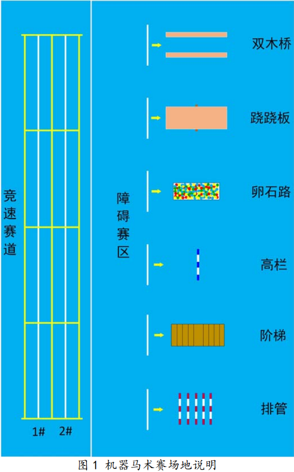

# 三、RC足式机器人比赛与机器人特点

## （一）RC足式机器人比赛

第十八届全国大学生机器人大赛 ROBOCON 以“快马加鞭”为主题，灵感来自古代传递信息的驿传制度。

第十八届全国大学生机器人大赛 ROBOCON 赛场上首次出现了四足的机器马，为挖掘四足机器人的深层价值，提高机器人技术研发的可持续性，自2019年起，举办 ROBOCON 机器马术赛。2019ROBOCON 机器马术赛于第十八届全国大学生机器人赛 ROBOCON “快马加鞭”决赛期间同地进行，仅设竞速赛和绕柱赛两项。

自2019年至今，马术比赛从主赛的R2比赛变为独立赛事，从实物+仿真赛演变成纯实物竞赛，并在2024年增加了越野赛。

下图为第二十一届马术场地。对比二十四届的场地可发现难度提升其实不算大，而总体上各个学校足式机器人的性能对比2022年已经不是一个级别了。首先是从电机选型上，早期的电机除了部分学校自研外（如东大、武大）基本为3508，因此各队伍通过加减速齿、加同步带、改装减速箱的方式增大电机扭矩以满足比赛要求；2023年起，以宇树GO1电机为代表的廉价关节电机开始在马术参赛队伍中普及，极大提升了整体机器人的性能上限。其次是结构设计上，各队伍越来越趋于最优解，例如串联腿部的减速齿轮+平行四边形连杆趋势；并联腿的碳方框架趋势。最终为控制算法，早期包括北科等强在2022赛季仍都是使用位置控制，甚至有部分学校连运动学解算都不使用，以轨迹取点的方式，给电机发送8到16个角度点位实现运动；而在2025赛季（第二十四届），大连交通大学落地了良好的强化学习效果。

下图为第二十二届马术场地。第二十三届基本沿用，在中心区添加了障碍。

| 第二十二届马术场地（图1） | 第二十二届马术场地（图2） |
|--------------------------|--------------------------|
|  |  |
| 第二十三届马术场地（图1） | 第二十三届马术场地（图2） |
|  |  |

竞速赛由直线演变为两年的转弯踩点，再到今年的直线。北科在24赛季惊艳的表现很大程度取决于其MPC算法，可简单理解为质心参考轨迹跟踪，实现了及其丝滑的过弯，这是之前大多数通过差速实现转弯的八自由度足式机器人是不同的。在障碍赛主要有：上下台阶、斜坡、高于或低于300mm通过障碍的需求。一直为结构化地形，对八自由度的并联四足较为友好，毕竟没有什么障碍是不能跳过去的。除第二十三届外，均有跨越300mm障碍的强制要求，早期的300mm障碍甚至是接触就掉的——这对于串联狗可不太友好。今年除了南昌大学使用了后空翻过障碍的方案外，串联的足式机器人基本是用前后腿扒拉的方案过高墙的，存在一定的失误率。

## （二）RC足式机器人特点

目前RC足式机器人可用一句话概括：

**并联同轴五连杆与位置控制仍为主流，串联除少部分队伍没有明显优势，越障整体依赖跳跃而非地形适应，自动方案整体稳定性差，与主流相差甚远。**

接下来我们一句句解释，对各个方案的介绍请看第二、第三部分。

（1）**并联同轴五连杆与位置控制仍为主流**；早期大多数队伍使用了3508这一款被广泛应用于RC\RM机器人底盘与各机构的电机，大大降低电控难度，最底线的情况下使用查表法（每一个足端点位对应两个电机的绝对位置，在完整的足端轨迹中采样八个点去循环运行）即可正常运行。采用位置控制就可以实现跳跃和稳定运动，控制方面采用力控制方案较少，这导致能量使用效率低，足底冲击大，完全采用点接触后稳定性不足，不得不增大足端，甚至使机器人发运动性能极大取决于足端的磨损程度高低。

（2）**串联除少部分队伍没有明显优势**：串联腿对小腿电机扭矩要求高，因此不得不缩小力臂长度，再加上没有科学的减速比计算方案，使得很多队伍的支撑腿长度甚至不如并联机构。虽然可以实现相同的足端轨迹与运动周期方案，但电机的高扭矩负载使得对应转速和相应明显下降。所以同样使用位置控制/力控制的情况下，串联对比并联没有明显优势，甚至可以说劣于。目前应该是没有使用更好算法的8自由度并联，因此没办法进一步对比。

（3）**越障整体依赖跳跃而非地形适应**：比赛地形主要以结构化为主，并联结构极其简单的跳跃实现完美满足使用需求，这使得大多数队伍抛弃了对地形适应的考虑；因此25赛季江阴越野赛草坡这种仅稍稍麻烦点的地形就卡了大量队伍导致越野赛没有成绩。

（4）**自动方案整体稳定性差**：很多队伍按照23年来的技术惯性使用了AprilTags相机定位，部分队伍使用了MID360的雷达方案，以及少部分队伍使用了以D435i为代表的深度相机，在比赛中经常出现距离识别错误、运动响应不足、定位便宜大、决策树适应性差等问题。而越野赛除了北科基本为手动方案，也足以发现RC主流视觉方案的部分局限性——当然今年也出现了RTK方案，希望明年可以成熟一些。

（5）**与主流相差甚远**：很多参赛的机器人比例不协调，导致运动学空间大大受限，运行效率差；控制方法落后但性价比高，逐渐成为了局部最优解；感知方案鲁棒性差……当然，这个比赛的主力基本为大一、大二学生，并非业内人士与研究生，因此也不能过多苛责。以北科、哈工大、大交、东大为代表的第一梯度也开始逐渐尝试往目前较为先进的方向探索，非常期待在26赛季的表现。

所以组委会也果断对26赛季的比赛进行了改革，希望有效吧（写于2025/9/29，规则10月中旬才出来）