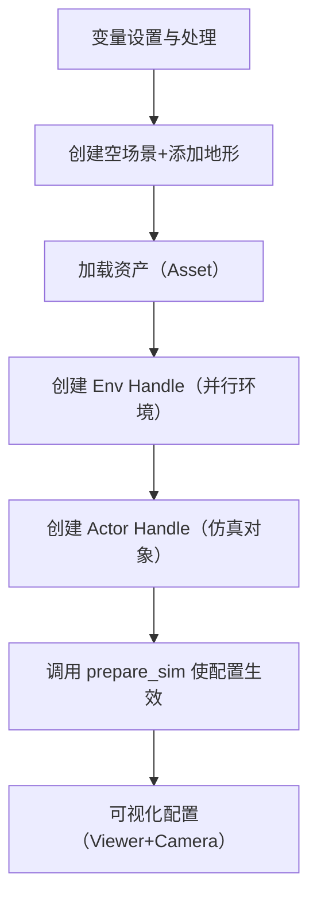

# Isaac Gym 技术文档：配置类与 CreateSim 核心功能详解
## 1. 引言
### 1.1 文档概述
本文档基于 Isaac Gym 相关视频讲解与提纲，详细解析其核心功能模块，重点围绕**配置类体系**与**CreateSim（仿真场景创建）** 展开，结合代码逻辑与实际应用场景，帮助开发者理解并实操 Isaac Gym 仿真环境搭建与配置调整。

### 1.2 Isaac Gym 核心内容
Isaac Gym 包含三大核心功能，支撑仿真场景的创建、交互与控制：
- **CreateSim**：创建仿真场景（本文档重点讲解）；
- **Get/Set State**：获取或设置仿真对象状态；
- **Set Command**：向仿真对象发送低层级控制指令。

### 1.3 示例代码资源
示例代码可通过以下链接访问：[https://gitee.com/desny/learn-isaac-gym](https://gitee.com/desny/learn-isaac-gym)，官方文档参考：`IsaacGym_Preview_4_Package/isaacgym/docs/index.html`。

## 2. 配置类体系
Isaac Gym 的配置通过**类继承与派生**实现，核心设计思路是「模板复用+自定义扩展」，确保配置的灵活性与一致性。

### 2.1 配置类继承结构

- **顶层基类：BaseConfig**
  - 无实际配置参数定义，仅负责将所有配置类**实例化**，避免直接修改模板导致的风险；
  - 所有配置类均间接继承自 BaseConfig，但开发者无需关注其实现细节。

- **核心模板类：LeggedRobotCfg**
  - 配置的核心模板，包含仿真所需的所有基础参数，按功能分为两大模块：
    1. `env_cfg`：与环境相关的配置（如机器人参数、地形、初始状态等）；
    2. `train_cfg`：与算法训练相关的配置（如奖励函数、训练迭代参数等）；
  - 内部通过**子类分组**管理参数（如 `Environment`、`Terrain`、`InitState` 等），结构清晰。

- **自定义配置类（如 G1Cfg、H1Cfg）**
  - 继承自 LeggedRobotCfg，根据具体任务需求修改或扩展参数；
  - 场景1：机器人模型切换（如 G1→H1），需修改机器人自由度、关节参数等；
  - 场景2：任务目标切换（如 Locomotion 行走→Mimic 动作模仿），需调整奖励函数及系数。

### 2.2 配置类使用注意事项
- **子类必须显式继承**：自定义配置类不仅要继承 LeggedRobotCfg 大类，其内部的子类（如 `env`、`terrain`）也需继承模板类的对应子类；
  - 错误示例：仅继承大类但未继承子类，会导致原模板中的参数（如 `NumObservations`）丢失，引发代码报错；
  - 正确示例：`class G1Cfg(LeggedRobotCfg): class env(LeggedRobotCfg.env): num_actions = 29`。

- **参数修改原则**：仅修改与任务相关的参数，其余参数沿用模板默认值，减少冗余配置。

### 2.3 关键配置参数解析
#### 2.3.1 核心基础参数
| 配置子类       | 关键参数                | 功能说明                                                                 |
|----------------|-------------------------|--------------------------------------------------------------------------|
| `InitState`    | `pos`（位置）           | XY 坐标默认设为 0（由地形后续修改），仅需调整高度值确保机器人初始姿态合理 |
|                | `DefaultJointAngles`    | 机器人初始关节角（弧度值），需包含所有可控关节名称与对应角度             |
| `Asset`        | `file_path`             | 机器人模型文件（如 URDF）路径，用于加载资产                             |
|                | `rigid_body_names`      | 需关注的机器人部件名称（如骨盆、大腿），方便后续获取部件状态             |
| `Termination`  | `terminate_after_contacts_on` | 任务终止条件（如骨盆与地面碰撞则判定摔倒，终止当前训练回合）             |
| `SelfCollisions` | 自碰撞开关（0=开启，1=关闭） | 开启时机器人部件间（如手与大腿）会产生碰撞力，关闭时则穿透               |
| `Terrain`      | `type`（地形类型）      | 示例中使用 `Plane`（平地），复杂地形后续单独讲解                         |
| `Sim`          | `dt`                    | 仿真步长（单位：秒），定义仿真计算的时间间隔                             |
|                | `sub_steps`             | 每个仿真步内的细分计算次数，默认设为 1                                   |
|                | `gravity`               | 重力向量（垂直向下），`up_axis` 默认为 Z 轴（机器人坐标系标准）           |

#### 2.3.2 任务相关参数
- `num_actions`：机器人可控自由度数量（如 G1 为 29 自由度，需覆盖模板默认的 26 自由度）；
- `reward_function`：奖励函数定义（如行走任务奖励前进距离，模仿任务奖励动作相似度）。

## 3. CreateSim 核心功能：创建仿真场景
CreateSim 是 Isaac Gym 最基础的核心功能，负责搭建仿真「舞台」，包括场景初始化、资产加载、环境与对象创建、可视化等流程，对应代码文件 `LeggedRobot.py` 的初始化函数。

### 3.1 核心流程总览


### 3.2 各步骤详细解析
#### 3.2.1 步骤1：变量设置与处理
- 从配置类中读取参数（如机器人模型路径、初始状态、地形类型等）；
- 初始化后续需用到的变量（如 Env/Actor 句柄列表、关节极限缓存等）。

#### 3.2.2 步骤2：创建空场景与地形
- 调用 `self.gym.create_sim()` 创建空的仿真容器；
- 调用 `self.gym.add_ground()` 添加地形（示例中为平地，复杂地形需配置高度图、摩擦力等参数）。

#### 3.2.3 步骤3：加载资产（Asset）
- 核心逻辑：将机器人模型、道具等「素材」放入舞台「后台」，供后续实例化；
- 流程：
  1. 从 `Asset.file_path` 读取模型文件（如 URDF）；
  2. 仿真引擎解析文件，返回模型关键信息（如自由度数量、刚体列表、关节极限）；
  3. 可选：对资产进行**Domain Randomization（域随机化）** 处理（见 4.1 节）。

#### 3.2.4 步骤4：创建 Env Handle（并行环境）
- 核心优势：Isaac Gym 支持多环境并行训练，极大提升训练效率（默认可设置 4096 个并行环境）；
- 实现：通过循环创建多个独立的 Env Handle，存入列表供后续管理，每个 Env 是相互隔离的仿真实例。

#### 3.2.5 步骤5：创建 Actor Handle（仿真对象）
- 核心逻辑：将「后台」的资产实例化到「舞台」上，Actor 可理解为仿真场景中的「演员」（如机器人、道具）；
- 关键操作：
  1. 为每个 Env 分配 Actor（如每个环境中创建一个机器人）；
  2. 设置 Actor 初始状态（位置、关节角，基于 `InitState` 配置）；
  3. 读取关节极限（如位置、速度、扭矩上限），并应用 `Soft Limits`（见 4.2 节）；
  4. 将 Actor Handle 存入列表，用于后续状态获取与控制。

#### 3.2.6 步骤6：调用 prepare_sim 使配置生效
- 所有场景设置（地形、资产、Env/Actor）仅为「规划」，需调用 `self.gym.prepare_sim(sim)` 激活配置，仿真才正式启动。

#### 3.2.7 步骤7：可视化配置
- **Headless 参数**：控制是否显示仿真窗口：
  - `Headless=True`：不显示窗口（训练时默认，节省计算资源）；
  - `Headless=False`：显示窗口（验证训练效果时使用）；
- **Viewer 交互**：创建可视化窗口，支持键盘/鼠标操作：
  - 键盘：`Esc` 退出程序，`V` 暂停渲染；
  - 鼠标：实时调整摄像头角度；
- **SetCamera**：手动配置摄像头位置与角度，优化场景观察视角。

## 4. 关键技术点
### 4.1 Domain Randomization（域随机化）
#### 4.1. 核心目的
减小「仿真→仿真（SIM2SIM）」与「仿真→现实（SIM2REAL）」的性能差距，提升训练策略的鲁棒性。

#### 4.1.2 实现方式（示例）
- 摩擦力随机化：为机器人脚底或地形设置随机摩擦力系数，避免策略过度拟合单一摩擦环境；
- 质量随机化：随机调整机器人主体（如骨盆）质量，模拟生产误差或部件损耗；
- 电机性能随机化：模拟电机老化导致的动力下降，提升策略对硬件差异的适应性。

### 4.2 Soft Limits（软限制）
#### 4.2.1 核心目的
保护硬件，避免机器人关节达到物理极限（硬限制）导致损坏。

#### 4.2.2 实现方式
- 硬限制：从 URDF 读取的关节极限（如位置范围），仿真中绝对不可突破；
- 软限制：在训练时将关节极限范围缩小（如缩小 20%），配合奖励函数引导机器人远离极限值，避免实际部署时触碰硬限制。

### 4.3 自碰撞与Episode终止
- 自碰撞：开启时（`SelfCollisions=0`），机器人部件间碰撞会产生交互力，更贴近现实；关闭时（`SelfCollisions=1`），部件穿透，专注于与外部环境（如地面）的碰撞；
- Episode 终止：通过 `terminate_after_contacts_on` 检测关键部件（如骨盆）与地面的碰撞，判定机器人摔倒，立即终止当前训练回合并重置，提升训练效率。

## 5. 总结与后续
### 5.1 本文档核心要点
1. 配置类体系：基于 `BaseConfig→LeggedRobotCfg→自定义Cfg` 的继承结构，支持灵活扩展；
2. CreateSim 流程：从场景创建、资产加载到可视化，完整覆盖仿真环境搭建全步骤；
3. 关键技术：域随机化与软限制是提升策略鲁棒性和保护硬件的核心手段。

### 5.2 后续内容预告
下一篇文档将讲解 Isaac Gym 的另外两大核心功能：
- **Get/Set State**：如何获取机器人关节状态、位置等信息，以及如何手动设置仿真对象状态；
- **Set Command**：如何向机器人发送低层级控制指令（如关节扭矩、位置指令），实现运动控制。


# IsaacGym 强化学习机器人运动控制技术文档
## 一、概述
### 1.1 核心定位
IsaacGym 是一款面向强化学习与机器人运动控制的仿真工具，核心优势在于能够高效衔接物理引擎与深度学习框架（如 PyTorch），支持机器人仿真状态的实时交互与低级别指令下发，适用于足式机器人等复杂运动控制任务的训练与验证。

### 1.2 核心操作体系
IsaacGym 的核心工作流围绕三大核心操作展开，形成闭环仿真与控制能力：
- 仿真环境创建（`create_sim`）：基础前置步骤，为后续交互提供仿真场景
- 状态获取与设置（`get/set State`）：实现仿真状态的读取与修改，是交互核心
- 低级别指令下发（`set command`）：基于控制算法生成电机执行指令，驱动机器人运动

### 1.3 依赖与参考资源
- 核心框架：PyTorch（数据处理与模型训练）、IsaacGym 物理引擎（仿真计算）
- 官方文档：`IsaacGym_Preview_4_Package/isaacgym/docs/index.html`
- 示例代码：[https://gitee.com/desny/learn-isaac-gym](https://gitee.com/desny/learn-isaac-gym)

## 二、状态交互：Get/Set State 操作
### 2.1 状态层级与数据结构
IsaacGym 的仿真状态分为三个层级，各层级数据结构一致但格式不同，最终面向用户层推荐使用 PyTorch Tensor（适配后续模型训练）：
| 层级         | 数据结构类型       | 作用场景                     |
|--------------|--------------------|------------------------------|
| 物理引擎层   | 原生物理状态格式   | 底层仿真计算存储             |
| IsaacGym 层  | IsaacGym Tensor    | 引擎与用户层数据中转         |
| 用户层       | PyTorch Tensor     | 算法开发、模型训练与推理     |

### 2.2 Get State：状态获取流程
从仿真中读取状态信息，核心是完成数据结构从物理引擎格式到 PyTorch Tensor 的转换，并保证数据实时性：
1. **数据获取**：通过 `self.gym.acquire_xx_tensor` 接口从物理引擎中获取原始状态缓存（如关节角度、基座位置等）
2. **格式转换**：调用 `gymtorch.wrap_tensor` 函数，将 IsaacGym Tensor 转换为 PyTorch Tensor
3. **数据刷新**：由于获取的是缓存数据，需定期调用 `self.gym.refresh_xx_tensor` 接口，同步物理引擎的实时计算结果

#### 2.2.1 常用状态信息说明
| 状态类型          | 含义与应用场景                                                                 |
|-------------------|------------------------------------------------------------------------------|
| ActorRootState    | 机器人基座（如骨盆）的世界坐标系位置、旋转角度及速度信息，反映机器人整体位姿       |
| DOFState          | 机器人关节状态，包含关节角度（位置）和角速度，是运动控制的核心数据               |
| NodeContactForces  | 机器人各身体部位受到的合力信息，可用于判断机器人是否摔倒（如骨盆与地面碰撞受力） |
| RigidBodyState    | 机器人刚体部件的世界坐标系位置、旋转及速度信息，细化到具体肢体部件               |

### 2.3 Set State：状态设置流程
修改仿真状态（如重置关节位置、初始化运动状态），流程与 Get State 反向：
1. **状态构建**：基于 PyTorch Tensor 创建或修改目标状态（如重置关节角速度为 0）
2. **格式转换**：调用 `gymtorch.unwrap_tensor` 函数，将 PyTorch Tensor 转换为 IsaacGym Tensor
3. **状态下发**：通过 `self.gym.set_xx_tensor` 接口，将转换后的数据写入物理引擎，完成状态更新

#### 2.3.1 典型应用场景：Episode 重置
当机器人训练中摔倒（通过 `NodeContactForces` 检测），需终止当前 Episode 并启动新训练周期时，通过 Set State 实现：
- 重置关节角度至默认姿态
- 清零关节角速度
- 同步更新关联状态缓存（因各状态切片共享内存空间，主状态修改后关联数据自动更新）

## 三、低级别指令：Set Command 与 PD 控制
### 3.1 指令层级区分
- **High-Level 指令**：高层运动目标，如“以 0.5m/s 速度向前行走”，不涉及具体执行细节
- **Low-Level 指令**：底层执行指令，由策略网络结合控制算法生成，如关节输出扭矩，直接驱动电机动作

### 3.2 PD 控制公式（核心算法）
低级别指令的核心是通过 PD 控制算法计算关节输出扭矩，公式如下（目标速度默认设为 0，简化后）：
\[
\tau = K_p(q_d - q) - K_d \cdot \dot{q}
\]

#### 3.2.1 公式参数详解
| 参数       | 含义                                                                 |
|------------|----------------------------------------------------------------------|
| \(\tau\)   | 关节输出扭矩（最终下发给电机的执行指令）                             |
| \(K_p\)    | 刚度系数（Stiffness），控制关节“软硬”，影响目标位置的收敛速度         |
| \(K_d\)    | 阻尼系数（Damping），控制关节运动“减震”，避免高频震荡                 |
| \(q_d\)    | 目标关节角度（由策略网络输出结合默认姿态计算得出）                   |
| \(q\)      | 当前关节角度（通过 Get State 实时获取）                               |
| \(\dot{q}\) | 当前关节角速度（通过 Get State 实时获取）                             |

#### 3.2.2 关键参数作用说明
- **\(K_p\)（刚度）**：
  - 取值越大，关节越“硬”，越难被外力改变姿态，目标位置收敛越快（如百米赛跑冲刺阶段）
  - 取值过小，关节越“软”，易受外力干扰，但过大可能导致超调（冲过目标位置）
- **\(K_d\)（阻尼）**：
  - 取值越大，减震效果越好，可避免关节在目标位置附近高频震荡（如百米赛跑冲刺后的减速）
  - 缺失或取值过小会导致系统不稳定，硬件可能因震荡受损

#### 3.2.3 参数设置方法
- 核心原则：通过大量实验验证 + 行业经验调整
- 注意事项：需根据机器人结构（如关节数量、肢体重量）和任务类型（如行走、跳跃）动态优化

### 3.3 控制模式分类
IsaacGym 支持三种核心控制模式，足式机器人运动训练以位置控制模式为主：
| 控制模式 | 标识 | 核心逻辑                                                                 |
|----------|------|--------------------------------------------------------------------------|
| 位置控制 | P    | 以目标关节角度为输入，通过 PD 公式计算扭矩，是足式机器人的主流控制方式   |
| 速度控制 | V    | 以目标关节角速度为输入，基于 PD 公式变体计算扭矩，适用于轮式机器人等场景 |
| 力矩控制 | T    | 直接将策略网络输出作为扭矩指令，无需 PD 计算，适用于高精度力控场景       |

### 3.4 控制模式衔接说明
- **仿真层面**：IsaacGym 底层采用力矩控制模式（`DefaultDOFDriveMode=3`），所有控制模式最终均通过下发扭矩指令实现
- **计算层面**：LeggedGym 中采用位置控制逻辑，通过 `ComputeTorques` 函数完成“目标角度→扭矩”的转换
- **实际部署**：真实机器人电机支持三种控制模式，策略网络推理时与仿真保持一致（力矩控制模式），确保仿真与实机衔接

## 四、核心代码实现示例
### 4.1 状态交互核心代码
```python
# 1. 初始化状态缓存（Get State 前置操作）
def InitBuffers(self):
    # 从物理引擎获取各类状态缓存
    self.actor_root_state = self.gym.acquire_actor_root_state_tensor(self.sim)
    self.dof_state = self.gym.acquire_dof_state_tensor(self.sim)
    self.contact_forces = self.gym.acquire_rigid_body_contact_force_tensor(self.sim)
    # 转换为 PyTorch Tensor
    self.actor_root_state = gymtorch.wrap_tensor(self.actor_root_state)
    self.dof_state = gymtorch.wrap_tensor(self.dof_state)
    # 状态切片（分离关节角度和角速度）
    self.dof_pos = self.dof_state[..., 0:1]  # 关节角度
    self.dof_vel = self.dof_state[..., 1:2]  # 关节角速度

# 2. 定期刷新状态（确保数据实时性）
def DevStep(self):
    # 与仿真环境交互后，刷新状态缓存
    self.gym.refresh_actor_root_state_tensor(self.sim)
    self.gym.refresh_dof_state_tensor(self.sim)

# 3. 重置状态（Set State 典型应用）
def Reset(self):
    # 初始化目标关节角度（基于默认姿态）
    target_dof_pos = self.default_dof_pos + self.policy_output * self.action_scale
    # 清零目标关节角速度
    target_dof_vel = torch.zeros_like(self.dof_vel)
    # 合并状态并转换格式
    target_dof_state = torch.cat([target_dof_pos, target_dof_vel], dim=-1)
    target_dof_state = gymtorch.unwrap_tensor(target_dof_state)
    # 下发至物理引擎
    self.gym.set_dof_state_tensor(self.sim, target_dof_state)
```

### 4.2 PD 扭矩计算代码
```python
def ComputeTorques(self, actions):
    # 1. 动作缩放：稳定训练初期（避免策略输出过大导致训练震荡）
    scaled_actions = actions * self.action_scale
    # 2. 计算目标关节角度（默认姿态 + 策略偏移）
    target_dof_pos = self.default_dof_pos + scaled_actions
    # 3. 获取当前关节状态
    current_dof_pos = self.dof_pos
    current_dof_vel = self.dof_vel
    # 4. PD 公式计算扭矩
    pos_error = target_dof_pos - current_dof_pos
    torque = self.Kp * pos_error - self.Kd * current_dof_vel
    # 5. 扭矩限制（保护硬件/仿真稳定性）
    torque = torch.clamp(torque, -self.max_torque, self.max_torque)
    return torque

# 6. 指令下发
def Step(self, actions):
    # 计算扭矩
    self.torques = self.ComputeTorques(actions)
    # 转换格式并下发至物理引擎
    unwrapped_torques = gymtorch.unwrap_tensor(self.torques)
    self.gym.set_dof_effort_tensor(self.sim, unwrapped_torques)
```

## 五、常见问题解析
### 5.1 关节位置（\(q\)）的含义误解
- 误区：将关节位置误认为世界坐标系下的 3D 坐标
- 正解：关节位置本质是关节角度（如旋转角度），用于描述关节的转动状态

### 5.2 控制模式冲突疑惑
- 问题：IsaacGym 底层为力矩控制（`DefaultDOFDriveMode=3`），为何训练中使用位置控制？
- 解答：两者属于不同层面的控制逻辑——位置控制是“计算逻辑”（基于 PD 公式将角度目标转换为扭矩），力矩控制是“执行逻辑”（仿真/实机最终通过扭矩驱动关节），不存在冲突

### 5.3 为何不直接使用 IsaacGym 原生位置控制接口？
- 灵活性更高：自定义 `ComputeTorques` 函数可灵活调整 PD 参数、添加扭矩限制等逻辑
- 物理效果更优：原生接口的 PD 计算逻辑固定，自定义实现更适配足式机器人训练场景
- 部署一致性：与真实机器人的力矩控制模式保持一致，降低仿真到实机的迁移成本

## 六、后续内容预告
本文档已覆盖 IsaacGym 核心操作（状态交互、低级别指令控制），下一期将重点介绍 LeggedGym 的 Environment 模块，包括仿真环境配置、训练任务定义、奖励函数设计等内容，助力完整实现强化学习机器人运动控制流程。